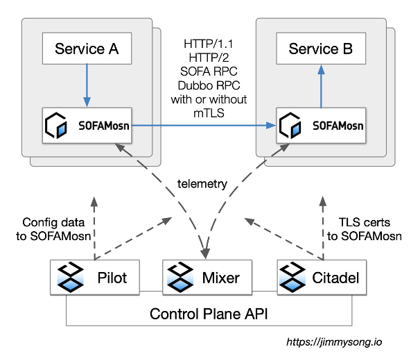
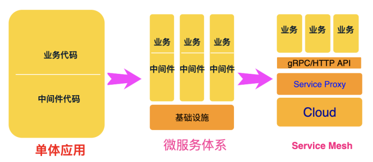

## 云原生中间件的终态
---
*written by Alex Stocks on 2021/01/24，版权所有，无授权不得转载*

据说云原生诞生很早，可以从巨型机时代在巨型机上虚拟出若干小型机开始追溯，其为普罗大众所熟知则要从 2010s 时以 OpenStack 为代表的虚拟编排时代开始。

自从以 2013 年开源的 docker 为代表的的容器技术和以 2014 年开源的 K8s 为代表的容器编排技术登上舞台之后，相关技术从业人员才从认知和体感上接受，云原生时代真的到来了。

在云原生时代，不变镜像作为核心技术的 docker 定义了不可变的单服务部署形态，统一了容器编排形态的 k8s 则定义了不变的 service 接口，二者结合定义了服务可依赖的不可变的基础设施。有了这种完备的不变的基础设置，就可以定义了不可变的中间件新形态 -- 云原生中间件。

云原生时代的中间件，包含了不可变的通信、消息、事件(event) 等基础通信设施。个人愚陋，所知的云原生时代的事实上的标准通信设施有：2008 年开源的 protobuf v2 和 2014 年开源的 protobuf v3 统一了序列化协议；2016 年 gRPC 发布 v1 之后逐渐成了跨语言首选的通信库；2017 年后以 envoy 和 istio 为代表的 service mesh 逐渐统一了网格的控制面与数据面。

## 1 服务网格
---

从最早的单体应用时代到分布式技术时代，流行的是微服务技术。微服务时代各大公司都沉淀出了具有代表性的一些服务通信框架，如 Google 的 gRPC，阿里的 Dubbo 和 HSF，百度的 bRPC 等等。

除了南北向通信的网络接入层代理外，微服务时代使用同一通信框架的各个服务实体之间直接进行通信，很少听说各个服务实体之间通过代理【Proxy】进行通信，其根由是各个通信实体之间同构。或者说，网络通信代理被各个强悍的通信框架给消化掉，以 Proxyless SDK 的形式存在，如服务发现、服务路由、容灾限流、负载均衡等功能都存在于各个服务框架的 SDK 中。

一些大经济实体随着业务体量变大，业务类型变得庞杂，公司内部各个分部时间可能存在不同服务框架导致各个服务之间通信异构化越来越严重，如阿里内部早前存在异构的 Dubbo 和 HSF【当然现在 HSF 已经采用 Dubbo 作为内核以 Dubbo 插件的形式存在】，如当下的阿里的 HSF 和蚂蚁金服的 SofaRPC，其间通信不得不借助于 Proxy 形式的通信网关。

即使是使用统一了同一个网络框架，可能由于序列化协议或者通信库的向后兼容能力差也会导致使用个不同版本通信框架的各个服务之间的异构化，如采用了 pb v2 和 pb v3 的通信框架不兼容，不遑多让的 Thrift 0.8.x 与Thrift 0.9.x 之间也不兼容。不过 Protobuf v3 或者 Protobuf v2 的各个子版本之间的向前和先后兼容性还是不错的，一些弱鸡公司的内部序列化协议无论是否采用 TLV 形式都可能导致各个版本的协议之间都不兼容，进而导致各个子版本的服务框架之间不兼容，最终导致不同版本的业务服务之间无法快速演进，有些新版本的业务中存在各种神逻辑可能不是为了兼容旧版本的业务逻辑，而是为了兼容旧版本框架的通信协议！

上面这些同一实体内部不同公司之间有两三个不同服务框架的情况已经算是很好了，在中国这个神奇的国度的各种神奇经济实体内还存在这更神奇的事情：同一个公司内部不同部门之间存在各自的服务框架 ，其总体服务框架可能达 30 余种之多！不论这些服务框架各个子版本之间是否兼容，各个服务框架之间的兼容可能通过网关可以做到兼容，这个技术可以解决的，也可能山头利益需要在网关这种技术之外再做一些业务流量或者其他利益交换才能兼容，美其名曰保护用户隐私。

除了序列化协议、通信框架、各个山头利益导致的异构外，还普遍存在着因为各个不同语言技术栈之间差异导致的异构：每种语言都有个各自的序列化协议和通信框架。

随着各种异化，大家普遍相信：没有什么差异不是一层 Proxy 解决不了的。随着 2016 年兴起的 Service Mesh 技术的流行，大家相信：将 SDK 形式的服务框架的序列化协议、通信能力、服务治理能力一股脑地沉淀到服务网格的代理【如 envoy 或者 MOSN 这类数据面 sidecar】中神奇的事情自然就能发生，服务框架 SDK 会变的非常轻量甚至消失，多语言、多协议和多种通信方式之间的差异将被磨平，然后带来统一流量控制、统一监控设施、统一安全可信认证、业务丝般平滑升级、业务升级速度大幅提升等诸般好处。

带着对 Service Mesh 可将所有复杂性消灭于无形的这种神奇魔力的迷之自信，有业界大佬已经将如下图中的 Istio + MOSN 为代表的的形态定义为 Service Mesh 的终极形态。

## 2 代理的罪与罚
---

然无论是 envoy 还是 mosn，也仅仅是一个具备通信能力的 local proxy，也仅仅是具备流量控制、协议转换、通信协议转换、路由方向控制等能力，至于具体的序列化协议转换、通信协议转换等工作还是需要相关的基础设施开发人员去做的。

除了序列化协议和通信协议转换，中间件的其他能力向 Proxy 下沉的过程中，都需要做大量的 filter 层面的工作。相对于 Proxyless 形式的 Service Mesh，Proxy Service Mesh 成本没有任何变化，其对业务的侵入性也没有减轻更多。

如果说 Proxyless Service Mesh 形态下的 SDK 升级需要业务层面做很多改造，Proxy Service Mesh 形态下的业务从 Proxyless 向 Proxy 形态升级过程中改造成本也不可谓不小。

如果通信协议采用了 Protobuf V3，Proxy Serivce Mesh 形态下的业务升级协议时可能做到平滑升级：只升级 Proxy 不用升级业务服务实体。但现实是一些大型公司内部的私有协议根本做不到向后兼容，其成本就是升级协议时服务网格的 Proxy 和业务实体一起升级吧，至于期望的平滑升级存在于梦中。

诸般问题的核心是 Local Proxy 没有统一通信协议和序列化协议，仅仅注重于流量劫持。

Service Mesh 技术的一些鼓吹者假设服务实体是一个无状态的服务，其代理也当然是一个无状态的 sidecar，然后宣传 Service Mesh 时代的各种红利。至于那些有状态的应用，他们自己打掉牙齿和血吞：利用大公司有人有钱耗费巨量人日成本后，把状态转移到 Proxy 中去，让应用无状态。那么这就很难做到业务无感知的平滑升级了。一些被鼓惑起来的中小厂家在踩完各种坑后，神奇的发现他们根本没有实力实现有状态的 sidecar！

这些中小厂家能做的就是回退到微服务技术体系，忍受所谓的技术落后，让哪些所谓的 Service Mesh 的种种技术红利随风去吧。

其最根本的原因是：同等级别的业务形态下，技术复杂性守恒，总成本守恒。

## 3 真正的终态
---

以 Service Mesh 技术为代表的的云原生技术体系根植于以 k8s 为代表的的云原生基础设施之上。终极形态的 Proxy 除了被动地去兼容各种协议，更应该主动的去统一序列化协议，如自身直接支持 Protobuf v3 协议，业务也采用这种可保证向后兼容的协议即可。

除了被动地去兼容各种通信框架做互联互通，可以更主动地向事实上的通信框架 gRPC 或者通信协议 HTTP 靠拢。gRPC 有各种语言的 SDK 库。各种语言自身会主动提供 HTTP 通信协议库，且 HTTP2.0 向后兼容 HTTP 1.1。

抛却各种繁芜，把各种技术栈统一到一种事实上的技术标准之上，才能定义出不可变的中间件设施的终态。

个人认知中的微服务时代的中间件体系大概有如下技术栈：

* RPC，其代表是 Dubbo/Spring Cloud/gRPC 等。
* Cache，其代表是 Redis。
* MQ，其代表有 kafka/rocketmq 等。
* 服务跟踪，如兼容 Opentracing 标准的各种框架。
* 日志收集，如 Flume/Logtail 等。
* 指标收集，如 prometheus。
* 事务框架，如阿里的 seata。
* 配置下发，如 apollo/nacos。
* 服务注册，如 zookeeper/etcd 等。
* 流量控制，如 hystrix/sentinel 等。
* 搜索，如 ElasticSearch。
* 流式计算，如 spark/flink。
* 其他。

把这些事实上的中间件梳理一番后，抽象出统一的中间件标准模型，沉淀到 Proxy 中去的工作即是：Proxy 统一提供这些标准模型的 API 接口，业务适配之即可。Service Mesh 下的 sidecar 不仅仅是一个 Local Proxy，更应该是一个提供各个中间件技术栈标准能力的 Service Proxy。

真正的终态才能带来真正的价值。就其浅显的技术价值而言，做到基础中间件技术的统一后，即可做到无关语言，无关各个具体的中间件实体。减轻业务开发人员负担，使其专注于业务逻辑，做到真正的快速迭代与平滑升级，提升研发效率的同时降低各种成本。

在统一了标准服务 API 的 Proxy 之下的是提供这些标准服务的各大云厂商。越早向统一服务模型靠拢的云厂商越快得利，越相信自己私有服务能力的云厂商越孤立。

真正 Proxy 终极的商业价值就是无云平台依赖，云平台使用者没有被云服务提供商绑架的危险。统一了中间件技术栈的平台提供的技术能力相同，其相互之间的竞争就不会停留在某种独有的所谓的核心技术优势上，而是在同一技术体系下不断降低服务成本，提供更好的用户体验、更强的服务能力与更亲民的价格。

## Payment

<table>
  <tbody>
  <tr></tr>
    <tr>
      <td align="center"  valign="middle">
        
      </td>
      <td align="center"  valign="middle">
        
   </tbody>
</table>

## Timeline

>- 于雨氏，2021/01/24，初作此文于帝都朝阳金融中心。