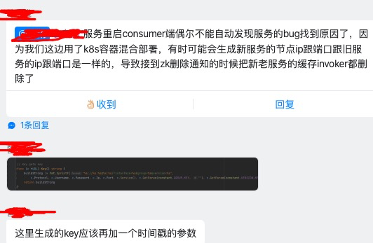

# dubbogo 在云原生时代
---
*written by Alex Stocks on 2021/04/11，版权所有，无授权不得转载*

周六【20210410】正在和社区同学忙着 dubbogo 3.0 发版，某互联网教育公司的曾同学报来一个问题，随后和相关同学展开了多轮讨论。因为个人觉得这是一次比较有意义的讨论，觉得有必要花费时间记录下来，算是 dubbogo 在云原生进化途中的一个见证。

后面如果有更多有意义的讨论，个人将继续补加此文。

## 1 新服务上线后 consumer 无法调用
---

2021-04-07T19:39+08:00 pm 曾同学报出来一个 [dubbo-go pr 1137](https://github.com/apache/dubbo-go/pull/1137/files) ，当时囿于工作繁忙，没有分析其背景，且代码改动不甚合理，就没理会让其自己继续追踪下根因。

2021-04-10T17:51+08:00 pm，曾同学发来如下消息：

这次预感其分析过程比较靠谱，遂组织社区五个同学对其问题进行分析。

### 1.1 问题描述

根据与曾同学的沟通，其整体环境是在一个 k8s 环境下，使用注册中心 zk，其出问题的过程如下：

* 1 service A【以下简称sA】 在物理主机 host X【以下简称 hX】上有一个服务节点 provider M【以下简称 pM】；
* 2 pM 向注册中心注册使用的 IP:Port 不是其所在的 pod 的 IP:Port，使用了 hX 的 IP:Port，原因是为了让 k8s 集群外部的 consumer 也能调用到 pM 提供的 sA 服务；
* 3 在 hX 上新启动一个 sA 的节点 provider N【以下简称 pN】，pN 向 注册中心注册的 IP:Port 也使用了 hX 的 IP:Port；

如下图：
 
 
* 4 consumer 收到注册中心发来的 pN 的上线通知 event，由于 pM 和 pN 的 service key 一样，把本地缓存中 service map 中的 pM 替换为 pN； 
* 5 待 pN 稳定运行一段时间后，下线 pM；
* 6 consumer 收到 pM 下线 event 后，在本地缓存中删除 pN。

分析其过程，根因是其 devops 部署的问题，但是用户希望能在 dubbo/dubbogo 层把这个问题吃掉。使用方希望能根据通知下线中一些可靠字段【譬如 timestamp？】确认下线服务的准确性。

### 1.2 解决方案

曾同学给出了一个解决方案，对 consumer 端的本地 service map 缓存进行改造，由于 provider 启动时上报注册中心的 metadata 中使用了服务启动的时间戳 timestamp，可以在原来的 key 维度中加入 timestamp 这个维度。但被社区否决了：加入时间戳维度并不能解决问题，因为时间戳精度只能达到 秒 级别，并不能从根本上解决问题。

dubbogo 有一个 health check 机制：consumer 对注册中心下发的 provider 列表定时发送心跳 check 逻辑，进行 alive 二次验证。结合 health check 机制，社区给出的解决方案是：

* 1 收到下线事件时，先检测 service key 对应的 provider 最近【一个心跳周期内】是否还在被调用，如果还在被调用，则不下线；
* 2 如果在最近没有被调用，然后再比对注册中心下线事件通知里的 timestamp 字段，如果相同则下线。

最终下线与否取决于 healthCheck 的结果。最终方案通过这个 timestamp 和 health check 这两个双保险把误下线的概率降到最低。

详细内容已经整理到 [dubbo-go issue 1141][1]，欢迎关注后续讨论。

### 1.3 隐含前提

社区方案，有个前提是：注册中心通知事件的有序性。

梳理下我们支持的所有注册中心对这个特性的支持特点:

* 1 etcd 有 revision 的概念，这是数据的全局版本号，可以保证有序；
* 2 基于 etcd 的 k8s 也可以保证的 event 通知有序；
* 3 类似于 etcd 的 consul 也可以保证有序性；
* 4 zk 也可以保证通知有序性，只不过可能丢事件，这个可以通过 dubbo/dubbogo health check 进行补偿；
* 5 经 nacos 同学李志鹏确认，nacos 可以确保事件通知的有序性，原话是 “同一个节点只要保证客户端服务上线和下线操作是有序的，通知也是有序的”。

## 2 多余的话

有人说 dubbogo 的架子太过于庞大，维护成本和学习成本很高，不如微内核框架的可插拔机制优雅，其实任何框架都是有历史的，都是有现实意义的。诚所谓存在即合理，无意义的口水争论是无法推动产品进步的。

诚如 linus 与其老师 Andrew Tanenbaum 就 linux 的宏内核与 minix 的微内核的争论，并不能因此就动摇 linux 是第一大 OS 的地位。dubbogo 重构前的版本直接借鉴了 go-micro，是可插拔的，但后来经鄙人和一些 Javaer 借鉴 dubbogo v1 、getty rpc 以及 dubbo 重构后，彻底变成了 Dubbo 的翻版，被人戏称为一个类似于宏内核的 “怪物”。另外，重构过程中鄙人的代码提交被彻底打乱，所以可能有些人觉得鄙人没写多少代码。

站在事后的角度来看，这也铸就了 dubbogo 强大的功能，对各种注册中心的支持正是基于它有可插拔的灵魂，否则也不可能支持这么多第三方组件和如此多的通信协议与序列化协议。目前 dubbogo 的各项功能几乎都被生产环境验证过，譬如 芒果TV 使用了基于 nacos 注册中心的 HTTP + JSONRPC、TCP + hessian2 通信协议，而 得物 则 使用了基于 nacos 注册中心的 gRPC 通信方式。况且 dubbogo 并不是如一些喷子所谓的没有代码生成工具，其 v1.5 中 gRPC 和 dubbogo 3.0 都提供了各种工具，并不比竞品差太多。或者说， dubbogo 的任何一角都很强大，足以覆盖竞品的功能。

在云原生时代，dubbogo 未来会继续秉承 “bridging the gap between Java and Go”，在 多语言和多框架【gRPC 和 Spring Cloud】之间架起桥梁，继续进化。

dubbogo 不仅仅是一个 RPC 微服务治理框架，而应该成为云原生时代的微服务基础设施！

[^参考文档]:

[1]:https://github.com/apache/dubbo-go/issues/1141

## Payment

  &nbsp;&nbsp;&nbsp;&nbsp;&nbsp;&nbsp;&nbsp;&nbsp;&nbsp;&nbsp;&nbsp;&nbsp;&nbsp;&nbsp;  

## Timeline

>- 2021/04/11，于雨氏，初作此文于帝都五环。