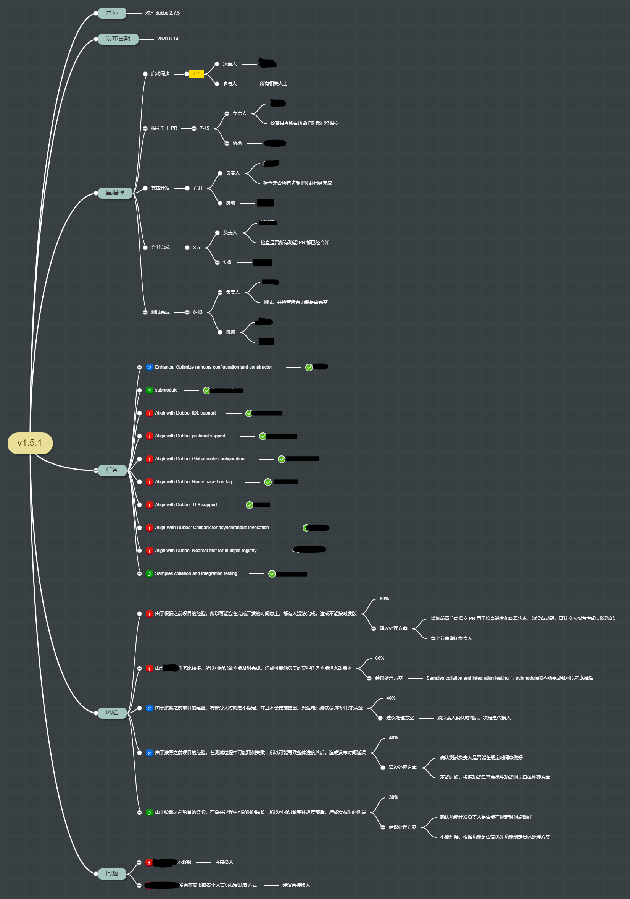
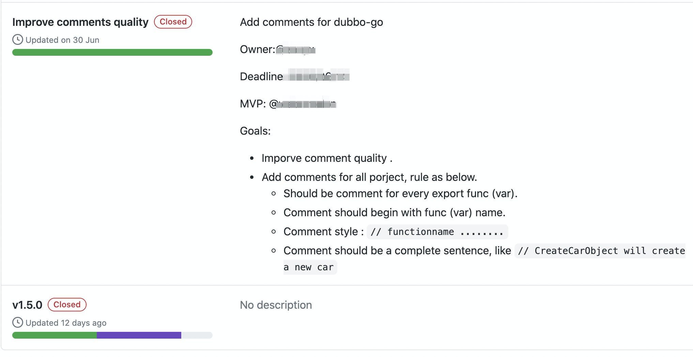

# dubbogo 进化之道
---
*written by Alex Stocks on 2020/08/02，版权所有，无授权不得转载*

## 1 引语

dubbogo 项目已进入第五个年头。

项目发展的前两年，个人筚路蓝缕老牛拉车，把 hessian2协议库、网络库和整体基础框架搭建一番。从 2018 年项目被 Dubbo 官方接纳开始，依托阿里平台，社区开始形成并快速发展。赖社区众筒子们齐心合力，如今全面兼容 Dubbo v2.7.x 的 Dubbo-go v1.5.0 已经发布。

其间偶尔想总结一番，但怯于写出什么不合适的文字，让社区伙伴以为吾人喜掠人之美，贪他人之功，总结没写好，却导致社区产生离心力。然不同时期感悟不同，不记录下来，终究留有遗憾，故诚惶诚恐写下此文，若有错误，望友人不吝指教。

## 2 立项

一个项目整体必须提炼出核心目标，指明其存在的意义和价值。有了初心，项目发展过程中产生困惑时，才能明确答复 “我是谁？从哪里来？到哪里去”，找准自己当下的位置，矫正发展方向，减少走向歧途的可能。

### 2.1 dubbogo

dubbogo 项目有其自身的 milestone 要求，大致规划了每个阶段的关键里程碑，在项目发展初期仅仅是实现 Dubbo 的某个功能，但在发展过程中会不断结合当下的技术发展潮流不断修正其未来发展方向。

其发版计划是通过 “开发当前版本、规划新版本、根据反馈修正新版本” 的模式定义当前版本的开发内容和下一个版本的发展方向。每次发版后会根据社区使用反馈对下一代的发展目标进行修正。

站在吃瓜人的角度，或许可以说出 “dubbogo 不就是 dubbo 的 Go 语言版本嘛，照着抄就是了” 之类的呓语。而参与过 dubbogo 项目跟着社区一路走来的人，就知道 dubbogo 并不简单定位于 Dubbo 项目的 Go 语言版本。

dubbogo 初心不变，不同时间对自身定位均有升级。个人目前对 dubbogo 的定位是：

* 1 全面兼容 Dubbo。
* 2 它是一个 Go 语言应用通信框架，充分利用作为云原生时代第一语言---Go 语言的优势，扩展 dubbo 的能力。

### 2.2 dubbo-go-proxy

dubbogo 项目初期的目的就是依靠 Dubbo 实现 "bridge the gap between Java and Go" ，目前 dubbogo 正与 Dubbo 齐头并进，已经达到项目立项的目标。有长期生命的通信框架，大概有 5 年的成长期和 5 年的稳定成熟期。目前的 dubbogo 处在成长期和稳定成熟期的过渡期，这就意味着社区如果想保持发展态势，就必须开始走多元化道路，发展自己的生态了。

眼下 dubbogo 社区正在集中精力孵化一个新的项目---实现一个基于 dubbogo 的[HTTP 网关](https://github.com/dubbogo/dubbo-go-proxy)，项目的意义是：dubbogo 自身是一个流量控制中间件，在其上扩展项目，其方向很自然就是做一个 proxy/sidecar or gateway，且社区一直有网关这方面的需求。

项目目的：

* 1 做一个具有生产使用意义的网关。
* 2 dubbo-go-proxy 验证 dubbogo 的能力，对 dubbogo 未来的进化指出新方向，共同进化。
* 3 优化 dubbogo 的稳定性和性能。

## 3 团队

目前的软件发展期已过了软件英雄个人独挑大梁闯天下的草莽阶段，进入了团队合作时期。项目立项完毕后，就进入招兵买马阶段了。

### 3.1 来源

dubbogo 社区发展初期，其关键成员都是通过与提交 issue 或者 pr 的筒子撩来的。通过这种方式撩来的同道因为志同，有极高的概率同社区走下来。dubbogo 社区的 core member 就是这样来的。

其次是与其他公司的合作。dubbogo 本身是一个有着极高生产环境需求的项目，在发展过程中依次与 携程、涂鸦、斗鱼、虎牙、蚂蚁金服和阿里集团有过极深的合作。其间与携程地合作对 dubbogo 成型极为关键。

另一个途径是与其他社区合作。dubbogo 项目发展过程中，与以下社区合作过：

* 与 MOSN 社区合作实现 Dubbo Mesh；
* 与 sentinel 社区合作，在 Dubbo/Dubbo-go 完整接入 sentinel 的降级和限流方案；
* 与 Apollo 社区合作，在 Dubbo-go 中实现远程配置下发；
* 与 Nacos 社区合作，实现基于 Nacos 的服务发现；

与其他社区合作的好处是使得双方的项目都受益：扩展双方的能力和使用场景，其次是社区间人员的流动。在合作过程中，dubbogo 自身受益极大，目前几个核心成员都来自于其他社区。合作完成后并不意味着结束，而是一个新的双赢的开始：社区项目也是发展的，当一个项目有新特性时可以同时快速被另一个项目采用验证，对扩展筒子们的技术能力和人脉也是极为有利的，dubbogo 社区目前的好几个筒子同时活跃在多个社区。

dubbogo 项目已经过了草莽阶段，形成了一个的 800 多人的社区群，所以 dubbogo-proxy 项目立项后，很快就在社区群内找到很多项目爱好者。

### 3.2 成员的 qulification

能牺牲自我闲暇主动参与开源项目的筒子，其主动性和学习能力都不会差，且囿于自身技术能力不性，个人对加入团队的技术水平没有太高要求。

项目发展初期有很多同学会 Java 不懂 Dubbo 不会 Go，最后都通过参与项目提升了自我的能力。当然有些人会担心项目代码的质量，但只要秉持 "Commnity Over Code" 这个 "Apache Way"，在发展过程中这些问题都不大。

2019 年时，参与 dubbogo 项目的成员相当一部分同学平时工作是进行业务开发，秉承着对中间件通信技术 “我是谁？我从哪里来？要到那里去” 的初心参与 dubbogo 的开发，无论是对 dubbogo 抑或是对其自身技术水平提升都产生了积极的影响。

dubbogo 社区对 dubbogo 发版时间有一定期限要求，所以对参与人员的时间投入也有一定的要求。每个版本的核心功能的 owner，需要保证在 deadline 期限内完成开发任务。

dubbogo 每个版本都有一个发版人，负责相应版本的任务拆分、发展跟踪、代码 Review 和最后的测试验收，这就要求发版人自身的技术水平和时间投入极高。目前 dubbogo 每个大版本的发版人都不是同一个人，每次 dubbogo 发版，都意味着每个发版人的体力和精力的极大付出。于某在此致敬历届发版人！

## 4 管理

项目立项后，就需要明确发展大方向、发展 milestone、版本规划、以及一段时间内的具体的开发规划。项目发展初期，Roadmap 可以不清晰，先摸着石头过河，在发展过程中逐步明确其内容。

### 4.1 需求收集

dubbogo 项目发展初期，其目标仅仅是实现 dubbo 某个版本的功能， 所以其需求收集并不需要花费很久时间。随着 2019 年 8 月份发布 v1.0 后，dubbogo 越来越多地被多家生产厂商投入生产使用环境中，目前其需求方来源如下：

* 实现 dubbo 某个版本的功能；
* 实际使用方的生产需求；
* 为紧跟当下最近技术发展方向而进行的技术预演；

dubbogo 当前的 k8s 注册中心技术方案就是紧跟最新技术发展方向而进行预演的极好例证，其发展时间线如下：

* 2019 年 7 月，随着阿里集团和蚂蚁金服在云原生方向的推波助澜，阿里 dubbo 开发团队并未给出可靠的技术方向，dubbogo 社区 core members 也都没有云原生方向的技术积累和相应人才，决定先开发一个基于 kube-apiserver 的注册中心，以进行技术储备；
* 2019 年 8 月， 调研 dubbo 的 k8s 注册中心方案后，dubbogo 社区决定抛开它独立实现一个，争取以最低代价把 dubbo 应用迁移到 k8s 环境中运行起来，同时决定未来的发展方向是 dubbogo operator；
* 2019 年 11 月，社区的 王翔 同学初步给出了初步实现，在 2020 年 1 月随 dubbogo v1.2 版本发布；
* 2020 年 4 月，有用户要求在 k8s 环境中 consumer 可跨 namespace 访问 provider，相应实现在 2020 年 7 月随着 dubbogo v1.5 版本发布；
* 2020 年 5 月，dubbogo 社区和 mosn 社区合作实现了 dubbo mesh；
* 2020 年 6 月，社区意识到 kube-apiserver 是系统的运维态 IAAS 层的核心组件，不应该跨过 PAAS 层直接暴露给应用层，否则应用层使用不当或者框架自身的流量方面的 bug把 kube-apiserver  打垮后将造成整个系统的 P0 级故障，dubbogo v1.6 应当给出 dubbogo operator 的具体实现；
* 2020 年 7 月，dubbogo v1.5 发布后，社区已经知道完全可以把目前的 kube-apiserver 注册中心的实现方案独立成为一个 dubbogo operator，未来的方向是结合 istio 拓展其灰度发布、限流、故障注入和配置动态下发能力。

至于 dubbo-go-proxy ，dubbogo 社区并不打算借鉴其他项目，完全依靠社区同学贡献各自想法后，进行项目需求收集。目前 dubbogo 社区已经收集完毕 dubbo-go-proxy 的[项目需求方的意见](https://github.com/apache/dubbo-go/issues/540)，预计在 8 月中旬给出项目目标。

### 4.2 项目管理

需求收集完毕，定义近期一段时间内的开发目标后，就进入了项目任务拆解和项目开发管理阶段。像 dubbogo 和 dubbo-go-proxy 这种后来者项目，处于追赶阶段，个人理解它们并没有所谓的后发优势，更没有特定的技术优势，能够做的就是快速迭代，以缩短与竞品的差距。

dubbogo 要求接受开发任务的各个 feature owner 必须在某个 deadline 前完成相应的开发任务。当然，feature 的等级不同，非核心 feature 【如技术预演性的 feature】允许 delay，顺延发布也无不可。

个人在项目每个版本的需求收集阶段，即会把爱好者统一拉入一个小群进行沟通交流。进入开发阶段时，由于项目时间 deadline 限定以及技术匹配度两项要求，每个版本就很自然能选出能够留下来参与项目开发的人。最终参与每个版本开发的人尽量不要超过 7 个人，否则沟通成本就会剧增。

下图是 dubbogo v1.5.1 的项目管理图：

其有任务分解、技术风险以及风险预案，极好。

工具是生产力，目前以 dubbogo 项目开发进度跟踪工具使用 Github Projects。如上图，每个子任务进度，这个工具都会及时显示，相应的任务 owner 可以及时根据任务进度和 deadline ，调整开发计划。更进一步的好处是，没有人会对工具产生意见，摆脱 “交通基本靠走，通讯基本靠吼” 的沟通模式，减少版本发版人和 feature owner 之间的戾气。

### 4.3 代码质量

开源项目的开发任务不仅仅是开发代码，也不意味着因为各个 owner 仅仅是业务时间参与开源项目就可以降低对代码质量要求。

工具就是生产力，合适的工具能够减少人工工作量和提升代码质量。dubbogo 在项目开发过程中的各个阶段都用到了如下工具：

* [auto-comment](https://github.com/apps/auto-comment) contributor 提出 issue 或者 pr 后，可很方便地发出预先定制的评语
* [hound](https://github.com/marketplace/hound) 一个 Go 语言项目静态代码检测工具，自动 Review 代码
* [travis](https://www.travis-ci.org/) 一个 Github 项目自动化测试工具，可自动执行代码单测和用户自定义的集成测试，并发出钉钉通知
* 人工 Review，dubbogo 社区要求每个 pr 至少有三个 committer 级别的人 Review 通过
*  [goreportcard](https://goreportcard.com) 一个很好的 Github 项目静态代码检测工具
*  [gitee](gitee.com)  作为国内一个比较强大的代码托管网站，免费为项目提供了一些代码安全和静态代码质量检测工具，dubbogo 也经常使用，受益良多
*  代码规范，社区内部有一份简单的代码规范，并随着项目发展不断完善。

## 5 宣传

对开源项目进行宣传没什么值得非议的。dubbogo 项目每次发完版本，发版人都会首先发出一份 "What's New"，除了总结最新版本的特性外，还会总结其近期进展并对未来发展进行规划。然后各个 feature owner 会写出其 own 的 feature 的深度解析文章，以帮助项目爱好者和使用者了解其实现思路和使用方法。

至于宣传渠道，dubbogo 项目发展初期，主要借助阿里中间件公众号，无法控制发布时间。目前已经与国内主流开源平台和公众号建立了良好的合作关系，经过社区审阅的文章会在第一时间通过这些渠道发出。

君子之过也，如日月之食焉：过也，人皆见之。宣传的目的不是为了吹嘘，是为了把自身暴露出去，让更多的人加入社区，参与到项目自身的改进，提高项目质量。 

dubbogo 自身还有很多缺点，如：

* 网站建设和文档质量都有待改进
* API 用户友好度不够
* 配置文件过多且没有合理的文档说明导致入门门槛高
* 其他

希望借助社区之力，在 dubbogo 发展过程中消化并解决掉这些问题。

dubbogo 社区与 dubbogo 同在。

## 于雨氏 ##

* 2020/08/02，于雨氏，于帝都朝阳金箱堂。

