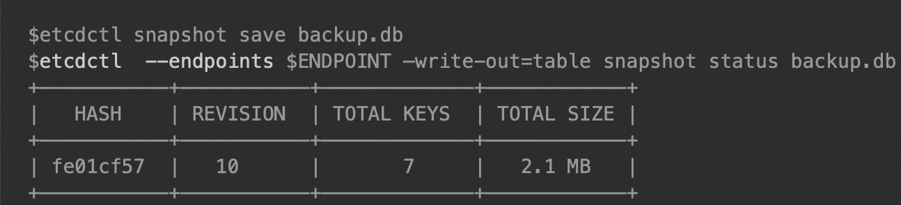

## etcd 使用经验总结 ##
---
*written by Alex Stocks on 2018/01/09，版权所有，无授权不得转载*


### 0 说明 ###
---

近日在单机上部署了一个 etcd 静态集群和基于这个静态集群的动态集群，并进行了相关测试，本文是部署以及测试过程的遇到的相关问题的流水账，权做记忆，以备后来参考。

为分布式集群提供一致性服务的组件，先有 google 内部的 Chubby，后有 hadoop 生态的 zookeeper。基于 Java 的 zookeeper 保证 CP，但是廉颇老矣，以往曾有同事曾经测试过在三千左右的客户端的频繁读写情况下 zookeeper 会频繁死掉。和 zookeeper 等同类产品相比，coreos 开发的同样保证 CP 的 etcd 与其功能几乎雷同，但是 zookeeper 的设计和实现都很繁琐，而采用了 gRPC 作为底层通信框架的 etcd 几乎有所有主流语言的客户端支持。zookeeper 的通信协议是自定制的 Jute RPC 协议，而 etcd 使用的 gRPC 可以接收通过 HTTP 发来的 JSON 请求，通过 curl 工具就可以对etcd 进行测试。容器时代的王者 kubernets 依赖它可实现上万个容器的管理。

etcd 提供了 leader 选举、分布式时钟、分布式锁、持续监控（watch）和集群内各个成员的 liveness 监控等功能。zookeeper 虽然也实现了类似的功能，但是不方便易用，还需借助 Netflix 提供的 Apache Curator 库。

etcd 目前主要有 v2 和 v3 两个版本，但 v3 比 v2 在 API 层做了大幅度的优化，且 v2 客户端经过解析优化后与 v3 的消息处理性能仍然有 2 倍的差距，而 v2 的 JSON 外部协议和集群内部协议在 v3 中同样支持，所以本文以 v3 为主。个人使用 etcd 的体会：etcd 与其说是一个提供一致性服务的分布式系统，不如说是一个分布式 kv 数据库。

[参考文档21](https://github.com/coreos/etcd/blob/master/Documentation/learning/why.md)提到etcd名字的由来：unix 系统的目录 /etc 是存储配置文件的地方，后来再加上一个代表distributed systems 的 ”d” 就组成了 etcd。所以说 etcd 可以被认识是一个分布式 kv 配置项数据库。

[参考文档23](https://github.com/coreos/etcd/blob/master/Documentation/learning/data_model.md)提到 etcd 是一个存储 **更新频率不高** 的 kv 存储库并能提供查询服务，其数据只有一个层级，数据模型采用 MVCC，每个 key 创建时起始 version 是 1，每次更新操作增一。实际 etcd 底层的 boltdb 采用 B+ 树形式存储 kv 的 MVCC 数据，每次修改的数据只存储增量版本，所以创建snapshot 的成本也是挺高的。kv 中的 key 是一个三元组 (major, sub, type)，Major 存储了 key 的 revision，Sub 则存储了同样 revision 下的差异，type 则是一个后缀，用于指明一些特殊 value 的类型，如果当前 value 中有 tombstone 则 type 为 t。B+ 树的 key 按照词典顺序进行排序。etcd 在内存中对 key 的 revision 也是以 B+ 树组织起来形成一个索引，value 指针指向磁盘中相应地增量值，这种组织形式便于进行 iteration。

etcd 还提供了一个客户端工具 [etcdctl](https://github.com/coreos/etcd/blob/master/etcdctl/README.md)，关于其详细用法见参考文档22。

### 1 静态集群 ###
---

关于集群如何部署，其实参考文档1已经有详细说明，本节只说明我自己测试时的使用方式。

etcd单节点启动命令如下：

```bash
	etcd --name=${name} \
	    --data-dir=${data_dir} \
	    --wal-dir=${wal_dir} \
	    --auto-compaction-retention=1 \
	    --snapshot-count=5000  \
	    --quota-backend-bytes=$((160*1024*1024*1024)) \
	    --heartbeat-interval=100 \
	    --election-timeout=500 \
	    --max-request-bytes 1536 \
	    --initial-advertise-peer-urls http://${ip}:${peer_port} \
	    --listen-peer-urls http://${ip}:${peer_port} \
	    --listen-client-urls http://${ip}:${client_port},http://127.0.0.1:${client_port} \
	    --advertise-client-urls http://${ip}:${client_port} \
	    --initial-cluster-token ${cluster_name} \
	    --initial-cluster etcd_node0=http://${ip}:${peer_port},etcd_node1=http://${peer1_ip}:${peer1_peer_port},etcd_node2=http://${peer2_ip}:${peer2_peer_port} \
	    --initial-cluster-state new  >> ${log_dir}/${name}.log 2>&1 &
```

各个参数的详细意义见参考文档17，下面列出一些主要参数的含义如下：

- 1 name 是 node 的名称，用于在集群中标识当前节点，etcd 单节点允许迁移，迁移后名称不变即可被其他节点识别；
- 2 etcd 底层使用的 kv 数据库 coreos/bbolt 是类似于 Rocksdb 的一个 LSM 数据库实现，与Rocksdb 一样数据有 wal 和 data 两种，建议两种数据分别存储到不同的存储系统上，以保证数据安全和系统性能；
- 3 etcd 底层使用的 coreos/bbolt, 类似于 rocksdb 会定期做 compaction 以清除过期数据，上面的  auto-compaction-retention 指定的时间单位是小时，当然也可以借助工具 etcdctl 强行进行 compaction，使用方法详见参考文档9#History compaction#一节；
- 4 参考文档9#Space quota#一节建议给etcd限定磁盘使用量，以防止etcd无限度的使用磁盘导致磁盘爆满后再去做compaction导致系统响应速度下降进而导致系统不稳定，当etcd使用的磁盘额度到达限定额度的时候会发出cluster级别的alarm使集群进入maintenance模式，只接收读和删除请求，当进行compaction和defragmenting(碎片化整理)完毕留出足够空间的时候才会回到正常工作状态；
- 5 max-request-bytes可以限制key的最大长度，此处限制长度为15KiB；
- 5 initial-cluster-token用于标识集群的名称，initial-cluster则给出了静态cluster的各个成员的名称以及地址；
- 6 initial-cluster-state说明单节点启动时候的状态，节点重启时这个参数值改为 **existing**；
- 7 initial-cluster列出了cluster的初始成员，cluster启动后可通过命令 **etcdctl member update** 进行更改；
- 8 --force-new-cluster这个选项用于创建一个单节点集群；

集群部署完毕后，可以借助etcdctl查看集群的成员列表以及集群运行状态。etcdctl自身也分为v2和v3两个版本，集群状态的查看可借助其v2版本，使用方式如下：

```bash
	export ETCDCTL_API=2
	echo "-----------------member list----------------"
	etcdctl --endpoints=“http://localhost:2379” member list
	echo "-----------------cluster health-------------"
	etcdctl --endpoints=“http://localhost:2379“ cluster-health
```

静态集群自身也是可以扩容的，具体扩容方法见参考文档6和参考文档7。

### 1.1 更改client的advertise-client-urls ###
---

参考文档7#Update advertise client URLs#提到如果想更改这个参数，只需要在配置文件中把参数值更改后，重启实例即可。

### 1.2 更改client的advertise-peer-urls ###
---

参考文档7#Update advertise peer URLs#给出了更改这个参数的方法：

* 1 执行命令 **etcdctl member update a8266ecf031671f3 http://10.0.1.10:2380** 以告知cluster内其他成员这个节点的新地址；
* 2 更改节点配置，重启节点，以恢复节点的quorum。

### 1.3 添加一个节点 ###
---

具体详细步骤见参考文档7 #Add a New Member# 一节，下面给出操作过程：


* 1 通过命令 `ETCDCTL_API=3 etcdctl --endpoints=http://192.168.11.1:2379,http://192.168.11.1:12379,http://192.168.11.1:22379 member add etcd_node3 --peer-urls=http://192.168.11.1:32379` 更改集群配置

同时执行如下命令修改环境变量。

```bash
     ETCD_NAME="etcd_node3"
     ETCD_INITIAL_CLUSTER="etcd_node1=http://192.168.11.1:12380,etcd_node2=http://192.168.11.1:22380,etcd_node0=http://192.168.11.1:2380,etcd_node3=http://192.168.11.1:32379"
     ETCD_INITIAL_CLUSTER_STATE="existing"
```

需要注意的是，命令 `etcdctl member add` 会创建一个新的 member id，所以需要在第二步添加成员之前确保 `--data-dir` 为空，否则 etcd 启动时会使用 boltdb 中存储的旧的 ID [ https://github.com/etcd-io/etcd/issues/3710 ]。另外，需要确保 `--initial-cluster-state existing` 配置项正确。

* 2 添加成员

```bash
etcd --name=etcd_node3 \   
	--data-dir=/tmp/etcd/etcd_node3/./data/ \     
	--wal-dir=/tmp/etcd/etcd_node3/./wal/ \  
	--listen-peer-urls=http://192.168.11.100:32380 \  
	--initial-advertise-peer-urls=http://192.168.11.100:32380 \  
	--listen-client-urls=http://192.168.11.100:32379,http://127.0.0.1:32379 \  
	--advertise-client-urls=http://192.168.11.100:32379 \   
	--initial-cluster-state=existing \   
	--initial-cluster="etcd_node2=http://192.168.11.100:22380,etcd_node1=http://192.168.11.100:12380,etcd_node0=http://192.168.11.100:2380,etcd_node3=http://192.168.11.100:32380"
```

一定要注意，”initial-cluster” 里面一定要有新成员的peer地址。参考文档7 #Strict Reconfiguration Check Mode# 提到：etcdctl 执行完毕 ”etcdctl member add“ 后，etcd cluster 就把这个还未存在的node算进quorum了，**第二步必须准确完成**。

	如果仅仅通过命令”etcdctl member add“添加一个节点，但是不添加实际节点，然后就通过”etcdctl member remove“删除，则会得到如下结果：

```bash	
	$ ETCDCTL_API=3 etcdctl --endpoints=http://192.168.11.100:2379,http://192.168.11.100:12379,http://192.168.11.100:22379 member add    etcd_node3 --peer-urls=http://192.168.11.100:32380
	Member e9cfc62cee5f30d1 added to cluster 63e8b43e8a1af9bc
	
	ETCD_NAME=“etcd_node3”
	ETCD_INITIAL_CLUSTER=“etcd_node2=http://192.168.11.100:22380,etcd_node1=http://192.168.11.100:12380,etcd_node0=http://192.168.11.100:2380,etcd_node3=http://192.168.11.100:32380”
	ETCD_INITIAL_ADVERTISE_PEER_URLS=“http://192.168.11.100:32380”
	ETCD_INITIAL_CLUSTER_STATE=“existing”
	
	$ etcdctl member remove 63e8b43e8a1af9bc
	Couldn't find a member in the cluster with an ID of 63e8b43e8a1af9bc.
```

可见如果不添加节点，这个理论上存在但是实际上不存在的node是不可能从quorum中剔除掉的。

这两个添加 node 的步骤不能错乱，否则会导致集群中的 node ID 错乱，etcd log 中会有大量这种错误 "rafthttp: request sent was ignored (cluster ID mismatch: remote[db30be88917b6839]=ac5f3aa02066b598, local=9b09b40f488fe304)" [ https://github.com/etcd-io/etcd/issues/3710 ]。

### 1.4 删除一个节点 ###
---

具体详细步骤见参考文档7#Remove a New Member#一节，一个命令即可完成任务：

```bash
	$ etcdctl member remove a8266ecf031671f3
	Removed member a8266ecf031671f3 from cluster
```

在参考文档7#Error Cases When Adding Members#一小节中，提到一个node被remove后，如果再次重新启动，则会得到如下错误提示：

```bash
	$ etcd
	etcd: this member has been permanently removed from the cluster. Exiting.
	exit 1
```

## 2 动态集群 ##
---

当可以预估 etcd 集群的使用量以及明确知道集群的成员的时候，可以静态方式部署集群。但大部分情况下这两个无法确定的时候，可以使用动态方式部署集群。

动态方式部署 etcd 集群依赖于 etcd 具备的动态发现(官文称为 discovery)功能：可以使用已有的 etcd 集群或者  dns 服务作为 etcd 通信数据 pubsub 节点，实现另一个集群中各个已有成员之间的服务发现和新成员的加入，进而实现集群的扩展。

个人倾向于以一个数量有限且压力不大的静态集群作为动态集群各个节点的 discovery 的基础。个人使用Elasticsearch多年，这种使用方式其实与Elasticsearch集群的部署方式雷同：先部署若干以控制角色启动的Elasticsearch节点组成一个discovery中心，然后各个以数据节点角色启动的Elasticsearch通过这个discovery中心实现服务发现。可见大道所行处，成熟的架构雷同。

在一个静态集群上创建channel如下：

```bash
	curl -X PUT "http://${registry_url}/v2/keys/discovery/testdiscoverycluster/_config/size" -d value=3
```

动态集群etcd单节点启动命令如下：

```bash
    etcd --name=${name} \
        --data-dir=${data_dir} \
        --wal-dir=${wal_dir} \
        --auto-compaction-retention=1 \
        --snapshot-count=5000  \
        --quota-backend-bytes=$((160*1024*1024*1024)) \
        --heartbeat-interval=100 \
        --election-timeout=500 \
        --max-request-bytes 1536 \
        --initial-advertise-peer-urls http://${ip}:${peer_port} \
        --listen-peer-urls http://${ip}:${peer_port} \
        --listen-client-urls http://${ip}:${client_port},http://127.0.0.1:${client_port} \
        --advertise-client-urls http://${ip}:${client_port} \
        --discovery http://localhost:2379/v2/keys/discovery/testdiscoverycluster \
        --initial-cluster-token ${cluster_name} >> ${log_dir}/${name}.log 2>&1 &
```

可见不需要再指定集群内的各个成员，只需要指定discovery channel即可。

## 3 测试 ##
---

为了测试两种集群模式对集群成员变动的反应，分别进行一系列测试。

## 3.1 静态集群测试 ##
---

静态集群成员如果丢失数据或者改变名称，则再次加入集群后不会被接纳。

有作证明的测试过程1如下：

- 1 部署一个静态集群；
- 2 以 kill 方式杀死一个成员，然后 clear 掉数据，重启失败；

此时 etcd 的 log 显示一个critical级别错误 log “etcdmain: member 7f198dd1e26bed5a has already been bootstrapped”。

有作证明的测试过程2如下：

- 1 部署一个静态集群；
- 2 以kill方式杀死一个成员，然后给成员一个新名称，重启失败；

此时etcd的log给出critical级别错误log“etcdmain: couldn't find local name "etcd_node3" in the initial cluster configuration”。

修改名称等同于扩充集群，正确的操作步骤参见#1.3#节。

## 3.2 动态集群测试 ##
---

当动态集群启动后，集群内成员间即可相互通信，不依赖于原静态集群。有作证明的测试过程如下：

- 1 部署一个静态集群；
- 2 以 discovery 方式在静态集群之上再部署一个动态集群；
- 3 杀掉静态集群各个成员；
- 4 通过 etcdctl 查看动态集群成员列表以及集群状态，成员不变，集群状态是healthy；
- 5 向动态集群添加新成员失败；
- 6 杀掉一个动态集群成员，再重新启动后成功加入动态集群；
- 7 杀掉一个动态集群成员，清空其 data_dir 和 wal_dir 下数据，再重新启动后加入动态集群失败；

只要动态集群现有成员的数据还在，就能保证动态集群自身的稳定运行【参考文档6#Do not use public discovery service for runtime reconfiguration#也证实了这点】。又有作证明的测试过程如下：

- 1 部署一个静态集群；
- 2 以 discovery 方式在静态集群之上再部署一个动态集群；
- 3 杀掉动态集群各个成员，清空各个成员数据，然后分别启动之，这些成员加入动态集群失败；
- 4 修改各个成员的 name，然后再启动，加入动态集群成功；

上面最后一步启动的各个节点，其实是以新 node 的身份加入了原动态集群。


## 4 分布式一致性 ##
---

目前 etcd 的同类产品很多，既有通过 zab 协议实现 paxos 的 zookeeper，也有 kafka 自身在 topic 的 partition级别实现的类似于 raft 的一致性的 coordinator。关于 etcd 与同类产品的比较详见[参考文档21](https://github.com/coreos/etcd/blob/master/Documentation/learning/why.md)。

### 4.1 consul & Eureka ###
---

文章开头提及了zookeeper，并给出了二者特性的一些比较，这里再补充下 consul 的相关特性。consul自身是一个端到端的服务发现框架。它包括了监控检查、失败探测和 DNS 能力支持。它也提供了一个性能一般的存储引擎以及一组复杂的 API 接口，Consul 0.7 的存储引擎的可扩展性不好，当 key 的数目达到百万级的时候，其延迟和内存压力急剧上升。它竟然没有 KV 接口，而且不提供多版本 key 支持，没有条件事务 (conditional transactions)支持，也没有流式 watch 功能支持。

当然 consul 和 etcd 的使用目的不一样，用于解决不同使用场景下的相关问题。如果单纯从存储角度来看，当然选择 etcd。如果需要端到端的服务发现能力，etcd 的特性就不够突出了，可以选择 Kubernetes、Consul 和SmartStack。

etcd 所有的数据同步都是在一个唯一的“复制组”（consistent replication group）里进行的。当进行少量 GB 级别的数据排序时，etcd 还是能够胜任这个工作的，每次改动 leader 都会给这个动作分配一个 cluster 级别的唯一 ID【revision ID】，这个ID是全局单调递增的。唯一的“复制组”意味着etcd cluster的数据是不能扩展或者说是不能分区(sharding)的，如果需要通过多 raft group 提供 sharding 的能力就只能使用 NewSQL 而非 etcd 了。

[参考文档28](http://dockone.io/article/801)一文中，etcd 的作者李响提到：`Consul是个full stack的工具。etcd只是一个简单的一致性kv。我们认为能把一致性kv这件事情完整的做好已经不容易了。我们希望上层的系统可以在etcd上搭建，而不是让etcd本身服务最终用户。另外在某些程度上而言，Consul并不着重保证自身的稳定性和可靠性。HashiCorp自己的调度系统nomad也并没有采用Consul。这些差别导致了很多设计、实现上的不同。`

[参考文档29](http://calvin1978.blogcn.com/articles/routing.html)提到：`Netflix 家也有个 Eureka，目前的版本基于RESTFul的API， 所以推送能力比前几家弱，靠着默认定时30秒的刷新，Server间要数据同步，Client与Server要数据同步，文档里说最多两分钟才保证通知到所有客户端，与ZK们秒级的推送速度相差甚远。对于脑裂的情况，Eureka的态度是宁愿保留坏数据，不要丢失好数据，见仁见智`。

### 4.2 zookeeper ###
---

考虑到 zookeeper 集群是第一个流行起来的同类组件，已有很多分布式系统已经采用它，这些系统不可能为了使用 etcd 而重新开发，etcd 为了与之兼容而在 etcd v3 之上开发了一个etcd代理：zetcd。

etcd v3 基于 gRPC 提供了 REST 接口，提供了 PUT/DELETE/GET 等类似 HTTP 的幂等原语，使之可在功能上与zookeeper 等同，但是使用 go 开发的 etcd 性能可甩基于  JVM 的 zookeeper 好几条街【参考文档2】。etcd v3的协议与 zookeeper 不同，zetcd 将 ZooKeeper 客户端的请求转换为适合于 etcd 数据模型和 API 要求的消息发送给 etcd，然后将 etcd 的响应消息转换后返回给客户端。

个人建议把 zetcd 作为服务端环境的基础设置，在使用etcd集群提供的服务的每个系统上都部署一个，把原有依赖zookeeper 服务的系统迁移到etcd之上。官方文档【参考文档3】中提到使用 proxy 的好处是：当 etcd cluster 成员变动比较大的时候，proxy 自动把失效的成员从可用 etcd member list 中剔除掉，并发送心跳包去探测其是否活过来。

参考文档3说别指望一个 proxy 对系统性能提高有大的帮助，参考文档8的 #Limitions# 指出有些情况下还可能造成 watch 返回的结果不正确。

参考文档25 提到 zetcd 有一个 `cross-checking` 工作模式。在 cross-checking 模式下，zetcd 同时连接 zookeeper 集群和 etcd 集群，zookeeper 集群称为 oracle，etcd 集群称为 candidate。每次读写请求，zetcd 都会同时发往 zookeeper 和 etcd，以 zookeeper 的响应检验 etcd 的响应，若二者响应结果不一致则可以把结果以 log 形式记录下来。假设有一个 zookeeper 单节点伪集群 `localhost:2182`，错误日志输出到 stderr，则 cross-checking 模式启动命令如下：

	zetcd --zkaddr 0.0.0.0:2181 --endpoints localhost:2379 --debug-zkbridge localhost:2182  --debug-oracle zk --logtostderr -v 9

上面命令行中 flag 参数 `-zkbridge` 用来指定一个 ZooKeeper 集群，`-oracle zk` 用来启用 `cross-checking` 工作模式。

至于 zetcd 如何使用本文不再详述。

[参考文档28](http://dockone.io/article/801)一文中，etcd 的作者李响提到：`etcd和ZooKeeper的设计理念和方向不太一样。目前etcd着重于go stack和cloud infra领域。很多上层系统例如Kubernetes、CloudFoundry、Mesos等都对稳定性、扩展性有更高的要求。由于理念的不同，导致了很多设计的不同。比如etcd会支持稳定的watch而不是简单的one time trigger watch，因为很多调度系统是需要得到完整历史记录的。etcd支持mvcc，因为可能有协同系统需要无锁操作等等。在性能上今后etcd可能也要做更多工作，因为container infra有更多的大规模场景。`

### 4.3 etcd v2 & v3 ###
---

etcd 最新版本是 v3，与其以前的 v2 版本有很大不同，[参考文档28](http://dockone.io/article/801) 提到 `etcd 3主要解决如下几个问题：多版本键值（MVCC）、迷你事务（mini transcation）、更稳定的watch、大数据规模、大用户watch、性能优化。`

etcd v2 支持 CompareAndSwap 这个原子性操作。CompareAndSwap 首先对一个 key 进行值比较，如果比较结果一致才会进行下一步的赋值操作。像利用 x86 的 CAS 实现锁一样，利用 CompareAndSwap 可以实现分布式的锁系统。但是这个 feature 在 v3 中移除了。

v3 与 v2 的主要对比，[参考文档28](http://dockone.io/article/801) 罗列如下：

+ mini transaction 支持原子性比较多个键值并且操作多个键值。之前的 CompareAndSwap 实际上一个针对单个 key 的mini transaction。一个简单的例子是 Tx(compare: A=1 && B=2, success: C = 3, D = 3, fail: C = 0, D = 0)。当 etcd 收到这条 transcation 请求，etcd 会原子性的判断 A 和 B 当前的值和期待的值。如果判断成功，C 和 D 的值会被设置为 3。

+ etcd v2 对一个 key 仅保存了 1000 个历史更改，如果 watch 过慢就无法得到之前的变更。etcd v3 为了支持多纪录，采用了历史记录为主索引的存储结构。etcd v3 可以存储上十万个纪录，进行快速查询并且支持根据用户的要求进行 compaction。

+ etcd v2 和其它类似开源一致性系统一样最多只能存储数十万级别的 key。主要原因是一致性系统都采用了基于 log 的复制，log 不能无限增长，所以在某一时刻系统需要做一个完整的 snapshot 并且将 snapshot 存储到磁盘。在存储 snapshot 之后才能将之前的 log 丢弃。每次存储完整的 snapshot 是非常没有效率的，但是对于一致性系统来说设计增量 snapshot 以及传输同步大量数据都是非常繁琐的。etcd v3 通过对 raft 和存储系统的重构，能够很好的支持增量 snapshot 和传输相对较大的 snapshot。目前 etcd v3 可以存储百万到千万级别的 key。

+ 另外一个问题是支持大规模 watch。我们主要工作是减小每个 watch 带来的资源消耗。首先我们利用了HTTP/2 的 multiple stream per tcp connection，这样同一个 client 的不同 watch 可以 share 同一个 tcp connection。另一方面我们对于同一个用户的不同 watch 只使用一个 goroutine 来 serve，这样再一次减轻了 server 的资源消耗。【v2 每个 watch 都会占用一个 tcp 资源和一个 goroutine 资源，大概要消耗 30-40kb】。

+ 我们在性能方面也做了很多相关的优化。etcd v3 目前的性能远强于 etcd v2，我们相信 etcd v3 的性能在不进行特殊优化的情况下就可以足够应付绝大部分的使用场景。在一个由 3 台 8 核节点组成的的云服务器上，<font color=red>**etcd v3 可以做到每秒数万次的写操作和十万次读操作**</font>。


### 4.4 Raft ###
---

[参考文档27](https://yuerblog.cc/yuerblog.cc/2017/12/10/principle-about-etcd-v3/) 提到 Raft 协议内容如下：

	+ 每次写入都是在一个事务（tx）中完成的。
	+ 一个事务（tx）可以包含若干 put（写入K-V键值对）操作。
	+ etcd 集群有一个 leader，写入请求都会提交给它。
	+ leader 先将数据保存成日志形式，并定时的将日志发往其他节点保存。
	+ 当超过 1/2 节点成功保存了日志，则 leader 会将 tx 最终提交（也是一条日志）。
	+ 一旦 leader 提交 tx，则会在下一次心跳时将提交记录发送给其他节点，其他节点也会提交。
	+ leader 宕机后，剩余节点协商找到拥有最大已提交 tx ID（必须是被超过半数的节点已提交的）的节点作为新leader。
	
	最重要的是：
	+ Raft中，后提交的事务ID > 先提交的事务ID，每个事务 ID 都是唯一的。
	+ 无论客户端是在哪个 etcd 节点提交，整个集群对外表现出数据视图最终都是一样的。

etcd 通过 boltdb 的 MVCC 保证单机数据一致性，通过 raft 保证集群数据的一致性。参考文档15#Operation#提到，raft 的 quorum 一致性算法说来也就一句话：集群中至少 (n+1)/2 个节点都能对一个外部写操作或者内部集群成员更新达成共识。这个模型能够完全规避脑裂现象的发生。

如果 raft 集群中有处于 unhealthy 状态的 node，需要先把它剔除掉，然后才能进行替换操作。但是添加一个新的 node 是一件非常高风险的操作：如果一个 3 节点的etcd集群有一个 unhealthy node，此时没有先把unhealthy node 剔除掉，而新添加节点时可能由于配置不当或者其他原因导致新的 node 添加失败，则新集群理论上 node number 为 4 而当前 quorum 只可能达到 2，失去 consensus 的集群对任何操作都无法达成共识。

如果按照正确的操作步骤，先剔除 unhealthy node，此时 n 为 2 而 quorum 为 2，添加新节点后 n 为 3，及时添加新节点失败也不会导致集群不可用。

etcd 通过设置配置文件中 [strict-reconfig-check选项](https://github.com/coreos/etcd/blob/15bfc1b36162805e8a90ae747d955667870c2f95/etcd.conf.yml.sample#L70) 为 true，禁止任何危及 quorum 的行为。如果用户把这个选项设为 false，则添加一个新节点就轻松多了，结果就是集群数据不一致，大部分情况下会收到 "disk geometry corruption” 之类的error log。

etcd 内部 的 raft 实现见[参考文档24](https://github.com/coreos/etcd/blob/master/raft/design.md)。leader 会存储所有 follower对自身 log 数据的progress（复制进度），leader 根据每个 follower 的 progress 向其发送 ”replication message”，replication message 是 msgApp 外加上 log 数据。progress 有两个比较重要的属性：match 和 next。match 是 leader 知道的 follower 对自身数据的最新复制进度【或者说就是 follower 最新的 log entry set index】，如果 leader 对 follower 的复制进度一无所知则这个值为 0，next 则是将要发送给 follower 的下一个 log entry set 的序号 range end。

progress有三个状态：probe，replicate 和 snapshot。

	                            +————————————————————————————————————————————————————————+
	                            |                  send snapshot                         |
	                            |                                                        |
	                  +——————————v—————————+                                  +——————————v—————————+
	              +—>       probe          |                                  |      snapshot      |
	              |   |  max inflight = 1  <——————————————————————————————————+  max inflight = 0  |
	              |   +——————————v—————————+                                  +——————————v—————————+
	              |             |            1. snapshot success
	              |             |               (next=snapshot.index + 1)
	              |             |            2. snapshot failure
	              |             |               (no change)
	              |             |            3. receives msgAppResp(rej=false&&index>lastsnap.index)
	              |             |               (match=m.index,next=match+1)
	receives msgAppResp(rej=true)
	(next=match+1)|             |
	              |             |
	              |             |
	              |             |   receives msgAppResp(rej=false&&index>match)
	              |             |   (match=m.index,next=match+1)
	              |             |
	              |             |
	              |             |
	              |   +——————————v—————————+
	              |   |     replicate      |
	              +—+ | max inflight = n   |
	                  +——————————v—————————+


如果 follower 处于 probe 状态，则 leader 每个心跳包最多只发送一个 “replication message”。leader 会缓慢发送 “replication message” 并探测 follower 的处理速度。leader 收到 msgHeartbeatResp 或者收到 msgAppResp（其中 reject 值为 true）时，leader 会发送下 **一个**  “replication message”。

当 follower 给 leader 的 msgAppResp 的 reject 为 false 的时候，它会被置为 replicate 状态，reject 为 false 就意味着 follower 能够跟上 leader 的发送速度。leader 会启动 stream 方式向以求最快的方式向 follower 发送“replication message”。当 follower 与 leader 之间的连接断连或者 follower 给 leader 回复的 msgAppResp 的reject 为 true 时，就会被重新置为 probe 状态，leader 当然也会把 next 置为 match+1。

当 follower 处于 replicate 状态时，leader 会一次尽量多地把批量 “replication message” 发送给 follower，并把“next” 取值为当前 log entry set 的最大值，以让 follower 尽可能快地跟上 leader 的最新数据。

当follower的log entry set与leader的log entry set相差甚巨的时候，leader会把follower的状态置为snapshot，然后以msgSnap请求方式向其发送snapshot数据，发送完后leader就等待follower直到超时或者成功或者失败或者连接中断。当follower接收完毕snapshot数据后，就会回到probe状态。[参考文档30](http://www.sohu.com/a/204912012_505827) 中提到接收 snapshot 的 follower 此时的角色是 learner 。

当follower处于snapshot状态时候，leader不再发送“replication message”给follower。

新当选的 leader 会把所有 follower 的 state 置为 probe，把 match 置为 0，把 next 置为自身 log entry set 的最大值。

leader向follower发送数据的方式类同于kafka每个topic partition级别leader向follower同步数据的过程。二者之间进行数据同步的时候，可以通过下面两个步骤进行流量控制：

+ 1. 限制message的max size。这个值是可以通过相关参数进行限定的，限定后可以降低探测follower接收速度的成本；
+ 2. 当follower处于replicate状态时候，限定每次批量发送消息的数目。leader在网络层之上有一个发送buffer，通过类似于tcp的发送窗口的算法动态调整buffer的大小，以防止leader由于发包过快导致follower大量地丢包，提高发送成功率。

在 Raft 进行 “membership change” 的时候，一定要注意以下几个 key point ：

+ 1. 原来的 Quorum 中有处于崩溃状态的 follower，一定要先把这个节点从 Quorum 中删除；
+ 2. learner 没有 vote 权限，不算入 Quorum；
+ 3. 一次向一个 Quorom 中最多添加一个 node；
+ 4. Raft 中正确向其中添加一个节点的算法是支持 Joint Consensus 算法，`虽然我知道理论上面 100% 的事情怎么做，但为了更加简单，我可以稍微放低一点要求。TiKV 和 etcd 现在都是没有用 joint consensus 的，但我们现在在开始添加 Learner，后面如果真的遇到了其他的 corner case，会不会考虑一下，没准也不是不可能的事情。`[引自参考文档30](http://www.sohu.com/a/204912012_505827)。

[参考文档31](http://www.sohu.com/a/202861958_736949) 给出了Etcd Raft 正常工作流程优化的几个关键点如下：

+ Pipeline

	Raft 工作流程分为Propose，Append，Broadcast 和 Apply。客户发起交易，我们叫做 Propose，然后我们记录交易，这个叫做 Append，再就是通知其他节点，这个叫做 Broadcast，等我们最后知道大部分网点都确认了这笔交易记录，我们就执行交易，也就是 Apply。

	对于客户 A，操作是 Propose，Append，Broadcast， Apply，对于客户 B 也是一样的流程，之前我们必须等 A 完成了，才能处理 B。当 A 在 Append 之后，我们就可以开始处理 B 的 Propose 了。我们只要保证的是所有银行网点的交易记录是一致有序的，那么我们就一定能保证最终所有银行的数据是一致的，所以只要 A Append 了，B 开始 Propose，B Append 的时候交易记录一定在 A 的后面，这样记录就一定是有序的了。

	当 A 执行完 Append 之后，我们就能立刻开始处理 B，而当 B Append 之后，我们也可以立刻处理下一个用户 C，这样整个流程就是一个像水流那样源源不断流动的了，这不就是一个 Pipeline 了。

+ Batch

	如果很多客户同时要发起交易，那么我们可以将这些交易记录，用一个消息发送过去到其他网点，这样我们就不需要一个一个的发送消息了，这就是 Batch。

	各个节点之间距离还是有点远的，消息传递的时间开销还是有点大的。使用 Batch 可以减少消息的发送次数，自然就能提高效率了。

+ Leader 并发写盘

	整个 Raft 的流程：Leader 收到 Propose，Append Log，然后 Broadcast Log，等收到 Follower 的回复确定 Log 被 Committed 之后，开始 Apply。而对应的 Follower，在收到 Log 之后，先 Append Log，然后给 Leader reply 消息，等下次 Leader 发过来的消息知道 Log 被 Committed 了，就可以 Apply 了。

	当用户在 Leader 节点进行交易的时候，原来我们的流程是 Propose，Append，然后再 Broadcast，但现在，我们在 Propose 之后，就可以直接 Broadcast，同时 Append，这两个步骤在 Leader 节点是可以同时处理的。即使 Broadcast 先进行，Leader 节点这边仍然需要在 Append 之后确保这笔记录被大多数节点确认了。

	Leader 节点必须知道大部分节点都收到了交易记录，才能认为是 Committed，然后继续处理。如果 Follower 节点这边也直接先回复消息再 Append，就可能出现一种情况，在 Append 之前，Follower 节点出现了问题，导致 Append 不成功。那么极端情况下面就会出现，Leader 认为记录都已经被大部分节点接受了，但实际并没有，我们就很可能面临数据丢失的问题了。所以 leader 可以先发起 Broadcast 然后再进行 Append，但是 follower 必须先 Append 然后再 Broadcast。

#### 4.4.1 MVCC ####
---

etcd 在内存中维护了一个 btree（B树）纯内存索引，就和 MySQL 的索引一样，它是有序的。

在这个btree中，整个k-v存储大概就是这样：

```go
	type treeIndex struct {
		sync.RWMutex
		tree *btree.BTree
	}
```

当存储大量的K-V时，因为用户的value一般比较大，全部放在内存btree里内存耗费过大，所以etcd将用户value保存在磁盘中。

etcd 在事件模型（watch 机制）上与 ZooKeeper 完全不同，每次数据变化都会通知，并且通知里携带有变化后的数据内容，其基础就是自带 MVCC 的 bboltdb 存储引擎。

MVCC 下面是几条预备知识：

+ 每个 tx 事务有唯一事务 ID，在 etcd 中叫做 main ID，全局递增不重复。
+ 一个 tx 可以包含多个修改操作（put 和 delete），每一个操作叫做一个 revision（修订），共享同一个 main ID。
+ 一个 tx 内连续的多个修改操作会被从 0 递增编号，这个编号叫做 sub ID。
+ 每个 revision 由（main ID，sub ID）唯一标识。

revision 定义如下：

```go
	// A revision indicates modification of the key-value space.
	// The set of changes that share same main revision changes the key-value space atomically.
	type revision struct {
		// main is the main revision of a set of changes that happen atomically.
		main int64
	
		// sub is the the sub revision of a change in a set of changes that happen
		// atomically. Each change has different increasing sub revision in that
		// set.
		sub int64
	}
```

内存索引中，每个原始key会关联一个key_index结构，里面维护了多版本信息：

```go
	type keyIndex struct {
		key         []byte   // key字段就是用户的原始key
		modified    revision // modified字段记录这个key的最后一次修改对应的revision信息
		generations []generation // 多版本（历史修改）
	}
	
	// generation contains multiple revisions of a key.
	type generation struct {
		ver     int64
		created revision // 记录了引起本次key创建的revision信息
		revs    []revision
	}
```

key 初始创建的时候，generations[0] 会被创建，当用户继续更新这个 key 的时候，generations[0].revs 数组会不断追加记录本次的revision 信息（main，sub）。在 bbolt 中，每个 revision 将作为 key，即序列化（revision.main+revision.sub）作为 key。因此，我们先通过内存 btree 在 keyIndex.generations[0].revs 中找到最后一条 revision，即可去 bbolt 中读取对应的数据。如果我们持续更新同一个 key，那么 generations[0].revs 就会一直变大，这怎么办呢？在多版本中的，一般采用 compact 来压缩历史版本，即当历史版本到达一定数量时，会删除一些历史版本，只保存最近的一些版本。

<font color=blue>**keyIndex 中的 generations 数组不会在一个数组的 index 上不断膨胀下去，一旦发生删除就会结束当前的Generation，生成新的Generation。同时 version 也会归零，每次 put 操作会让其从 1 重新开始增长。**</font>

put 操作的 bboltdb 的 key 由 main+sub 构成：

```go
	ibytes := newRevBytes()
​	idxRev := revision{main: rev, sub: int64(len(tw.changes))}
​	revToBytes(idxRev, ibytes)
```

delete 操作的 key 由 main+sub+”t” 构成：

```go
	idxRev := revision{main: tw.beginRev + 1, sub: int64(len(tw.changes))}
​	revToBytes(idxRev, ibytes)
​	ibytes = appendMarkTombstone(ibytes)
​	​
​	// appendMarkTombstone appends tombstone mark to normal revision bytes.
​	func appendMarkTombstone(b []byte) []byte {
​		if len(b) != revBytesLen {
​		    plog.Panicf(“cannot append mark to non normal revision bytes”)
​		}
​		return append(b, markTombstone)
​	}

	// isTombstone checks whether the revision bytes is a tombstone.
	func isTombstone(b []byte) bool {
		return len(b) == markedRevBytesLen && b[markBytePosition] == markTombstone
	}
```

bbolt 中存储的 value 是这样一个 json 序列化后的结构，包括 key 创建时的 revision（对应某一代 generation 的 created），本次更新版本，sub ID（Version ver），Lease ID（租约ID）：

```go
	kv := mvccpb.KeyValue{
​	    Key:            key,
​	    Value:          value,
​	    CreateRevision: c,
​	    ModRevision:    rev,
​	    Version:        ver,  // version is the version of the key. A deletion resets the version to zero and any modification of the key increases its version.
​	    Lease:          int64(leaseID),
​	}
```

总结来说：内存 btree 维护的是用户 key => keyIndex 的映射，keyIndex 内维护多版本的 revision 信息，而 revision 可以映射到磁盘bbolt 中的用户 value。

!! 注意：本小节选自 [参考文档 27](https://yuerblog.cc/2017/12/10/principle-about-etcd-v3)。

## 5 运行环境 ##
---

官方文档【参考文档4】给出了 etcd 稳定运行系统的一些硬件参考指标，本文精简如下：

- 1 CPU: 2~4 core 即可保证 etcd 流畅运行，当每秒的请求成千上万时，CPU 需要频繁地从内存加载数据，此时建议使用 8 ~ 16 个core；
- 2 Memory: 平常情况下 8G 内存即可保证 etcd 流畅运行，其中主要存储 kv cache 数据和客户端 watch 的数据，当处理的 qps 上万的时候，建议 16 ~ 64GB 的内存量，参考文档 15#System requirements# 提到 etcd 要求的内存最小容量是 2GB；
- 3 Disk: 存储介质的质量是 etcd 运行 performance 和 stability 的关键，差劲的存储介质会导致延迟增加和系统不稳定。一般情况下顺序读写能达到 50 IOPS(如 7200RPM 的磁盘)即可满足要求，当压力大的时候，要求能达到 500 IOPS（SSD盘或者其他虚拟的block设备）。需要注意的是，一般云厂商提供的磁盘 IOPS 是并行而非顺序的，这个并行的指标一般是顺序指标的十倍以上，可以使用diskbench or fio 工具去测试之。当 etcd 死掉重启后，为了快速恢复服务，etcd 需要快速进行数据恢复。通常情况下恢复 100MB 数据需要 15s（每秒10MB/s），在大 etcd 集群中要求 1GB 数据 15s 内恢复完毕（每秒 100MB/s）。<font color=blue>通常情况下建议使用 SSD 作为存储介质。如果用磁盘，要求能达到 15,000 RPM 的 RAID0。</font>   
- 4 Network: 一般情况下 1GbE（千兆）网卡可以保证稳定运行，对于大的集群则要求 10GbE(万兆) 网卡。不仅是速度，同时尽量把etcd 集群部署在同一个 IDC 以保证网络稳定，否则很容易出现网络分区导致的集群被划分成大集群和小集群的情况。
- 5 System: 根据参考文档5，etcd 官方保证 etcd 可在 amd64 + linux & ppc64Ie + linux 上稳定运行，其他硬件不推荐，由于 go runtime 在 32-bit 系统上的 bug，也不推荐 32 位操作系统；
- 6 Etcd： 集群的数目一般为 3 或者 5 即可，成员不是越多越好，参考文档7的 #Change the cluster size# 就提到 etcd 集群成员越多，leader 的通信任务就越繁重，可能导致响应延迟上升，参考文档15 #What is maximum cluster size# 则提到 Google Chubby 认为最适宜的数目是 5，最大数目为 7。

 ​         参考文档15#Should I add a member before removing an unhealthy member#一节提到，当集群出现 unhealthy 节点的时候，应该先下线这个节点，然后及时添加新节点以保证 quorum。
- 7 Go: [参考文档16](https://github.com/coreos/etcd/blob/master/Documentation/v2/admin_guide.md)#Best Practices#一节要求Go的最低版本是1.4。

### 5.1 与运行环境有关的faq ###
---

参考文档 15 列出了一些与运行环境有关的 faq，列出如下。

#### 5.1.1 “apply entries took too long” ####
---

etcd 集群接受一个写请求后，每个 etcd 成员都需要把写请求数据固化到 cores/bbolt 之中，整个过程不要超过 50ms。如果超过100ms，则 etcd 就会打印此条 log 进行警告。通常情况下是因为磁盘慢，比如磁盘竞争或者譬如虚拟块磁盘这种烂设备。etcd暴露给Prometheus 的 metrics 指标 backend_commit_duration_seconds 就显示了 commit 的瓶颈时间，这个指标低于 25ms 即可认为服务正常，如果磁盘本身确实慢则设置一个 etcd 专用磁盘或者更换成 SSD 通常就能解决问题。

第二个原因是 CPU 计算力不足。如果是通过监控系统发现 CPU 利用率确实很高，就应该把 etcd 移到更好的机器上，然后通过 cgroups 保证 etcd 进程独享某些核的计算能力，或者提高 etcd 的 priority。

或者有别的一些低速请求如有人要获取所有的 key 也会导致写请求受影响。

#### 5.1.2 “failed to send out heartbeat on time” ####
---

etcd 使用了 raft 算法，leader 会定时地给每个 follower 发送心跳，如果 leader 连续两个心跳时间没有给 follower 发送心跳，etcd 会打印这个 log 以给出告警。通常情况下这个 issue 是 disk 运行过慢导致的，leader 一般会在心跳包里附带一些 metadata，leader 需要先把这些数据固化到磁盘上，然后才能发送。写磁盘过程可能要与其他应用竞争，或者因为磁盘是一个虚拟的或者是 SATA 类型的导致运行过慢，此时只有更好更快磁盘硬件才能解决问题。etcd 暴露给 Prometheus 的 metrics 指标 wal_fsync_duration_seconds 就显示了 wal日志的平均花费时间，通常这个指标应低于 10ms。

第二种原因就是 CPU 计算能力不足。如果是通过监控系统发现 CPU 利用率确实很高，就应该把 etcd 移到更好的机器上，然后通过cgroups 保证 etcd 进程独享某些核的计算能力，或者提高 etcd 的 priority。

第三种原因就可能是网速过慢。如果 Prometheus 显示是网络服务质量不行，譬如延迟太高或者丢包率过高，那就把 etcd 移到网络不拥堵的情况下就能解决问题。但是如果 etcd 是跨机房部署的，长延迟就不可避免了，那就需要根据机房间的 RTT 调整h eartbeat-interval，而参数 election-timeout 则至少是 heartbeat-interval 的 5 倍。

#### 5.1.3 “snapshotting is taking more than x seconds to finish ...” ####
---

etcd 会把 kv snapshot 发送给一些比较慢的 follower 或者进行数据备份。慢的 snapshot 发送会拖慢系统的性能，其自身也会陷入一种活锁状态：在很慢地收完一个 snapshot 后还没有处理完，又因为过慢而接收新的 snapshot。当发送一个 snapshot 超过 30s 并且在1Gbps(千兆)网络环境下使用时间超过一定时间时，etcd 就会打印这个日志进行告警。


#### 5.1.4 “request ignored (cluster ID mismatch)” ####
---

etcd cluster 启动的时候通过 “initial-cluster-token” 参数指定集群的名称。如果一个老集群已经 tear down，但是还有部分成员活着，此时在老集群之上又部署新的集群之后，那些还活着的老成员会尝试连接新集群的各个成员，因为 cluster token 不一致新成员接收到请求后会报出这个 warning。

避免这个错误的方法就是不要使用老集群的地址。

### 5.2 运营环境参数调优 ###
---

下面内容来自于参考文档20。etcd 在网络延迟低的稳定环境下，采用 etcd 的默认参数就可以稳定运行。但如果硬件原因或者跨 IDC 会导致网络延迟过大，影响心跳时间超时或者选举超时。

当 cluster 中某节点卡死或者失联时，cluster 依靠两个参数重新达成 consensus：Heartbeat Interval 和 Election Timeout。Heartbeat Interval 是 leader 给 follower 发送心跳的时间间隔，这个时间值应该是两个 peer 之间的 RTT(round-trip time) 值，其默认值是 100ms。Election Timeout 则是心跳超时时间，如果这个时间超时后 follower 还没有收到 leader 发来的心跳，则 follower 就认为 leader 失联，然后发起 election，默认值是 1000ms。

Heartbeat Interval 一般取值集群中两个 peer 之间 RTT 最大值，取值范围是 [0.5 x RTT, 1.5 x RTT)。如果这个值过大，则会导致很晚才会发现 leader 失联，影响集群稳定性。Election Timeout 则依赖 Heartbeat Interval 和集群内所有 RTT 值的平均值，一般取值平均 RTT的十倍，这个值的最大值是50,000ms（50s）, 这个值只有在全球范围内部署的时候才使用。在全美大陆，这个值应该是 130ms，而美国和日本之间则应该是 350-400ms，全球范围的 RTT 一般是 5s，所以全球范围的 Election Timeout 取值 50s 作为上限为宜。

整个集群内所有peer的这两个值都应该取同样的值，否则会引起混乱。命令行修改这两个值的方法如下：

```bash
	# Command line arguments:
	$ etcd —heartbeat-interval=100 —election-timeout=500
	
	# Environment variables:
	$ ETCD_HEARTBEAT_INTERVAL=100 ETCD_ELECTION_TIMEOUT=500 etcd
```

etcd 底层的存储引擎 boltdb 采用了 MVCC 机制，会把一个 key 的所有 update 历史都存储下来，所以相关数据文件会线性增长，这会加重 etcd 的数据加载负担并降低集群的性能，在 v2 版本下 etcd 创建 snapshot 的成本也很高，所以默认情况下每 10,000 个 update 后etcd 才会创建一个 snapshot，如果这个参数下单机的内存和磁盘占用率还是很高，则可以通过命令调整如下：

```bash
	# Command line arguments:
	$ etcd —snapshot-count=5000
	
	# Environment variables:
	$ ETCD_SNAPSHOT_COUNT=5000 etcd
```

上面也提到，etcd 需要把 log 实时写入磁盘，所以其他通过 fsync 方式写入磁盘的进程会提高 etcd 进程的写过程的 latency，后果是心跳超时、处理请求超时、跟集群内其他成员失联。可以通过如下命令提高 etcd 进程的磁盘操作优先级：

```bash
	# best effort, highest priority
	$ sudo ionice -c2 -n0 -p `pgrep etcd`
```

如果 etcd 的 leader 需要处理大量的客户端高并发请求，则 etcd 可能由于网络拥塞导致每个请求处理延迟过高，下面日志会对这种情况有所提示：

```bash
	dropped MsgProp to 247ae21ff9436b2d since streamMsg’s sending buffer is full
	dropped MsgAppResp to 247ae21ff9436b2d since streamMsg’s sending buffer is full
```

此时可以通过提供 etcd 的发送缓冲器的优先级解决问题：

```
	tc qdisc add dev eth0 root handle 1: prio bands 3
	tc filter add dev eth0 parent 1: protocol ip prio 1 u32 match ip sport 2380 0xffff flowid 1:1
	tc filter add dev eth0 parent 1: protocol ip prio 1 u32 match ip dport 2380 0xffff flowid 1:1
	tc filter add dev eth0 parent 1: protocol ip prio 2 u32 match ip sport 2739 0xffff flowid 1:1
	tc filter add dev eth0 parent 1: protocol ip prio 2 u32 match ip dport 2739 0xffff flowid 1:1
```

## 6 etcd op ##
---

etcd 官方提供了一个万能的工具 etcdctl，etcd 的 op 工具都可以借助个工具完成。

### 6.1 snapshot ###
---

etcd v3 兼容 v2，所以进行数据操作前，需要检查数据的版本，参考文档 13 给出了一种查看 etcd 的数据的版本是否是 v3 的验证方式：

```bash
	ETCDCTL_API=3 etcdctl get "" --from-key --keys-only --limit 1 | wc -l
```

如果输出为 0，则数据版本是 v2。

参考文档9建议定期对 etcd 数据进行冷备，其 #Snapshot backup# 一节给出了冷备的用法：


​
​参考文档10 #Snapshotting the keyspace# 一节中提到了另一种方法：直接把数据目录 member/snap/db 下的数据拷贝备份。

至于用冷备数据如何恢复一个 cluster，请参见参考文档10#Restoring a cluster#。

snapshot 颇类似于 Redis 的 rdb 文件，是某个时刻所有 kv 数据各自最后 revision 的最新值，所有历史数据都被compact掉。第5节提到etcd 通过相关参数控制下默认每 10,000 次 update 后会对制作一个 snapshot。

### 6.2 data migration ###
---

etcd 集群的数据还可以进行数据迁移[migration]，可以采用离线或者在线两种方式，当数据量超过一定量的时候，参考文档13不建议进行在线恢复，建议直接把 etcd cluster 关停，备份数据然后拷贝到目的地，以离线方式重新启动 etcd cluster。

#### 6.2.1 离线迁移 ####
---

首先把集群停服，然后变换 etcd 每个 member 的 client 服务端口再次重启，确保 cluster 各个成员的 raft 状态机达到同样的状态，这个可以通过命令 **ETCDCTL_API=3 etcdctl endpoint status** 确认，当所有 member 的 raft index 相等或者相差不超过1（raft内部的命令导致）时认为数据一致。

通过命令 **ETCDCTL_API=3 etcdctl migrate** 即可完成数据 v2 到 v3 的迁移，v3 的数据格式是 mvcc 格式。数据迁移完毕可以通过命令 **ETCDCTL_API=3 etcdctl endpoint hashkv --cluster** 验证数据的一致性【注意这个命令只能在v3.3以上才可使用】。

但是对于 v2 中的 TTL 数据，如果数据 commited 时所在的 member 的 raft index 比 leader 的的 index 小，则数据迁移后可能导致数据不一致。

#### 6.2.2 在线迁移 ####
---

在线迁移的好处当然是不停服，但是前提是要求客户端使用 v3 版本的API。应用支持 etcd cluster 的 migration mode 和 normal mode，etcd cluster 运行在 migration cluster 期间，应用读取数据先使用 v3 API，失败后再尝试 v2 API。而在 normal mode 下应用只能使用 v3 API。两种 mode 下写 API 只能使用 v3。

migration mode 下客户端会 watch 一个 swtich mode key，当 migration mode 切换到 normal mode 后，这个 key 的 value 是 true。服务端在 migration mode 下则会启动一个后台任务，使用 v2 API 读取数据然后调用 v3 API 写入 mvcc 存储引擎中。

参考文档13在文章末尾不建议采用 online migration 方式，因为这会导致客户端和 etcd cluster 之间的网络开销外，还会导致 etcd 自身冗余数据过多。

参考文档14 #Limitations# 提到：当一个集群有超过 50MB 的 v2 数据时，数据升级过程可能花费两分钟，如果超过 100MB 则可能花费更多时间。

### 6.3 data compaction 和 data defragment ###
---

etcd 的 compaction 仅仅是合并一些文件并进行过去数据的删除，但是文件占用的磁盘可能有很多碎片，可以使用 etcdctl 完成碎片整理工作。

参考文档9 #History compaction# 给出了相关 compaction 使用方法：

```bash
	# keep one hour of history
	$ etcd --auto-compaction-retention=1
```

上面这种操作方法是通过时间窗口的策略让 etcd 自动压缩数据，还可以通过 etcdctl 命令手工进行数据压缩：

```bash
	# compact up to revision 3
	$ etcdctl compact 3
```

通过上面的命令手工压缩数据之后，revision 3 之前的数据就被清理掉了，譬如：

```bash
	$ etcdctl get --rev=2 somekey
	Error:  rpc error: code = 11 desc = etcdserver: mvcc: required revision has been compacted
```

参考文档9 #Defragmentation# 给出了碎片整理相关使用方法：

```bash
	$ etcdctl defrag
	Finished defragmenting etcd member[127.0.0.1:2379]
```

如果 etcd 没有运行，可以直接作用于 data 目录：

```bash
	$ etcdctl defrag --data-dir <path-to-etcd-data-dir>
```

### 6.4 角色控制 ###
---

如果 etcd 被当初一个配置中心，此时角色控制就有必要了。参考文档 11 详细描述了如何借助 etcdctl 进行角色控制，不过还有一个更好用的带有 UI 界面的工具 [e3w](https://github.com/soyking/e3w)，这个工具的界面是 Js 实现的，通过它就可方便地进行角色创建。

## 7 API ##
---

参考文档11#Request Size Limitation# 提到 etcd 为了防止一个大包请求把连接通道阻塞住，限制一个请求包大小在 1MB 以内。

### 7.1 Client Request Timeout ###
---

参考文档16 #Client Request Timeout# 提到当前各种请求的超时参数还不能被修改，这里也给出了各个类型的超时参数：

- 1 Get: 不可设置，应为 get 请求底层处理是异步的；
- 2 Watch: 不可设置，除非用户主动取消或者连接中断；
- 3 Delete, Put, Post, QuorumGet: 默认 5s，官方认为 5s 能够满足绝对部分情况下的超时要求；

其他情况下如果发生超时的情况，则可能有两种原因：处理请求的 server 不能提供正常服务，或者集群失去了 quorum。

如果客户端请求超时多次发生，系统管理员应该去检查系统的运行情况。

github.com/coreos/etcd/clientv3/config.go:Config::DialTimeout 意为创建 client 的首次连接超时，Client 创建成功后就不用关心其底层连接状态了，其底层会不断检查链接状态，失败则尝试重连。

### 7.2 KV ###
---

参考文档18提到 etcd 大部分 API 都是对 KV 对的请求和操作。etcd kv 的 protobuf 定义如下：

```go
	message KeyValue {
  		bytes key = 1;
  		int64 create_revision = 2;
  		int64 mod_revision = 3;
  		int64 version = 4;
  		bytes value = 5;
  		int64 lease = 6;
​	}
```

各个字段意义如下：

- key 是字节数组，不可为空；
- value 也是字节数组；
- version 则是 key 的版本，一个删除动作会把这个值清零，每次更新则会让其值增一；
- Create\_Revision key 创建时候的 revision；
- Mod\_Revision key 最近一次修改时的 revision；
- Lease  与 key 关联的 Lease，如果其值为 0 则说明没有关联的 Lease；

revision 是 MVCC 中的概念，是 etcd 中 cluster 级别的计数器，每次修改操作都会让其自增，可以认为是全局逻辑时钟(global logical clock)，对所有修改操作进行排序：revision 越大说明其值越新，etcd 对 key 索引使用 B+ 树方式进行组织。etcd 每个 key 都有很多revision（修订版本），每次事务操作都会创建一个 revision，老的 revision 在 etcd 进行 compaction 操作的时候会被清除。create_revision 会在使用 [mutex lock](https://github.com/coreos/etcd/blob/master/clientv3/concurrency/mutex.go) 的时候使用，Mod_Revision 与 [事务](https://github.com/coreos/etcd/blob/master/clientv3/concurrency/stm.go) 操作和 [leader选举](https://github.com/coreos/etcd/blob/master/clientv3/concurrency/election.go) 有关。

revision 也与 watch 有关，当 watch 的 client 与 server 闪断重连后，etcd 根据 client 上次 watch 相关的 revision，把其后的修改再通知给 client。

### 7.3 Range ###
---

etcd 允许一次以 range 形式操作多个 key。etcd 对数据的组织不像 zookeeper 那样以目录层次结构的方式进行，而只有一个层级，range 的形式是 [a, b)，即 [key, key_end)。如果 key_end 为空则请求只有 key；如果 range 是 [key, key+0x1) 则是请求以 key 为前缀的所有 key；如果 key\_end 是 ’\0’，则请求所有大于等于 key 的所有 key。

Range请求定义如下：

```go
	message RangeRequest {
	  enum SortOrder {
		NONE = 0; // default, no sorting
		ASCEND = 1; // lowest target value first
		DESCEND = 2; // highest target value first
	  }
	  enum SortTarget {
		KEY = 0;
		VERSION = 1;
		CREATE = 2;
		MOD = 3;
		VALUE = 4;
	  }
	
	  bytes key = 1;
	  bytes range_end = 2;
	  int64 limit = 3;
	  int64 revision = 4;
	  SortOrder sort_order = 5;
	  SortTarget sort_target = 6;
	  bool serializable = 7;
	  bool keys_only = 8;
	  bool count_only = 9;
	  int64 min_mod_revision = 10;
	  int64 max_mod_revision = 11;
	  int64 min_create_revision = 12;
	  int64 max_create_revision = 13;
	}
```

各个字段含义如下：

- Key, Range_End - key range；
- Limit - 返回key的数目的最大值，如果为0则说明没有限制；
- Revision - key修改的时间点(point-in-time)，如果其值为0则是获取最新的kv，如果指定的revision已经被compact掉则etcd返回ErrCompacted错误；
- Sort\_Order - 请求的排序方式；
- Sort\_Target - kv的排序方式；
- Serializable - sets the range request to use serializable member-local reads. By default, Range is linearizable; it reflects the current consensus of the cluster. For better performance and availability, in exchange for possible stale reads, a serializable range request is served locally without needing to reach consensus with other nodes in the cluster.
- Keys\_Only - 只返回key，无需返回Value；
- Count\_Only - 只返回range内key的数目；
- Min\_Mod\_Revision - 最低mod revision值，Mod\_Revision低于这个值的kv会被过滤掉；
- Max\_Mod\_Revision - 最大mod revision值，Mod\_Revision高于这个值的kv会被过滤掉；
- Min\_Create\_Revision - 最低create revision值，Mod\_Revision低于这个值的kv会被过滤掉；
- Max\_Create\_Revision - 最高create revision值，Mod\_Revision高于这个值的kv会被过滤掉。

Range 请求的响应定义如下：

```go
	message ResponseHeader {
	  uint64 cluster_id = 1;
	  uint64 member_id = 2;
	  int64 revision = 3;
	  uint64 raft_term = 4;
	}
	
	message RangeResponse {
	  ResponseHeader header = 1;
	  repeated mvccpb.KeyValue kvs = 2;
	  bool more = 3;
	  int64 count = 4;
	}
```

各个字段含义如下：

- Cluster_ID - etcd cluster ID；
- Member_ID - 返回响应的 cluster member 的 ID；
- Revision - 获取当前系统最新的 kv Revision；
- Raft_Term - 这个字段可用于检测当前集群是否已经选举出一个新的 leader；
- Kvs - 请求返回结果，如果 Count_Only 为 true，则这个结果为空；
- More - 是否有更多值，如果 limit 为 true；
- Count - Count_Only 为 true 时候的结果。

[参考文档26](https://yuerblog.cc/2017/12/12/etcd-v3-sdk-usage) 提到 Get 操作时的 etcd Range 机制：

	我们通过一个特别的 Get 选项，获取/test目录下的所有孩子：
	
	rangeResp, err := kv.Get(context.TODO(), "/test/", clientv3.WithPrefix())
	WithPrefix() 是指查找以 /test/ 为前缀的所有 key，因此可以模拟出查找子目录的效果。
	
	我们知道 etcd 是一个有序的 k-v 存储，因此 /test/ 为前缀的key总是顺序排列在一起。
	
	withPrefix实际上会转化为范围查询，它根据前缀/test/生成了一个key range，[“/test/”, “/test0”)，为什么呢？因为比/大的字符是’0’，所以以/test0作为范围的末尾，就可以扫描到所有的/test/打头的key了。
	
	在之前，我Put了一个/testxxx干扰项，因为不符合/test/前缀（注意末尾的/），所以就不会被这次Get获取到。但是，如果我查询的前缀是/test，那么/testxxx也会被扫描到，这就是etcd k-v模型导致的，编程时一定要特别注意。

### 7.4 Put ###
---

PutReqeust 定义如下：

```go
	message PutRequest {
	  bytes key = 1;
	  bytes value = 2;
	  int64 lease = 3;
	  bool prev_kv = 4;
	  bool ignore_value = 5;
	  bool ignore_lease = 6;
	}
```

各个字段含义如下：

- Key - KV 对的 key；
- Value - KV 对的 value；
- Lease - KV 对的超时 lease ID，默认值为 0；
- Prev_kv - 如果为 true，则 response 会返回 update 前的 kv 值；
- Ignore_Value - 不更新当前key的value，当key不存在的时候返回一个error；
- Ignore_Lease - 不更新key的lease，当key不存在的时候返回一个error。

响应定义如下：

```go
	message PutResponse {
	  ResponseHeader header = 1;
	  mvccpb.KeyValue prev_kv = 2;
	}
```

- prev_kv：Reqeuest 中的 prev\_kv 被设置为 true 的时候，这个结果就是 update 前的 kv 值；

### 7.5 Delete Range ###
---

删除则可以删除一定范围内的 kv 对，请求定义如下：

```go
	message DeleteRangeRequest {
	  bytes key = 1;
	  bytes range_end = 2;
	  bool prev_kv = 3;
	}
```

- Key, Range_End - key range；
- Prev_kv - 如果设置为 true，则返回删除前的kv结果；

响应定义如下：

```go
	message DeleteRangeResponse {
	  ResponseHeader header = 1;
	  int64 deleted = 2;
	  repeated mvccpb.KeyValue prev_kvs = 3;
	}
```

- Deleted - 被删除的 kv 数目；
- Prev\_kv - 如果请求中的 prev\_kv 被设为 true，则响应中就返回被删除的 kv 值数组；


### 7.6 Transaction ###
---

事务是在 kv 存储引擎之上的一种原子的 If/Then/Else 构建实现，它提供了一种在一组 kv 之上的一批请求的原子完成能力（就是一个原来多个请求现在一个事务请求内完成），能够防止意外的并行更新，构建原子的 compare-and-swap 操作，提供了一种更高级的并行控制能力。

事务内 revision 只增加一次，但是一个事务内对一个 kv 的写操作只能进行一次。事务要么成功，要么失败，没有中间状态，

参考文档19中给出了谷歌对事务(谷歌称为 MultiOp)的解释：

	来自 google paxosdb 论文:
	我们的系统有一个处于核心地位的叫做的 MultiOp 功能。 除了循环的 iteration 操作，其他操作都可以被认为是这个操作的单一调用。MultiOp是一个原子实现，由三个部分组成：
	1. 名为 guard 的比较算子列表。在 guard 中每个测试检查数据库中的单个项(entry)。它可能检查某个值的存在或者缺失，或者和给定的值比较。在 guard 中两个不同的测试可能应用于数据库中相同或者不同的项。guard 中的所有测试被应用然后 MultiOp 返回结果。如果所有测试是true，MultiOp 执行 t 操作 (见下面的第二项), 否则它执行 f 操作 (见下面的第三项).
	2. 被称为 t 操作的数据库操作列表. 列表中的每个操作是插入，删除，或者查找操作，并应用到单个数据库项。列表中的两个不同操作可能应用到数据库中相同或者不同的项。如果 guard 评价为true 这些操作将被执行
	3. 被成为 f 操作的数据库操作列表. 类似 t 操作, 但是是在 guard 评价为 false 时执行。

事务操作可以认为是一个比较操作链，每个比较动作定义如下：

```go
	message Compare {
	  enum CompareResult {
	    EQUAL = 0;
	    GREATER = 1;
	    LESS = 2;
	    NOT_EQUAL = 3;
	  }
	  enum CompareTarget {
	    VERSION = 0;
	    CREATE = 1;
	    MOD = 2;
	    VALUE= 3;
	  }
	  CompareResult result = 1;
	  // target is the key-value field to inspect for the comparison.
	  CompareTarget target = 2;
	  // key is the subject key for the comparison operation.
	  bytes key = 3;
	  oneof target_union {
	    int64 version = 4;
	    int64 create_revision = 5;
	    int64 mod_revision = 6;
	    bytes value = 7;
	  }
	}
```

- Result - 逻辑比较类型，如相等、小于或者大于；
- Target - 有待被比较的kv的某个字段，如 key 的 version、创建 revision、修改 revision 或者 value；
- Key - 用于比较操作的key；
- Target\_Union - 附带比较对象，如给定的 key 的版本、给定 key 的创建 revision、最后的修改 revision 和 key 的 value。

定义了比较算子后，事务请求还需要一连串的子请求操作，定义如下：

```go
	message RequestOp {
	  // request is a union of request types accepted by a transaction.
	  oneof request {
	    RangeRequest request_range = 1;
	    PutRequest request_put = 2;
	    DeleteRangeRequest request_delete_range = 3;
	  }
	}
```

- Request\_Range - 一个 RangeRequest；
- Request\_Put - 一个 PutRequest，keys 中每个 key 都必须唯一不能重复；
- Request\_Delete\_Range - 一个 DeleteRangeRequest，其操作的 key 也必须在整个事务中唯一。

最终事务请求定义如下：

```go
	message TxnRequest {
	  repeated Compare compare = 1;
	  repeated RequestOp success = 2;
	  repeated RequestOp failure = 3;
	}
```

- Compare - 一个比较算子序列；
- Success - 如果比较成功，则处理这个请求对象序列，响应的结果就是对这些子请求处理的结果；
- Failure - 如果比较失败，则处理这个请求对象序列，响应的结果就是对这些子请求处理的结果。

事务响应定义如下：

```go
	message TxnResponse {
	  ResponseHeader header = 1;
	  bool succeeded = 2;
	  repeated ResponseOp responses = 3;
	}
```

- Succeeded - 算子比较的结果，success 则为 true，fail 则为 false；
- Responses - 对所有子请求的处理结果。

ResponseOp 定义如下:

```go
	message ResponseOp {
	  oneof response {
	    RangeResponse response_range = 1;
	    PutResponse response_put = 2;
	    DeleteRangeResponse response_delete_range = 3;
	  }
	}
```

ResponseOp 的成员与 RequestOp 对应，此处就不再一一列举解释了。

### 7.7 Watch ###
---

Watch API 提供了一组基于事件的接口，用于异步获取 key 的变化后的通知。etcd 会把 key 的每一次变化都通知给观察者，而不像zookeeper 那样只通知最近一次的变化。

Event 代表了 key 的一次 update，包括 update 的类型和变化前后的数据，定义如下:

```go
	message Event {
	  enum EventType {
	    PUT = 0;
	    DELETE = 1;
	  }
	  EventType type = 1;
	  KeyValue kv = 2;
	  KeyValue prev_kv = 3;
	}
```

- Type - event type，PUT 则下面会给出新增加的 value，DELETE 则指出 key 已被删除；
- KV - KeyValue 是 event 相关的 value，如果 type 是 PUT 则 KV 是当前更新后的 kv 对，如果 kv.Version 值为 1 则说明 kv 是新创建的。如果 type 是 DELETE，则 KV 的 revision 就是 delete 动作发生时的 revision；
- Prev_KV - event 动作发生前的 kv 值，为了节省带宽，如果请求中没有特别指明，这个值内容为空。

Watch 是一个长久运行的请求，基于 gRPC 的 stream 进行 stream 数据的传输。

Watch 对 event 作出了如下三项保证:

- 有序 - event 依据 revision 进行排序，一个 event 投递一次后就不会再次被投递；
- 可靠 - 一系列 event 通知如 a/b/c 的发生时间 a < b < c，则只会依次收到 a、b和c，不会只收到 a 和 c；
- 原子 - 一次操作产生一个 revision，server 发出一个 event，事务的结果也仅仅产生一次 event 通知。

基于一次 gRPC stream 连接，可以发出如下 watch 创建请求：

```go
	message WatchCreateRequest {
	  bytes key = 1;
	  bytes range_end = 2;
	  int64 start_revision = 3;
	  bool progress_notify = 4;
	
	  enum FilterType {
	    NOPUT = 0;
	    NODELETE = 1;
	  }
	  repeated FilterType filters = 5;
	  bool prev_kv = 6;
	}
```

- Key, Range\_End - 被观察的 key 的 range[key, range\_end)，如果 range\_end 没有设置，则只有参数 key 被观察，如果 range\_end 等同于 '\0'， 则大于等于参数 key 的所有 key 都将被观察；
- Start_Revision - 观察的起始的 revision，如果不设置则是最新的 revision；
- Progress_Notify - 如果设置为 true，则 etcd 将定期发送不带任何事件的空 WatchResponse。当一个 watch 连接断开后，客户端进行重连时候会指定开始的 revision，server 会根据当前系统的负载决定把发送 watch event 的频率；
- Filters - event 过滤器，server 给 watch 客户端发送通知的时候，会先把相关事件过滤掉；
- Prev_kv - 如果设置为 true，则被创建的观察者在事件发生前获取上一次的 kv，如果上一次的 kv 在 etcd compaction 的时候被删除掉，则不会返回任何值。

watch 的响应内容定义如下：

```go
	message WatchResponse {
	  ResponseHeader header = 1;
	  int64 watch_id = 2;
	  bool created = 3;
	  bool canceled = 4;
	  int64 compact_revision = 5;
	
	  repeated mvccpb.Event events = 11;
	}
```

- Watch_ID - 和watch相关的watcher ID；
- Created - 如果请求是WatchCreateRequest，则这个值为true，所有发送给同一个watch的event都带有同样的watch_id；
- Canceled - 如果请求是WatchCancelRequest，则这个值为true，这个Response之后watcher不会再收到任何response；
- Compact_Revision - 如果watcher试图观察一个旧的不存在的revision时候，server会返回当前存在的最小的有效revision。如果watcher根不是server发出的watch通知的时候，server会发出这个通知并断开watch连接。
- Events - 针对同一个watch ID返回的一批有序的event集合。

如果一个watcher想停止watch，则可以发出如下请求：

```go
	message WatchCancelRequest {
	   int64 watch_id = 1;
	}
```

- Watch_ID - 要取消的 watcher 的 ID，server 后面就不会再更多的 event。

### 7.8 Lease ###
---

Lease 提供了对租约的支持。cluster 保证了 lease 时间内 kv 的有效性，当 lease 到期而客户端没有对 lease 进行续约时，lease 就超时了。每个 kv 只能绑定到一个 lease 之上，当 lease 超时后，相关的所有 kv 都会被删除，每个 key 的每个 watcher 都会收到 delete event。

创建一个 lease 请求体如下：

```go
	message LeaseGrantRequest {
	  int64 TTL = 1;
	  int64 ID = 2;
	}
```

- TTL - 一个以秒为单位的超时时间；
- ID - Lease ID，如果值为 0，则 etcd 会进行赋值。

server 创建 lease 成功后，会返回如下的响应：

```go
	message LeaseGrantResponse {
	  ResponseHeader header = 1;
	  int64 ID = 2;
	  int64 TTL = 3;
	}
```

- ID - etcd 为 lease 分配的 ID；
- TTL - 以秒为单位的 lease 时间；

撤销租约请求如下：

```go
	message LeaseRevokeRequest {
	  int64 ID = 1;
	}
```

- ID - 将要撤销的 lease ID，请求成功后，所有 ID 相关的 key 都会被删除。

如果客户端想要对一个 lease 进行续约，可以发出如下请求：

```go
	message LeaseKeepAliveRequest {
	  int64 ID = 1;
	}
```

- ID - 续约的 lease ID。

应答消息体定义如下：

```go
	message LeaseKeepAliveResponse {
	  ResponseHeader header = 1;
	  int64 ID = 2;
	  int64 TTL = 3;
	}
```

- ID - 续约的 ID；
- TTL - 剩余的 TTL，以秒为单位。

github.com/coreos/etcd/clientv3/lease.go:Lease 接口提供了以下一些功能函数：

* Grante: 创建一个 lease 对象；
* Revoke: 释放一个 lease 对象；
* TimeToLive: 获取 lease 剩余的 TTL 时间；
* Leases: 列举 etcd 中的所有 lease；
* KeepAlive: 自动定时对 lease 续约；
* KeepAliveOnce: 为 lease 续约一次，代码注释中说大部分情况下都应该使用 KeepAlive；
* Close: 关闭当前客户端建立的所有 lease；

Put 函数和 KeepAlive 函数都有一个 Lease 对象，如果在进行 Put 或者 KeepAlive 之前 Lease 已经过期，则 etcd 会返回 error。

### 7.9 Compact ###
---

可以通过 API 进行过往数据（历史数据）的整理（compaction），否则一直增长下午磁盘会被沾满且影响 etcd 性能和集群的稳定性，请求消息体定义如下：

```go
	message CompactionRequest {
	  int64 revision = 1;
	  bool physical = 2;
	}
```

- revision: 小于 revision 值的历史数据都会被清理；
- physical: 这个标记为 true 的时候，RPC server 端会等待直到物理磁盘的历史数据被整理完毕再给客户端响应。

响应消息体定义如下：

```go
	message CompactionResponse {
	  ResponseHeader header = 1;
	}
```

## 参考文档 ##
---

- 1 [Clustering Guide](https://github.com/coreos/etcd/blob/master/Documentation/op-guide/clustering.md)
- 2 [Exploring Performance of etcd, Zookeeper and Consul Consistent Key-value Datastores](https://coreos.com/blog/performance-of-etcd.html)
- 3 [When to use etcd gateway](https://github.com/coreos/etcd/blob/master/Documentation/op-guide/gateway.md#when-to-use-etcd-gateway)
- 4 [hardware](https://github.com/coreos/etcd/blob/master/Documentation/op-guide/hardware.md)
- 5 [supported platform](https://github.com/coreos/etcd/blob/master/Documentation/op-guide/supported-platform.md)
- 6 [runtime reconf design](https://github.com/coreos/etcd/blob/master/Documentation/op-guide/runtime-reconf-design.md)
- 7 [Runtime reconfiguration](https://github.com/coreos/etcd/blob/master/Documentation/op-guide/runtime-configuration.md)
- 8 [gRPC proxy](https://github.com/coreos/etcd/blob/master/Documentation/op-guide/grpc_proxy.md)
- 9 [Maintenance](https://github.com/coreos/etcd/blob/master/Documentation/op-guide/maintenance.md)
- 10 [Disaster recovery](https://github.com/coreos/etcd/blob/master/Documentation/op-guide/recovery.md)
- 11 [ole-based access control](https://github.com/coreos/etcd/blob/master/Documentation/op-guide/authentication.md)
- 12 [Overview](https://github.com/coreos/etcd/blob/master/Documentation/rfc/v3api.md)
- 13 [Migrate applications from using API v2 to API v3](https://github.com/coreos/etcd/blob/master/Documentation/op-guide/v2-migration.md)
- 14 [Upgrade etcd from 3.1 to 3.2](https://github.com/coreos/etcd/blob/master/Documentation/upgrades/upgrade_3_2.md)
- 15 [faq](https://github.com/coreos/etcd/blob/master/Documentation/faq.md)
- 16 [Administration](https://github.com/coreos/etcd/blob/master/Documentation/v2/admin_guide.md)
- 17 [Configuration Flags](https://github.com/coreos/etcd/blob/master/Documentation/v2/configuration.md)
- 18 [etcd3 API](https://github.com/coreos/etcd/blob/master/Documentation/learning/api.md)
- 19 [etcd API Reference](https://github.com/coreos/etcd/blob/65464838ba7d2ddbc282f0330153e4fb999ac598/Documentation/dev-guide/api_reference_v3.md)
- 20 [Tuning](https://github.com/coreos/etcd/blob/master/Documentation/tuning.md)
- 21 [etcd versus other key-value stores](https://github.com/coreos/etcd/blob/master/Documentation/learning/why.md)
- 22 [etcdctl](https://github.com/coreos/etcd/blob/master/etcdctl/README.md#alarm-disarm)
- 23 [data_model](https://github.com/coreos/etcd/blob/master/Documentation/learning/data_model.md)
- 24 [Progress](https://github.com/coreos/etcd/blob/master/raft/design.md)
- 25 [zetcd readme](https://github.com/coreos/zetcd/blob/master/README.md)
- 26 [etcd v3客户端用法](https://yuerblog.cc/2017/12/12/etcd-v3-sdk-usage)
- 27 [etcd v3原理分析](https://yuerblog.cc/2017/12/10/principle-about-etcd-v3)
- 28 [谈谈CoreOS的etcd](http://dockone.io/article/801)
- 29 [服务化之－负载均衡与路由的设计](http://calvin1978.blogcn.com/articles/routing.html)
- 30 [Raft 之 Membership Change](http://www.sohu.com/a/204912012_505827)
- 31 [深入浅出 Raft - Optimization](http://www.sohu.com/a/202861958_736949)

## Payment


<div>
<table>
  <tbody>
  <tr></tr>
    <tr>
      <td align="center"  valign="middle">
        <a href="" target="_blank">
          
        </a>
      </td>
      <td align="center"  valign="middle">
        <a href="" target="_blank">
          
        </a>
   </tbody>
</table>
</div>

## Timeline ##

> 2018/01/09，于雨氏，初作此文于海淀。
>
> 2018/01/14日凌晨，于雨氏，参考etcd官方文档重构此文于海淀。
>
> 2018/04/03，于雨氏，与海淀补充 zetcd `Cross-checking` 小节。
>
> 2018/04/09，于雨氏，与海淀补充 `MVCC` 小节。
>
> 2018/04/10，于雨氏，与海淀补充 `v2 & v3` 小节。
>
> 2018/06/22，于雨氏，与海淀给 `Raft` 小节补充 `learner 以及 Pipeline & Batch & leader Append`  相关内容。
