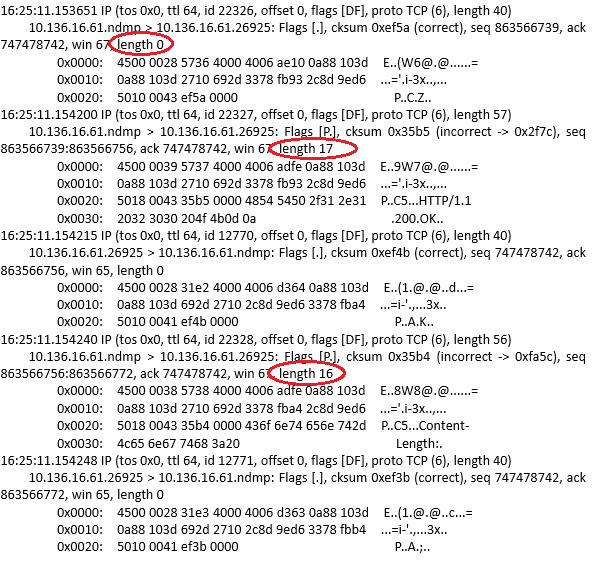
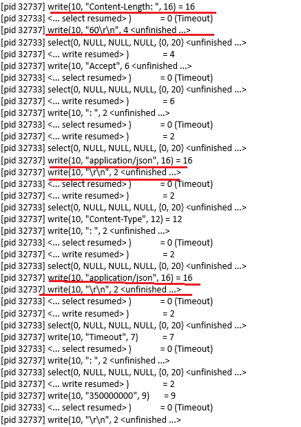
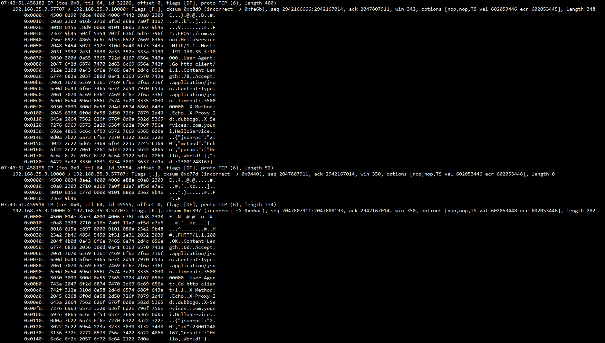

## 一次Golang HTTP响应优化过程 ##
---
*written by Alex Stocks on 2016/08/01*

### 1 前言 ###
---

最近鄙人在用golang撸一个rpc框架，表示层协议采用了HTTP协议，在进行性能测试的时候发现server端给客户端进行回复的时候，一个大小282B的TCP响应包竟然被拆分成了超过30个TCP包返回给了客户端，其中大部分包长度不超过10B！   

通过追踪Go的内部代码以及相关工具的辅助下最终完成了把HTTP response通过一个TCP packet完成传输的优化过程。

### 2 问题详述 ###
---

2016/07/30比人给rpc框架谢了一个简单的echo测试用例，在服务端用tcpdump抓包(command: tcpdump -Xnlpvvs0 -S port 10000 -iany)时惊讶地发现了前言中叙述的问题，抓包详细结果比较大(如果你感兴趣请点击链接[http-slices](../doc/http-slices.pdf))，在此只给出关键部分的截图：

	

### 3 问题扒粪  ###
---

根据抓包的结果，直觉是server端把一次HTTP响应内容拆分成很多子tcp packet发送了客户端。

为了验证更深入地分析server端程序写响应的过程，祭出大杀器strace(command: strace -p 32732 -f)分析整个过程中server端程序的系统调用流程，整个流程结果也比较大(如果你感兴趣请点击链接[http-server-strace](../doc/http-server-strace.pdf))，在此只给出关键部分的截图：

	

截图中几个醒目的地方很显然地给出了问题的答案：多次tcp小包回写。

### 4 刨根问底  ###
---

通过相关工具找到了问题所在，下一步就是通过分析代码流程，找出问题相关的代码块所在。

下面先贴出rpc框架中给客户端返回response的关键代码：

	
	func SendResponse(m *Message) error {
		rsp := &http.Response{
			Header:        r.Header,
			Body:          &buffer{b},
			Status:        "200 OK",
			StatusCode:    200,
			Proto:         "HTTP/1.1",
			ProtoMajor:    1,
			ProtoMinor:    1,
			ContentLength: int64(len(m.Body)),
		}
	
		return rsp.Write(h.conn) // h.conn is net.TcpConn
	}

上面代码构造了一个http.Response对象rsp，然后借助于golang的内部函数net/http/response.go:(*Response)Write把rsp写回给client。

要继续追踪问题，就须查看上面的Write函数的具体实现了，其关键代码如下：

	// https://github.com/golang/go/blob/master/src/net/http/response.go
	func (r *Response) Write(w io.Writer) error {
		// Status line
		protoMajor, protoMinor := strconv.Itoa(r.ProtoMajor), strconv.Itoa(r.ProtoMinor)
		statusCode := strconv.Itoa(r.StatusCode) + " "
		text = strings.TrimPrefix(text, statusCode)
		if _, err := io.WriteString(w, "HTTP/"+protoMajor+"."+protoMinor+" "+statusCode+text+"\r\n"); err != nil {
			return err
		}
	
		// Clone it, so we can modify r1 as needed.
		r1 := new(Response)
		*r1 = *r
		if r1.ContentLength == 0 && r1.Body != nil {
			// Is it actually 0 length? Or just unknown?
			var buf [1]byte
			r1.Body.Read(buf[:])
		
	        r1.ContentLength = -1
	        r1.Body = struct {
	            io.Reader
	            io.Closer
	        }{
	            io.MultiReader(bytes.NewReader(buf[:1]), r.Body),
	            r.Body,
	        }
		}
		// If we're sending a non-chunked HTTP/1.1 response without a
		// content-length, the only way to do that is the old HTTP/1.0
		// way, by noting the EOF with a connection close, so we need
		// to set Close.
		if r1.ContentLength == -1 && !r1.Close && r1.ProtoAtLeast(1, 1) && !chunked(r1.TransferEncoding) {
			r1.Close = true
		}
	
		// Process Body,ContentLength,Close,Trailer
		tw, err := newTransferWriter(r1)
		if err != nil {
			return err
		}
		err = tw.WriteHeader(w)
		if err != nil {
			return err
		}
	
		// Rest of header
		err = r.Header.WriteSubset(w, respExcludeHeader)
		if err != nil {
			return err
		}
	
		// contentLengthAlreadySent may have been already sent for
		// POST/PUT requests, even if zero length. See Issue 8180.
		contentLengthAlreadySent := tw.shouldSendContentLength()
		if r1.ContentLength == 0 && !chunked(r1.TransferEncoding) && !contentLengthAlreadySent {
			if _, err := io.WriteString(w, "Content-Length: 0\r\n"); err != nil {
				return err
			}
		}
	
		// End-of-header
		if _, err := io.WriteString(w, "\r\n"); err != nil {
			return err
		}
	
		// Write body and trailer
		err = tw.WriteBody(w)
		if err != nil {
			return err
		}
	
		// Success
		return nil
	}

通过上面的代码，可见golang的策略是在序列化HTTP的内容的过程中逐步把序列化结果写入@w(w io.Writer)中的，符合抓包内容表现以及系统跟踪的系统函数调用分析结果。

那么，解决方法不可能是hack golang的这个函数，能改变的只能是rpc框架对这个函数的调用方式。

### 5 解决之道  ###
---

鄙人目前能否想到的思路就是给Response.Write method传入一个buffer，让这个method先把HTTP response内容写入这个buffer，然后再把buffer缓存所有个内容一次性地写入net.TcpConn中。

根据这个思路，修改后的SendResponse函数关键代码如下：

	func SendResponse(m *Message) error {
        rsp := &http.Response{
                Header:        r.Header,
                Body:          &buffer{b},
                Status:        "200 OK",
                StatusCode:    200,
                Proto:         "HTTP/1.1",
                ProtoMajor:    1,
                ProtoMinor:    1,
                ContentLength: int64(len(m.Body)),
        }

		/*
        	return rsp.Write(h.conn)
		*/
        rspBuf := bytes.NewBuffer(make([]byte, 0))
        err := rsp.Write(rspBuf)
        if err != nil {
                return err
        }

        _, err = rspBuf.WriteTo(h.conn)
        return err
	}

改进代码并重新部署程序后，用tcpdump抓包结果如下：

	

从截图内容可以看出改进后的代码确实达到了我的目的。同样地，如果你对整个抓包结果感兴趣，请点击链接[http-merge](../doc/http-merge.pdf))。

### 6 总结 ###
---

优化无止境，每个人都有自己的观察方法和追踪套路，多掌握一些工具对优化效率的提高大有裨益。

吾人愚人也，记忆力很差劲，本文记述整个优化过程最重要的目的仅为本人备忘，此次优化过程花费了我一天时间和精力，如果你有更好的方法请不吝赐教！

此记。

## 扒粪者-于雨氏 ##
> 于雨氏，2016/08/01，初作此文于东沪。