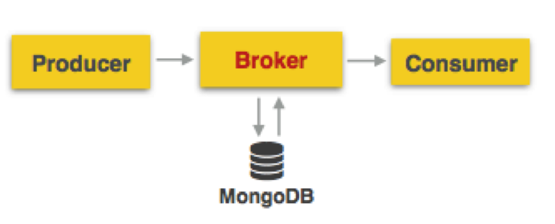
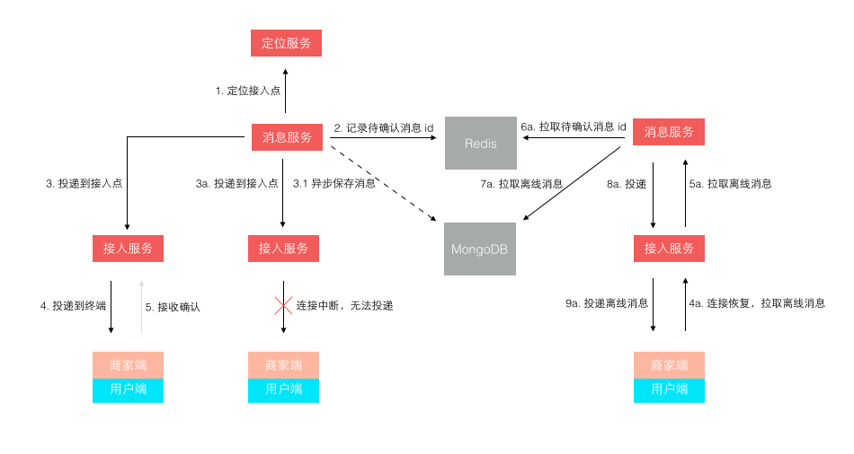

## 一套简洁的即时通信(IM)系统 ##
---
*written by Alex Stocks on 2016/03/07*

### 1 前言 ###
---

无论是IM消息通信系统还是客户消息系统，其本质都是一套消息发送与投递系统，或者说是一套网络通信系统，其本质两个词:存储与转发。由于看到最近一个月内业界有些公司的相关人员介绍了自己的IM系统：

- 1 如携程高级经理顾庆分享[参考文档1]的携程异步消息系统初期架构:

	

	

	上面两幅图[图片来自参考文档1]所示显示了携程家的消息系统的初期架构，图片1中的架构直接用mongodb作为消息队列，然后就把系统开发出来了，至图片2中可以见到一个常见IT系统的接口层。

- 2 京东咚咚初期架构

	

	上面这幅图[参考文档2]揭示了京东家的消息系统的初期架构，作者云下山巅[mindwind]揭示了其特点是“为了业务的快速上线，1.0 版本的技术架构实现是非常直接且简单粗暴的”，而且后台系统使用.net基于Redis就把一个IM系统开发出来了。

两家系统的初期架构说明，一套消息系统对提升自家的服务质量是多么的重要，可以认为现代的服务型的互联网公司成长过程就是一套IM系统的进化史。

本文结合鄙人对IM系统的了解，也给出一套初具IM系统系统特点的消息系统模型。

### 2 在线消息系统 ###
---

本文只考虑IM系统的在线消息模型，不考虑其离线消息系统[能够存储IM消息的系统]。根据个人理解，其应有的feature如下：

- A 整个系统中Server端提供存储转发能力，无论整体架构是B/S还是C/S； 
- B 消息发送者能够成功发送消息给后端，且得到后端地确认；
- C 接收端能够不重不漏地接收Server端转发来的没有超过**消息生命周期**和**系统承载能力**的消息；
- D 整个系统只考虑文本短消息[即限制其长度]；
- E 每条消息都有生命周期，如一天，且有长度限制如1440B【尽量不要超过一个frame的size】，只考虑在线消息的处理，无论是超时的消息还是超出系统承载能力的消息[如键盘狂人或者键盘狂机器人发出的消息]都被认为是"垃圾消息";
- F 为简单起见，不给消息很多类型，如个人对个人消息，群消息，讨论组消息等，都认为是一种群[下文用channel替代之，也有人用Room这个词]消息类型；
- G 为简单起见，这个群的建立与销毁流程本文不述及，也即消息流程开始的时候各个消息群都已经组建完毕，且流程中没有成员的增减；
- H 账户申请、用户鉴权和天朝独有的黄反词检查等IM安全层等暂不考虑；

根据以上系统特点，先给出一套稍微完备的IM系统的框架图：

针对上图，我先给出各个模块的说明，然后分章节介绍这套系统的各个模块的职能，以及相关的系统流程。

系统名词解释：

> 1 PC: 单机型客户端，如windows端和mac端等等；
>
> 2 Web/h5: 网页客户端；
>
> 3 Android： 手机移动端，取其典型Android端，当然也有ios端[但是考虑到各家开发App都是安卓客户端最先上系统新版本，故用Android代表之]；
>
> 4 broker：文本消息的有线或者无线接口端，考虑到携程采用了这个词，我也姑且先用之，它提供了消息的接收与投递功能；
>
> 5 Relay：图片/语音/视频 转发接口端，其后端可以是自家的服务也可以是第三方服务(如提供图片存储服务的七牛、提供云视频解决方案的腾讯云等)；
>
> 6 msg chat server：消息逻辑处理端；
>
> 7 Router: 在线状态服务端，存储在线的用户以及其登录的broker接口机的id以及一些心跳包时间等数据； 
>
> 8 Counter: 消息计数器，为每个text等类型的消息分配MSG id； 
>
> 9 Msg Queue: 每个channel消息的msg id队列，存储每个client未接收的且未超时的且未超出队列大小的msg id集合；
> 
> 10 Mysql/mongodb: 消息存储服务、用户资料数据、以及channel成员列表服务数据库，因为二者比较典型，所以取用了这个名字，当然你可以在其上部署一层cache服务；
>
> 11 Client：客户端层；
>
> 12 Interface/If(下文简称If)：服务接口层；
>
> 13 Logic：消息逻辑处理层，[这层其实应该有系统最多的模块]；
>
> 14 DB：存储层，存储了在线状态、消息id以及msg id队列和消息内容等；
> 
> 15 http: 消息发送和接收协议，IM协议中一般理解为long polling消息处理方式，在web端多采用这种协议；
> 
> 16 Websocket: 另一种消息发送和接收协议，在移动环境或者采用html5开发的系统多采用这种协议；
> 
> 17 TCP: 另一种消息发送和接收协议，在环境或者采用html5开发的系统多采用这种协议；
> 
> 18 UDP: 另一种消息发送和接收协议，某个不保证提供稳定消息传输服务的厂家采用的协议，也许也是用户最多使用的协议，它的优点是无论是无线还是有线环境下都非常快，又由于http/Websocket的基础都是tcp协议，UDP协议在环境拥塞情况下由于不提供拥塞控制等退让算法，反而会去争用网络通道，所以在网络复杂的特别是发生网络风暴的情况下它会显得更快^ _ ^ & ^ _ ^【呵呵哒】；
>
> 19 RPC: 一种远程过程调用协议，提供分布式环境下的函数调用能力；
>
> 20 Restful: 一种远程服务提供的架构风格，跟RPC比起来貌似更高级点；

### 3 消息发送流程 ###
---

在介绍消息发送流程之前，先介绍一些基本概念。

#### 3.1 pub/sub、UIN和session ####

一个消息系统，从宏观上来说，就是一个PUB/SUB系统，有消息生成者publisher[or producer]，有消息中转者broker，有消息处理者msg server，以及消息消费者subscriber[or consumer]。消息消费者可以是一个人，也可以是一群人，在pub/sub系统之中producer&consumer一起构成了一个channel，或者称之为room，或者称之为group。

无论是producer还是consumer，每个具体单位都要由系统分配给一个id，称之为UIN[名词来源于icq]。

后端的if层的broker机器可以在全球或者某个区域分布多个，UIN依据dns系统可以得到if层所有的机器列表，如果dns层由于机器坏掉或者是被攻击时不能服务，那么客户端应该根据记忆[无论是上次成功登陆的机器还是被厂家内置的机器列表]知道某些机器的ip&port地址，然后根据测速结果来选择一个离其最近的broker。

UIN在于broker之间进行一段时间内有效的会话服务，称之为一个session。这个session存活于一个长连接里，也可以横跨几个长连接或者短连接，即session自身依赖的网络链接是不稳定的。session有效期间内，Server认为UIN在线，session有效期内客户端要定时地给broker发送心跳包。本文认为的session可以是不稳定的，即session有效期内下发给客户端的消息可以丢失，但是可以通过一些其他手段保证消息被投递给客户端。

#### 3.2 发送流程 ####

消息的制造者[producer]一般是IM系统的最基本单元UIN[即一个自然人]，既然是一个自然人，就认为其发送能力有限，不可能一秒内发出多于一条的消息，即其消息频率最高为： 1条msg / s。高于这个频率，都被认为是键盘狂人或者狂躁机器人，客户端或者服务端应该具有拒绝给这种人提供服务或者丢弃其由于发狂而发出的消息。

基于上面这个假设，producer发出的消息请求被称为msg req，服务器给客户端返回的消息响应称为msg ack。整个消息流程为：

- A client以阻塞方式发出msg req，req = {producer uin, channel name, msg device id, msg time, msg content}；
- B broker收到消息后，以uin为hash或者通过其他hash方式把消息转发给某个msg chat server；
- C msg chat server收到消息后以key = Hash{producer uin【发送者id】 + msg device id【设备id】+ msg time【消息发送时间，精确到秒】}到本地消息缓存中查询消息是否已经存在，如果存在则终止消息流程，给broker返回"duplicate msg"这个msg ack，否则继续；
- D msg chat server到Counter模块以channel name为key查询其最新的msg id，把msg id自增一后作为这条消息的id；
- E msg chat server把分配好id的消息插入本地msg cache和msg DB[mysql/mongoDB]中；
- F msg chat server给broker返回msg ack, ack = {producer uin, channel name, msg device id, msg time, msg id}；
- G broker把msg ack下发给producer；
- H producer收到ack包后终止消息流程，如果在发送流程超时后仍未收到消息则转到步骤1进行重试，并计算重试次数；
- I 如果重试次数超过两次依然失败则提示“系统繁忙” or “网络环境不佳，请主人稍后再尝试发送”等，终止消息发送流程。

上面设计到了一个模块图中没有的概念：msg cache，之所以没有绘制出来，是因为msg cache的大小是可预估的，它只是用于消息去重判断，所以只需存下去重msg key即可。假设msg chat server的服务人数是40 000人，消息发送频率是1条/s，消息的生命周期是24 hour，消息key长度是64B，那么这个cache大小 = 64B * (24 * 3600)s * 40000 = 221 184 000 000B，这个数字可能有点恐怖，如果是真实商业环境这个数字只会更小，因为没有人一天一夜不吃不喝不停发消息嘛。其本质是一个hashset(C++中对应的是unordered_set)，物理存储介质当然是共享内存了。

[2016/03/10日：经过思考，msg cache只需存下某个UIN在某个device上的最新的消息时间即可，msg cache的结构应为hashtable，以{UIN + device id}为key，以其最新的消息的发送时间(客户端发送消息的时间)为value，不再考虑消息的生命周期。msg chat server每收到一条新消息就把新消息中记录的发送时间与缓存中记录的消息时间比较即可，如果新消息的时间小于这个msg pool记录的时间即说明其为重复消息，大于则为新消息，并用新消息的msg time作为msg cache中对应kv的value的最新值。假设UIN为4B，device id为4B，时间为4B，则msg cache的数据的size（不计算hashtable数据结构本身占用的内存size）为12B * 40000 = 480 000B，新msg pool完全与每条消息的lifetime无关，这就大大下降了其内存占用。

那么还有一个问题，如果用户修改了手机的本地时间怎么办？那就换做另一个参数：本地手机时钟累计运行时长，手机出厂后其运行累计时长只会一直增加不会减小。]

这个流程牵涉到一个比较重要的模块：Counter，这个模块其实都可以用Redis充当，怎么做你自己想^ _ ^。这个模块自身的实现就是一个分布式的计数器，直接使用Redis也没什么问题，但是最好的方法是采用消息id批发器的方式，msg chat server到Counter每次批发一批id回来,然后分配给每个msg，当使用完毕的时候再接着去Counter申请一批回来，以减轻Counter的压力，具体的设计请参考专利《即时消息的处理方法和装置》[参考文档9]。

上面还有一个概念未叙述到：发送端的消息邮箱{有人称为消息盒子，或者某大厂称之为客户端消息db}，它存储了所有本地发送出去的消息，其中没有服务端分配的msg id的消息都被认为是发送失败的消息，待用户主动尝试发送或者网络环境重新稳定后可以有客户端尝试重新发送流程。

用户查看消息邮箱中的本地历史消息的时候，就要依据msg id把消息排序好展现给用户。至于用户发送过程中看到的消息可以认为是本地消息的一个cache，每个channel最多给他展现100条，这100条消息的排序要依照每条消息的发出时间或者是消息的接收时间[这个接收到的消息时间以消息到达本机时的本地时钟为依据]。当用户要查看超出数目如100条消息之外的消息，客户端要引导用户去走历史消息查看流程。

#### 3.3 消息状态部分流程 ####

在进行消息的发送流程中，msg chat server充当了消息的处理者，其实消息的发送流程就可以认为是一次客户端与服务端进行简单的“心跳逻辑”的过程，这个过程msg chat server[实际上就是下面提到的heartbeat server]还要完成如下部分消息状态处理逻辑：

- 1 heartbeat server到Router中直接修改producer的状态为在线；
- 2 heartbeat server要把client连接的broker的id以及其最新登录时间更新至Router中；

至于Router具体的构造，第四章节会叙述到。

#### 3.4 关于长文本消息 ####

还有一个问题，如果消息超过服务端规定的短文本消息的最大长度怎么办？

一种方法是干脆丢弃，拒绝给客户端发送出去，貌似用户体验没那么好。

还有另一种方法，分片。用分片的方法拆成若干条短消息，每条短消息由客户端或者服务端自己给他分配好序列号，待用户收到的时候再拼装起来。其本质跟tcp层处理大package时拆分若干个子packet道理一样。

长文本如果能借用第二种方法处理，发送图片是不是也可以这么干？其本质都是数据嘛，语音和视频数据的处理亦不外乎如是。

### 4 消息处理以及消息投递流程 ###
---

上述的消息发送流程中，msg chat server把分配的msg id的消息返回给producer后，还要继续进行消息的投递。消息的投递涉及到一系列的技巧，涉及到消息的订阅者能否不重不漏地在消息还**“活着”**的消息，这些技巧其实也没什么神秘之处，下面的流程会详细地描述到。

#### 4.1 消息投递流程 ####
---

消息投递，顾名思义，就是消息的下发而已，有人美其名曰消息Push流程。

如果说消息的发送 = msg req + msg ack, 那么消息的投递就简单多了：

- A msg chat server到channel成员列表服务数据库拉取成员列表；
- B msg chat server循环到Router中查看每个成员是否在线，如果在线则获取成员连接的broker接口机地址；
- C msg chat server发送消息到broker；
- D broker接收到消息后就把msg下发给客户端；
- E msg chat server循环给在线的成员发送完消息后，把msg id放入其channel在msg queue中的msg id list的末尾；
- F 如果msg queue的msg id list超过长度限制，则要删除掉链表的head部分的若干id，以保证list长度不超过系统规定的参数；
- G 流程结束。

消息的投递是不是显得轻松多了，至于"被认为在线"客户端有没有收到msg，msg chat server压根就不管！

这个流程牵涉到另一个比较重要的模块：router，它其实也可以用Redis充当，利用Redis的bitmap记录所有用户的状态，0标示离线，1表示在线，然后再利用hashtable存储每个用户登录的broker的id和最新登录时间。

至于msg queue模块，其实也是一个hashtable，key为channel的name或者id，value就是一个msg id list。

听说Redis最近要添加Bloom Filter，那就更好玩了，关键就看其能否应对删除操作，如果有删除接口，把它当做bitmap玩玩倒也无妨。

### 5 心跳流程 ###
---

一个客户端要维持与服务端的session有效，就须与其broker维持一个心跳流程，以被认为是处于在线状态。那么，最基本的问题就是：心跳时长。

这个问题会让很多移动开发者头疼许久，最基本的要根据网络环境来设计不同的心跳时长：譬如有线环境把频率设置为10s，wifi环境下这个频率设计为30s，在3G或者4G环境下设置为1.5分钟，在2G环境下设置为4分钟。总之其原则是：网络环境越差劲，心跳时间间隔越长。

心跳时间间隔长那么其心跳频率就低，其消息收发速度就慢。

进一步，无线环境下这个心跳时间长度不是固定不变的，具体时长要由服务端进行判断，如果无线环境下假设起始心跳间隔是4分钟，客户端连续最近3次心跳有一次失败，那就把时长修改为2分钟，如果有两次失败就修改为1分钟，如果连续3次超时未上报心跳，就认为客户端离线！

[2016/03/10: 经过今日思考，觉得上面这一段的例子中参数是错误的，它违背了上上段叙述的原则，当出现心跳超时的情况后就说明网络环境发生了变化，但是仅仅凭借一次超时还不足以说明网络环境变好还是变坏。其实把心跳时长的问题转换一个角度进行思考：当知道了前三次或者前两次实际心跳时间间隔，怎么预测接下来的心跳时间间隔？其本质就是一个拉格朗日外插法的应用而已。我这里不多叙述，仅仅给出一种方法：如果已经知道最近两次心跳时间间隔为iv1和iv2，则接下来的给客户端返回的iv3 = k * ((iv1 + iv2) / 2)，如果iv1 > iv2，则k = 0.8，否则k = 1.2，这两个值也仅仅是经验值而已，具体怎么取值需系统设计者自己权衡，但足以自适应一些复杂的网络环境，如坐在火车上使用移动网络的APP。

如果系统设计者觉得麻烦，就可以把上面的值修改为经验参数值，如无线环境下假设起始心跳间隔是4分钟，客户端连续最近3次心跳有一次失败，那就把时长修改为4.5分钟，如果有两次失败就修改为5.5分钟，如果连续3次超时未上报心跳，就认为客户端离线！]

解决了心跳时长问题，再来看看具体的心跳流程：

- A 客户端发送心跳包hearbeat，heartbeat = {uin, device id, network type, list{channel name:newest channel msg id}，other info}，即heartbeat包要上报uin所在的所有channel，以及本地历史消息记录中每个channel最新的消息的id；
- B broker把心跳包转给专门处理心跳逻辑的msg chat server[以下称为heartbeat server]；
- C heartbeat server到Router中更新client的在线状态以及登录的broker的id和最新登录时间；
- D heartbeat server到Counter服务器循环查询每个channel的最新消息id，如果客户端上报的id与这个id不等，就发送一条msg通知msg chat server，msg = {uin， channel name， client newest msg id of channel}；
- E msg chat server收到这条消息后，重新启动消息下发逻辑，到msg queue中取出所有的大于{client newest msg id of channel}的id列表；
- F msg chat server依据list中的id到消息存储服务器中依次取出每个msg[取不到也就表示这个消息因为超时而被消息存储服务器删除了]；
- G msg chat server把这些消息作为"未读消息"下发给客户端；
- H heartbeat server根据Router存储的客户端的最近三次的登录时间，调整session的心跳时间间隔，作为心跳回包的一部分参数值给客户端下发heartbeat ack包，其他数据包括其所在的每个channel的最新消息的msg id；
- I heartbeat server定时地到Router中检查所有客户端的最新登录时间，如果超过其session有效时间，就把其state置为“离线”，并删除其登录服务id等数据；
- J 客户端收到heartbeat ack包后，修改下次心跳时间，并依据每个channel的最新的msg id与本地消息邮箱中对应的channel的最新消息id做对比，如果id不等，客户端可以启动拉取消息流程或者等待server端把这些消息下发过来。

上面提到的一个词：newest channel id 或者 client newest msg id of channel，其意思就是消息接收者所在的channel的所拥有的本地消息的最新id。一般地，如果server端的Counter能够稳定地提供服务，channel中的msg id应该是连续的，如果客户端检测到msg id不连续，可以把不连续处的id作为newest channel id，要求server端再把这个msg id以后的消息重发下来，这就要求client有消息去重判断的功能。

每次收到server端下发的消息后，用户必须更新local newest channel msg id，把消息id窗口往前推进，不要因为id不连续而一直不更新这个值，因为服务端的服务也不一定超级稳定。

上面的一段我写的稍嫌“囋”一些，其实其思想类似于tcp的滑动窗口思想，自己做对比去理解之。

step H要求router至少要存储client最新四次的登录时间，然后根据这三次时间间隔以及网络类型修改下次心跳时间间隔有效时长。我这里已经很明了的写出了原理了，至于怎么取值可以依据上面提到的原理修改相关参数[这个得需要测试才能得出一些关键数据，但是这个参数值应该跟我本文提到的参数值相差无几]。

至于step J叙述到的client是否启用消息拉取逻辑，取决于你的服务类型。具体场景分别对待，本文不会再设计消息的pull流程。

其实结合第4章节以及本章节，用流行的术语来说，消息的下发就是微信所谓的"是参考Activesyec，SYNC协议"[参考文档7]流程，江湖人称推拉相结合的过程。这个过程可以借用参考文档2中给出的一副流程图做参考：

注意上图与本文一些名词的用法不同，它的所谓的“离线消息”，咱本文中被称为"未读消息"。

随着本章节的结束，IM的主要流程就描述完毕，更详细的流程请参考文档3、4和5。

### 6 消息存储服务 ###
---

由于本文叙述的消息系统是一个在线消息模型，所以msg db中存储的超时消息必须被删除。首先db的大小可以根据服务人数的数目以及每条消息的时长估算出来。

其次，简单的im系统中不考虑用户的等级的话，可以认为所有的msg都是平等的有相同的lifetime。但是如果区分了用户优先级，则其消息lifetime也就不等，就得有服务等级不同用户的msg db[其实优先级越高，其消息存储越久，企业付出了存储成本，某种神秘的力量也就越容易获取到其聊天数据]。

最后，启动一个定时消息删除模块，它定时启动删除msg db中超时的msg即可。

### 7 其他类型消息 ###
---

由于本文只是描述文本型短消息服务的相关流程，如果还要考虑图片、声音和视频流服务，这些消息就会被称为富媒体消息。最基本的富媒体消息应该有一个文本消息与之对应，文本消息中包含了这些富媒体文件的url地址或者其他方式定义的地址。消费者拉倒这样类型的消息，就可以根据消息地址去拉取富媒体文件。

至于富媒体文件怎么存储，个人建议可以借助目前成熟的第三方服务平台，如借助七牛的云图片服务[我举个栗子而已，没收任何费用，无做广告的嫌疑^ _ ^]存储服务存储图片，借助腾讯云的视频服务能力处理语音和视频消息。

富媒体消息拉取和上传都要经过你的Relay接口，这个服务接口因为逻辑与正常的文本消息差别很大，所以建议独立做一个接口叫做Relay模块，以与broker作区分，也为以后更换第三方服务厂商打好基础。

如果你厂有钱又有人，那就考虑自己做富媒体文件的存储吧，此时在逻辑层应该有个对应的模块叫做rich text msg server[下面简称为rich server]，其逻辑应该为：

- A 不管是语音还是视频，client采用合适的文件格式格式化后压缩好，然后再分片上传到relay，每个分片要分好分片序号；
- B Relay收到这些分片后把数据透传给rich server；
- C rich server先把分片数据存储在cache中，当收到最后一个分片的时候查收缺失的分片；
- D rich server如果发现了缺失分片，就把缺失分片列表告知客户端，让其重传即可；
- E 待所有分片都收集好，rich server就可以再次把数据拼装好放入mongodb或者其他什么db中。

整个逻辑就完成了，是不是也很easy的^ _ ^。

### 8 总结 ###
---

这套IM系统，总体有以下特点：

- 1 其完备的IM系统设计；
- 2 以Counter作为系统的心脏驱动整个系统的流程设计；
- 3 客户端的消息流程方案有所涉及；
- 4 保证服务质量的情况下保障消息不重不漏；
- 5 详细叙述了消息下发的技术流程；
- 6 给出了自己设计的智能心跳方案；
- 7 对长消息、图片、语音和视频等“长数据”的处理给出了自己的解决方法；
- 8 天生的分布式能力，保证其多IDC的部署能力；
- 9 尽个人能力，不断优化中......

如有指教，欢迎在本文下方留言板留言或者发送email与我(alexstocks at foxmail dot com)交流。

### 9 跋 ###
---

本人写文章之过程譬如牛之反刍，会不断思考不断改进，所以有错误请你指正。也请关注我的blog:alexstocks.github.io，我每篇文章的最新版都会在这里及时更新。

此记。

## 参考文档 ##

- 1 [携程异步消息系统实践](http://blog.qiniu.com/archives/4791)
- 2 [京东咚咚架构演进](http://blog.csdn.net/mindfloating/article/details/50166169)
- 3 [从腾讯微博的成长分析架构的三个阶段](http://tech.it168.com/a2012/0810/1383/000001383838.shtml)
- 4 [几个大型网站的Feeds(Timeline)设计简单对比](http://datafans.net/?p=1163)
- 5 [腾讯微博架构设计](http://wenku.baidu.com/link?url=YU5duz8qnl-qavXoPY1MfRI-9MIYJNqI0ZRfZqvR08DpBGIZBNnlG2W-DUyIJZVU2YaRw9m-YxRMgaXntbqdiLhMXLCppU7ZmBM_quP8S9u)
- 6 [腾讯IM架构 1亿在线背后的技术挑战](http://wenku.baidu.com/view/caa2161859eef8c75fbfb3c0.html)
- 7 [微信技术总监周颢：一亿用户背后架构秘密](http://news.pedaily.cn/201503/20150301379053.shtml)
- 8 [视频：微信技术总监周颢：一亿用户背后架构秘密](http://www.uml.net.cn/video/lecture/2-20120427-101.asp)
- 9 [即时消息的处理方法和装置](http://industry.wanfangdata.com.cn/sh/Detail/Patent?id=Patent_CN201410171968.0)

## 扒粪者-于雨氏 ##
> 于雨氏，2016/03/07，初作此文于金箱堂。
>
> 于雨氏，2016/03/08，于金箱堂修改msg cache部分相关字句。
>
> 于雨氏，2016/03/09，于金箱堂修改全文，并着重第五章心跳逻辑的部分流程。
> 
> 于雨氏，2016/03/10，于金箱堂再次修改第3.2节关于msg cache的计算流程以及第五章心跳逻辑的心跳时长估算流程。
> 
> 于雨氏，2016/03/17，于金箱堂依据参考文档9，再次修改第3.2节关于Counter的设计。
