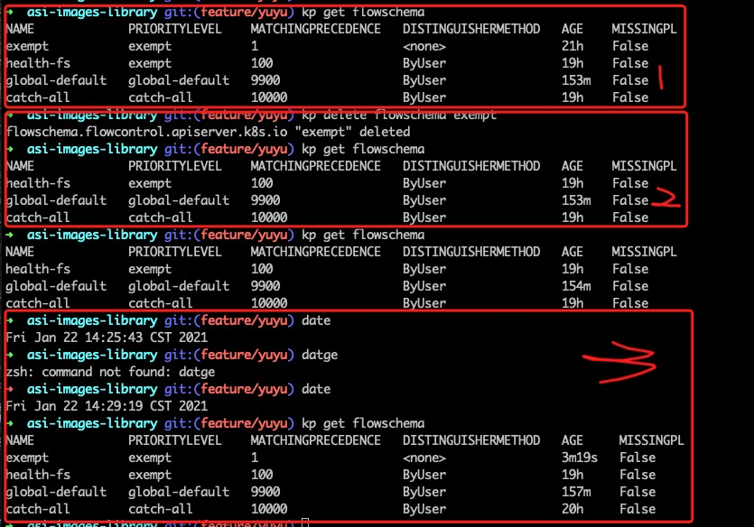
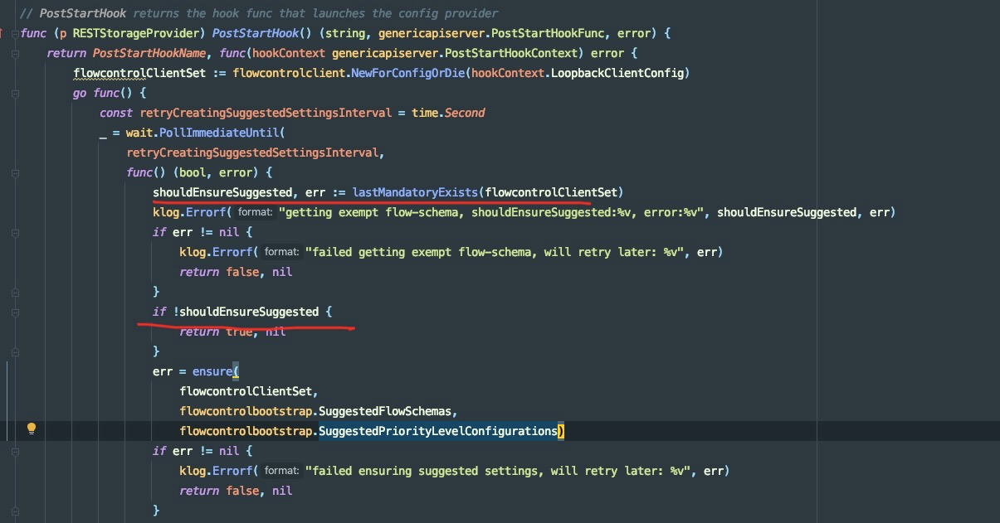

# kubernetes APF 分析
---
*written by Alex Stocks on 2020/08/31，版权所有，无授权不得转载*


APF 是 `API Priority And Fairness`【API优先级和公平性】 的缩写。API优先级和公平性允许集群管理员将控制平面的并发性划分为不同的加权优先级，到达kube-apiserver的每个请求将被归类到一个优先级，并获得其在控制平面的吞吐量中的公平份额。

[文档2][2] 中有句话很好地说出了 APF 解决的问题：
> Kubernetes的工作负载很容易意外地使apiservers服务器崩溃，导致其他重要的流量（比如系统控制器或领导人选举）间歇性地失败。在最坏的情况下，一些损坏的节点或控制器可能将一个繁忙的集群推到崩溃边缘，将一个本地问题变成控制平面故障。

## 1 总体算法

总体方法如下：

* 每个请求都由一个流模式（Flow Schema）匹配。流模式声明与之匹配的请求的优先级，并为这些请求分配一个“流标识符（flow identifier）”。流标识符是系统如何确定请求是否来自相同的源。
* 可以将优先级配置为以多种方式运行。每个优先级都有自己的独立并发池。优先级还引入了对不能立即得到服务的请求进行排队的概念。
* 为了防止任何一个用户或命名空间独占一个优先级级别，可以将它们配置为具有多个队列。“洗牌分片（Shuffle Sharding）”用于将每个请求流分配给队列的一个子集。
最后，当有处理请求的能力时，使用“公平排队（Fair Queuing）”算法来选择下一个请求。在每个优先级内，队列以公平性进行竞争。

在到达处理程序时，请求被精确地分配到一个优先级级和该优先级级中的一个流。因此，理解FlowSchema和PriorityLevelConfiguration如何工作将帮助你管理通过kube-apiserver的请求流量。

FlowSchema：FlowSchema将识别PriorityLevelConfiguration对象和计算请求的“流标识符”的方法。目前，我们支持根据：发出请求的标识、谓词和目标对象来匹配请求。身份可以在以下方面匹配：用户名、用户组名或ServiceAccount。至于目标对象，我们可以通过apiGroup、resource[/subresource]和namespace进行匹配。

流标识符用于洗牌分片，因此，如果请求来自相同的源，那么它们必须具有相同的流标识符。我们喜欢考虑“大象”（发送很多/重请求）和“老鼠”（发送很少/轻请求）的场景：确保大象的请求都得到相同的流标识符是很重要的，否则它们在系统中看起来会像许多不同的老鼠！

参见这里的API文档！
https://kubernetes.io/docs/reference/generated/kubernetes-api/v1.18/#flowschema-v1alpha1-flowcontrol-apiserver-k8s-io

PriorityLevelConfiguration：定义一个优先级级别。

对于apiserver自身的请求，以及任何可重入（reentrant）的流量（例如，自己发出API请求的admission webhook），可以将优先级标记为“exempt（豁免）”，这意味着不进行任何类型的排队或限制。这是为了防止优先级反转（priority inversion）。

每个非豁免优先级都配置了许多“并发份额”，并获得一个要使用的独立并发池。该优先级级别的请求在池未满时在池中运行，而不是在其他任何地方。每个apiserver都配置了一个总并发限制（取mutating和readonly请求的旧限制的总和），然后按其并发份额的比例在各个优先级之间进行分配。

非豁免优先级可以选择多个队列来用于洗牌分片。以比一致哈希更好的方式将洗牌分片映射到队列。给定的流可以访问一个小的队列集合，对于每个传入的请求，都选择最短的队列。当优先级具有队列时，它还设置队列长度限制。请求在队列中可以等待的时间也有限制；这是apiserver请求超时的一个固定部分。无法执行且不能（再）排队的请求将被拒绝。
或者，非豁免优先级可以选择立即拒绝而不是在队列中等待。
 有关此特性，请参阅API文档。
https://kubernetes.io/docs/reference/generated/kubernetes-api/v1.18/#prioritylevelconfiguration-v1alpha1-flowcontrol-apiserver-k8s-io
有什么是缺失的？什么时候会有beta版？

## 2 代码分析

### 2.1 请求处理

> staging/src/k8s.io/apiserver/pkg/server/handler.go

```
// APIServerHandlers holds the different http.Handlers used by the API server.
// This includes the full handler chain, the director (which chooses between gorestful and nonGoRestful,
// the gorestful handler (used for the API) which falls through to the nonGoRestful handler on unregistered paths,
// and the nonGoRestful handler (which can contain a fallthrough of its own)
// FullHandlerChain -> Director -> {GoRestfulContainer,NonGoRestfulMux} based on inspection of registered web services
type APIServerHandler struct {
	// FullHandlerChain is the one that is eventually served with.  It should include the full filter
	// chain and then call the Director.
	FullHandlerChain http.Handler
	// The registered APIs.  InstallAPIs uses this.  Other servers probably shouldn't access this directly.
	GoRestfulContainer *restful.Container
	// NonGoRestfulMux is the final HTTP handler in the chain.
	// It comes after all filters and the API handling
	// This is where other servers can attach handler to various parts of the chain.
	NonGoRestfulMux *mux.PathRecorderMux

	// Director is here so that we can properly handle fall through and proxy cases.
	// This looks a bit bonkers, but here's what's happening.  We need to have /apis handling registered in gorestful in order to have
	// swagger generated for compatibility.  Doing that with `/apis` as a webservice, means that it forcibly 404s (no defaulting allowed)
	// all requests which are not /apis or /apis/.  We need those calls to fall through behind goresful for proper delegation.  Trying to
	// register for a pattern which includes everything behind it doesn't work because gorestful negotiates for verbs and content encoding
	// and all those things go crazy when gorestful really just needs to pass through.  In addition, openapi enforces unique verb constraints
	// which we don't fit into and it still muddies up swagger.  Trying to switch the webservices into a route doesn't work because the
	//  containing webservice faces all the same problems listed above.
	// This leads to the crazy thing done here.  Our mux does what we need, so we'll place it in front of gorestful.  It will introspect to
	// decide if the route is likely to be handled by goresful and route there if needed.  Otherwise, it goes to PostGoRestful mux in
	// order to handle "normal" paths and delegation. Hopefully no API consumers will ever have to deal with this level of detail.  I think
	// we should consider completely removing gorestful.
	// Other servers should only use this opaquely to delegate to an API server.
	Director http.Handler
}
```

// New creates a new server which logically combines the handling chain with the passed server.
// name is used to differentiate for logging. The handler chain in particular can be difficult as it starts delgating.
// delegationTarget may not be nil.
func (c completedConfig) New(name string, delegationTarget DelegationTarget) (*GenericAPIServer, error) {
   	handlerChainBuilder := func(handler http.Handler) http.Handler {
		return c.BuildHandlerChainFunc(handler, c.Config)
	}
	apiServerHandler := NewAPIServerHandler(name, c.Serializer, handlerChainBuilder, delegationTarget.UnprotectedHandler())

	s := &GenericAPIServer{
		Handler: apiServerHandler,
		listedPathProvider: apiServerHandler
	}  
	
	return s, nil
} 

type CompletedConfig struct {
	// Embed a private pointer that cannot be instantiated outside of this package.
	*completedConfig
}

* 把 http.Request 转换为 RequestInfo，获取请求的 Resource/NonResource 信息

> staging/src/k8s.io/apiserver/pkg/endpoints/request/requestinfo.go

```Go
// TODO write an integration test against the swagger doc to test the RequestInfo and match up behavior to responses
// NewRequestInfo returns the information from the http request.  If error is not nil, RequestInfo holds the information as best it is known before the failure
// It handles both resource and non-resource requests and fills in all the pertinent information for each.
// Valid Inputs:
// Resource paths
// /apis/{api-group}/{version}/namespaces
// /api/{version}/namespaces
// /api/{version}/namespaces/{namespace}
// /api/{version}/namespaces/{namespace}/{resource}
// /api/{version}/namespaces/{namespace}/{resource}/{resourceName}
// /api/{version}/{resource}
// /api/{version}/{resource}/{resourceName}
//
// Special verbs without subresources:
// /api/{version}/proxy/{resource}/{resourceName}
// /api/{version}/proxy/namespaces/{namespace}/{resource}/{resourceName}
//
// Special verbs with subresources:
// /api/{version}/watch/{resource}
// /api/{version}/watch/namespaces/{namespace}/{resource}
//
// NonResource paths
// /apis/{api-group}/{version}
// /apis/{api-group}
// /apis
// /api/{version}
 // /api
 // /healthz
 // /
 // 
 func (r *RequestInfoFactory) NewRequestInfo(req *http.Request) (*RequestInfo, error)
```

> k8s.io/apiserver/pkg/endpoints/filters/requestInfo.go:WithRequestInfo 

```Go
// WithRequestInfo attaches a RequestInfo to the context.
func WithRequestInfo(handler http.Handler, resolver request.RequestInfoResolver) http.Handler {
	return http.HandlerFunc(func(w http.ResponseWriter, req *http.Request) {
		ctx := req.Context()
		// 把 @req 转换为一个 RequestInfo
		info, err := resolver.NewRequestInfo(req)
		if err != nil {
			responsewriters.InternalError(w, req, fmt.Errorf("failed to create RequestInfo: %v", err))
			return
		}

		// request.WithRequestInfo(ctx, info): 把 RequestInfo 存入 @req 的 ctx 中，生成一个新的 ctx1，作为 ctx 的子类；
		// req.WithContext(ctx1) 会先生产一个 req 的拷贝 req1，然后 req1.txt =  ctx1，但是 req 又会作为左值被赋值为新的 req1
		// 所以效果是：把 新的 ctx 存入 req 中【req 原来的 ctx 会被替换】；
		//
		// 把 info 存入 req 的 ctx 中
		req = req.WithContext(request.WithRequestInfo(ctx, info))

		handler.ServeHTTP(w, req)
	})
}
```

WithRequestInfo 返回一个 http.Handler, 这个 handler 会根据 http.Request req 提取出一个 RequestInfo，然后存入 req.ctx 中【以后想要获取到 reqInfo，可通过request.RequestInfoFrom(req.Context()) 获取到】。

k8s.io/apiserver/pkg/server/filters/priority-and-fairness.go:WithPriorityAndFairness(
	handler http.Handler,
	longRunningRequestCheck apirequest.LongRunningRequestCheck,
	fcIfc utilflowcontrol.Interface,
) 

comment: 

* 1 从 http.Requst.Context() 中获取 RequestInfo 和 User；
* 2 检查用户的请求是否是 long-running 类型，是则直接处理，不进行 apf 处理；
* 3 构造 note 函数：用于构建一个 PriorityAndFairnessClassification；
* 4 构造一个 execute 函数：获取与 priorityAndFairnessKey 相关的原始 innerCtx，然后执行 handler.ServerHTTP(w, innerReq)；
* 5 digest := utilflowcontrol.RequestDigest{requestInfo, user}；
* 6 调用 fcIfc.Handle(ctx, digest, note, execute)

k8s.io/apiserver/pkg/server/config.go:DefaultBuildHandlerChain(apiHandler http.Handler, c *Config) 会调用这两个函数。

### 2.2 APF 内置的 fs & plc

通过 QA 的形式对内置的 fs & plc 进行解释。

Q: k8s 怎么保证内置的 fs & plc 在 k8s 启动的时候被创建出来？
> A: k8s 启动的时候调用如下函数创建 suggested fs&plc 和 mandatory fs&plc。

```Go
	pkg/registry/flowcontrol/rest/storage_flowcontrol.go:82
	func (p RESTStorageProvider) PostStartHook() (string, genericapiserver.PostStartHookFunc, error) 
```

Q: PostStartHook 中对 suggested 使用 ensure 函数保证创建，而对 mandatory 调用 upgrade 保证创建，为何？
> A: ensure 是确保 suggested 被创建，如果同名的 fs&plc 存在，则创建失败也所谓。upgrade 则是对现有的 fs&plc 进行升级，所以不管 mandatory fs&plc 存在与否都会被创建出来。

Q: 下面这俩时间查这么大，道理在哪？
```Go
	const retryCreatingSuggestedSettingsInterval = time.Second
	const retryCreatingMandatorySettingsInterval = time.Minute
```

> A：suggested的创建有短路逻辑，就是确保只有在mandatory不存在的情况下才会创建suggested。这其实也是个全局刷新suggested配置的后门。
 
Q: RESTStorageProvider.PostStartHook() 中针对 mandatory fs&plc 的 upgrade 函数是常驻 goroutine 吗？ 
> A:  是的。在 https://github.com/kubernetes/kubernetes/blob/e1ba7546bfe591d4e4fc0ce08c00652b79703b00/pkg/registry/flowcontrol/rest/storage_flowcontrol.go#L140 行有注释 "always retry"，即可说明问题。永远返回 false，永不退出。


### 2.3 一个小的 backdoor

通过与 APF 开发者金敏同学交流，得知 APF 有这样一个 backdoor：如果手工删除 exempt fs，则会引发全局 suggested fs & plc 重建。



做出如上图的验证：

* 1 当前 fs 集合：存在 exempt fs；
* 2 删除 exempt 后的 fs 集合： fs 确实被删除；
* 3 等待 3 分钟后，再次检验 fs 集合， exempt fs 被创建出来。

相关代码如下：



在第二个红线处，如果 exempt 不存在，则调用 ensure 函数创建 suggested fs & plc。

## 3 APF 相关参数

* 1 启动 APF

```Bash
kube-apiserver \
--feature-gates=APIPriorityAndFairness=true \
--runtime-config=flowcontrol.apiserver.k8s.io/v1alpha1=true 
```

"--enable-priority-and-fairness=false" 选项会禁用 APF，即使以上选项已启用。

* 2 list&watch

k8s官网 [flow-control][1] 一文有这么一句话：

> **Caution:** Requests classified as “long-running” — primarily watches — are not subject to the API Priority and Fairness filter. This is also true for the `--max-requests-inflight` flag without the API Priority and Fairness feature enabled.

即 对于 list&watch，无论是 apf 还是 max-inflight，都无效。

或者可以采用一个变通的方法：如果认为一个响应 3k 是一个RT [Round-Trip]，则可以把 【所有的 list&watch 的流量 / 3k 】的结果认为是一个 RT，然后通过 APF 或者 max-inflight 进行限制。

* 3 max-inflight & apf

k8s官网 [flow-control][1] 一文有这么一句话：

> **Caution:** With the Priority and Fairness feature enabled, the total concurrency limit for the server is set to the sum of `--max-requests-inflight` and `--max-mutating-requests-inflight`. There is no longer any distinction made between mutating and non-mutating requests; if you want to treat them separately for a given resource, make separate FlowSchemas that match the mutating and non-mutating verbs respectively.

如果 API sever 启动了 APF，它的总并发数为 --max-requests-inflight 和 --max-mutating-requests-inflight 两个配置值之和。这些并发数被分配给各个 PL，分配方式是根据 PriorityLevelConfiguration.Spec.Limited.AssuredConcurrencyShares 的数值按 **比例** 分配。PL 的 AssuredConcurrencyShare 越大，分配到的并发份额越大。每个 PL 都对应维护了一个 QueueSet，其中包含多个 queue ，当 PL 达到并发限制时，收到的请求会被缓存在 QueueSet 中，不会丢弃，除非 queue 也达到了容量限制。

* 4 plc 的各个参数

k8s官网 [flow-control][1] 一文说明如下：

- 增大 plc 的 `queues` 参数值，会减少不同 flow 之间冲突的可能性，但是会增加内存负担，如果其值为 1， 则会禁掉 fair-queueing 逻辑，但是请求还是会被排队处理；
- 增大 plc 的 `queueLengthLimit` 的参数值，可以应对突发的流量，不丢弃相关的请求，但会增大延迟和内存占用；
- 增大 plc 的 `handsize` 的参数值，可调节不同flow冲突的概率【增加公平度，防止某些 flow 饥饿】，以及总体并发度；但也可能导致某些类型的 flow 霸占住 as，且导致请求处理延迟增大；单 个 flow 上能处理的最大请求的数目可能的值为 handSize * queueLengthLimit

* 5 fs 的各个参数

k8s官网 [flow-control][1] 一文说明如下：

- request 与 fs 的 rules 中任何一个条件 match，就认为 request 匹配 fs：任何一个 rule = subjects 中任一个匹配，且匹配 `resourceRules` 或者 `nonResourceRules 中的任一一个规则；`
- 每个请求都会与所有的 fs 进行一遍比较，如果一个 inbound 的请求匹配多个 fs，则取值 matchingPrecedence 最高的 fs；如果多个 fs 的 matchingPrecedence 值相等，则取 name 最短的 fs；但最好的措施是不要让两个 fs 的 matchingPrecedence 值相等；
- 字符 `*` 作为值意味着匹配有效，当 key 为 subject.name  或者 `resourceRules{verbs, apiGroups, resources, namespaces} or nonResourceURLs 时；`
- distinguisherMethod.type = ByNamespace or  ByUser；

* 6 可观测性

每个 as 的 HTTP 响应 header 都有两个字段 `X-Kubernetes-PF-FlowSchema-UID`  和 `X-Kubernetes-PF-PriorityLevel-UID` ,  可以通过如下两个命令查看：

```
kubectl get flowschemas -o custom-columns="uid:{metadata.uid},name:{metadata.name}"
kubectl get prioritylevelconfigurations -o custom-columns="uid:{metadata.uid},name:{metadata.name}"
```

* 7 metrics

- piserver\_flowcontrol\_rejected\_requests\_total  apf 拒绝的 request 数目，按照 pl 的名称以及 fs 的名称以及 rejection 原因进行排序，拒绝掉的原因可能值有 queue-full【队列中已经有太多的请求在排队】、concurrency-limit【根据 plc 拒掉请求】、 time-out【请求还在队列中排队的时候就超时了】
- apiserver\_flowcontrol\_dispatched\_requests\_total 已经处理的请求总数
- apiserver\_flowcontrol\_current\_inqueue\_requests  还在队列中有待处理的请求总数
- apiserver\_flowcontrol\_current\_executing\_requests 正在执行中的请求数目
- apiserver\_flowcontrol\_request\_queue\_length\_after\_enqueue  实时队列中数据数目。这个值是抽样获取到的
- apiserver\_flowcontrol\_request\_concurrency\_limit 每个 plc 的并行上限
- apiserver\_flowcontrol\_request\_wait_duration\_seconds  请求处理过程中排队的时长，以及请求处理失败量
- apiserver\_flowcontrol\_request\_execution\_seconds  请求执行花费时间

## 4 待改进

重点待观察改进有：

* 用于WATCH和EXEC请求的流量管理
* 调整和改进FlowSchema/PriorityLevelConfiguration的默认设置
* 增强此特性如何工作的可观察性
    相关讨论 [Documenting APIPriorityAndFairness beta criteria](https://github.com/kubernetes/enhancements/pull/1632)
	* 关于 long-run task 的讨论
	
	> Supports concurrency limiting upon long-running requests
	Allow constant concurrency shares in the priority-level API model
	Automatically manages versions of mandatory/suggested configuration
	Necessary e2e test.
	
	>> wojtek-t:
	I would really like to have the LIST calls addressed though. Currently we treat "list all pods" as the same cost as "get single pod". I think this is much more important than addressing long-running requests.
	lavalamp:
	
	> I think there's two pieces of work here:
	1. The mechanism for acting on the estimate of an API call's cost
	2. The rules that produce the cost estimation
	We should make the code separate enough that it's easy for different people to work on these different tasks. It's easy to have someone go off and spend a month optimizing 2 once 1 is in place.

[^参考文档]:
[1]:https://kubernetes.io/docs/concepts/cluster-administration/flow-control/
[2]:https://cloud.tencent.com/developer/article/1613890
[3]:https://mp.weixin.qq.com/s/q0ehyR6oNgyWmR57D_eZOA
[3]:https://www.cnblogs.com/charlieroro/p/17703031.html

## Payment


<div>
<table>
  <tbody>
  <tr></tr>
    <tr>
      <td align="center"  valign="middle">
        <a href="" target="_blank">
          
        </a>
      </td>
      <td align="center"  valign="middle">
        <a href="" target="_blank">
          
        </a>
   </tbody>
</table>
</div>

## 于雨氏 ##

* 2020/08/31，于雨氏，于帝都金融中心。
