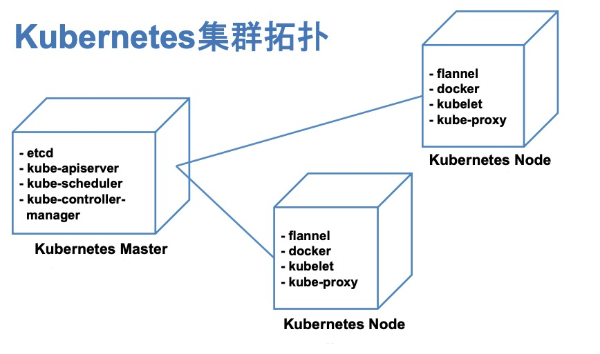

# kubernetes 实操
---
*written by Alex Stocks on 2019/12/08，版权所有，无授权不得转载*

## 1 安装
---

kubernetes【下面简称 k8s】进化到如今已有近五年时间，足够成熟。今年一直逼着自己抽出旅途时间学习了一些 k8s 的概念，在认知上已经接受声明式编程，然书上得来终觉浅，还是得操练一番才算入门，因此决定在本人的 15吋 MabBook Pro 机器上先把 k8s 系统搭建起来。

源于本人信奉的 “慢就是快” 的尿性，不打算采用 kubeadmin 以及 minikube 等一众一键安装工具，自己采用其各个零件组装一番的形式安装以加深对系统的理解。

## 1.1 系统

本地15吋 MabBook Pro 机器主要配置如下：

- CPU: Core i7
- Mem: 16 GB DDR4
- SSD: 256GB

在此系统之上，基于 vagrant + VirtualBox 安装了 3 台 Centos7 机器，统一规格如下：

- cpus: 2
- memory: 1280 MiB
- disksize: 8GB
- os: Linux 3.10.0


现在的 Docker 都要求 CentOS 系统的内核版本不能低于 3.10，否则安装过程会遇到很多麻烦问题。

三台虚机网络配置如下：

- k0: 172.27.137.10
- k1: 172.27.137.11
- k2: 172.27.137.12

计划以 k0 作为 k8s Master，在其上部署单节点 master 相关组件，k1 和 k2 作为 k8s worker。底层 worker 采用 docker，网络层采用 flannel。部署拓扑图如下。



整体系统参考了智超同学的 [CentOS 6.5安装部署Kubernetes 1.4过程记录][1] 一文，安装 k8s v1.4 系统。

## 1.2 docker

在 3 台机器之上通过 yum 方式安装 docker，操作步骤如下：

- 1 通过命令 `sudo yum install -y docker` 在三台机器上安装 docker；
- 2 通过命令 `sudo systemctl  start docker.service` 启动 docker daemon 进程；
- 3 通过命令 `sudo systemctl  enable docker.service` 加入开机启动；
- 4 通过命令 `ps aux | grep docker`  检验 docker 进程是否启用；
- 5 通过命令 `docker ps`  检验 docker daemon 是否正常工作。

## 1.3 etcd

在部署 k8s 之前，需要先准备基础网络环境。本次部署使用 flannel 和 etcd 对整个集群的网络进行配置。k8s 使用了 etcd v2 作为其 kv 数据库，本次部署采用单节点集群方式，只在 k0 上部署 etcd v2。

etcd v2 直接采用 coreos 公司的二进制发行版，通过命令 `wget https://github.com/coreos/etcd/releases/download/v2.3.8/etcd-v2.3.8-linux-amd64.tar.gz` 下载即可。

部署过程如下：

- 1 以 `/home/vagrant/test/k8s/docker` 作为 work 目录，创建 bin/sbin/data/wal/logs 等子目录；

    * bin 存放脚本；
    * sbin 存放 etcd 二进制文件；
    * data 存放 etcd raft 状态机数据；
    * wal 存放 etcd raft log；
    * logs 存放 etcd 运行日志。

- 2 把 etcd/etcdctl 二进制文件放入 sbin 中；
- 3 准备 etcd 启动脚本 bin/start.sh【内容如下】，并通过命令 `sh bin/start.sh` 方式启动 etcd；

	```Bash
	#!/usr/bin/env bash
	
	ip=172.27.137.10
	nohup ./sbin/etcd --name infra0 --initial-advertise-peer-urls http://${ip}:2380,http://${ip}:7001 --listen-peer-urls http://${ip}:2380,http://${ip}:7001 --listen-client-urls http://${ip}:2379,http://${ip}:4001 --advertise-client-urls http://${ip}:2379,http://${ip}:4001 --initial-cluster-token etcd-cluster --initial-cluster infra0=http://${ip}:2380,infra0=http://${ip}:7001 --data-dir /home/vagrant/test/k8s/etcd/data/ --wal-dir /home/vagrant/test/k8s/etcd/wal/ --initial-cluster-state new  >> ./logs/etcd.log 2>&1 &

- 4 启动成功之后，把 flannel 对网络段的划分写入 etcd 之中，脚本命令如下：

	```Bash
	#!/usr/bin/env bash
	
	ip=172.27.137.10
	sbin/etcdctl --endpoints=http://${ip}:2379,http://${ip}:4001 mk /coreos.com/network/config '{"Network":"172.17.0.0/16", "SubnetMin": "172.17.1.0", "SubnetMax": "172.17.254.0"}'

## 1.4 flannel

flannel 系 CoreOS 公司出品的一个 k8s 网络管理工具，整体通信机制建立在 UDP 之上，在测试环境可以很轻松地部署起来。本次部署也直接采用 coreos 公司的二进制发行版，通过命令 `wget https://github.com/coreos/flannel/releases/download/v0.6.2/flannel-v0.6.2-linux-amd64.tar.gz` 下载即可。

部署过程如下：
/home/vagrant/test/k8s/flannel

- 1 以 `/home/vagrant/test/k8s/flannel` 作为 work 目录，创建 bin/sbin/logs 等子目录；

    * bin 存放脚本；
    * sbin 存放 etcd 二进制文件；
    * logs 存放 flannel 运行日志。

- 2 把 flanneld 二进制文件放入 sbin 中；
- 3 修改 Linux 内核参数，在文件 /etc/sysctl.conf 中添加如下内容，开启网卡的 iptables 功能；

    ```text
     net.bridge.bridge-nf-call-ip6tables = 1
	 net.bridge.bridge-nf-call-iptables = 1
	 net.bridge.bridge-nf-call-arptables = 1
	 
- 4 通过命令 `sysctl -p` 使得上面配置生效；

- 5 准备 flannel 虚拟网络启动脚本 bin/start.sh【内容如下】，并通过命令 `sh bin/start.sh` 方式启动 flannel0 虚拟网络；

    ```Bash
    ip=172.27.137.10
nohup sudo sbin/flanneld -etcd-endpoints=http://${ip}:2379,http://${ip}:4001 >> logs/flanneld.log 2>&1 &

flannel 部署完毕之后，可通过 `ifconfig` 命令启动一个 flannel0 网卡，但可以观察到 docker0 虚机网卡的 ip 和 flannel0 虚拟网卡的 ip 并不在同一个网络段。docker 容器需要借助 docker0 --> flannel0 通道与其他 node 上的 容器进行通信，所以两个网卡必须处于同一个网络子网段。

重新配置 k0 的 docker0 的 ip 过程如下：

- 1 获取 flannel 的二进制文件包中的一个脚本 mk-docker-opts.sh；
- 2 执行命令 `mk-docker-opts.sh -c` 生成文件  `/run/docker_opts.env`；
- 3 把配置参数文件 `/run/docker_opts.env` 的内容放入 docekr0 网卡的配置参数文件 `/etc/sysconfig/docker` 中的参数 `OPTIONS` 中，内容如下：

	```Bash
	OPTIONS='--selinux-enabled --log-driver=journald --signature-verification=false --bip=172.17.79.1/24 --ip-masq=true --mtu=1472'
	if [ -z "${DOCKER_CERT_PATH}" ]; then
	    DOCKER_CERT_PATH=/etc/docker
	fi

- 4 通过命令 `systemctl  restart docker.service` 重启 docker，即可看到两个网卡已经处于同一子网段；
- 5 在 k1 和 k2 执行同样的配置过程。

## 1.5 k8s master

底层网络环境准备完后，就可以在 k0 上部署 k8s master 相关组件 apiserver/scheduler/controller-manager 了。

k8s 相关组件采用基于源码编译方式获取，编译过程如下；

- 1 在 CentOS 上安装 go 1.7.6；
    
    * 注1：k8s 1.4 开发时候对应的 go 版本是 v1.7，所以使用这个版本的 go 在 linux 上进行编译。具体相关问题详见 k8s 项目的两个 issue [38380](https://github.com/kubernetes/kubernetes/issues/38380) 和 [14549](https://github.com/kubernetes/kubernetes/issues/14549)。
    * 注2：k8s 1.4 的 kubelet 由于使用了 cgo，所以编译系统环境使用 linux。

- 2 从 `https://github.com/kubernetes/kubernetes/archive/v1.4.9.tar.gz` 下载 go 源码；
- 3 从源码编译出二进制 kube-controller-manager、kube-dns、kube-apiserver、kubectl、kubelet、kube-proxy、kube-scheduler。

### 1.5.1 启动 k8s master

编译出各个组件的二进制文件后，开始在 k0 上部署 k8s master 组件 kube-controller-manager、kube-dns、kube-apiserver、kube-scheduler。

部署过程如下：

- 1 以 `/home/vagrant/test/k8s/master` 作为 work 目录，创建 bin/sbin/logs 等子目录；

    * bin 存放脚本；
    * sbin 存放 master 各组件二进制文件；
    * logs 存放各组件的运行日志。

- 2 把 kube-apiserver/kube-controller-manager/kube-scheduler 二进制文件放入 sbin 中；
- 3 准备 apiserver 启动脚本 bin/apiserver.sh【内容如下】，并通过命令 `sh bin/apiserver.sh` 方式启动 apiserver；

	```Bash
	#!/usr/bin/env bash
	ip=172.27.137.10
	nohup sudo ./sbin/kube-apiserver --admission-control=NamespaceLifecycle,NamespaceAutoProvision,LimitRanger,ResourceQuota --insecure-bind-address=0.0.0.0 --insecure-port=8080 --allow-privileged=true --etcd-servers=http://${ip}:2379,http://${ip}:4001 --service-cluster-ip-range=10.0.0.0/24  >> logs/apiserver.log 2>&1 &
	
- 4 准备 dns 启动脚本 bin/dns.sh【内容如下】，并通过命令 `sh bin/dns.sh` 方式启动 dns；

	```Bash
	#!/usr/bin/env bash
	ip=172.27.137.10
	nohup sudo ./sbin/kube-dns --kube-master-url=http://${ip}:8080 >> logs/dns.log 2>&1 &
	
- 5 准备 scheduler 启动脚本 bin/scheduler.sh【内容如下】，并通过命令 `sh bin/scheduler.sh` 方式启动 scheduler；

	```Bash
	#!/usr/bin/env bash
	ip=172.27.137.10
    nohup sudo ./sbin/kube-scheduler --master=http://${ip}:8080 >> logs/scheduler.log 2>&1 &
	
- 6 准备 kube-controller-manager 启动脚本 bin/ctl.sh【内容如下】，并通过命令 `sh bin/ctl.sh` 方式启动 kube-controller-manager；

	```Bash
	#!/usr/bin/env bash
	ip=172.27.137.10
    nohup sudo ./sbin/kube-controller-manager --master=http://${ip}:8080 >> logs/ctl.log 2>&1 &
	
- 7 通过指令 `kubectl get componentstatuses` 检查 master 工作状态，若其成功启动，则命令提示结果如下：

	```Bash
	NAME                 STATUS    MESSAGE              ERROR
	controller-manager   Healthy   ok
	scheduler            Healthy   ok
	etcd-1               Healthy   {"health": "true"}
	etcd-0               Healthy   {"health": "true"}
				
## 1.6 k8s worker

在 k1 和 k2 上启动 k8s worker 节点 kubelet 和 kube-proxy。

部署过程如下：

- 1 以 `/home/vagrant/test/k8s/worker` 作为 work 目录，创建 bin/sbin/logs 等子目录；

    * bin 存放脚本；
    * sbin 存放 worker 组件二进制文件；
    * logs 存放各组件的运行日志。

- 2 把 kubelet/kube-proxy 二进制文件放入 sbin 中；
- 3 准备 kubelet 启动脚本 bin/kubelet.sh【内容如下】，并通过命令 `sh bin/kubelet.sh` 方式启动 kubelet；

	```Bash
	#!/usr/bin/env bash
	ip=172.27.137.10
	local=172.27.137.11
	nohup sudo ./sbin/kubelet --address=0.0.0.0 --port=10250 --hostname-override=${local} --api-servers=${ip}:8080 --allow-privileged=true --cadvisor-port=4194 --cluster_dns=${ip} --cluster_domain=cluster.local --healthz-bind-address=0.0.0.0 --healthz-port=10248 >> logs/kubelet.log 2>&1 &
	
- 4 准备 kube-proxy 启动脚本 bin/proxy.sh【内容如下】，并通过命令 `sh bin/proxy.sh` 方式启动 kube-proxy；

	```Bash
	#!/usr/bin/env bash
	ip=172.27.137.10
	nohup sudo ./sbin/kube-proxy --master=${ip}:8080 --proxy-mode=iptables >> logs/proxy.log 2>&1 &

- 5 在 master 上通过指令 `kubectl get nodes` 检查两个 worker 工作状态，若其成功启动，则命令提示结果如下：

	```Bash
	NAME            STATUS     AGE
	172.27.137.11   Ready      13h
	172.27.137.12   Ready      12h
	
	
## 参考文档 ##

- 1 [CentOS 6.5安装部署Kubernetes 1.4过程记录](http://blog.sina.com.cn/s/blog_48c95a190102wqpq.html)

[1]:http://blog.sina.com.cn/s/blog_48c95a190102wqpq.html 

## 扒粪者-于雨氏 ##

* 2019/12/08，于雨氏，于帝都丰台。


