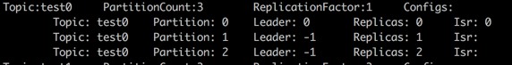
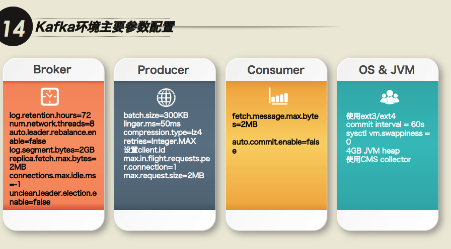
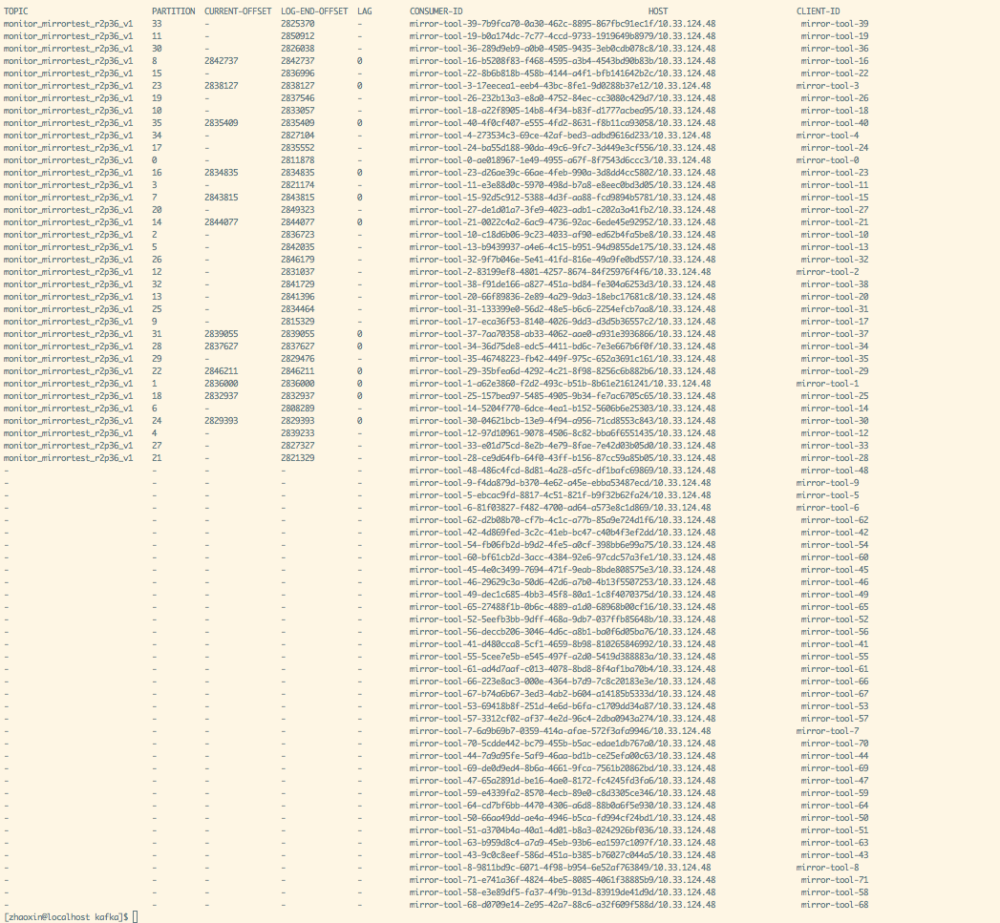

## Kafka 海滩拾贝 ##
---
*written by Alex Stocks on 2017/02/02*

### 0 引言 ###
---

大年初三(2017-01-30)下午15:56公司线上kafka集群(3 instances)挂了一台，导致整个线上服务瘫痪，由于正处于假期时间，用手机联系了相关同事手工重启系统且待系统服务正常后就暂时弃置一边。

今日稍有闲暇，赶往公司想把事故复盘一遍，以追踪事故原因。下面分别列出相关问题，并记录解决方法。

### 1 kafka启动与无法连接broker问题若干 ###
---

由于测试环境机器数目有限，我便在一个测试机器启动了3个kafka实例(kafka_2.11-0.10.1.1)和1个zk实例（zookeeper-3.4.9），并写了相关python程序去连接kafka集群。

#### Q1 kafka broker无法启动
-

broker无法启动大致有两个原因：第一是内存不足，第二是jmx无法启动。
可以通过修改kafka-server-start.sh如下一行代码来确定broker修改JVM HEAP size：

	export KAFKA_HEAP_OPTS="-Xmx1G -Xms1G"

把kafka-run-class.sh如下代码删除掉就可以关闭kafka的JMX：

	# JMX settings
	if [ -z "$KAFKA_JMX_OPTS" ]; then
	  KAFKA_JMX_OPTS="-Dcom.sun.management.jmxremote -Dcom.sun.management.jmxremote.authenticate=false  -Dcom.sun.management.jmxremote.ssl=false "
	fi

	# JMX port to use
	if [  $JMX_PORT ]; then
	  KAFKA_JMX_OPTS="$KAFKA_JMX_OPTS -Dcom.sun.management.jmxremote.port=$JMX_PORT "
	fi

把JMX关掉的坏处在于一些依赖于JMX（KafkaOffsetMonitor)就无法工作了。

#### Q2 python程序无法连接kafka broker
-

程序一直报如下错误：

    kafka.errors.NoBrokersAvailable: NoBrokersAvailable

首先查看了kafka集群的网络监听情况。执行命令 netstat -nlp | grep 9092 得到如下结果：

    tcp6   0      0 127.0.0.1:19092         :::*     LISTEN      18782/java
    tcp6   0      0 127.0.0.1:29092         :::*     LISTEN      19111/java
    tcp6   0      0 127.0.0.1:9092          :::*     LISTEN      18406/java

注意到了kafka实例使用的tcp协议的版本是tcp6，google一番后发现解决方法是把如下语句加入你的bash启动脚本（.bash_profile or .bashrc）：

    export _JAVA_OPTIONS="-Djava.net.preferIPv4Stack=true"

再次执行上面的命令查验后，结果如下：

    tcp   0      0 127.0.0.1:19092  0.0.0.0:*               LISTEN   25551/java
    tcp   0      0 127.0.0.1:29092  0.0.0.0:*               LISTEN   25842/java
    tcp   0      0 127.0.0.1:9092   0.0.0.0:*               LISTEN   25254/java

客户端程序是kafka python(https://github.com/dpkp/kafka-python)写的，再次启动后报如下错误：

    Traceback (most recent call last):
    File "producer.py", line 34, in <module>
    producer_timings['python_kafka_producer'] = python_kafka_producer_performance()
    File "producer.py", line 21, in python_kafka_producer_performance
    producer = KafkaProducer(bootstrap_servers=brokers)
    File "/usr/local/lib/python2.7/dist-packages/kafka/producer/kafka.py", line 328, in __init__
    **self.config)
    File "/usr/local/lib/python2.7/dist-packages/kafka/client_async.py", line 202, in __init__
    self.config['api_version'] = self.check_version(timeout=check_timeout)
    File "/usr/local/lib/python2.7/dist-packages/kafka/client_async.py", line 791, in check_version
    raise Errors.NoBrokersAvailable()
    kafka.errors.NoBrokersAvailable: NoBrokersAvailable

再次google后，在producer的参数里加上api_conf字段解决问题，修改后的代码如下：

    brokers = bootstrap_servers.split(',')
    producer = KafkaProducer(
        bootstrap_servers=brokers,
        api_version = (0, 10))

### 2 kafka集群稳定性测试 ###
---

测试环境：

- 在一台机器上部署1个zk实例（zookeeper-3.4.8）;
- 在同一台机器上部署3个kafka实例(kafka_2.11-0.10.1.1);
- 在同一台机器上部署1个kafka producer实例(基于kafka-python库，以下简称P)；
- 在同一台机器上部署1个kafka consumer实例(基于kafka-python库，以下简称C)；
- topic一个，其replica为3，partition为3；

测试流程：

> case 1 kill全部kafka实例然后30s内再全部重启

    P与C依然能正常工作，但丢失消息若干且部分乱序。
> case 2 kill一个kafka实例然后重启之

    重启kafka之前，P与C都能正常工作， 但又部分消息乱序。重启kafka实例之后，60S内P与C都与新实例建立了正常连接，且partition2以新实例为leader。
> case 3 kill一个kafka实例，kill P然后重启P，再kill C再重启C

    kill P且重启之后，P与C都可以正常工作。干掉C又重启之后，P与C依然能正常工作，但丢失消息若干且部分乱序。
> case 4 新建一个topic，其partition为3，其replica为1，然后kill掉两个kafka实例

    kill掉一个kafka实例后，这个topic的信息如下图：
   

    所以kafka中topic的replica应该大于1。

上面程序的相关代码详见[kafka failure test](https://github.com/AlexStocks/test/tree/master/kafka/kafka_failure_test)。

不改变测试环境其他条件，仅改变topic的replica为1的情况下，再次以下测试：
> case 1 kill全部kafka实例，3分钟后再全部重启

    P与C依然能正常工作，但丢失消息若干且部分乱序。但如果P为confluent_kafka(以下简称CK)实现，则仅仅有消息乱序现象。
> case 2 kill全部kafka实例，48分钟后再全部重启

    P与C依然能正常工作，但丢失消息若干。

### 3 线上kafka集群服务恢复 ###
---
第一次把线上那台死掉的机器重启后，它不断在重建数据，大约10分钟后仍然没有启动成功，目测是数据彻底乱掉了。于是我们把其数目录清空，然后再启动就成功了。

整个kafka集群服务恢复后，发现服务仍然很慢，通过日志发现这个kafka实例是在复制数据。这台机器从当天17:00pm开始一直到第二天08:00am才把数据重建成功，数据量约为598G，复制速率约为40G/H = 11.38KB/s。

到线上发现kafka数据保存时间配置如下：log.retention.hours=168，也就是保存了7天的数据。

参考上面的case4和这个参数，大约就知道优化方向了。

### 4 kafka消费者与broker连接不断挂掉 ###
---

在上海一家做wifi软件的公司工作的时候遇到这样一个问题：kafka consumer(Java)与broker之间的连接总是不断挂掉，查看了consumer的源码(主要是poll函数)后，发现主要原因是：

    consumer是单线程程序，从broker批量取出一批消息后处理，处理完毕后向broker汇报心跳，即messge process逻辑和heartbeat逻辑在一个线程上。

   解决方法是：设置max.partition.fetch.bytes=4096(kafka v0.9.0.0)或者max.poll.records=10(kafka v0.10.0.1)，这两个参数是用来设置每次拉取消息的最大量。

通过缩小batch message size来缩短message process时间，从而不阻塞hearbeat上报时间，后面这种现象就再也没有发生了。

### 5 kafka使用建议及相关参数 ###
---

#### 5.1 kafka使用建议 ####
---

- 据B站服务端老大说经他们测试，partition数目为磁盘数目的4倍（也就是说每个盘上放4个partition）时候kafka的性能最优；
- 磁盘建议使用ssd，为了充分利用CPU提高系统吞吐率计（无论磁盘顺序写再怎么快也跟不上内存和cpu的吞吐率）；
- 如果使用SATA或者ATA磁盘，为了提高吞吐率建议使用多个磁盘，通过log.dirs配置这些磁盘目录，如 “log.dirs=/mnt/diska,/mnt/diskb,/mnt/diskc”，但是相关优缺点自己权衡，根据参考文档2这个参数会导致kafka如下行为：

   > The intention is to allow the use of multiple disks without RAID or
logical volume management.
   >
   > It takes a comma separated list and partition replicas are randomly
distributed to the list.
   >
   > If you get a disk error that results in an IOException the broker will shut itself down.

   另外，不要一个目录配置成ssd而另一个目录配置成SATA，否则会导致topic数据传输忽快忽慢；
- 磁盘上数据保留时间(相关参数是log.retention.hours=168)建议改为24小时或者你认为其他的合适值即可；
- 不要想当然认为kafka保存数据的过程是可靠的，broker接收收据后异步批量刷入磁盘的，为了保证数据及时写入磁盘，可以修改参数 “log.flush.interval.messages”（这个参数一般不要修改，过大则影响数据可靠性，过小则影响broker的吞吐率进而影响响应生产者和消费者的速度，详细解释见参考文档3）；
- worker数目最好与parition数目相等（小于当然也可以），鄙人自己测试当partiton数目为1而消费者为10的时候，系统响应速度急剧下降，可见消费者都把时间浪费在消息争用上了；
- 为了保证系统稳定性，replica数目最少为2；
- 生产者发送消息选择压缩方法的时候，建议选择lz4（详见参考文档1）；
- 如果使用kafka的版本是v0.10以上，建议使用最新版kafka(目前是0.10.2.0)，个人发现 v0.10.1.0 版本的jar包不能正确获取某个consumer group的消费者个数；
- 其实个人真心建议不要使用v0.10，使用v0.8 or v0.9即可，其中一个原因是kafka版本越新则其周围可用的工具越少，工具的更新速度实在比不上kafka版本的个更新速度，每个大版本的更新就意味着其架构的大改；
- kafka v0.10的版本支持了offset存储在kafka上，但是他的offset提交处理速度非常慢，虽然支持异步定时提交offset，但是重启的话还是会丢，所以依赖kafka做主从同步保障数据一致性是不可能的（例如阿里的canal在mysql 集群间传递binlog式它们是绝对不会使用kafka的），也就说kafka不考虑消费者是否重复消费，当然也有大厂自己封装kafka后把每个consumer消费的offset存在别的中间件上，通过assign方式读取kafka消息来保证不重复消费kafka message；
- 不要使用github.com/wvanbergen/kafka/consumergroup包，这个包将近两年没有更新，在kafka v0.10.1.0上测试的时候发现其官方example程序不能正确建立consumer group，建议以github.com/bsm/sarama-cluster替代之；
- kafka使用的网卡流量到达极限的70%后，就开始大量丢包；
- kafka streaming的statestore是通过rocksdb实现的；
- kafka数据的顺序性、重复性和完整性（是否会丢）在发送端是没有保证的，[官方文档](http://docs.confluent.io/2.0.0/clients/producer.html)对此有详细描述。这里只谈到retries参数（librdkafka：message.send.max.retries），它是在发送失败的情况设置重新发送次数，但是熟悉消息系统的人知道：一旦有消息发送重试就可能导致本来在生产者端上顺序在前的消息A和B到了broker之后顺序却是B和A，如果要确保在broker上消息顺序也是A和B，那么可以设置max.in.flight.requests.per.connection参数为1，它确保生产者发送A成功之前不会发送B，即每次只发送一个消息（生产者的吞吐率就没法保证了）；
- 目前的kafka的负载均衡只考虑磁盘负载均衡没有考虑网卡流量，譬如有的topic虽然数据少但是消费者比较多，此时网卡就没有均衡，但即使是磁盘均衡也做到不够好，它的负载均衡是以partition为维度的，但多topic的parition数据量不可能相等；

##### 5.1.1 broker #####
---

- Kafka中Topic命名规范: appname\_feature\_function

  如ikurento_push_sched

- partition数目

  partition数目多少并不会严重影响broker性能，confluent官方层测试过10000个partition的情况。

#### 5.2 kafka最优参数 ####
---

在Kafka Beijing Meetup(3rd)上，胡夕给出了下图各个参数集：

下面分别解释下各个参数的意义。

##### 5.2.1 Broker #####
---
* log.retention.hours - 日志保存时间 (hours)。还有一个参数log.retention.bytes(日志最大字节数)，bytes和minutes无论哪个先达到都会启动相应的淘汰策略
* num.network.threads - 处理网络请求的最大线程数
* auto.leader.rebalance.enable - 是否在broker端启动partition-rebalance线程，检查Leader分配是否平衡
* leader.imbalance.check.interval.seconds - 周期性检查Leader分配是否平衡时间间隔
* replica.fetch.max.bytes - replicas每次获取数据的最大字节数
* connections.max.idle.ms - 链接超时时间，如果链接idle时间超过这个时间则会被broker关闭
* unclean.leader.election.enable - 是否允许leader死掉的情况下，不具备ISR选举资格的replicas被选为leader
* min.insync.replicas - 设定ISR中的最小副本数是多少，默认值为1。当且仅当request.required.acks参数设置为-1时，此参数才生效。如果ISR中的副本数少于min.insync.replicas配置的数量时，客户端会返回异常：org.apache.kafka.common.errors.NotEnoughReplicasExceptoin: Messages are rejected since there are fewer in-sync replicas than required
* max.connections.per.ip - 每个ip地址上每个broker可以被连接的最大数目
* max.connections.per.ip.overrides - 配置针对某个特别的IP or hostname的连接个数最大限制，配置样例见[#KAFKA-512](https://issues.apache.org/jira/browse/KAFKA-1512)
* offsets.topic.replication.factor - Topic __consumer_offsets的replica值，这个值默认为1，这是因为如果cluster只有一个kafka的情况下让系统跑起来，详细说明见[KAFKA-1846](https://issues.apache.org/jira/browse/KAFKA-1846)

  

  如果不修改offsets.topic.replication.factor的值，则__consumer_offsets的replica为1，如果某个partition的leader broker宕机，那就只能去无语对苍天了。所以预防的方法就是在config/server.properties中设置offsets.topic.replication.factor=3。那么，如果忘记修改offsets.topic.replication.factor的值，有什么补救补救办法，总不能眼睁睁看着悲剧发生吧？

  办法总是有的。可以通过kafka提供的重新分配分区工具 bin/kafka-reassign-partitions.sh 修改__consumer_offsets的replica，操作步骤如下：
  1 请先准备重新分配分区配置文件replica.json：

  		{"version":1,
  			"partitions":[
  				{"topic":"__consumer_offsets","partition":0,"replicas":[0,1,2]},
  				{"topic":"__consumer_offsets","partition":1,"replicas":[1,2,0]},
  				{"topic":"__consumer_offsets","partition":2,"replicas":[2,0,1]},
		]}

  2 通过如下命令执行扩容：

  		./bin/kafka-reassign-partitions.sh --zookeeper $zk  --reassignment-json-file replica.json --execute

  3 查看扩容结果:

  		./bin/kafka-reassign-partitions.sh --zookeeper $zk  --reassignment-json-file replica.json --verify

  

* offsets.topic.num.partitions - Topic __consumer_offsets的partition值，默认为50。

##### 5.2.2 Producer #####
---
* batch.size - 批处理消息字节数。如果某个消息大于这个值则不会被处理
* linger.ms - 发送延迟时间。producer端的消息发送线程到record buffer中获取消息然后立即发送，不管消息字节数是否达到batch.size，此时如果消息的数量太少就会影响吞吐率，linger参数的意义就是让发送线程发现发送消息总量太小的时候再等待ling.ms时间后再启动发送动作
* compression.type - 压缩类型，目前最恰当的type就是lz4。当启动压缩算法后，将导致producer端消息处理时间过长，为了增大吞吐率就需要调整上面两个参数值
* max.in.flight.requests.per.connection - 发送多少消息后等待broker端的回复。这个参数和retry配合使用，会影响消息的顺序，详细意义请参考5.1章节的内容
* max.request.size - 请求的最大字节数。这个设置会限制producer每次批量发送请求的数目，以防发出大量的请求
* request.required.acks - 设置数据发送数据请求的可靠性的级别。在设置request.required.acks=-1的同时，也要min.insync.replicas这个参数(可以在broker或者topic层面进行设置)的配合，这样才能发挥最大的功效，具体含义见参考文档5。
* session.timeout.ms - 在恶劣网络环境下要注意放大这个值，以防止producer不稳定。

##### 5.2.3 Consumer #####
---
* fetch.message.max.bytes - 单次fetch消息的最大字节数。Producer端的max.message.bytes = broker端的replica.fetch.max.bytes = 消费者的fetch.message.max.bytes，这三个值一起控制了单个消息的最大长度
* max.poll.records - 限制每回poll返回的最大数据条数。前面已经说到，fetch.message.max.bytes在v.10里面被max.poll.records替换掉，另外v.10版本中heartbeat不再在poll中触发，而是由单独的线程来完成，详细见[KIP-62](https://cwiki.apache.org/confluence/display/KAFKA/KIP-62%3A+Allow+consumer+to+send+heartbeats+from+a+background+thread)。
* num.consumer.fetchers - 用于fetch数据的fetcher线程数
* auto.commit.enable - 是否自动提交offset
* partition.assignment.strategy - `参考文献6`  建议将这个值设为 “ org.apache.kafka.clients.consumer.RoundRobinAssignor”，因为 `默认的策略（Range partitioning）会导致partition分配不均，如果采用默认的策略，当consumer（logstash数量*worker数量）的数量大于topic partition数量时，partition总是只会被分配给固定的一部分consumer`，这个策略本质是一种跨topic的shuffle，保证一个consumer group内消费多个topic时，总体保持负载均衡。关于两种策略的更详细区别请见 `参考文档7` 和 `参考文档14`。   
RoundRobinAssignor策略使用有以下要求：   
	- 同一个Consumer Group里面的所有消费者的num.streams必须相等；   
	- 同一个Consumer Group内每个消费者订阅的主题必须相同。

参照MirrorMaker，这两个要求很好理解。

##### 5.2.4 Os & Jvm & Mem #####
---
* linux文件系统最好使用ext3 or ext4
* commit interval(page buffer commit)改为60s
* vm.swappiness为0，等于告诉os尽量使用内存空间，然后才是磁盘swap的虚拟内存空间。否则os将频繁进行进程调度， 磁盘使用的波动就会比较大
* JVM的heap区域设置为4G，kafka官方推荐6G。因为会消耗28-30g的文件系统缓存。
* JVM的gc算法尽量使用CMS

##### 5.2.5 CPU #####
---
* CPU尽量选择多核。参考文档4认为：kafka不算是CPU消耗型服务，在主频和CPU核数之间，选择后者，将会获得多核带来的更好的并发处理性能。

##### 5.2.6 disk #####
---
* 推荐使用RAID。在kafka broker中配置多目录，每个目录配置在不同的磁盘上。参考文档4 不建议使用SSD，但是经个人测试confluent kafka producer向128G的ssd上运行的kafka每秒可压测出23.8GB/s的结果，而在1T SATA上运行的kafka只能压测出4.9MB/s的结果。

### 6 kafka lastest feature list ###
---

#### 6.1 broker  ####
---
- kafka 2017 7月份0.11版本发布后，可以在broker上进行[消息重复过滤](https://cwiki.apache.org/confluence/display/KAFKA/KIP-98+-+Exactly+Once+Delivery+and+Transactional+Messaging)，增强事务处理能力；

#### 6.2 consumer  ####
---
- kafka 目前最新版本(0.10.2)已经添加[OffsetsForTime功能](https://cwiki.apache.org/confluence/display/KAFKA/KIP-33+-+Add+a+time+based+log+index)，在consumer端有API [offsetsForTimes](https://kafka.apache.org/0102/javadoc/org/apache/kafka/clients/consumer/Consumer.html#offsetsForTimes(java.util.Map))，可以获取某个时间范围内的消息的offset集合；

### 7 kafka toolset ###
---

kafka自身不建议跨IDC部署，可以使用confluent的官方工具MirrorMaker或者uber开源的工具uReplicator把数据在跨IDC之间进行复制。uReplicator是基于MirrorMaker做的二次开发，但是uReplicator不能很好的支持kafka 0.10以上版本，暂不考虑。

#### 7.1 MirrorMaker ####
---

MirrorMaker自身支持把多个kafka集群的数据复制到一个目的地kafka集群中。关于MirrorMake怎么使用请详细参考8到13，但是请注意，这里面很多参数是针对kafka 0.9的，在kafka 0.10里面已经无用，具体哪些无用，自己多测试即可。

下面重点说明conf/mirror-producer.properties的“partition.assignment.strategy”和MirrorMaker的”num.streams”。

“partition.assignment.strategy”关系到consumer的负载均衡策略，默认的range策略会导致负载不均衡且consumer group内consumer的个数多于topic partition的数目时多余的consumer处于idle状态无法工作， `参考文档6` 和 `参考文档11` 都提到这个问题，具体原因参见 `参考文档7` 和 `参考文档14`。采用RoundRobin策略后，所有的consumer都会处于工作状态，加快数据复制速度。

num.streams则是指定consumers的个数。经个人测试，共两个kafka topic，每个topic partition数目为36时，实际测试环境中num.streams给定值为40，而MirrorMaker的实际consumer的个数为72，把num.streams改为100后consumer个数也是100，所以二者不一定一致。而当consumer个数为100，只消费一个topic的时候，有36个consumer线程处于工作状态，其他线程都处于空闲状态（如下图）。所以num.streams的值应该设置为所有topic的partition数目之和。

至于MirrorMaker的性能还可以，想kafka集群写入13993021个长度为100B的kv后，MirrorMaker两分钟内复制完毕。

至于MirrorMaker的缺点，参考文档13提到 `当 MirrorMaker 节点发生故障时，数据复制延迟较大，对于动态添加 topic 则需要重启进程、黑白名单管理完全静态等。虽然 uReplicator 针对 MirrorMaker 进行了大量优化，但在我们的大量测试之后仍遇到众多问题，我们需要具备动态管理 MirrorMaker 进程的能力，同时我们也不希望每次都重启 MirrorMaker进程`，至于MirrorMaker有哪些深坑，囿于测试条件限制，个人无法给出定论。

个人的看法是，一个topic启动一个MirrorMaker，`参考文档12`说为了系统稳定性和高可用，建议“Always run more than one mirror-maker processes. Make sure you use the same groupId in consumer config.”。

至于MirrorMaker 集群自身的稳定性，`参考文档12` 认为可以通过检查MirrorMaker的consumer group的lag值来验证，确实是一个好办法。

## 参考文档 ##

- 1 [Kafka Compression Performance Tests](http://blog.yaorenjie.com/2015/03/27/Kafka-Compression-Performance-Tests/)
- 2 [[Kafka-users] new log.dirs property (as opposed to log.dir)
](http://grokbase.com/t/kafka/users/136mjfz5bg/new-log-dirs-property-as-opposed-to-log-dir)
- 3 [apache kafka系列之server.properties配置文件参数说明](http://blog.csdn.net/lizhitao/article/details/25667831)
- 4 [某互联网大厂kafka最佳实践](http://www.jianshu.com/p/8689901720fd)
- 5 [kafka数据可靠性深度解读](http://www.bijishequ.com/detail/381629?p=71) - *唯品会出品，里面关于“Leader选举”一节写的比较详细，尤其是“leader选举的算法非常多，比如Zookeeper的Zab、Raft以及Viewstamped Replication。而Kafka所使用的leader选举算法更像是微软的PacificA算法”这句话*
- 6 [B站日志系统的前世今生](https://mp.weixin.qq.com/s/onrBwQ0vyLJYWD_FRnNjEg)
- 7 [Kafka分区分配策略](https://www.iteblog.com/archives/2209.html)
- 8 [Kafka mirroring](https://cwiki.apache.org/confluence/display/KAFKA/Kafka+mirroring)
- 9 [Kafka mirroring (MirrorMaker)](https://cwiki.apache.org/confluence/pages/viewpage.action?pageId=27846330)
- 10 [basic_ops_mirror_maker](https://kafka.apache.org/documentation.html#basic_ops_mirror_maker)
- 11 [Kafka MirrorMaker使用与性能调优全解析](https://mp.weixin.qq.com/s/tDbSpypnVOVK6203lZ758w)
- 12 [Kafka Mirror Maker Best Practices](https://community.hortonworks.com/articles/79891/kafka-mirror-maker-best-practices.html)
- 13 [百亿访问量的监控平台如何炼成？](http://www.sohu.com/a/211335858_262549)
- 14 [Kafka为Consumer分派分区：RangeAssignor和RoundRobinAssignor](http://blog.csdn.net/zhanyuanlin/article/details/76021614)

## 扒粪者-于雨氏 ##

* 2017/02/02，于雨氏，于致真大厦。
* 2017/02/19，于雨氏，于致真大厦，添加replica为1条件下的测试结果。
* 2017/03/02，于雨氏，于致真大厦，添加“kafka使用建议”。
* 2017/03/25，于雨氏，于致真大厦，补充“kafka启动与无法连接kafka问题若干”一节。
* 2017/03/25，于雨氏，于致真大厦，补充“使用建议”一节。
* 2017/05/01，于雨氏，于致真大厦，根据kafka beijing meetup(3rd)添加5.1&5.2。
* 2017/05/04，于雨氏，于致真大厦，添加“kafka lastest feature list”一章。
* 2018/01/17，于雨氏，于海淀，添加MirrorMaker一节和consumer”partition.assignment.strategy“参数说明。

