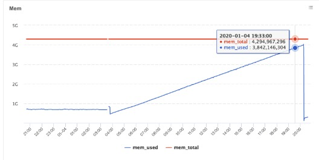
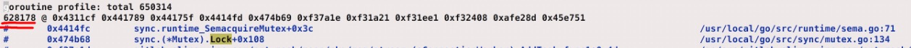
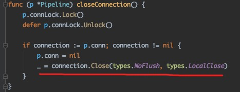
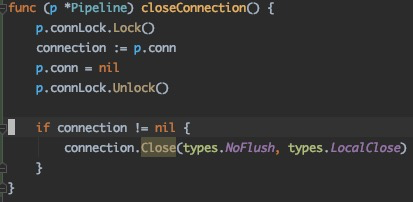

# 一些教训
---
*written by Alex Stocks on 2020/01/12，版权所有，无授权不得转载*

网上有很多的编程实战与编程实践，譬如[Effective Go][1]。但常常是事非经历不知难。本文将陆续记录一些事故教训，以改进编程实践。

## <a name="1">1 死锁与 goroutine 泄露</a>
---

话说上周六【20200105】晚上 8 点正在处理追查某次赶在封网前的应用发布的原因，某大佬发来线一个 sidecar 容器的诡异监控图像：



并告知通过 `curl localhost:34902/debug/pprof/goroutine?debug=1 > /tmp/1.txt` 抓到的 goroutine 栈已经从容器 download 出来并存入事故平台， 可供分析【真的很幸运，文件 download 下来后三分钟容器就被系统干掉了】。  

刚打开如下 goroutine 栈图，看到 628178 个 gorouting 被 hang 在一个死锁上，瞬间感觉我完(真)蛋(牛)了(13)。



通过后面的 goroutine 堆栈，定位到了两处造成死锁的函数流程，其中一处流程的关键代码如下：



函数 `Pipeline.closeConnection` 红线处代码关闭连接后，底层库又回来调用相关回调函数进而导致 `Pipeline.closeConnection` 函数再次被调用，然后这个容器就完美的发生了上面的约 63 万个 goroutine 泄露。

改进后的代码如下：



虽然事后评估，触发本次 goroutine 泄露的概率非常低，相关发布继续进行，但于某人已是精疲力尽【当时场景：正在追查一次发布失败原因，又突然发生了本次事故】，因为其后果是：差点导致几十万台容器版本降级回滚！

事后总结教训，得出如下编程实践规则：

```
1 严禁在一行代码内对同一个变量产生两次写行为；
2 严禁在一行代码内对同一个变量产生既写又读的行为； 
3 严禁在锁内执行被锁对象的行为函数。
```

前两条规则是于某写西渣渣事后的编程实践，在此不做解释，对第三条实践规则的解释是：加锁只锁住它的目标对象，至于对象的相关动作或者对象【容器】内的对象的动作一定放在锁外。

## 参考文档

>- 1 [Effective Go](https://golang.google.cn/doc/effective_go.html)  

[1]:https://golang.google.cn/doc/effective_go.html "Effective Go"


## 扒粪者-于雨氏 ##

>- 2020/01/12，于雨氏，于丰台初写此文 <a href="#1">[1 死锁与 goroutine 泄露]</a>。

