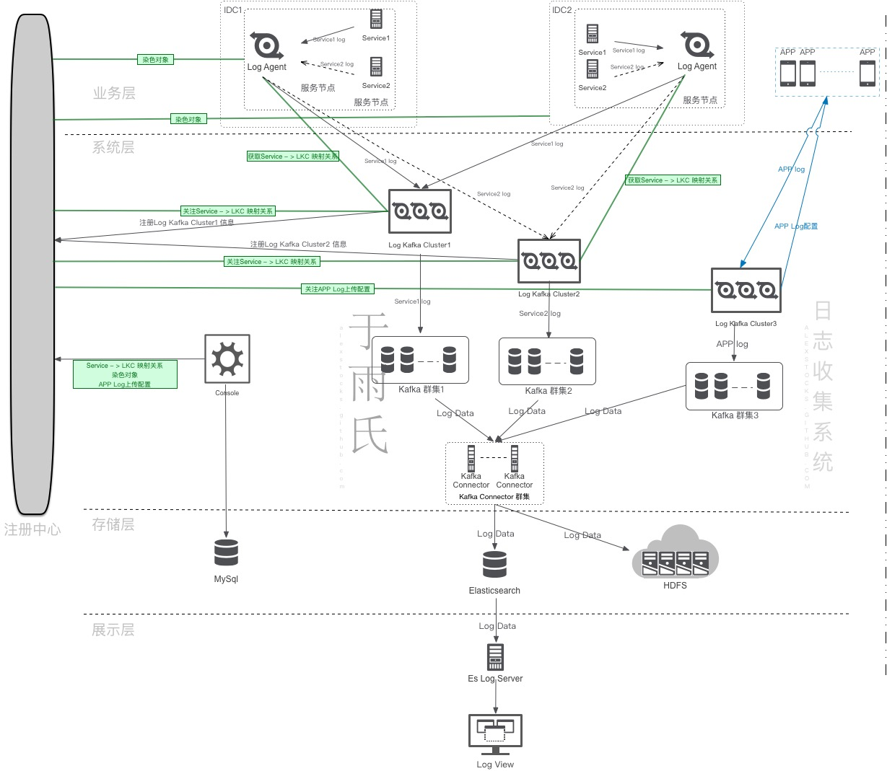
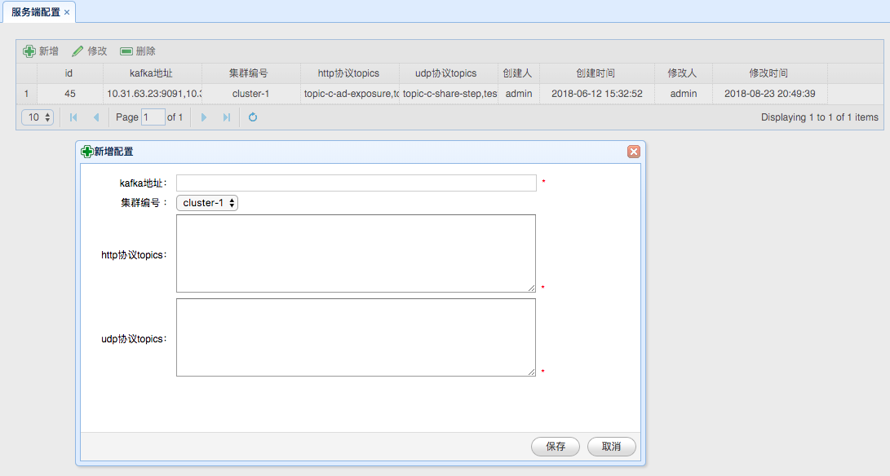
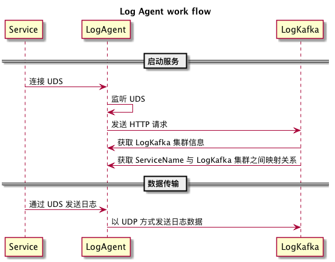
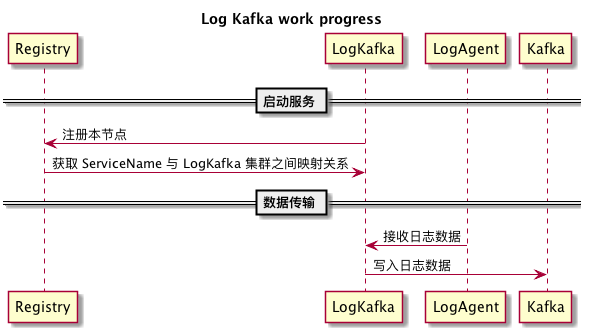
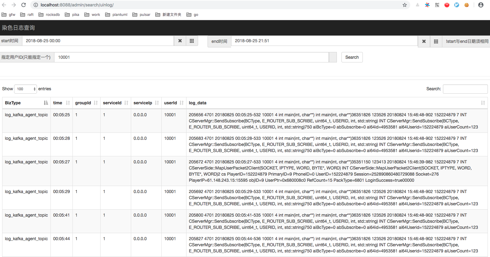

## 一套日志管理系统实现
---
*written by Alex Stocks on 2018/11/25，版权所有，无授权不得转载*

### 0 前述

前一篇博文 [一套实时监控告警系统实现](http://alexstocks.github.io/html/monitor.html) 中提到 `一个摆脱了手工作坊时代的可称之为近代化的互联网公司，如果想对自己的后台服务以及各个用户的客户端的运行情况了如指掌，大概也需要自己的 “听诊器”：分布式实时监控告警系统、分布式日志收集系统和分布式链路追踪系统`。

实时监控告警系统基于固定的数据抽象模式能够快速及时地对服务端线上服务质量进行监控，而链路追踪系统则主要用于分析服务质量和各个服务之间的调用关系，日志收集系统主要用于大数据处理分析场景，为安全审计、客户端产品开发、服务端治理质量提高以及链路追踪提供必要的支持。目前也有很多中小公司直接基于日志收集系统进行服务的监控和告警，但是由于日志收集系统一般处理的日志量比较大，几乎不可能做到实时，个人强烈反对直接基于日志系统对线上服务进行告警监控。

本文将详细记述愚人 2018 年 Q2 实现的一套日志收集系统以及其附属的存储和检索系统的详细工作流程，可认作是前一篇博文 [一套实时监控告警系统实现](http://alexstocks.github.io/html/monitor.html) 的续貂之作。

### 1 日志系统


互联网公司的日志数据可以区分为客户端日志和服务端日志，两种日志来源、内容形态、收集方式、处理方法均不一样，下面先给出愚人实现的系统的总体架构，然后再分章节详细介绍各个子模块的工作流程。

#### 1.1 总体架构

日志管理系统分为日志收集、数据清洗、日志存储、数据检索和数据分析等众多子模块，囿于本人大数据系统经验不足，此日志系统不涉及与之相关的部分。

本系统考虑到公司服务端业务跨 IDC 特点，其总体架构如下：



#### 1.2 各模块解释

总架构图中给出了日志收集的详细数据流向以及控制流程，本章对各个模块的功用进行详细地解释。

- 1 Log Agent

	> Log Agent 是服务端日志收集的源头，在每个服务节点（物理机或者虚机）都有部署，通过监听 UDS（Unix Domain Socket）被动收集各个服务的日志数据，而后根据 Service Name 发送给每个服务对应的 Log Kafka 群集。

- 2 Log Kafka

	> Log Kafka 是系统最关键的节点，从 Log Agent 和客户端 APP 接收日志数据，而后根据 Service Name（客户端相应字段称之为 BizType）写入不同的 Kafka 通道（Topic）。
	
- 3 Registry

	> Registry 是系统的注册中心，用于 Log Kafka 服务注册和服务发现，并传递服务端日志收集参数。
	
- 4 Kafka Connector

	> Kafka Connector 是系统的数据迁移节点，从 Kafka 不同通道读取日志数据 （Log Data）然后存入不同的 Elasticsearch Index。当然也会根据线上需要把数据存入 HDFS 以供大数据系统分析使用。
	
- 5 Console

	> Console 是系统的控制中心，用于设定客户端的日志收集方式以及服务端日志的传输通道。
	
- 6 Es Log Server

	> Es Log Server 是系统的数据过滤和汇聚模块，用于日志查询。
	
- 7 Log View

	> Log View 是日志数据的展示模块，根据用户设定的参数向 Es Log Server 发出日志查询请求，并展示查询结果。
	
### 2 服务端日志收集处理

不同的服务有不同的服务名称（Service Name），日志系统进行日志收集时，不同的服务使用不同的传输通道。

本文的日志系统强制要求日志数据采用 JSON 文本格式。下面先介绍服务端日志数据的 schema，然后再介绍各个模块的处理流程。

#### 2.1 服务端日志格式

不同服务的日志数据格式不可能相同，但为了便于日志收集，需要约定一些共同的日志字段（Log Data Common Field）以便于日志数据清洗和传输。

本系统规定的日志格式如下：

```JSON
	{
	    “IP”: “10.10.10.10“,
	    “Timestamp”: “20181125 16:38:32.112+08:00”,
	    “ServerID”: 12345,
	    “BizType”: “pubsub_proxy”,
	    “BizAction”: “MsgAck”,
	    “UserID”: 456789,
	    “Log”: “xxx”
	}
```

各个字段详细意义如下：

- 1 IP: Host IP;
- 2 Timestamp: Log Data timestamp;
- 3 ServerID: 服务节点标识；
	
	> 服务节点的 IP 会漂移，无法作为唯一标识，因此以 ServerID 代之，公司的 itil 系统会为每个服务节点分配一个唯一的 ServerID。
	
- 4 BizType: Service Name，服务名称，类似于 Class Name；
- 5 BizAction: Service Action，类似于 Class Method；
- 6 UserID: 用户 ID；
- 7 Log: Log Data，统一放入这个字段中，用于大数据系统详细分析处理。

公司主要 APP 是一个社交类型的产品，所以每个服务请求处理都是响应一次用户服务请求，所以日志公共字段中要求必须加入相应的服务用户的 ID。

#### 2.2 Console

Console 是日志系统的控制中心，用于设定服务对应的 LogKafka 集群编号以及 Kafka 地址，其 UI 界面如下：



上面 UI 中 “集群编号” 即为 LogKafka 的群集编号。

上面 UI 中 “http协议topics” 设定了某个 “kafka地址” 可以接收的客户端日志服务名称。

上面 UI 中 “udp协议topics” 设定了某个 “kafka地址” 可以接收的服务端日志服务名称。

每个服务单独使用一个 Kafka Topic 通道，Topic 名称与服务名称相同。

Console 的数据除存入 Mysql 中作备份外，另外存入注册中心中，以方便各个服务获取相关映射信息。

从上面相关信息可知：

- 1 一个 LogKafka 群集只对应一个 Kafka 集群，多个 LogKafka 群集可以共用一个 Kafka 集群；
- 2 每个服务通道只能通过一个 Kafka 集群。 

#### 2.3 Log Agent

Log Agent 分布在每个服务节点上，通过监听 Unix Domain Socket 接收部署在本节点上各个服务的日志数据，其详细工作流程如下：



LogAgent 向 LogKafka 发送日志数据时采用以 UDP 通信形式，以方便跨集群数据传输，另一个考量是日志系统是一种有损服务，即便一段时间内丢若干条日志数据亦无妨。

Log Agent 收到 UDS 日志数据包时会解析出 BizType（服务名称），并根据 BizType 对应的 Log Kafka 集群信息以哈希路由方式固定地向集群中某一 Log Kafka 发送日志。 

最终实现的 Log Agent 系统有一个 Service Agent 机制：定时向 Log Kafka 发起 HTTP 请求并读取其响应，获取 Log Kafka 节点列表。以及时对 Log Kafka 进行服务发现。  

#### 2.4 Log Kafka

Log Kafka 从 Log Agent 接收日志数据包，进行解析后根据服务名称写入相应的 Kafka 传输通道。日志系统中 Log Kafka 以多群集方式进行部署，每个群集都有唯一标识，即 Console UI 界面中的 “集群编号”。

总体架构图中 LKC 即为 Log Kafka Cluster 的英文首字母缩写。

其工作流程如下：



Log Kafka 需要向注册中心其所在的 Log Kafka 群集的信息节点进行注册。

Log Kafka 向其所在的 “集群编号” 在注册中心的节点（Zookeeper中的路径 或者 etcd 的 key等等）注册完毕后，即可从注册中心读取所有 Log Kafka 群集的各个成员信息。

Log Kafka 根据 Console 在注册中心存储的服务对应的各个服务对应的 “集群编号” 即可知道各个 Log Kafka 群集所传输的日志数据的服务名称集合【即 ServiceName 到 各个 LogKafka 群集的映射】，根据自身所在群集的 “集群编号” 亦可得知其可以传输的日志数据的服务名称集合。

Log Kafka 提供 HTTP 接口，Log Agent可通过这个 HTTP 接口获取所有的 ServiceName 与 各个 LogKafka 群集的映射数据，以及各个 Log Kafka 群集（LKC）内成员列表。

#### 2.6 Kafka Connector

Kafka Connector 是日志系统中日志数据的迁移通道，把不同服务的日志数据写入不同的 Elasticsearch 数据库（Index）中。

Kafka Connector 自身调用 Kafka 和 Elasticsearch 的相关 API 即可完成相关功能，然为效率计，最好采用流水线工作模式，不同的服务启动不同的工作线程。

考虑到 Elasticsearch 自身的特点，同一个服务的日志数据以日为维度进行分库。

Kafka Connector 同时可以根据 Console 相应配置把 Log Data 写入 HDFS 中，以方便大数据部门进一步清洗加工处理。

#### 2.6 Es Log Server

Es Log Server 是一个 Web Server，提供日志数据的查询和过滤功能，响应对 Log View 发来的请求。

最终的系统实现采用 Python Flask 框架实现相应的功能，因为考虑到日志系统的写多读少特性，Es Log Server并无很高的性能追求。

#### 2.7 Log View

Log View 可以认作是 Es Log Server 的前端展示，采用 Js 实现，其 UI 界面如下：



Es Log Server 和 Log View 系统是愚人用了两天时间搭建的一个简单的日志数据查询展示系统，实际还有很多进一步的工作待作，不过目前的简陋实现已经能够满足服务端人员的需求。其实另一个不足为外人道的理由是愚人的 Python 和 Js 开发水平是入门级。

### 3 客户端日志收集处理

客户端日志整体处理流程与服务端日志处理流程无差，其区别主要在于日志 schema 差异甚大，另外还有一个额外的 客户端日志上传机制。


#### 3.1 客户端日志格式

同服务端日志收集一样，但为了便于日志收集，客户端日志约定了如下共同的日志字段（Log Data Common Field）以便于日志数据清洗和传输：

```JSON
	{
		“IP”: “10.10.10.10“,
	    “Timestamp”: “20181125 20:56:32.112+08:00”,
	    “DeviceID”: “abcd”,
	    “BizType”: “Recharge”,
	    “BizAction”: “MsgAck”,
	    “UserID”: 456789,
	    “Log”: “xxx”
	}
```

各个字段详细意义如下：

- 1 IP: Host IP;
- 2 Timestamp: Log Data timestamp;
- 3 DeviceID: 设备指纹；
- 4 BizType: Service Name，服务名称，类似于 Class Name；
- 5 BizAction: Service Action，类似于 Class Method；
- 6 UserID: 用户 ID；
- 7 Log: 其他Log Data，统一放入这个字段中，用于大数据系统详细分析处理。

其实客户端日志共同字段同服务端日志差异不大。BizType 是日志的行为类型，日志服务器会这个字段把日志写入同名的 Kafka Topic。

#### 3.2 客户端日志上传机制

客户端须通过 HTTP 通道进行明文的日志传输，可启用压缩机制，但不能加密，以让用户明确知晓 APP 的行为。

客户端日志有多种种类，针对不同种类的日志需要进行不同的上传机制。即便是同类型日志，不同版本的客户端用户可能需要不同的上传机制。不同业务随着业务发展也需要改进上传机制。
 
日志上传的时候需要对上传的频度、文件size以及上传渠道（移动 或者 wifi）进行控制。不能频繁上传消耗用户流量和电量，更不能占用过多系统资源影响用户体验。

客户端通过配置接口（Log Kafka HTTP接口）拉取客户端日志配置后，根据配置决定需要上传的日志，根据配置决定不同日志上传时长间隔。

##### 3.2.1 客户端日志上传配置

愚人定义的客户端日志上传配置规范如下：

```JSON
	{
	  “version” : 1,
	  “author”: “zx”,
	  “max_size” : 256,
	  “ttl”: 3600,
	  “action”:{
	    “0”: {“size”: 0, “ttl”:0, “net”: 1},
	    “1”: {“size”: 8, “ttl”:1, “net”: 3},
	    “2”: {“size”: 256, “ttl”:600, “net”: 2},
	  },
	  “switch”:{
	    “1” : “1”,
	    “2” : “0”,
	    “3” : “1”,
	    “4” : “1”
	  }
	}
```

各个字段详细意义如下： 

- 1 version 是配置的版本，客户端应该使用最新版本的配置；
- 2 max_size 为 log 文件最大 size；
- 3 ttl 是日志存储的最大时长；
- 4 action 是上传动作类型；
- 5 switch 是上传行为开关，针对不同类型的日志采用不同的 `action`。

上传动作类型 `action` 各个字段详细意义如下：

- 1 size 是配置文件的size，以KB为单位；
- 2 ttl 是日志在客户端停留时长，超过则不予上传，以分钟为单位。0 表示不上传，1 表示实时上传；
- 3 net 是上传网络通道，0x1 表示无线，0x2 表示wifi，0x3 就表示两者皆可。

上面示例中，各个 `action` 意义如下：

| 编号 | 说明 |
| :--- | :--- |
| 0 | 表示不上传 |
| 1 | 表示实时上传，但是 size 不得超过 8KB |
| 2 | 表示离线上传，但是文件 size 不得超过256KB，日志有效时间应在 10 小时以内 |
 

上面示例中，各个上传行为开关 `switch` 日志分类定义如下：

| 编号 | 说明 |
| :--- | :--- |
| 1 | 用户行为日志 |
| 2 | 后台操作日志 |
| 3 | 后台操作异常/失败日志 |
| 4 | crash日志 |

##### 3.2.2 客户端日志存放删除规则
 
客户端日志路径应为 `/com.test.xxx/logs/biztype/timestamp`，其中 `biztype` 为日志分类名称，`timestamp` 为文件创建时间。

客户端以log size对log进行分割，日志删除规则如下：

- 1 用户设备空间余量不够；
- 2 日志过期；
- 3 日志上传成功；

##### 3.2.2 客户端日志上传规则
 
客户端日志上传上传条件为：应用运行在前台，网络（移动 或者 wifi）连通，有满足配置规则的日志。

上传详细流程：

- 1 过滤上传内容，只上传 ttl 内的日志；
- 2 客户端通过网络通道向日志服务器上传日志；
- 3 收到日志服务器返回的上传结果；
- 4 如果上传成功则立即删除 log 文件，如果上传失败无论何种 log 全部转为离线日志继续上传。
 
#### 3.3 Log Kafka

客户端日志系统所使用的 Log Kafka 集群与服务端使用的 Log Kafka 集群分离。

客户端 Log Kafka 群集 前面有一个 Nginx 集群，Nginx 集群配置统一的对外服务域名。由 Nginx 的额外实现逻辑完成对 APP 鉴权工作，然后把日志数据或者 APP 拉取配置规范请求转发给 Log Kafka 群集。

Log Kafka 对 APP 的响应亦由 Nginx 原路由转回。

### 4 展望

本文详细记述了愚人实现的日志系统的相关流程，其实现距今已经半年有余，有待改进的工作如下：

- 1 与实时监控系统结合，待告警时把相关上下文日志一并邮件抄送；
- 2 日志深加工处理，以支撑起链路跟踪系统；
- 3 其他。

## 参考文档

- 1 [一套实时监控告警系统实现](http://alexstocks.github.io/html/monitor.html)

## 扒粪者-于雨氏

> 2018/11/25，于雨氏，于丰台，初作此文。
