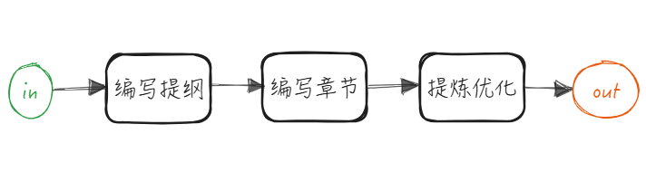
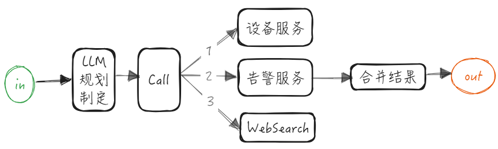
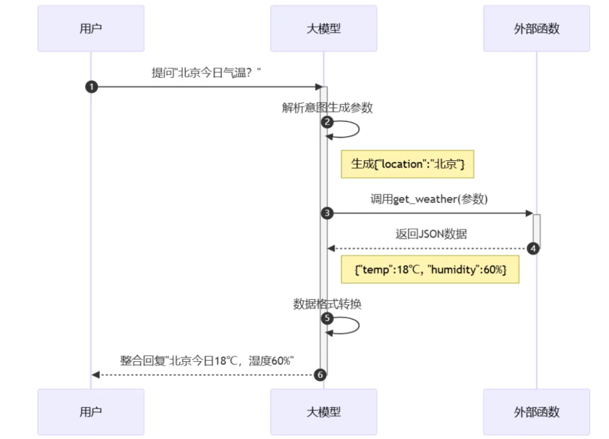
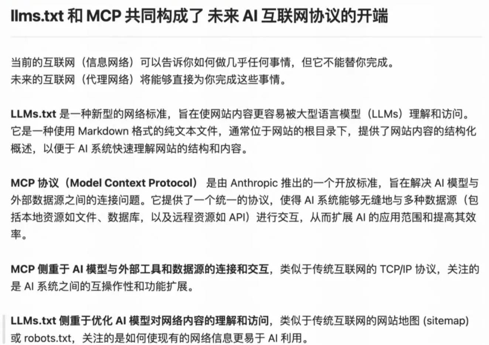
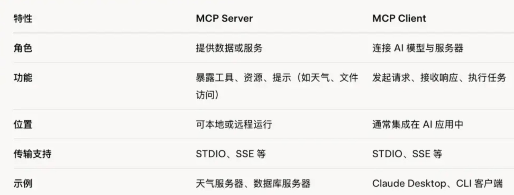
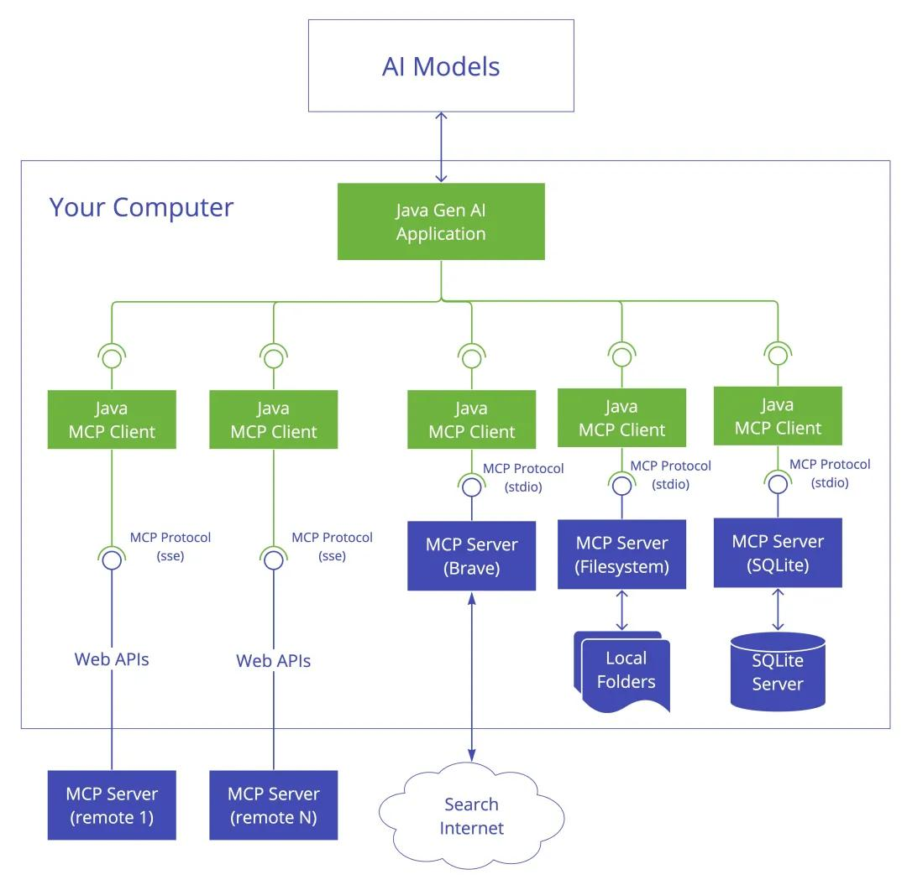
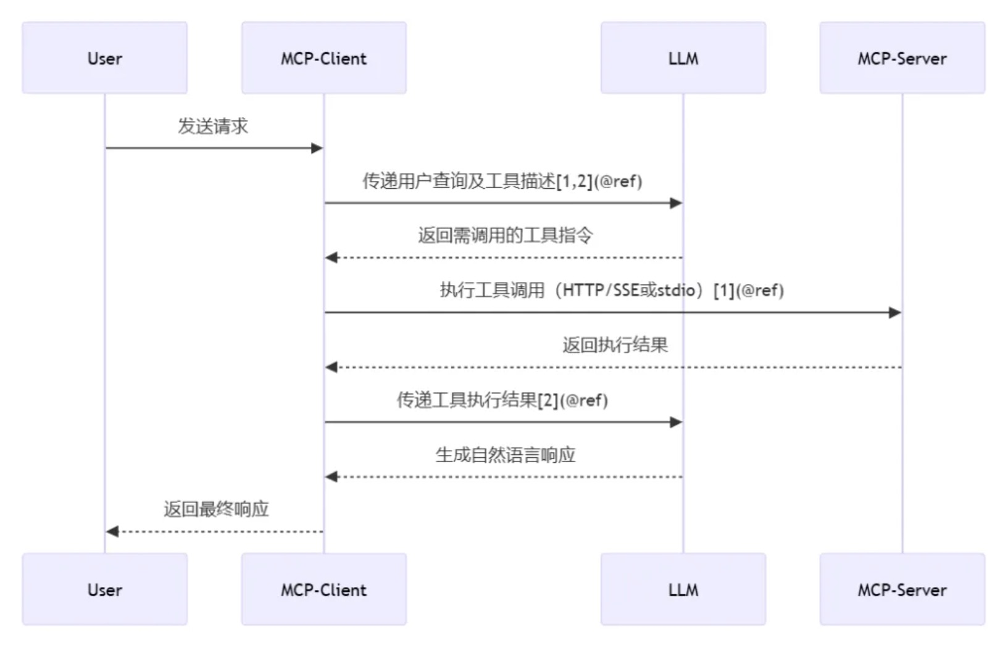
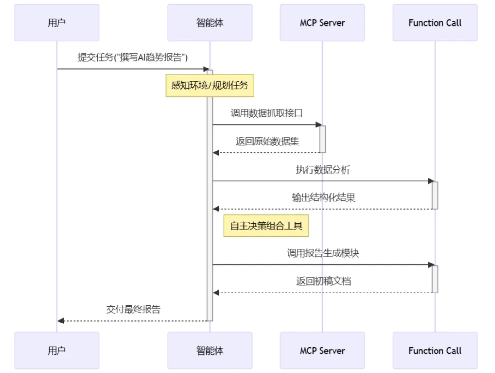
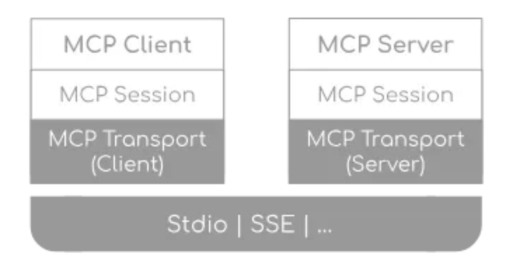

# **解析模型上下文协议（MCP）：LLM 与 Agent 之间的 RPC 协议**

---
*written by Alex Stocks on 2025/03/17，版权所有，无授权不得转载*

## **一、背景与定义：AI 互联互通**

随着大型语言模型（LLM）的广泛应用，为各行业带来了前所未有的机遇。OpenAI 发布了一个实时访问第三方应用的功能（Function call），为 ChatGPT 提供上下文（ChatGPT 升级为实时协作助手）。

### 1.1 Agents 智能体

LLM 工程的“三大关键”是：Prompt、RAG 和 Agent。

大型模型大大降低了智能体实现的门槛。编程助手很早就有，例如 Visual Studio 里的 Visual Assist X，但 Cursor 是 AI 时代的代码助手，AI Agent 发展过程将从 Chat 进化到 Composer，最后成为完整的 AI Agent：

* 1 AI Chat 只是提供建议，如何将 AI 的响应转化为行为和最终的结果完全依赖人类，例如手动复制粘贴或进行某些修改。
* 2 AI Composer 能自动修改代码，但仍需人类参与确认，且无法执行除了修改代码以外的其它操作。
* 3 AI Agent 是一个完全的自动化程序，未来能够做到自动读取 Figma 的图片、自动生成代码、自动读取日志、自动调试代码，甚至自动推送代码到 GitHub。

AI Agent 是一个智能系统，能够自主运行以实现特定目标。传统的 AI 聊天仅提供建议，或者需要手动执行任务；而 AI Agent 则可以分析具体情况、做出决策并自行采取行动。AI Agent 能利用 MCP 提供的功能描述来理解更多的上下文，并在各种平台和服务上自动执行任务。

自去年大模型的爆发以来，Agent 已经开始爆发，尤其是在 2025 年被称为“Agents 元年”。在国内人工智能领域，智能体（Agent）通常被翻译为智能体。目前，最广泛的应用场景仍然是在编程领域，代码助手如 Cursor 等非常受欢迎。

目前的大模型主要包括本文大模型和多模态大模型，能够生成文字、进行逻辑推理、编写代码、生成图片和视频等。


仅有这些模型基础能力尚不足以称之为智能体。智能体顾名思义，是一系列能力的集合体。在不同环境中，其能力也会有所不同。除了大模型的生成能力和逻辑推理能力外，再加上函数（工具）调用的能力，已经看到了智能体的雏形。智能体 = 大模型 + 工具集。

### 1.2 智能体模式

介绍两种相对简单的模式：串行 Workflow 模式和动态 Agents 模式。



Workflow模式: 初级智能体，此模式下智能体只能执行某些经过编排好的能力实现固定功能。



动态 Agents 模式：高级智能体，完全由智能体规划任务并决定如何执行任务，是否调用两个服务还是三个服务，取决于任务本身及其规划。

即使有了高级智能体，为什么仍然需要实现初级智能体呢？因为目前模型的意图识别、推理、规划能力还无法达到百分之百的可靠性。在这种情况下，越复杂的智能体可能意味着出错的概率越大。因此，使用简单且能够满足业务需求的初级智能体可能是更好的选择。

### 1.3 Agent 智能化的可行性与成本

目前，大型模型在理解和生成数据方面的可靠性并未达到 100%，因此许多畅想尚无法实现。在当前的技术水平下，智能体（Agents）处理越复杂的业务，出错的概率越高。例如，智能体查询数据可能没有问题，但如果涉及数据的增删改，则可能带来不可忽视的风险。除非能够避免错误或忽略这些错误，否则复杂任务的智能体可能难以实现。

为了提高可靠性，业内通常会在智能体中加入评估模块，如果评估分数低于某个阈值，则重新迭代某个或整个流程。然而，依然无法确保智能体的执行结果绝对正确。比如，编程助手智能体（如 Cursor）之所以受欢迎，部分原因是其容错性较高，后续调试和测试能够发现并修正错误。

智能体（Agents）的可靠性随步骤增多而下降。如果每个节点的可靠性是 90%，那么经过五个节点后，整体的可靠性将降至不到 60%（0.90 * 0.90 * 0.90 * 0.90 * 0.90 = 59%）。

由于可靠性问题，距离完全成熟的智能体可能还有一段距离。目前，智能体的基座大模型的可靠性仍然限制了智能体的应用。

### 1.4 Function Calling

OpenAI 提出的 Function Calling 是 MCP 的基础，可以理解为 Function Calling 等同于工具（tools）。大模型（LLM）能够理解工具的描述和参数要求，从一堆工具中选择一个或多个工具来解决用户的问题。



Function Calling 指的是 AI 模型根据上下文自动执行函数的机制，充当了 AI 模型与外部系统之间的桥梁。不同的 AI 模型平台有不同的实现方式，具体的代码集成方式也不同。如果我们使用 Function Calling，我们需要通过代码为 LLM 提供一组 functions，并清晰地定义函数描述、输入和输出，以便 LLM 能够基于这些结构化数据进行推理并执行相应函数。

```Python
# 示例：使用Function Call查询天气
functions = [
  {
    "name": "get_current_weather",
    "description": "获取指定城市的天气",
    "parameters": {
      "type": "object",
      "properties": {"location": {"type": "string"}},
      "required": ["location"]
    }
  }
]
```

Function Calling 适合处理边界清晰、描述明确的任务。

但 Function Calling 也有缺点，尤其是在处理多轮对话和复杂需求时。如果任务种类繁多，Function Calling 的代码可能变得难以维护。需要处理网络访问、权限控制、流程控制、错误处理、可靠性、版本更新等问题。例如，一个 AI 助手如果需要调用日历、邮件和数据库服务，开发者需要为每个服务编写认证、错误处理和上下文传递的逻辑。此外，针对不同的应用场景，可能还需要做定制化开发。

传统方案依赖点对点的 API 集成，导致开发效率低下、生态碎片化（每个数据源都需要独立开发接口）。OpenAI 随后提出了 GPTs 的概念。GPTs 类似于微信的小程序，其底层实现仍然基于 Function call，用户可以选择使用不同的 GPT。但问题在于，GPTs 只能在 OpenAI 平台上使用，在其他 LLM 平台上，还需要重新开发。这对开发者不方便，也不利于服务商的市场拓展。


MCP（Model Context Protocol） 应运而生，旨在解决大型语言模型（LLM）与外部数据、工具之间的集成难题。其核心目标是通过标准化协议，简化 LLM 与外部资源的交互，实现“一次集成，多次复用”，解决传统方案的 NxM 复杂度问题。MCP 旨在成为 AI 领域的“USB-C 接口”，统一连接各种工具和数据源。

MCP 发布后，AI 应用层的开发进入了一个新的时代。



MCP 可以在不同的应用和服务之间保持上下文，从而增强整体自主执行任务的能力。

## **二、技术架构：客户端-服务器模型的三层设计**

MCP基于**客户端-服务器架构**，支持灵活的本地与远程部署模式。



### 2.1 **Host（主机）**  



Host 承载 AI 交互环境的应用程序（如 IDE 工具 Cursor、Claude Desktop），负责运行 MCP 客户端并管理用户界面。作为 LLM 应用载体（如 Claude Desktop、智能 IDE），负责发起连接请求并聚合上下文。

示例：开发者通过 Cursor 发起代码生成请求，Host 调用 MCP 客户端，同时连接 GitHub 服务器（代码库）、Slack 服务器（通知）和数据库服务器。

### 2.2 **MCP Client（客户端）** 

MCP 将不同任务进行分层处理，每一层都提供特定的能力、描述和限制。MCP 客户端根据不同的任务判断，选择是否需要调用某个能力，然后通过每层的输入和输出，构建一个可以处理复杂、多步对话和统一上下文的 Agent。

 
 
Client 集成于 Host 中，负责将 AI 模型的请求转换为标准协议消息（基于 JSON-RPC 2.0），并与服务器建立双向通信。与 Server 保持 1:1 专用连接，处理协议协商、消息路由和权限管理。

支持的传输模式： 
 
 • **本地通信**：通过 stdio（标准输入输出） 实现进程间交互（如访问本地文件系统）  
 
  适用场景：
     ◦ 构建命令行工具
     ◦ 实现本地集成
     ◦ 需要简单的进程间通信
     ◦ 与 Shell 脚本协作

 • **远程通信**：基于 HTTP SSE/WebSocket 实现跨网络服务调用（如访问云端 API）
服务器发送事件（SSE：Server-Sent Events）SSE 传输通过 HTTP POST 实现客户端到服务器的通信，同时支持服务器到客户端的流式传输。 
  
  适用场景：
     ◦ 仅需要服务器到客户端的流式传输
     ◦ 在受限网络环境中工作
     ◦ 实现简单的更新机制
     
 • **自定义传输（Custom Transports）**：MCP 支持轻松实现自定义传输，以满足特定需求。任何传输实现只需符合 Transport 接口即可。 
 
 以下场景适用自定义传输：
     ◦ 自定义网络协议
     ◦ 专用通信通道
     ◦ 与现有系统集成
     ◦ 性能优化

		interface Transport {
			// Start processing messages
			start(): Promise<void>;
			
			// Send a JSON-RPC message
			send(message: JSONRPCMessage): Promise<void>;
			
			// Close the connection
			close(): Promise<void>;
			
			// Callbacks
			onclose: () => void;
			onerror: (error: Error) => void;
			onmessage: (message: JSONRPCMessage) => void;
		}

在 MCP 框架内，定义了一系列核心消息类型，这些类型被称为“原语”，它们用于规范客户端和服务器之间的交互 。这些原语可以分为服务器端原语和客户端原语。

客户端原语：

 - **Roots（根）**: 这些代表了宿主机文件系统或环境中的入口点。在获得适当的权限后，MCP 服务器可以访问这些根目录下的资源。虽然根资源（Roots）主要用于文件系统路径，但它们也可以是任何有效的 URI，包括 HTTP URL。

以下是一个典型的 MCP 客户端如何暴露根资源（Roots）的示例：

```Js
{
  "roots": [
    {
      "uri": "file:///home/user/projects/frontend",
      "name": "前端代码库"
    },
    {
      "uri": "https://api.example.com/v1",
      "name": "API 端点"
    }
  ]
}
```

该配置建议服务器同时关注本地代码库和一个 API 端点，并保持它们在逻辑上的独立性。

Client 通过 Roots 为服务器提供相关资源的边界，当 Roots 发生变化时通知服务器。根资源（Roots）只是提供信息，并无强制性，仅仅是建议 Server 遵守。

### 2.3 **MCP Server（服务器）**  



* Function Call 无强制协议，具体实现因平台而异，适用于任务简单且低延迟的场景，适合小型项目。例如，当用户询问“北京今天的天气如何”时，模型可以直接调用 get_weather() 函数获取结果。

* MCP Server 严格遵循 Model Context Protocol 标准，涉及多源数据整合，支持独立扩展，适合企业级应用。例如，企业可以将内部系统（CRM、ERP）封装为 MCP Server，供多个 Agent 安全调用。

* Agent 依赖于底层工具的协议规范，需要自主决策和多步执行，集成多种模块，适合大型复杂系统。例如，在客户服务场景中，Agent 可以自动监控用户反馈、分析问题并生成解决方案。

MCP 协议的核心在于 Server：MCP Server 是为了实现 AI Agent 的自动化而存在的，它是一个中间层，告诉 AI Agent 目前存在哪些服务，哪些 API，哪些数据源，AI Agent 可以根据 Server 提供的信息来决定是否调用某个服务，然后通过 Function Calling 来执行函数。

MCP Server 通过标准化协议公开特定功能，连接外部数据源（如数据库、API、文件系统），提供如下原语（标准化能力）： 

 - **Tools（工具）**：可执行函数（如发送邮件、运行代码、查询数据库）。  
 - **Resources（资源）**：访问结构化或非结构化数据（如实时行情、文档、数据库记录）。
 
   ◦ **Local Resources （本地资源）**：MCP 服务器可以安全访问的计算机资源（如数据库、文件、服务）。
   
   ◦ **Remote Resources （远程资源）**：MCP 服务器可以连接的通过互联网（如通过 API）可用的资源。  
 - **Prompts（提示模板）**：预定义任务模板或流程（如医疗诊断模板、代码审查规则），旨在指导 AI 模型完成特定的任务 。
 - **Sampling（采样）**: 这是一种特殊的机制，它允许 MCP 服务器请求宿主 AI 基于给定的提示生成文本完成。这个功能主要用于促进更复杂的多步骤推理过程。Anthropic 建议对任何采样请求都进行人工批准，以确保用户对 AI 的行为保持控制。

Sampling 就给了用户一个在执行工具的前后的接口，用户可以在工具执行前后来执行一些操作。比如，当调用本地文件的删除的工具的时候，肯定是期望用户确认后再进行删除。那么，此时就可以使用这个功能。

```Python
from mcp.server import FastMCP
from mcp.types import SamplingMessage, TextContent

app = FastMCP('file_server')

@app.tool()
async def delete_file(file_path: str):
    # 创建 SamplingMessage 用于触发 sampling callback 函数
    result = await app.get_context().session.create_message(
        messages=[
            SamplingMessage(
                role='user', content=TextContent(
                    type='text', text=f'是否要删除文件: {file_path} (Y)')
            )
        ],
        max_tokens=100
    )

    # 获取到 sampling callback 函数的返回值，并根据返回值进行处理
    if result.content.text == 'Y':
        return f'文件 {file_path} 已被删除！！'

if __name__ == '__main__':
    app.run(transport='stdio')

```

当前主要使用 Tools 和 Resources。

### 2.3.1 **Tools vs API**  

MCP Tools 与 传统的 API 以及 Function Calling 在设计理念、功能特性和使用方式上存在不同。传统的 API 通常通过一组预先定义好的、固定的端点来暴露其功能，客户端需要按照这些端点的特定结构进行交互 。相比之下，MCP Tools 包含了丰富的语义描述，详细说明了该工具的具体功能、每个参数的含义、预期的输出格式以及任何相关的约束和限制。这种自描述的特性使得 MCP 在很大程度上减少了对外部文档的依赖，可以简单认为 Tool = API + Doc。

从通信模式来看，传统的 API 通常采用简单的请求-响应模式，而 MCP 则是一个持续的、双向的对话过程 。它允许 AI 模型请求数据或执行操作，还能够动态地接收来自外部工具的更新，而无需客户端不断地发送新的请求 。这种持久的、实时的双向通信能力，类似于 WebSockets，使得 MCP 更适合构建需要保持状态和实时交互的 AI 应用。

| 特性 | MCP Tools | API | 
| :--- | :--- | :--- | 
|  定义	|  AI 交互的标准化协议| 预定义的固定端点集合 | 
| 工具定义 | 带有元数据的自描述工具  | 具有固定结构的固定端点  |
| 通信 | 有状态，双向，实时  |  无状态，请求-响应 | 
| 上下文处理 | 增强的上下文感知和管理  | 有限的上下文管理  |
| 互操作性 | 模型无关，旨在成为通用标准  | 通常特定于某个服务或平台  | 
| 灵活性 | 动态工具发现和适应  | 需要更新客户端以适应变化  |  
| 安全性 | 内置机制，服务器控制资源  |  依赖 API 密钥管理  |  

### 2.4 **Transportation（通信）**  


MCP 的基本工作流程：
• 初始化连接：客户端向服务器发送连接请求，建立通信通道。
• 发送请求：客户端根据需求构建请求消息，并发送给服务器。 
• 处理请求：服务器接收到请求后，解析请求内容，执行相应的操作（如查询数据库、读取文件等）。
• 返回结果：服务器将处理结果封装成响应消息，发送回客户端。 
• 断开连接：任务完成后，客户端可以主动关闭连接或等待服务器超时关闭。



传输是模型上下文协议（MCP）的核心组件之一，为客户端和服务器之间的通信提供基础。传输机制负责处理消息的发送和接收的底层逻辑。

#### 2.4.1 消息类型（Message types）

MCP 定义了以下主要消息类型：

   • 请求（Request）：需要另一方提供响应

	interface Request {
		method: string;
		params: { … };
	}

   • 通知（Notification）：单向消息，不需要响应

	interface Notification {
		method: string;
		params: { … };
	}

   • 结果（Result）：成功响应请求的消息

	interface Result {
		[key: string]: unknown;
	}

   • 错误（Error）：表示请求失败的消息

	interface Error {
		code: number;
		message: string;
		data: unknown;
	}

#### 2.4.2 通信协议

MCP 使用 JSON-RPC 2.0 作为传输格式，旨在规范支持模型、资源、工具等多种交互，具体的规范请参考：https://github.com/modelcontextprotocol/specification。传输层负责将 MCP 协议消息转换为 JSON-RPC 格式进行传输，并将接收到的 JSON-RPC 消息还原为 MCP 协议消息。

JSON-RPC 协议定义了请求和响应的结构。在一次典型的交互中，客户端会发送请求给语言服务器，例如请求代码补全建议，而语言服务器则根据请求返回执行结果或错误信息。基于轻量级 JSON 数据格式的通信方式，不仅使协议实现简单高效，还能适配多种开发环境：

   • 无状态：每个请求都是独立的，不依赖于先前的交互。
   • 轻量级：协议简单，使用 JSON 格式，易于解析和实现。
   • 传输灵活：可以通过 HTTP、WebSocket 或其他传输协议实现。
   • 双向通信：支持服务器向客户端发送通知（没有响应的请求）。

JSON-RPC 使用三种类型的消息：

**请求消息（Requests）**

    jsonrpc：协议版本号（目前固定为 2.0）。
    method：要调用的方法名称。
    params：调用方法所需的参数（可以是数组或对象）。
    id：唯一标识请求的 ID，用于匹配响应。
   
代码示例：

	{
		jsonrpc: “2.0”,
		id: number | string,
		method: string,
		params: object
	}

**响应消息（Responses）**

	• jsonrpc：协议版本号。
	• result：请求成功时返回的结果。
	• error：请求失败时返回的错误对象，包含错误码和错误信息。
	• id：对应请求的 ID，用于区分多个响应。

代码示例：

	{
		jsonrpc: “2.0”,
		id: number | string,
		result: object,
		error: {
			code: number,
			message: string,
			data: unknown
		}
	}

**通知消息（Notifications）**

	{
		jsonrpc: “2.0”,
		method: string,
		params: object
	}

以下是一个使用 JSON-RPC 进行交互的完整示例：

客户端发送请求

	{
		“jsonrpc”: “2.0”,
		“method”: “add”,
		“params”: [5, 3],
		“id”: 1
	}

服务器成功响应

	{
		“jsonrpc”: “2.0”,
		“result”: 8,
		“id”: 1
	}

服务器错误响应：如果请求的方法不存在或参数错误，返回以下结构

	{
		“jsonrpc”: “2.0”,
		“error”: {
			“code”: -32601,
			“message”: “Method not found”
		},
		“id”: 1
	}

#### 2.4.3 错误处理（Error Handling）

传输实现需要处理各种错误场景，包括：
• 连接错误（Connection errors）
• 消息解析错误（Message parsing errors）
• 协议错误（Protocol errors）
• 网络超时（Network timeouts）
• 资源清理（Resource cleanup）

通过设计健壮的错误处理机制，可以确保传输的稳定性和可靠性。

### 2.5 工程实践

根据 MCP 协议的定义，它是一个客户端-服务端模型，客户端通过请求使用服务端提供的工具、资源和提示词。这里我们先编写 Server 端 Demo，然后再编写 Client 端，使用 Client 调用 Server 端。

> Server

在下面的 Server Demo 中，我们定义了一个 Tool、一个 Resource 和一个 Prompt。

```Python
# -*- coding: utf-8 -*-
from codecs import encode
import logging
from typing import Any
import asyncio
import httpx
from mcp.server.models import InitializationOptions
import mcp.types as types
from mcp.server import NotificationOptions, Server
import mcp.server.stdio
from pydantic import AnyUrl


server = Server("demo")
@server.list_prompts()
async def handle_list_prompts() -> list[types.Prompt]:
    """
    提示模版定义
    """
    return [
        types.Prompt(
            name="example-prompt",
            description="An example prompt template",
            arguments=[
                types.PromptArgument(
                    name="arg1",
                    description="Example argument",
                    required=True
                )
            ]
        )
    ]

@server.get_prompt()
async def handle_get_prompt(
    name: str,
    arguments: dict[str, str] | None
) -> types.GetPromptResult:
    """
    提示模板处理
    """
    if name != "example-prompt":
        raise ValueError(f"Unknown prompt: {name}")

    return types.GetPromptResult(
        description="Example prompt",
        messages=[
            types.PromptMessage(
                role="user",
                content=types.TextContent(
                    type="text",
                    text="Example prompt text"
                )
            )
        ]
    )

@server.list_resources()
async def list_resources() -> list[types.Resource]:
    """
    资源定义
    """
    test='test.txt'
    return [
        types.Resource(
            uri=AnyUrl(f"file:///{test}.txt"),
            name=test,
            description=f"A sample text resource named {test}",
            mimeType="text/plain",
        )
        # for name in SAMPLE_RESOURCES.keys()
    ]

@server.read_resource()
async def read_resource(uri: AnyUrl) -> str | bytes:
    assert uri.path is not None
    name = uri.path.replace(".txt", "").lstrip("/")

    if name not in SAMPLE_RESOURCES:
        raise ValueError(f"Unknown resource: {uri}")

    return SAMPLE_RESOURCES[name]

@server.list_tools()
async def handle_list_tools() -> list[types.Tool]:
    """
    工具定义.
    每个工具都使用JSON Schema验证指定其参数.
    """
    return [
        types.Tool(
            name="demo-tool",
            description="Get data tool for a param",
            inputSchema={
                "type": "object",
                "properties": {
                    "param": {
                        "type": "string",
                        "description": "url",
                    },
                },
                "required": ["param"],
            },
        )
    ]

@server.call_tool()
async def handle_call_tool(
    name: str, arguments: dict | None
) -> list[Any]:
    logging.info(name)
    """
    处理工具调用
    """
    if not arguments:
        raise ValueError("Missing arguments")
    if name == "demo-tool":
        param = arguments.get("param")
        if not param:
            raise ValueError("Missing state parameter")
        param = param.upper()
        return [
            types.TextContent(
                type="text",
                text=f"text:{param}"
            )
        ]
    else:
        raise ValueError(f"Unknown tool: {name}")

async def main():
    from anyio.streams.text import TextStream
    # Run the server using stdin/stdout streams
    async with mcp.server.stdio.stdio_server() as (read_stream, write_stream):
        await server.run(
            read_stream,
            write_stream,
            InitializationOptions(
                server_name="demo-server",
                server_version="0.1.0",
                capabilities=server.get_capabilities(
                    notification_options=NotificationOptions(),
                    experimental_capabilities={},
                ),
            ),
        )

if __name__ == "__main__":
	asyncio.run(main())
```

> Client

Client 端的实现主要是与 Server 建立连接，并调用 Server 提供的各种资源。客户端需要根据 Server 支持的方式建立连接，如果是 stdio 模式，就需要建立 stdio 模式连接，否则需要建立 SSE 连接。


```Python
async def demo(config):
    server_params = StdioServerParameters(
                command=shutil.which("npx") if config['command'] == "npx" else config['command'],
                args=config['args'],
                env={**os.environ, **config['env']} if config.get('env') else None
            )
    try:
        print('demo')
        stdio_context = stdio_client(server_params)
        read, write = await stdio_context.__aenter__()
        session = ClientSession(read, write)
        await session.__aenter__()
        capabilities = await session.initialize()
        tools_response =await session.list_tools()
        resources=await session.list_resources()
        tools = []
        for item in tools_response:
            if isinstance(item, tuple) and item[0] == 'tools':
                for tool in item[1]:
                    tools.append(tool)
        params={}
        params[tools[0].inputSchema['required'][0]]='测试参数';
        result =await session.call_tool(tools[0].name,params)
        print(result)
        await stdio_context.__aexit__(None, None, None)
    except Exception as e:
        print(e)

if __name__=="__main__":
    asyncio.run(demo({'command':'python','args':['server_demo.py']}))
```

> MCP Inspector

MCP 提供了 [MCP Inspector](https://github.com/modelcontextprotocol/inspector) 用于调试与测试 MCP Server，使得 Server 开发更加方便。

使用 Node.js 启动 Inspector 程序，启动后可以在浏览器访问 http://localhost:5173 查看。可以在其中查看 MCP Server 提供的各种服务，如 Tools、Resources、Prompts 等，以及调用 Tools 服务。

```Js
npx @modelcontextprotocol/inspector
```


---

## **三、核心优势：为何 MCP 引发技术浪潮？** 

为推动开发者快速上手，MCP 开源了以下三大核心工具：

- **MCP 规范及 SDK**：帮助开发者轻松理解和实现协议功能。
  - **MCP 官网**：[https://modelcontextprotocol.io](https://modelcontextprotocol.io)
  - **MCP 快速入门**：[https://modelcontextprotocol.io/quickstart/server](https://modelcontextprotocol.io/quickstart/server)
  - **MCP GitHub**：[https://github.com/modelcontextprotocol](https://github.com/modelcontextprotocol)
  - **MCP 服务器库**：[https://github.com/modelcontextprotocol/servers](https://github.com/modelcontextprotocol/servers)
  - **Awesome MCP Servers**：[https://github.com/appcypher/awesome-mcp-servers](https://github.com/appcypher/awesome-mcp-servers)

- **本机 MCP 服务支持**：通过 Claude 桌面应用快速实现本地化数据连接，应用安装链接：[https://claude.ai/download](https://claude.ai/download)。

- **开源服务代码库**：包含 Google Drive、Slack、GitHub 等流行系统的预构建实现，便于直接部署和测试。访问链接：[https://github.com/modelcontextprotocol/servers](https://github.com/modelcontextprotocol/servers)。

它使得开发变得更简单，实现一次编写、多次集成，无需为每个新集成重写定制代码。同时，它具备更强的灵活性，切换 AI 模型或工具时无需复杂的重新配置。此外，MCP 连接保持活跃状态，能够满足实时上下文更新和交互的需求。内置的访问控制机制和标准化安全实践为数据交互提供了可靠保障。随着 AI 生态系统的扩展，只需连接新的 MCP 服务器即可轻松添加新功能。

### 3.1 **动态发现与灵活集成**

MCP 协议支持服务器和客户端的能力协商，这意味着双方在通信开始时可以交换各自支持的功能和协议版本。  
这种机制使得 LLMs 能够根据外部系统的能力动态调整交互方式，实现了更灵活的交互。

客户端可自动发现可用服务器及服务列表，无需预定义接口，支持即插即用。例如，AI 助手在新增 Slack 集成时，无需修改核心代码，仅需连接对应的 MCP 服务器。

### 3.2 **集成效率与性能优化**

连接 AI 模型与各种数据源通常需要为每个数据源编写定制化的代码，这不仅耗时，而且容易出错 。这种为连接 M 个不同的 LLM 和 N 个不同的工具而产生的 “MxN” 问题。MCP 将传统 M×N 的集成复杂度降为 M+N（M 个 LLM 模型接入 + N 个工具 Server 实现） 模式，适配成本降低 70% 以上。

轻量化协议头（占比 < 5%），支持消息压缩与容错机制（如断点续传），减少通信开销。

预构建服务器生态（如 GitHub、PostgreSQL 等）实现“开箱即用”。

### 3.3 **双向实时通信**

MCP 连接是状态化的，允许在连接的生命周期内进行多次请求和响应，这对于维护对话上下文和执行复杂任务非常重要。

支持 WebSocket 级实时通信，支持模型与服务器间的动态交互。

**案例1**：医疗 Agent 通过 MCP 持续监测患者生命体征数据并实时调整诊疗方案。

**案例2**：LLM 可实时获取数据库更新并触发后续操作（如生成报告后自动发送邮件）。 

### 3.4 **安全与合规性**

MCP 协议强调数据安全，所有数据访问都在用户本地执行，并需要明确授权，确保数据不会被不当访问或泄露。

**权限分级控制**：内置端到端加密、权限分级和审计日志，确保数据访问可控。敏感数据仅通过本地 Server 访问，避免向 LLM 提供商暴露密钥。例如，医疗服务器可限制模型仅访问脱敏病历。

**操作审计**：所有工具调用需经用户授权，并记录完整日志。

### 3.5 **跨平台兼容性**

支持 Python、TypeScript 等多语言 SDK，适配异构系统（本地/云端/容器化环境）。

**企业案例**：某金融公司通过 MCP 统一对接内部 CRM、风控系统和区块链平台。
      
---

## **四、典型应用场景：从代码助手到企业级自动化**

### 4.1 **智能开发助手**

可以实现个性化对话体验、专业领域问答和多轮对话管理。

**案例**：用户通过 Slack 提交功能需求，Cursor 自动调用 MCP 服务器连接 GitHub/Gitlab、Slack 和测试工具，生成代码并提交 Pull Request，全流程无需人工干预。

动态分析代码库架构，结合项目规范生成代码片段（通过 GitHub MCP 服务器）。通过集成 Git 和 GitHub/GitLab MCP 服务器，Claude 可以管理代码仓库，执行代码提交、创建分支、创建拉取请求等操作 。例如，用户可以指示 Claude 创建一个新的 GitHub 仓库，并将一个 HTML 文件推送到主分支 。与代码仓库的集成使得 AI 成为软件开发工作流程中一个非常有价值的工具，能够自动化代码管理和代码审查等任务。

实时检测安全漏洞并推荐修复方案（集成静态分析工具）。

### 4.2 **跨领域医疗诊断**

**流程**：LLM 通过 MCP 集成影像分析模型（CNN）、电子病历数据库和医学文献库，综合生成诊断建议。例如，结合 CT 影像与患者病史，准确率提升 15%。

### 4.3 **金融实时分析**

用于构建知识管理平台和决策支持系统。

**实现**：MCP 服务器对接股票行情 API 和内部风控模型，LLM 生成实时投资报告，并自动触发交易指令（需合规审批）。

### 4.4 **智能测试与运维**

**端到端测试**：Agent 调用 Puppeteer Server 自动执行网页操作并生成测试报告。

**故障诊断**：实时分析服务器日志，自动触发扩容或告警。

### 4.5 **跨平台工作流自动化**

**会议助理**：自动读取日历 → 生成纪要 → 通过 Slack 发送给参会者（联动 3 个 Server）。

**电商运营**：分析销售数据 → 触发库存补货 API → 生成营销文案。

### 4.6 **隐私敏感场景**

**医疗数据处理**：本地 Server 对接医院数据库，模型在隔离环境中分析患者记录。

数据库交互是 MCP 的一个重要应用领域。通过 PostgreSQL 和 SQLite MCP 服务器，Agent 能够查询和更新数据库中的数据 。例如，开发者可以要求 Agent 查询电影数据库的结构模式，或者检索特定电影的详细信息。数据库集成使得 AI 能够访问和分析结构化数据，从而可以通过自然语言实现数据分析和报告等应用。这项功能使得 AI 成为处理数据的更强大的工具。

**法律文档审查**：仅授权访问特定案例库，确保合规性。

---

## **五、未来趋势：协议生态的进化方向**

### 1. **现存挑战**

**协议碎片化风险**：尽管 MCP 开源，但不同厂商的扩展实现可能导致兼容性问题，主流 LLM 厂商（如 Anthropic、OpenAI）可能通过生态优势形成事实标准，挤压中小开发者空间。
**安全边界**：恶意 Server 可能成为攻击入口（需强化沙箱机制）。
**性能瓶颈**：大规模工具调用可能增加响应延迟（需优化通信协议）。
**性能与安全权衡**：加密和权限校验可能增加延迟（实测隐私保护模式下延迟上升 8%）。引入流式传输和缓存机制，降低高并发场景的延迟。
**多模态支持**：从文本扩展至图像/音频交互（如通过 MCP 连接医学影像系统）。

### 2. **未来方向**

**边缘计算支持**：优化低带宽环境下的通信效率，适应物联网和工业场景。

**标准化组织**：成立行业联盟制定协议扩展规范（如权限控制标准）。

**开源生态扩展**：社区已构建超 1100 个 MCP 服务器（如 Composio 支持 15,000+ API 操作），未来可能形成类似 HTTP 的通用协议。开发者共享 Server 插件（类似“MCP 应用商店”）。

**多模态增强**：集成图像、语音等非文本数据，提升复杂任务处理能力。

**智能水平提升**：未来的 MCP 协议可能会引入更高级的智能化功能，如自动化能力协商、智能数据路由等。

**链上集成**：结合区块链实现不可篡改的操作审计。

**混合云部署**：通过 MCP 桥接公有云模型与私有化数据中台。

---

## **六、总结**

MCP 协议通过标准化交互框架，正推动其成为 AI 领域的“HTTP 协议”，将 LLM 从“被动应答者”升级为“主动执行者”，解决了传统 AI 集成的碎片化问题，促进了多模型协同和上下文感知。


MCP 的价值不仅体现在技术优化，更在于推动 AI 生态从“模型中心化”向“任务分布化”演进。它将在 AI Agent 时代扮演越来越重要的角色，成为连接 AI 与外部数据资源的标准桥梁。随着开源社区和行业应用的深化，MCP 有望成为智能体时代的核心基础设施，释放 AI 在垂直领域的无限潜力。

## 参考文档 ##
---

- 1 [模型上下文协议MCP](https://www.cnblogs.com/softlin/p/18624966)
- 2 [一文揭秘MCP Server、Function Call与Agent的核心区别](https://mp.weixin.qq.com/s/GhxTft6ccDLpqhJb0sKrzw)
- 3 [AI Agents(智能体)是什么能做什么](https://www.cnblogs.com/softlin/p/18669191)
- 4 [7000字详解火爆全网的Claude 模型上下文协议 (MCP)](https://mp.weixin.qq.com/s/cgZoVD0WgmT03VcHlo10dg)
- 5 [Model Context Protocol(MCP) 编程极速入门](https://zhuanlan.zhihu.com/p/27463359194)

## Payment


<div>
<table>
  <tbody>
  <tr></tr>
    <tr>
      <td align="center"  valign="middle">
        <a href="" target="_blank">
          
        </a>
      </td>
      <td align="center"  valign="middle">
        <a href="" target="_blank">
          
        </a>
   </tbody>
</table>
</div>

## Timeline ##

> 2025/03/17，于雨氏，初作此文于朝阳金辉。

