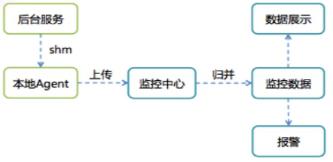

## 一套完备的实时监控告警系统实现
---
*written by Alex Stocks on 2018/11/17，版权所有，无授权不得转载*

### 0 缘起

据说 `现代医学即始于听诊器的发明`【见[参考文档1](https://baike.baidu.com/item/%E5%90%AC%E8%AF%8A%E5%99%A8)】,医生借助此器物得以 `收集和放大从心脏、肺部、动脉、静脉和其他内脏器官处发出的声音`见[参考文档1](https://baike.baidu.com/item/%E5%90%AC%E8%AF%8A%E5%99%A8)】.

一个摆脱了手工作坊时代的可称之为近代化的互联网公司，如果想对自己的后台服务以及各个用户的客户端的运行情况了如指掌，大概也需要自己的 “听诊器”：分布式实时监控告警系统、分布式日志收集系统和分布式链路追踪系统。实时监控告警系统用于获取当前服务端的运行情况，当某服务的某个指标波动超过正常阈值时进行警报提示，以及时止损。借助日志收集系统可以获取某个事故的上下文环境，以明晰问题所在。链路追踪系统则可以跟踪一次服务流程的完整过程，可以帮助分析影响服务质量的瓶颈所在。

愚人刚入职当前公司的时候，这三套设施近乎于无。去年（2017年）在公司做了一套消息系统时，顺便基于 Flume/Kafka/Elastisearch 搭建了一套建议的日志追踪系统，直到昨晚为止相关业务方自己流程出问题时还在借助这套系统提供的消息日志对自己服务的问题进行分析，监控系统则是用自己实现的消息发送和接收两个 Robot 对各个消息子链路的消息时延进行追踪计算后汇总到微信中进行人工监控。此后便借助公司的各种机缘逐步搭建了监控告警系统和日志收集系统。

闲话休说，言归正传。去年（2017年） 12 月份某同事给聊天室上线了某新功能后便去休假了，翌日便有聊天室用户反馈收不到消息，估计这位同事此时正在火车上欣赏窗外祖国的大好河山，由于手机联网能力太差无法及时处理，留守公司的同事也无法根据线上日志追查到底是那台服务进程发生了故障，最终的解决方法是把 70 多个服务进程逐一重启以恢复服务。此事大概稍微引起了公司领导对基础设施的重视，可能想起来鄙人以前一直叨叨要有这样一套系统，便嘱托鄙人有时间研究下。可能是这种事故太多领导已经麻木了，也可能是因为工作繁忙此事此后便不再提及了。

系统就这么继续 “安稳” 地继续运行了俩月，一个总监忙着设计了一套完全与现有服务端架构不兼容的 “新架构”，待图片绘就和文字码完后，打算给小弟们分配相关开发任务。清晰地记得2018年1月底一个周六下午，两个服务端总监【高级总监和总监】招呼愚人开会，而后大概 15 分钟内滔滔不绝地说了当前架构的各种不足以及新架构的各种牛逼之处，在第 15 分钟时 CTO 冲进会议室，愠怒道某服务又挂了，此后俩总监跑出去商量对策。鄙人便又在会议室待了大概二十分钟后，俩总监垂头丧气地回来说是不知道服务问题到底出在何处，只好重启了事，其中一位便发话道：你赶紧把监控系统做了吧！

所谓大人一语便是口含天宪，愚人便带着几个同事开发了本文所述的监控告警系统。然此一句话可谓是 “草蛇灰线伏笔千里”，此后监控告警系统一直被理解为 “监控” 系统，后边上线后被当做 “示波器” 一类的玩具，当做心电图看看。

### 1 腾讯 SNG 的监控告警系统

诚如武器有 “苏式” 和 “欧美式”，监控系统也有很多风格地实现，国内业界数的着的大公司各家成长路线不一样，对同一系统的实现风格也不一样。不仅各大公司的技术实现路线不一样，即使同一个公司内不同事业群的技术实现路线也不一样，正如 [参考文档2](http://www.cnblogs.com/hujiapeng/p/6235761.html) 中一句话：`每个事业群均根据自身特性自主研发了多套监控系统，以满足自身特定业务场景的监控需求，如广告的GoldenEye、菜鸟的棱镜、阿里云的天基、蚂蚁的金融云（基于XFlush）、中间件的EagleEye等，这些监控系统均有各自的使用场景。`。

阿里如此，腾讯也不例外。[参考文档3](https://www.infoq.cn/article/the-road-of-the-growth-weixin-background) 给出了微信刚起家时的监控系统的实现：

```
1.申请日志上报资源；
2.在业务逻辑中加入日志上报点，日志会被每台机器上的agent收集并上传到统计中心；
3.开发统计代码；
4.实现统计监控页面。
```

这种套路的系统的缺点，[参考文档3](http://www.cnblogs.com/hujiapeng/p/6235761.html) 文中有道是：`这种费时费力的模式会反过来降低开发人员对加入业务监控的积极性，每次故障后，是由 QA 牵头出一份故障报告，着重点是对故障影响的评估和故障定级`，此文稍后便提及 `出乎意料地简单且强大的公司内的标杆——即通后台（QQ 后台）` 的监控告警系统：



这套称之为 `基于 ID-Value 的监控告警体系` 的实现思路非常简单，客户端 SDK 仅提供了 2 个 API。经个人搜索，在淘宝的开源代码平台上搜出来的如下腾讯代码即为腾讯内部 API 接口的头文件：

```C++
// http://code.taobao.org/p/rockysmarthome/diff/2/trunk/smarthome/EHNetwork/svrlibindevelop/include/utility/attrapi.h
#ifndef ATTR_API_H
#define ATTR_API_H

/**
 * <p>提供监控打点的API，其共享内存地址为0x5FEB，一台机器上监控打点的属性个数最多为1000个</p>
 * <p>20011-11 修改</p>
 * @author  joepi
 */
#define MAX_ATTR_NODE		1000
#define VERSION			"1.1(增加版本信息与取值 )"

typedef struct
{
	int iUse;
	int iAttrID;
	int iCurValue;
} AttrNode;

typedef struct
{
	AttrNode astNode[MAX_ATTR_NODE];
} AttrList;

/**
 * 累加属性所对应的值
 * @param attr 属性值
 * @iValue 属性对应的累加值
 * @return 0 成功 -1失败，失败的原因是本机器上打点的属性个数超过了1000
 */
int Attr_API(int attr,int iValue);//iValue为累加值

/**
 * 直接设置属性所对应的值
 * @param attr 监控打点的属性值
 * @iValue 属性对应的值
 * @return 0 成功 -1失败，失败的原因是本机器上打点的属性个数超过了1000
 */
int Attr_API_Set(int attr,int iValue);

/**
 * 得到监控打点属性所对应的值
 * @param attr 监控打点的属性
 * @param iValue 如果属性存在，或者属性不存在（此时认为值为0），但是新分配成功，值将赋值给iValue
 * @return 0 属性找到了, 1属性没找到但是新分配了 -1属性没找到并且也没有新分配成功
 */
int Get_Attr_Value(int attr,int *iValue);//获得属性ID为attr的值，如果不存在返回-1,存在返回0并附给iValue;
int Attr_API_Get(int attr,int *iValue);//获得属性ID为attr的值，如果不存在返回-1,存在返回0并附给iValue;

#endif
```

上面代码中最重要的两个接口分别是 `Attr_API` 和 `Attr_API_Set`，分别称之为 `累加属性值上报` 和 `设置属性值上报`。最经常使用的是  `累加属性值上报` ，其意义也非常明了：如果监控系统的实时时间单位是分钟级，则把每分钟内对此 ATTR 上报的所有值进行累加，而后作为分钟时刻的监控值。 `设置属性值上报` 的意义则是：以每分钟内第一个上报值作为此分钟时刻的上报值，其使用主要集中在一些统计采样分析任务场景下。

这套系统的工作流程如下：

```
- 1 申请者在操作后台（可以称之为 Console）上提供一段字符串描述后，Console 为这个文字描述分配一个数值作为其 ID，同时配置好告警条件；
- 2 申请者在要被监控的业务流程代码中调用监控 API，在上面代码中 @attr 字段填充为 Console 分配的 ID，把 @iValue 设置为上报值（Attr_API 中这个值一般设置为 1）；
- 3 系统运行时 SDK 会在申请者推设置的两个参数值外再添加上机器 host 和精确到纳秒的当前时刻值以及其他上下文信息后写入一个基于共享内存实现的环形队列；
- 4 每台机器上的 Agent 定时将所有 ID-Value 上报到监控中心；
- 5 监控中心对数据汇总入库后就可以通过统一的监控页面输出监控曲线；
- 6 监控中心通过预先配置的监控规则产生报警。
```

上面流程道出了监控系统的两大用途：以图形曲线显示系统运行情况，对服务进行报警。[参考文档3](http://www.cnblogs.com/hujiapeng/p/6235761.html) 指出了这套系统的进一步使用：`在少量灰度阶段就能直接通过监控曲线了解业务是否符合预期`。

### 2 一套分钟级监控告警系统

诚所谓“筚路蓝缕，以启山林”，QQ 的系统作为前辈在前面树立了标杆，吾辈参照其原理实现一套类似的系统就是了。

愚人去年通过公开渠道搜集了这套系统的相关资料进行理解后，便自己设计了一套类似系统的架构实现，当项目立项开工时相关准备工作已经完成，最后在农历2018年新年前夕共用三周时间便完成了系统的原型开发。

#### 2.1 总体架构

[参考文档1](https://baike.baidu.com/item/%E5%90%AC%E8%AF%8A%E5%99%A8) 中描述 `听诊器由听诊头、导音管、耳挂组成`，听诊器与医生构成了一套器人复合诊断系统。其实告警监控系统（下文称之为 Monitor）与这个复合体基本无差，其由数据采集节点(Client)、监控代理(Agent)、数据传输节点(Proxy)、计算中心(Judger)、存储节点(Database)、展示中心(Dashboard)、控制中心(Console)、告警中心(Alarm)和注册中心(Registry)等部分构成。

本系统考虑到公司业务跨 IDC 特点，其总体架构如下：


#### 2.2 子模块介绍

下面分别依据介绍各个子模块的功能。

- 1 Client 是上报数据流的源头，通过调用 Monitor SDK 代码预埋监控点，在程序运行时上报数据到本机的 Agent。

> 注：Client 是服务端的服务节点，因为其调用了 Monitor 的服务，故而称之为 Client，不要与常用的 APP 引用混淆。

- 2 Agent 从 SHM 队列中接收 Client 上报数据，进行规整后定时上报给监控中心，如果 Agent 在监控中心所在的 IDC 的 Proxy。
- 3 Proxy 是数据传输通道，从 Agent 或者外部 IDC 的 Proxy 传输来的监控流量包，把数据传输给 Calculator。

	> 注：Proxy有两种工作模式：工作的计算节点所在 IDC（称之为 Monitor Center）的 Bonnie 和工作在所有业务机房的 Clyde，二者都是跨 IDC 的 Monitor 系统的数据传输代理，本身无状态。每个 IDC 的 Clyde 群集向自己所在机房的 Registry 注册，然后每个服务节点的 Agent 采用随机的路由策略把监控数据网络包发给某个固定的 Clyde 节点
 
- 4 Registry 是一个分布式的注册中心，提供服务注册、服务发现和服务通知服务，实际采用当下被广泛使用的 Zookeeper，每个 IDC 单独部署一套 Registry，Proxy/Judger 都需要按照约定的schema规则向Registry注册。
- 5 Judger 是 Monitor 系统的中枢所在，对上报的原始数据进行第一次加工然后存入本地 DB，并根据预设的规则进行告警判断。

	> Judger 存储一段时间内的监控数据，最终各种计算结果存入 Database 中，所以其是弱状态的服务节点，所有 Service 的监控数据都会从Proxy 集中路由到某个固定的 Judger，Service 与 Judger 之间的映射关系可在 Console 上设定，并存入 Database 和 Registry 中。

- 6 Database 作为归并计算后的监控数据的最终目的地，本系统使用 Elasticsearch/InfluxDB/Mysql 多种开源组件。在 Mysql 中存储告警参数以及告警结果，在 InfluxDB 中存储归并后的结果，归并前的原始结果则在 Elasticsearch 中落地。

	> 注：本系统把告警原始结果存储 Elasticsearch 中是合适的，因为公司体量并不大，Monitor 把所有的原始上报结果以 day 为单位汇总存入一个 Elasticsearch index。如果数据量非常大，可以考虑存入 HDFS。

- 7 Console 用于设定 Monitor 的告警规则，并把相应规则存入Mysql alarm table中。
- 8 Dashboard 用于用于展示从某个维度加工后的监控数据，本系统采用 Grafana 作为展示 Panel。
- 9 Alarm 顾名思义就是 Monitor 的告警系统，它依据 Judger 处理的告警判断结果，把告警内容以短信、邮件等形式推送给相关人员。

Monitor 作为一个业务告警监控系统，其自身的运行 Metrics 亦须予以收集，以防止因为其自身故障引起误报警。Agent/Proxy/Judger 定时地把自身的 qps、监控数据量等参数设定在 MySQL monitor db 里，Console 可以查看到这些 metrics 数据。运维人员可以在 Console 中设定一些规则对 Monitor 进行监控，其定时地汇总出一个 Monitor 运行报表通过邮件方式通知相关人员。Consle 还需要监控 Registry 中各个 Schema 路径，当某个 Monitor 系统节点宕机时发出最高级别的告警。Console 相当于 Monitor 系统的监控者。

### 3 详细设计实现

第二章介绍了 Monitor 系统的总体设计，下面分章节详述愚人的架构方案。

#### 3.1 Console

Console用于告警参数设置以及新服务上线时候通知某server负责即可。
Monitor Console与Server之并不用直接数据通信，相关数据交互发生在MySQL层。Monitor Server须定时从MySQL加载新配置的数据。
整个Console的实现借鉴我以往使用的一套用Java Web开发的系统，功能列表如下：
- 1 实现多用户权限控制；
- 2 实现告警参数设置；
- 3 实现告警结果查收；
- 4 实现服务上线管理；

#### 3.2 SDK

#### 3.3 Agent

#### 3.4 Clyde & Bonie

#### 3.5 Judger

#### 3.6 Kafka & Kafka Connector

#### 3.7 InfluxDB Cluster

#### 3.8 Dashboard

## 参考文档

- 1 [听诊器](https://baike.baidu.com/item/%E5%90%AC%E8%AF%8A%E5%99%A8)
- 2 [1.1 万亿交易量级下的秒级监控](http://www.cnblogs.com/hujiapeng/p/6235761.html)
- 2 [从无到有：微信后台系统的演进之路](https://www.infoq.cn/article/the-road-of-the-growth-weixin-background)


## 扒粪者-于雨氏

> 2018/11/17，于雨氏，初作此文于丰台。
