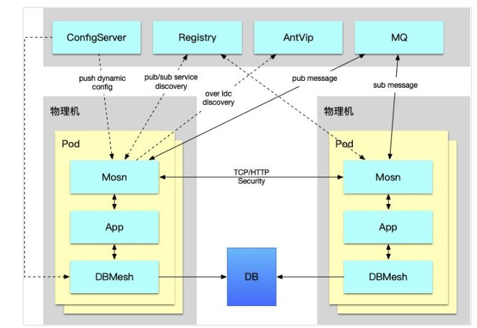
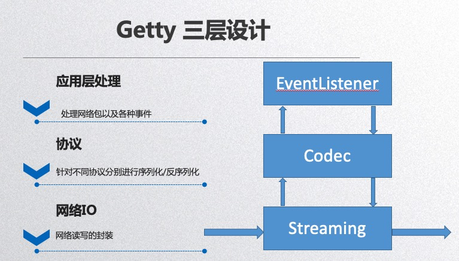

# SOFAMosn 笔记
---
*written by Alex Stocks on 2019/07/06，版权所有，无授权不得转载*

关于 SOFAMosn 与愚人的缘分，故事须从 2018 年 9 月 16 日说起。此日在离京南下某地参加毕业 X 周年聚会的火车途中，在 dubbogo QQ 群里，群友 老C 发来一条连接，说是其参与的一个叫做 [SOFAMosn][1] 的开源项目使用了愚人实现的 hessian2 协议 go 语言版本实现，以与 [apache/dubbo][2] 进行通信。

老C顺便提及，项目由其所在的阿里大文娱UC事业部和蚂蚁金服共建。既然大师推荐且是大厂出品，愚人便兴起翻阅了下此项目，一阅其工程组织架构，不知其是西渣渣还是爪哇风格，其代码风格亦看不出师承何处，且彼时对 Service Mesh 无甚了解，便意兴阑珊掩鼻而过。

话说缘分天注定。半载过后，愚人工作内容便是参与此项目开发，便需要对此项目的具体机理深入了解，以免踩坑。

## 1 SOFAMosn

SOFAMosn 是蚂蚁金服 Service Mesh 整体实践中最基础的组件。

参考文档 [蚂蚁金服 Service Mesh 落地实践与挑战][2] 文中述及了蚂蚁金服当前的 Service Mesh 进展情况，不同于开源的 Istio 体系，蚂蚁金服内部版 Service Mesh 落地优先考虑数据面的实现与落地，控制面在逐步建设中，整体的架构上看，我们使用数据面直接和内部的各种中间件服务端对接，来完成 RPC、消息等能力的下沉，给业务应用减负。SOFAMosn 便是数据平面落地的产物。

SOFAMosn 在 Service Mesh 充当 sidecar 角色，可以粗浅地理解为 Go 语言版本的 Envoy，目前其形态如下： 



整体架构与 RPC 有些许相似：

* 通过 Registry 实现服务注册和服务通知
* 通过 ConfigServer 实现服务配置动态下发
* 相互之间通过 TCP/HTTP 进行 transport 通信
* 通过 MQ 进行 pub/sub；

### 1.1 SOFAMosn 配置

愚人刚开始学习 SOFAMosn 相关概念的时候，是通过其配置文件，并类比于 Envoy 入门的。

SOFAMosn 的配置文件大体内容如下：

```text/json
{
  "servers": [
    {
      "mosn_server_name": "mosn_server_1",
      "listeners": [
        {
          "name": "ingress_sofa","address": "0.0.0.0:12220", "type": "ingress",
          "filter_chains": [
            {
              "match": "",
              "tls_context": {"status": true, "server_name": "hello.com", "verify_client": true,
              },
              "filters": [
                {
                  "type": "proxy",
                  "config": {
                    "downstream_protocol": "SofaRpc","name": "proxy_config","upstream_protocol": "SofaRpc","router_config_name": "test_router"
                  }
                }
              ]
            }
          ],
        }
      ]
    }
  ],
  "cluster_manager": {
    "clusters": [
      {
        "name": "test_cpp", "lb_type": "LB_ROUNDROBIN",
        "health_check": {
          "protocol": "SofaRpc", "timeout": "90s",
        },
        "hosts": [
          {
            "address": "11.166.22.163:12200", "hostname": "downstream_machine1", "weight": 1,
          }
        ],
      }
    ]
  }
}
```

上面内容原子开源版本 SOFAMosn 的配置文件 [mosn_config.json][6]，经愚人裁剪和合并，以利于阅读。

#### 1.1 SOFAMosn Servers


## 2 四层架构

SOFAMosn 本质是一个 Local(Client-Side) Proxy，downstream 通过它把请求路由到 upstream，




## 参考文档

- 1 [Service Mesh数据平面SOFAMosn深层揭秘](https://www.servicemesher.com/blog/sofa-mosn-deep-dive/)
- 2 [蚂蚁金服 Service Mesh 落地实践与挑战](https://blog.csdn.net/sofastack/article/details/93558620)
- 3 [Service Mesh 形态刍议](http://alexstocks.github.io/html/service_mesh.html)

[1]:(https://github.com/sofastack/sofa-mosn)
[2]:(github.com/apache/dubbo)
[3]:(https://www.servicemesher.com/blog/sofa-mosn-deep-dive/)
[4]:(https://blog.csdn.net/sofastack/article/details/93558620)
[5]:(http://alexstocks.github.io/html/service_mesh.html)
[6]:(https://github.com/sofastack/sofa-mosn/blob/master/configs/mosn_config.json)

## 扒粪者-于雨氏

>- 2019/07/06，于雨氏，于西湖黄龙，初作此文。


