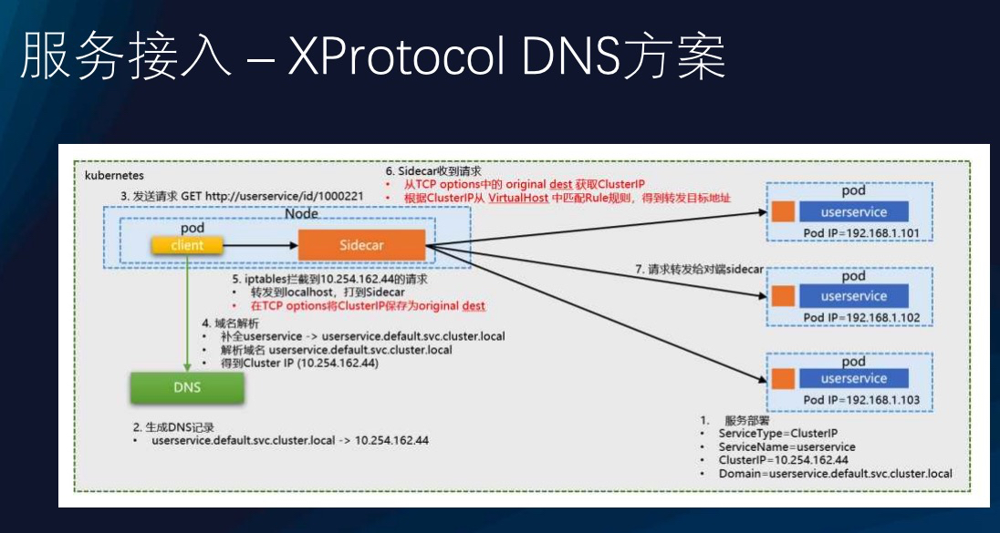
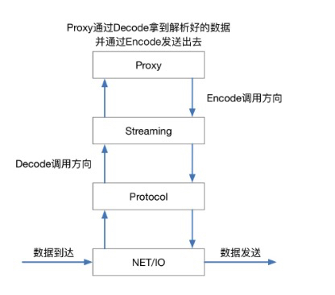
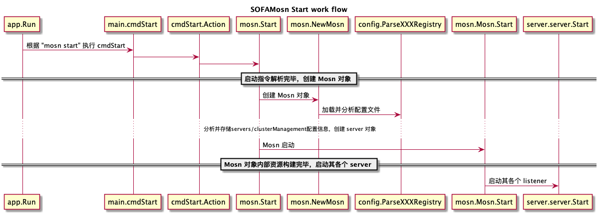
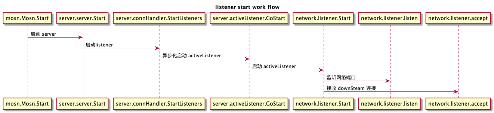
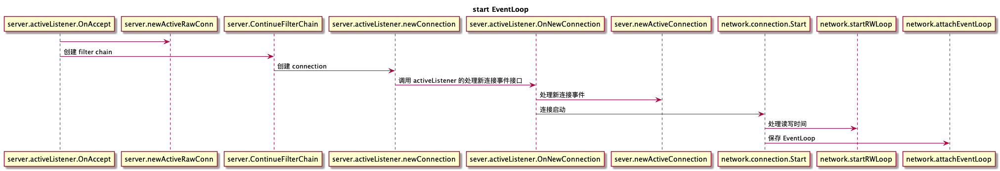
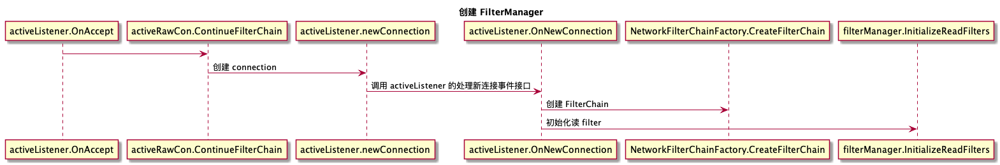
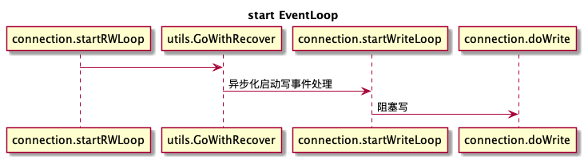

# SOFAMosn 笔记
---
*written by Alex Stocks on 2019/07/06，版权所有，无授权不得转载*

关于 SOFAMosn 与愚人的故事，须从 2018 年 9 月 16 日说起。此日在离京南下某地参加毕业 X 周年聚会的火车途中，dubbogo QQ 群群友 老C 发来一条连接，说是其参与的一个叫做 [SOFAMosn][1] 的开源项目使用了愚人的 [dubbogo/hessian2][8] 项目，以与 [apache/dubbo][2] 进行通信。

老C顺便提及，项目由其所在的阿里大文娱UC事业部和蚂蚁金服共建。既然是大厂出品，愚人便兴起翻阅了下此项目，一阅其工程组织架构，不知其是西渣渣还是爪哇风格，二阅其代码风格亦看不出师承何处，且彼时对 Service Mesh 无甚了解，便意兴阑珊掩鼻而过。

话说缘分天注定。半载过后，愚人工作内容便是参与此项目相关系统开发，便需要对其机理深入了解，以免踩坑。

## 1 SOFAMosn

SOFAMosn 是蚂蚁金服 Service Mesh 整体实践中最基础的组件。

参考文档 [蚂蚁金服 Service Mesh 落地实践与挑战][2] 文中述及了蚂蚁金服当前的 Service Mesh 进展情况，不同于开源的 Istio 体系，蚂蚁金服内部版 Service Mesh 落地优先考虑数据面的实现与落地，控制面在逐步建设中，整体的架构上看，我们使用数据面直接和内部的各种中间件服务端对接，来完成 RPC、消息等能力的下沉，给业务应用减负。SOFAMosn 便是数据平面落地的产物。

SOFAMosn 在 Service Mesh 充当 sidecar 角色，可以粗浅地理解为 Go 语言版本的 Envoy，目前其形态如下： 


整体架构与 RPC 有些许相似：

* 通过 Registry 实现服务注册和服务通知
* 通过 ConfigServer 实现服务配置动态下发
* 相互之间通过 TCP/HTTP 进行 transport 通信
* 通过 MQ 进行 pub/sub；

## 2 SOFAMosn 的基本概念

愚人刚开始学习 SOFAMosn 相关概念的时候，是通过其配置文件，并类比于 Envoy 入门的。


上图是 Service Mesh 布道师 宋净超(Jimmy Song) 绘制的 Envoy 架构图，用宋老师的一句话总结图中流程即为，host A 经过 Envoy 访问 host B 的过程，每个 host 上都可能运行多个 service，Envoy 中也可能有多个 Listener，每个 Listener 中可能会有多个 filter 组成了 chain。

### <a name="2.1">2.1 SOFAMosn 配置</a>

SOFAMosn 的配置文件大体内容如下：

```text/json
{"servers": [
    {"mosn_server_name": "mosn_server_1",
      "listeners": [{
          "name": "ingress_sofa","address": "0.0.0.0:12220", "type": "ingress",
          "filter_chains": [{
              "match": "",
              "filters": [{
                  "type": "proxy",
                  "config": {
                    "downstream_protocol": "SofaRpc","name": "proxy_config","upstream_protocol": "SofaRpc","router_config_name": "test_router"}},
                    {"type": "connection_manager",
                        "config": {
                            "virtual_hosts":["routers": [{"route": {"cluster_name": "test_cpp"}]]
                    }]}]}],
  "cluster_manager": {
    "clusters": [{
        "name": "test_cpp", "lb_type": "LB_ROUNDROBIN",
        "health_check": {
          "protocol": "SofaRpc", "timeout": "90s"},
        "hosts": [{
            "address": "11.166.22.163:12200", "hostname": "downstream_machine1", "weight": 1}]}]}
}
```

上面内容源自开源版本 SOFAMosn 的配置文件 [mosn_config.json][6]，经愚人裁剪和合并，以利于阅读。

配置分为 "servers" 和 "cluster_manager" 两块。"servers" 主要存储了 SOFAMosn 对 "host A" 的监听端口。

"cluster_manager" 则用于描述其后端 upstream 提供 service 的 hosts 集合。

"servers" 和 "cluster_manager" 衔接的关键之处是 "servers.listeners.filter_chains.filters.config.virtual_hosts.routers.route.cluster_name"。

SOFAMosn 本质是一个 Local(Client-Side) Proxy，downstream 通过它把请求路由到 upstream。

#### 2.1.1 SOFAMosn Servers

套用宋老师的话，SOFAMosn 有多个 Listener 组成了 "listeners" ，每个 Listener 中有多个 Filters 组成了 "filter_chains"。

> Listener 是处于 downstream 位置的 “host A" 可以访问的网络地址，一般为一个 tcp port。

> Listener filter	可以理解为 codec（协议处理），每个port（listener）上可以有多个 filter，即在一个网络地址上可以进行多种downstream 协议解析。Listener 使用 listener filter（监听器过滤器）来操作链接的元数据。

一般地，出于效率考虑，listen filter 不会完整解析 downstream 发来的完整协议，而是只解析部分头部，获取必要的路由相关的字段即可。

配置文件中 "servers.listeners.filter_chains.filters.type" 字段的值 "proxy" 完美地点出了 SOFAMosn 的 Local Prxoy 角色。

配置文件中的 "servers.listeners.filter_chains.filters.config" 中的 "downstream" 与 "upstream" 表明了其上下游使用的 filter(codec) 协议。

> Router 作为就是路由，用于选择 downstream 请求目的地 upstream cluster，是 MOSN 的核心模块，支持的功能包括：

* VirtualHost 形式的路由功能
* 基于 subset 的子集群路由匹配
* 路由重试以及重定向功能

配置文件中的 Router 是一种 VirtualHost 形式的路由，字段 "servers.listeners.filter_chains.filters.config.virtual_hosts.routers.route.cluster_name" 的值 "test_cpp"，表明其使用 ”cluster_manager.clusters.name“:"test_cpp" 的相关 cluster。

#### 2.1.2 SOFAMosn cluster manager

集群（cluster）是一组提供相同服务的 上游(upstream) 主机(Host) 集合，类比于 dubbo 中的 provider 列表，其内容主要有：

* 负载均衡策略
* 健康检查
* 静态 upstream hosts 集合

upstream cluster 集合除了可在配置中获取外，也可以通过 XDS 方式发现上游服务，其流程如下图：



图片流程清晰如斯，愚人就不再多用文字画蛇添足了。

## 3 SOFAMosn 网络层

一般的 RPC，downstream 与 upstream 之间直接进行网络通信，其网络层模型如下：


上图中 RPC 各个模型的作用有文字解释，此处不再赘述。本质为 Proxy 的 SOFAMosn 隔离了 downstream 和 upstream，其网络模型如下：



各个模块作用如下：

* NET/IO 对应 RPC 的 Streaming，用于读写底层的字节流，并检测连接；
* Protocol 对应 RPC 的 Codec，用于编解码 Package；
* Stream 用于封装请求和响应；
* Proxy 用于在 downstream 和 upstream 之间进行 stream 转发；

NET/IO 在代码层映射为 Listener 和 Connection，Listener 用来监听端口，并接收新连接。Connection 用来管理 Listener 上 accept 来的 tcp 连接，包括从 tcp conn 上读写数据等，接口定义在 `sofamosn/pkg/types/network.go`。

Protocol 收到 downstream 发来的二进制流后，根据配置文件中的协议名称选择相应的 decoder，解码后的报文整体包分为 header、body 和 tailer 三部分，接口定义在 `sofamosn/pkg/types/protocol.go`。
 
SOFAMosn 的 Stream 概念非常类似网络编程的 multiplexing 概念：通过全局唯一的 stream id 实现 request 和 response 报文关联，实现在一个连接上实现多路流传输。Stream 具有方向性，区分 upStream 和 downStream，且与协议强相关，不同格式的协议使用不同的 Stream。

Proxy 则是 SOFAMosn 角色的体现，在 upStream 和 downStream 之间进行路由选择，在 SOFAMosn 中其还管理连接池、service 集群。

### <a name="3.1">3.1 网络线程模型</a>

SOFAMosn 网络层采用了两种网络模型，分别针对不同的使用场景。


上图是 SOFAMosn 0.1.0 版本的线程模型，也是一种比较经典的 Go 网络双工线程模型，其各个部分职能如下：

* 读写分离，分别有两个 goroutine【下文简称 gr】处理网络阻塞读写；
* 读 gr 处理读 event，把二进制字节流转换为一个或多个报文；
* 写 gr 负责把 package 编码为二进制流，并发送出去；
* 一个专门的 event gr pool 负责逻辑处理。

这种网络模型适合在连接数不满 1k 时处理吞吐比较高的长连接场景，但是在连接达 10k 的短链接场景就不合适了。最简单的道理，gr 数目达 20k 时 go 的 gr 调度器的调度处理效率极低。 


上图则是 SOFAMosn 最新版本提供的第二种网络线程模型，基于 epoll/kqueue 机制重新实现的 NetPoll。SOFAMosn 根据 CPU 核数定制一个 Poller，每个 Poller 有一个常驻 gr，downstream connection 将自身注册的读写事件到某个 Poller 中，<u>**当 Poller 的 gr 接收到可读事件后，再从 gr pool 中选择一个 gr 执行网络读事件处理**</u>。

这种网络模型适用于短链接较多但是网络吞吐不高的场景，如 Gateway。

SOFAMosn 默认情况下适用第一种网络模型。
 
## 4 SOFAMosn 代码分析

SOFAMosn 整体代码可读性不友好，估计其初始作者并没有很长时间的 Go 使用经验。

本节主要分析其配置解析、网络启动与网络事件处理流程，不涉及其运行流程。

### 4.1 Main 入口

开源版本 SOFAMosn 的 Main 入口文件在 [cmd/mosn/main/mosn.go](https://github.com/sofastack/sofa-mosn/blob/master/cmd/mosn/main/mosn.go)。

SOFAMosn 使用了第三方库封装了一个 APP 代表整体程序，并能够处理 start、stop 和 reload 三个控制命令，但在控制命令处理文件[cmd/mosn/main/control.go](https://github.com/sofastack/sofa-mosn/blob/master/cmd/mosn/main/control.go) 中见到如下代码：

```Go
	cmdStop = cli.Command{
		Name:  "stop",
		Usage: "stop mosn proxy",
		Action: func(c *cli.Context) error {
			return nil
		},
	}

	cmdReload = cli.Command{
		Name:  "reload",
		Usage: "reconfiguration",
		Action: func(c *cli.Context) error {
			return nil
		},
	}
``` 

Stop 命令和 Reload 命令的 Action 函数为空，不知道这样的封装意义何在，涉嫌过度封装。实际使用命令仅仅 Start 而已。
 
整体 cmd/mosn/main 目录下有用的代码仅如下一行：

```Go
    mosn.Start(conf, serviceCluster, serviceNode)
```

如果还有其他有用代码的话，可能就是 [mosn.go](https://github.com/sofastack/sofa-mosn/blob/master/cmd/mosn/main/mosn.go) 文件的 import 语句库，可让各个相关子目录的 init() 函数在 SOFAMosn 启动时被调用。

真正的 SOFAMosn 对象为文件 [mosn/starter.go](https://github.com/sofastack/sofa-mosn/blob/master/pkg/mosn/starter.go) 中的 mosn.Mosn，其定义如下：

```Go
// Mosn class which wrapper server
type Mosn struct {
	servers        []server.Server
	clustermanager types.ClusterManager
	routerManager  types.RouterManager
	config         *config.MOSNConfig
	adminServer    admin.Server
}
```

Mosn 总体启动过程如下：


 
### 4.2 读取并分析配置文件

前面 <a name="#2.1">2.1 SOFAMosn 配置</a> 一节中给出了 SOFAMosn 的标准配置文件，其对应的代码在 [config/config.go](https://github.com/sofastack/sofa-mosn/blob/master/pkg/config/config.go)，主要结构体定义如下：

```Go
type ApplicationInfo struct {
	AppName       string `json:"app_name,omitempty"`
}

// ServiceRegistryInfo
type ServiceRegistryInfo struct {
	ServiceAppInfo ApplicationInfo     `json:"application,omitempty"`
	MsgMetaInfo    map[string][]string `json:"msg_meta_info,omitempty"`
}

// MOSNConfig make up mosn to start the mosn project
// Servers contains the listener, filter and so on
// ClusterManager used to manage the upstream
type MOSNConfig struct {
	Servers         []v2.ServerConfig      `json:"servers,omitempty"`         //server config, listener
	ClusterManager  ClusterManagerConfig   `json:"cluster_manager,omitempty"` //cluster config, cluster
	ServiceRegistry v2.ServiceRegistryInfo `json:"service_registry"`          //service registry config, used by service discovery module
}
```

配置整体解析流程如下：


### 4.3 listener 启动流程

SOFAMosn 的 servers 相关对象【server 和 listener】主要定义在 pkg/server 目录下，其主要文件内容如下：

* [types.go](https://github.com/sofastack/sofa-mosn/blob/master/pkg/server/types.go) 定义了一个 Server 接口
* [server.go](https://github.com/sofastack/sofa-mosn/blob/master/pkg/server/types.go) 定义了接口 Server 的实现 sever struct
* [handler.go](https://github.com/sofastack/sofa-mosn/blob/master/pkg/server/types.go) 则定义了对 listener 各种事件的处理

pkg/network 目录则定义了网络连接、监听与读写处理流程。

listener 启动流程如下：

* 1 构建 server.activeListener 对象


 
* 2 所有的 listener 对象构建完毕后，listener:Start() 开始监听各自的端口



* 3 处理监听事件 server.activeListener.OnAccpet，创建 network/connection.go:connection 对象，调用 connection:Start() 启动 EventLoop

### 4.4 网络读写事件处理

<a name="#3.1">3.1 网络线程模型</a> 节中述到 SOFAMosn 提供了两种网络线程模型，本节只给出其第一种网络线程模型【下文简称 orow】下的读写事件处理流程。

* 1 启动监听事件



* 2 接收连接后的 FilterManager 对象初始化



* 3 orow 模型下的 transport 层的读流程


* 4 orow 模型下的 transport 层的写流程



关于写，SOFAMosn 对写采用了合并写优化。[蚂蚁金服 Service Mesh 落地实践与挑战][4] 一文写道，
通过 golang 的 writev 我们把多笔请求合并成一次写，降低 sys.call 的调用，提升整体的性能与吞吐，同时在使用 writev 的过程中，有发现 golang 对 writev 的实现有 bug，会导致部分内存无法回收，我们给 golang 提交 PR 修复此问题，已被接受：https://github.com/golang/go/pull/32138。

这个 bug 是同事元总【原 tengine 总负责人】发现并解决掉的，但是最新的 Go 语言尚未发版【Go 1.13】，实际处理方法则是把多次写的内容先在内存中合并，然后再调用一次写 sys.call 发送，相关代码如下：

```Go
	// connection.startRWLoop()
	for i := 0; i < 10; i++ {
		select {
		case buf, ok := <-c.writeBufferChan:
			if !ok {
				return
			}
			c.appendBuffer(buf)
		default:
		}
	}
```

## 参考文档

- 1 [Service Mesh数据平面SOFAMosn深层揭秘](https://www.servicemesher.com/blog/sofa-mosn-deep-dive/)
- 2 [蚂蚁金服 Service Mesh 落地实践与挑战](https://blog.csdn.net/sofastack/article/details/93558620)
- 3 [Service Mesh 形态刍议](http://alexstocks.github.io/html/service_mesh.html)
- 4 [Envoy 的架构与基本术语](https://jimmysong.io/posts/envoy-archiecture-and-terminology/)

[1]:(https://github.com/sofastack/sofa-mosn)
[2]:(github.com/apache/dubbo)
[3]:(https://www.servicemesher.com/blog/sofa-mosn-deep-dive/)
[4]:(https://blog.csdn.net/sofastack/article/details/93558620)
[5]:(http://alexstocks.github.io/html/service_mesh.html)
[6]:(https://github.com/sofastack/sofa-mosn/blob/master/configs/mosn_config.json)
[7]:(https://jimmysong.io/posts/envoy-archiecture-and-terminology/)
[8]:(https://github.com/dubbogo/hessian2)

## 扒粪者-于雨氏

>- 2019/07/06，于雨氏，于西湖黄龙，初作此文。


