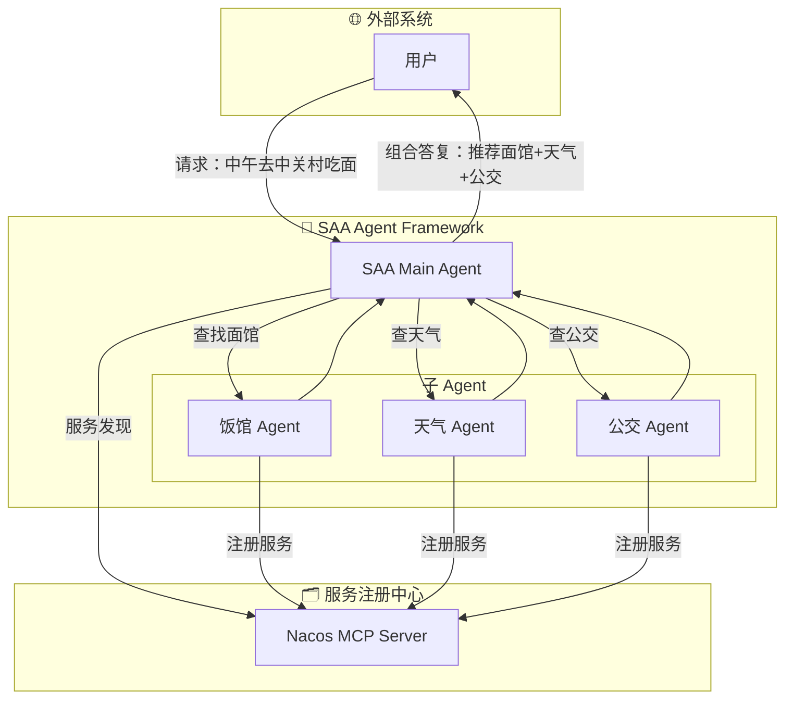
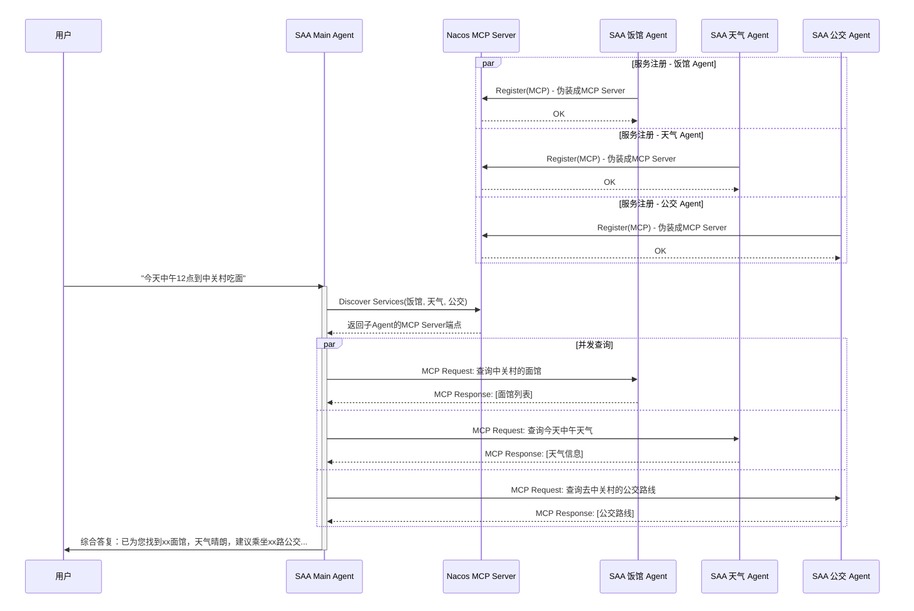
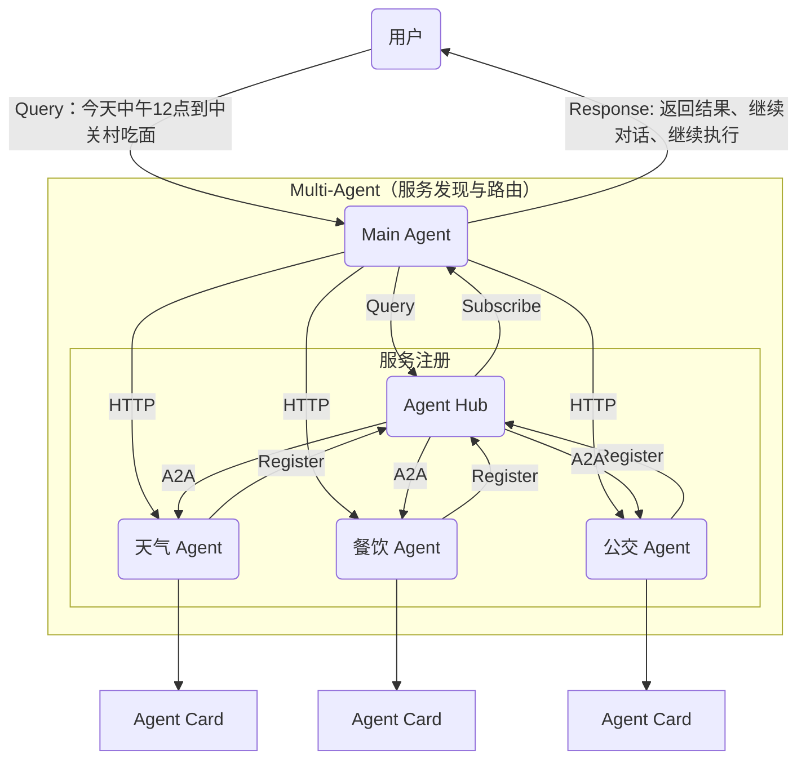
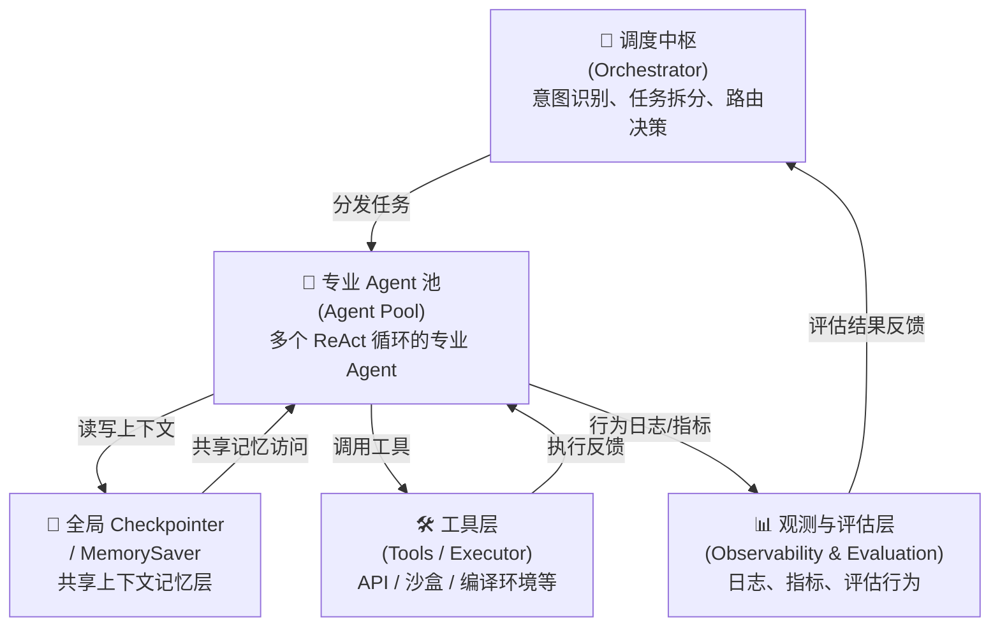
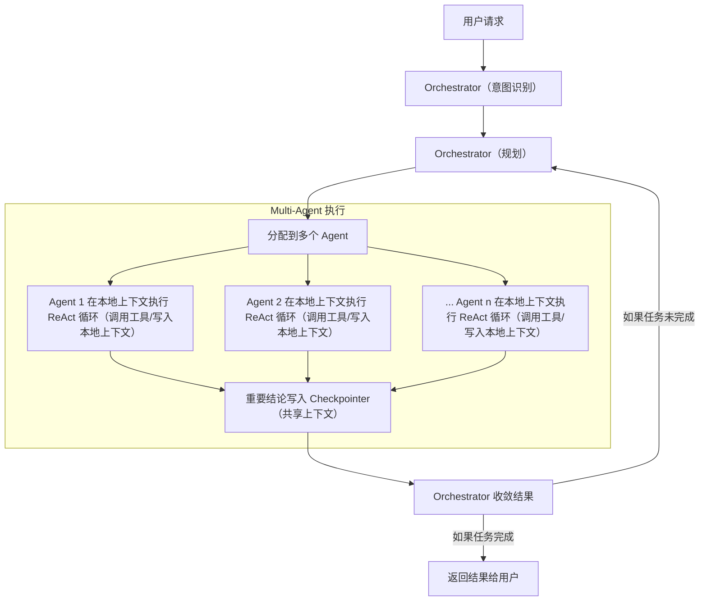
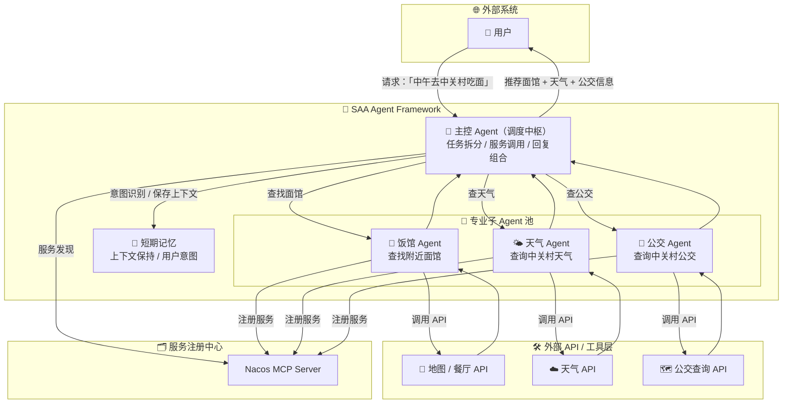
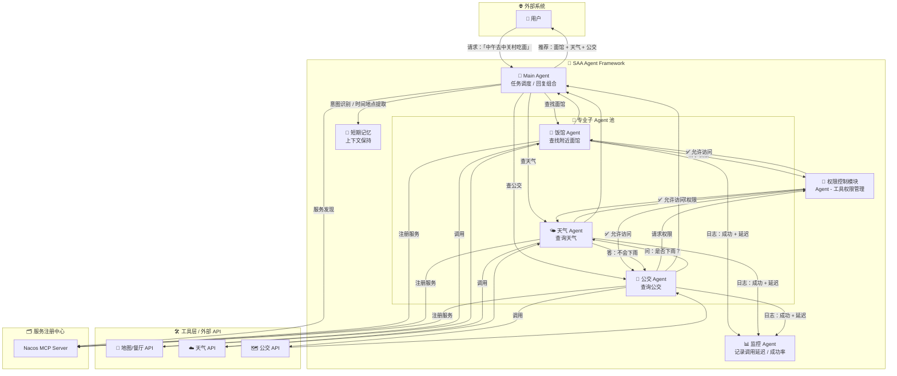

随着大语言模型（LLM）的能力突飞猛进，智能体（Agent）已成为将 AI 技术转化为实际业务价值的重要桥梁。然而，面对跨领域、长周期或专业性强的复杂任务，单一智能体的局限性逐渐显现，比如上下文信息过多、记忆不够聚焦、决策不够精准等。为了解决这些问题，分布式多智能体（Multi-Agent）系统应运而生，展现出更强大的问题解决能力和更高的准确性。

本文将深入探讨如何通过 **多智能体架构** 和 **上下文工程** 打造一个高效、可扩展的 AI 智能体系统，并结合一个通俗易懂的案例，分享一套实用的实践方案。

---

## 1  什么是多智能体系统？

面对日益复杂的任务，由多个具备自主决策和交互能力的 Agent 组成的**分布式多智能体（Multi-Agent）系统**，相比于单打独斗的 Agent，展现出更强大的问题解决能力和更高的准确率 。

### 1.1 多智能体架构

理解 Multi-Agent 系统，首先要明确其基本构成单元。

- **智能体**：一个 Agent 的基本构成可以概括为 `Agent = LLM + 观察 (Observation) + 思考 (Thought) + 行动 (Action) + 记忆 (Memory)` 。它能够感知环境，通过思考进行决策，并利用工具执行动作。
  - **观察**：感知外部环境，比如用户输入或API返回的数据。
  - **思考**：基于大语言模型进行推理和决策。
  - **行动**：调用工具（如查询API、执行代码）完成具体任务。
  - **记忆**：存储任务过程中的关键信息，支持后续决策。
- **多智能体系统** ：它是在单个 Agent 基础上的扩展，其定义为 `Multi-Agent = 智能体 + 环境 + 标准操作流程 (SOP) + 通信 + 经济模型` 。该系统的核心特征包括 ：
  - **自主性 (Autonomy)**：每个 Agent 都具备独立的决策能力，不受其他 Agent 的直接控制 。
  - **协作性 (Collaboration)**：Agent 之间通过通信、协商或竞争来解决冲突，共同完成任务 。例如，MetaGPT 框架通过为不同 Agent（如产品经理、工程师）分配角色和精心编排的 SOP 来模拟软件公司的全流程协作 。
  - **分布性 (Distribution)**：系统将复杂任务拆解为子任务，交由不同的 Agent 并行处理，从而降低整体复杂度 。

### 1.2  单 Agent vs. 多 Agent

在简单场景下，单一智能体开发简单、成本低，适合快速落地。但随着任务复杂度的提升，单一智能体的短板暴露无遗：

| **场景**   | **单一智能体**     | **多智能体**         |
| ---------- | ---------------------- | ------------------------ |
| 跨领域支持 | 修改原有智能体，成本高 | 新增智能体即可支持       |
| 长周期任务 | 上下文截断，信息丢失   | 智能体轮替，避免信息超限 |
| 工具复用   | 工具强耦合，难以复用   | 可共享工具库             |

**多 Agent 架构的核心优势**：

1. **更专注的上下文**：通过意图识别和任务拆解，每个智能体只关注自己领域的上下文，有效解决了长周期任务中的信息丢失问题 。
2. **更灵活的扩展**：面对新功能，只需新增或集成新的 Agent，无需重构系统 。
3. **更高的准确率**：多智能体协作在复杂任务中的表现优于单一智能体 。

 

---

## 2 如何设计多智能体架构？

多智能体系统的设计就像搭积木，核心在于选择合适的架构方式和协作模式。

### 2.1 架构范式

- **工作流：动态 vs 静态**
  - **静态工作流**：以 Dify 等平台为代表，其工作流依赖于在画布中预先连接好的工具节点，这种静态编排模式难以处理真实任务中的突发状况和未知噪声。
  - **动态工作流（ReAct）**：ReAct 通过“**推理-行动-观察(Reasoning-Action-Observation)**”的动态循环，赋予 Agent 动态决策的能力 。例如，当 Agent 发现所需接口无法查询时，它可以自主决策并向用户收集补充信息，而非像静态工作流那样需要人工干预调整 。ReAct 支持**按需调用工具**，更适合对准确性要求高的代码生成、数据分析等复杂场景 。
- **协作模式：分布式** **vs. 统一型**
  - **统一型**：以 Manus 为例，其核心依赖一个**中央调度器**（如 ToDoList）进行任务分发 。在处理跨领域任务时，所有上下文信息都汇集于此，**上下文长度极易成为瓶颈** 。尽管其通过虚拟文件系统等方式缓解了限制，但 Agent 往往**“只知记忆名而不知其内容”**，在需要深度专业知识的场景下，容易缺乏准确的判断语境 。
  - **分布式**：分布式架构通过意图识别和任务拆解，将不同任务分配给独立的、职责明确的专业 Agent 。每个 Agent 只需关注自己领域的上下文，从根本上解决了统一型 Agent 的上下文瓶颈问题，并带来了卓越的系统扩展能力 。

**结论**：基于 ReAct 范式的分布式多智能体架构是目前较为先进且实用的方案。

### 2.2 一个可行的 Multi-Agent 架构实例

2025 年初 MCP 出来后，Multi-Agent 之间的协作范式之一，就是 sub-agent 伪装成一个 MCP Server 供 Main Agent 调用。以一个常见需求“今天中午12点去中关村吃面”为例，设计一套基于 Spring AI Alibaba（SAA）的多智能体系统，展示其工作原理。

在早期实践中，一种常见的协作范式是让子 Agent 伪装成 MCP Server，供主 Agent 调用 。

- **主 Agent (Main** **Agent，Orchestrator)**：负责接收用户需求，拆分任务并协调子智能体。
- **子 Agents (Sub-agents)**：如饭馆 Agent、天气 Agent、公交 Agent，各自负责一个垂直领域，并向 Nacos MCP Server 注册自己，伪装成一个 MCP Server，成为 Main Agent 的一个 Tool 。
- **服务注册中心（Nacos）**：子智能体注册服务，主智能体通过 Nacos 动态发现并调用它们。

基于 Nacos MCP Server 的架构如下：

这就是一个典型的 **统一型 Agent，**Main Agent 对用户输入进行意图识别后，通过本地 Nacos MCP Router 按照关键字搜索 sub-agent，搜索后按照 MCP 协议进行通信。

其工作流程如下：

1. **服务注册**：子智能体（如饭馆、天气、公交）向 Nacos 注册服务，声明自己的能力。
2. **任务分发**：主智能体接收用户请求，解析直接意图（如“中关村”“吃面”）以及隐藏意图，向 Nacos 查询能够处理“饭馆”、“天气”和“公交”等任务的子 Agent，然后通过 MCP 协议直接调用它们。
3. **并行执行**：
   1. 饭馆智能体调用地图API，推荐附近面馆。
   2. 天气智能体查询中午天气情况。
   3. 公交智能体查找去中关村的公交路线。
4. **结果汇总**：主智能体整合子智能体的结果，返回给用户：“推荐XX面馆，天气晴朗，建议乘坐XX路公交。”

详细工作流程如下：

这是一个典型的 **统一型 Agent 架构**，虽然能够工作，但所有调度的复杂性和上下文管理都集中在 Main Agent，存在前文所述的瓶颈。

MCP 协议火爆后，Google 马上跟进，推出了 A2A 协议，以实现 Multi-Agent 之间的协作。如果用 A2A 协议改造这个 **统一型 Agent** 为 **分布式多 Agent，** 其路由与通信链路如下：

Sub-agent 以 A2A 方式注册到 Nacos A2A Registry，然后 Main Agent 可以到 Nacos A2A Registry 以 A2A 方式动态搜索 sub-agent，搜索后用 Spring Cloud 的方式通过 OpenFeign 调用 sub-agent。好处是：现有服务线上协议的通信方式不改变，只多一个改造成本：使用 A2A 协议的服务注册和发现。

通过这个例子，一个可行的 Multi-Agent 架构是：基于 Re-Act 范式的分布式多 Agent。

### 2.3 从实例中抽象 Multi-Agent核心组件

还以前面提到的例子说明，在**分布式多 Agent 架构**这种模式下，子 Agent 以 A2A 方式注册到服务中心（如 Nacos A2A Registry）。Main Agent 或调度中枢可以动态搜索并调用这些子 Agent（例如通过 Spring Cloud OpenFeign）。这种改造的好处是，可以在不改变现有服务线上通信协议（如 HTTP）的情况下，仅增加 A2A 协议的服务注册和发现层，实现平滑过渡。

从这个实例中，我们可以抽象出一个典型的分布式 Multi-Agent 系统的核心逻辑组件 ：

- **调度中枢 (Orchestrator)**：负责顶级意图识别、任务拆分和向专业 Agent 的动态路由决策 。
- **专业 Agent 池 (Agent Pool)**：包含多个各司其职的专业 Agent（如网页开发、数据分析），每个 Agent 独立运行自己的 ReAct 循环 。
- **全局 Checkpointer / MemorySaver**：作为跨 Agent 的持久化/可查询记忆层（支持短期与长期记忆），支持共享上下文的读写与查询 。
- **工具层 (Tools / Executor)**：提供 Agent 执行动作所需的各种能力，如 API 调用、代码沙盒、编译环境等 。
- **观测与评估层 (Observability & Evaluation)**：负责记录日志、监控指标，并对 Agent 的行为和结果进行评估（Accuracy、Tool-use correctness、Latency、Cost） 。

上图比较简略。如果从一个用户请求开始，其 workflow 如下：

这是一个非线性工作流，有 循环、分支、并行，工程上可以借助 LangGraph，以支持复杂路由。

### 2.4 Multi-Agent 的挑战

Multi-Agent 一个核心挑战浮出水面：如何让多个 Agent 高效协作、共享信息并维持长期记忆？这就依赖于 **上下文工程（Context Engineering，下文简称 CE）**。

**Multi-Agent 系统** **CE** **原则**：

1. **分治上下文**：把任务拆成“语义上独立”的子任务，每个 Agent 只维护与其职责相关的上下文；
2. **最小化跨 Agent 共享**：只共享“必要且值昂贵”的语义（例如会话关键事实、用户偏好、任务状态），其余信息局部化；
3. **动态路由与可插拔性**：Agent 能按需被调度、替换、扩展，无需重构主流程；
4. **可观测与可评估**：每个 Agent 的决策路径、工具调用与上下文演进要可审计与可打分。

 

---

## 3 上下文工程：让智能体更聪明

上下文是智能体的“灵魂”，决定了决策的质量和系统的效率。上下文工程（Context Engineering）通过科学管理上下文，为大模型提供了更精准、更恰当的 context，让多智能体系统更高效。

###  3.1 **核心价值**

在一个 Agent 的工作循环中，模型根据当前上下文选择一个动作，在环境中执行后产生观察结果，随之动作和观察结果被附加到上下文中，成为下一次迭代的输入，直至任务完成 。这个过程的质量高度依赖于上下文的构建与管理。

### 3.2 上下文分类

上下文可以分为三类，需要不同的管理策略：

- **临时上下文 (Ephemeral Context)**：当前会话内的短期状态，如任务的中间产物，通常存储在内存或短期 KV（如 Redis）中，并设置生命周期（TTL），例如一小时后自动销毁以控制成本 。
- **跨 Agent 记忆 (Shared Memory)**：需要在不同 Agent 间继承的重要事实，如用户偏好、任务元数据等，应存储在全局共享的 Checkpointer 中 。
- **长期知识库 (Persistent Knowledge)**：如文档、FAQ 等，适合长期存储，并通过 RAG 等检索方式供 Agent 使用 。

### 3.3 **分布式环境下的上下文管理**

为了支持多轮对话和跨集群部署，用 LangGraph提供的`MemorySaver` 实现上下文管理，实现会话记忆共享：

- **工作流**：Redis 作为核心的 KV 存储，负责记忆的持久化存储和读取 。`checkpointer`则基于会话ID维护状态，负责上下文的加载和内存管理 。调度中枢（Main-Agent）和专业Agent通过`checkpointer`进行记忆的存储和读取，形成闭环 。
- **时效性管理**：由于资源限制，临时上下文必须有生命周期，如只支持动态存储一小时，若一小时内没有新的消息，相关的会话将被销毁 。

### 3.4 上下文存储与一致性

在分布式环境中，可以用 Redis Cluster 作为 Checkpointer 的后端，支持跨 Agent 集群的会话记忆共享与读写：

- 写入采用 **append-only** 或乐观并发控制（CAS），避免频繁冲突；
- 对于跨机房高频访问，采用本地缓存 + 背景同步（cache invalidation）策略；
- 对写入进行分级：强一致（关键状态）与最终一致（普通记忆），根据业务重要性选择。

### 3.5  检索与压缩（token 管理）

- **策略**：长期记忆用检索（RAG），短期上下文用完整回放；对长文本采用**分段索引 + 摘要压缩**，以及动态上下文合成（selective concatenation）。
- **实现建议**：
  - 在 Checkpointer 中维护“重要性分数”，为检索时排序；
  - 定期对会话进行**自动摘要 / 记忆压缩**（把低价值的长聊天压缩成要点），以控制 token 成本。

### 3.6 **Multi-Agent架构下的上下文共享机制**

为了让不同的 Agent 能够协同工作，必须建立一套高效的上下文共享机制。一个可行的实现方式如下：

   - **全局Checkpointer**：平台支持一个全局可读的`checkpointer`，用于存储跨Agent共享的信息，实现不同Agent之间的记忆共享 。
   - **记忆继承**：各Agent会将执行过程中产生的重要记忆存储到这个全局空间 。每个Agent在初始化时，都会加载全局`MemorySaver`里的记忆，从而实现重要上下文的继承 。

可以将跨 Agent 共享放在全局 Checkpointer/MemorySaver 中实现，并对临时上下文做时限（如 1 小时）以控制资源消耗。

### 3.7 语义合约（上下文协议）

定义 Agent-to-Agent 的最小语义合约（schema），例如：`{session_id, fact_type, fact_value, provenance, ttl}`，确保不同 Agent 读写时语义一致。

### 3.8 举个例子

还以吃面的例子说明，加入以下改进点：

- **Orchestrator（调度中枢）角色** —— SAA Main Agent 的职责细化（任务拆分 / 路由 / 汇总回复）
- **短期记忆**：主 Agent 可以记录用户的上下文（如“中午” = 当前时间段）
- **增强工具层抽象**（如公交 API、天气 API 可看作工具）
- **增加评估层或日志记录** **Agent**
- **更清晰地表示子 Agent 是独立运行的服务，通过注册中心发现与调用**

五个改进点：

| **组件**           | **说明**                                                     |
| ------------------ | ------------------------------------------------------------ |
| 🎯 Main Agent       | 相当于你原图的 SAA Main Agent，这里命名为 Orchestrator 并强调它是调度中枢 |
| 🧠 短期记忆         | 存储用户上下文信息，比如“中午”“中关村”等，便于多轮对话       |
| 🍜 / 🌤️ / 🚌 子 Agent | 各自独立运行，专注于单一任务，具备调用外部 API 的能力        |
| 📍 / ☁️ / 🗺️ 工具层   | 抽象了真实世界的外部服务/API（如高德地图、天气网、公交网等） |
| 🗂️ 注册中心 Nacos   | 作为服务发现机制连接各组件                                   |

 

---

## 4 **Agent 的设计、运维与风险管理**

在构建和部署智能体系统时，其设计、运维和风险管理是确保其在实际环境中稳定运行的关键考量。

### 4.1 **Agent 设计与运行时规范**

在 Agent 的设计和运行时规范层面，有规范如下：

- **ReAct** **+ 反思机制**：每个 Agent 内部使用 ReAct 循环。在任务开始、调用工具前后、状态变更等关键节点，强制调用 `sequentialThinking` 等工具进行规划、决策与反思，确保 Agent 的每一步行动都经过深思熟虑 。
- **动态路由与失败降级**：调度中枢应基于意图相似度、Agent 可用性和历史成功率进行动态路由 。当任务失败时，应有明确的降级策略，如重试其他 Agent、转为人工接管或向用户请求更明确的输入 。
- **安全与合规**：所有企业级系统都必须建立在**坚实的安全与合规基础**上。在写入共享记忆前，必须进行隐私数据过滤和脱敏处理。对于敏感字段，应采用加密或严格限制生命周期等措施来保障数据安全。

### 4.2 **系统运维与评估**

要衡量 Multi-Agent 系统的效能，需要建立一套持续的评估体系，关注以下关键指标 ：

- **任务成功率 (End-to-end)** 
- **工具调用正确率 (Tool-call correctness)** ：工具调用是否按预期返回
- **上下文命中率 (Upstream** **context hit rate)** ：检索到的记忆是否有助于决策
- **平均 Token 成本与任务成本** 
- **响应时延与可用性** 

同时引入持续评估（自动化评估集）对 Agent 输出进行精度/合规/简洁性打分。

### 4.3 **常见风险与缓解策略**

- **上下文幻觉 (Hallucination)**：通过工具结果交叉校验、Observation 驳回机制和证据回溯来缓解 。
- **跨 Agent 冲突**：通过严格的语义合约和明确的优先级/仲裁策略来解决 。
- **存储成本爆炸**：实施严格的 TTL 策略和记忆摘要/压缩机制是必要的工程妥协 。
- **扩展痛点**：在系统设计之初就应规划好 Agent 的注册、版本管理和能力声明（capability manifest）机制，以支持未来的平滑扩展 。

### 4.4  举个例子

再次以吃面为例，考虑到 监控、权限、Agent 间协作三个扩展点：

- 加入监控 Agent 来记录延迟、调用成功率  
- 使用权限控制模块 控制哪些 Agent 能访问某些工具  
- 模拟 Agent 间协作对话（比如公交 Agent 问天气 Agent 是否下雨）

整合进架构图，升级版 Multi-Agent 架构图：

三个扩展点：

| **组件**                          | **说明**                                                     |
| --------------------------------- | ------------------------------------------------------------ |
| 监控 Agent（MonitorAgent）        | 每个子 Agent 都向它发送：   执行延迟（ms）   工具调用是否成功（成功 / 失败 / 超时） 可用于：   SLA 监控   异常告警   后续优化模型调用或 Agent 路由策略 |
| 权限控制模块（PermissionControl） | 定义哪些 Agent 有权限调用哪些工具：   - 例如 WeatherAgent 只能访问 Weather API   - 防止越权行为或误调用其他 Agent 工具 模拟一种 **RBAC（角色权限控制）** 机制 |
| Agent 间协作示例                  | BusAgent 发起主动请求：“今天天气好吗？” WeatherAgent 回复：“不会下雨” BusAgent 决定推荐步行方案而不是地铁换乘 |

 

---

## 5 结论

多智能体架构与上下文工程是构建高效 AI 系统的两大支柱：

- **多智能体架构**：通过**职责分离和分布式协作**，降低任务复杂性，提升扩展性，定义了“如何协作”的**骨架**。
- **上下文工程**：通过科学管理上下文，**保证决策质量与长期记忆价值，**是流淌于骨架中的**“血液”。**

从“吃面”案例到分布式架构的演进，我们看到多智能体系统通过技术迭代，从 MCP 到 A2A 的架构演进，再到集成了监控、权限与 Agent 间协作的完整设计，通过技术方案的迭代，构建可靠、可扩展、可运维的 AI Agent 系统，AI 智能体系统将在更多场景中发挥价值，为复杂任务提供更智能的解决方案。