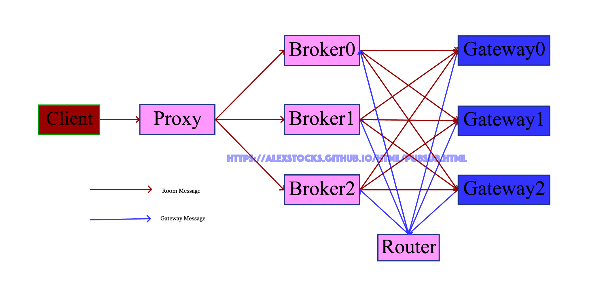
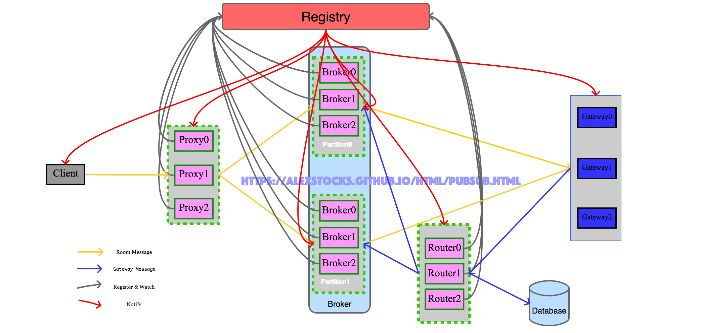
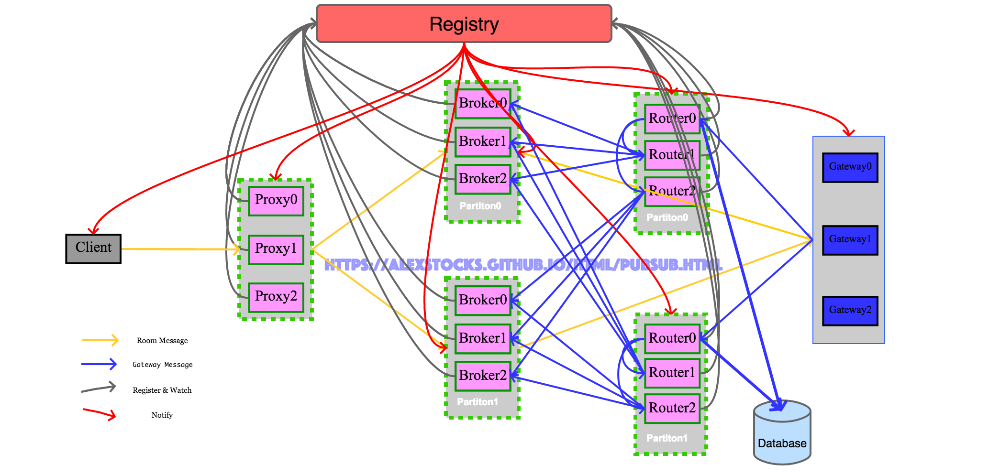

## 一套高可用的pub/sub系统实现 ##
---
*written by Alex Stocks on 2017/12/31*

### 1 极简实现 ###
---

所谓系统pub/sub，就是一种群聊方式，譬如直播房间内的聊天对应的服务器端就是一个pub/sub系统。

2017年9月初初步实现了一套极简的pub/sub系统，其大致架构如下：
		

    
系统名词解释：

> 1 Client : 系统消息发布者，publisher；
>
> 2 Proxy  : 系统代理，对外统一接口，收集Client发来的消息转发给Broker；
>
> 3 Broker ：系统Server，Broker会根据Gateway message组织Room ID和Gateway IP&port的映射关系，然后把Proxy发来的消息转发到Room中所有成员登录的所有Gateway，；
>
> 4 Router ：用户登录消息转发者，把Gateway转发来的用户登入登出消息转发给所有的Broker；
>
> 5 Gateway：所有服务端的入口，接收合法客户端的连接，并把客户端的登录登出消息通过Router转发给所有的Broker；
> 
> 当一个Room中多个Client连接一个Gateway的时候，Broker只会根据Room ID把房间内的消息转发一次给这个Gateway，由Gateway再把消息复制多份分别发送给连接这个Gateway的Room中的所有客户端。 

这套系统有如下特点：   

- 1 系统只转发房间内的聊天消息，每个节点收到后立即转发出去，不存储任何房间内的聊天消息，不考虑消息丢失以及消息重复的问题；
- 2 系统固定地由一个Proxy、三个Broker和一个Router构成；
- 3 Proxy接收后端发送来的房间消息，然后按照一定的负载均衡算法把消息发往某个Broker，Broker则把消息发送到所有与Room有关系的接口机Gateway；
- 4 Router接收Gateway转发来的某个Room内某成员在这个Gateway的登出或者登录消息，然后把消息发送到所有Broker；
- 5 Broker收到Router转发来的Gateway消息后，更新（添加或者删除）与某Room相关的Gateway集合记录；
- 6 整个系统的通信链路采用UDP通信方式；

从以上特点，整个消息系统足够简单，**不考虑扩缩容问题**，当系统负载到达极限的时候，就**重新再部署一套系统**以应对后端client的消息压力。
     
这种处理方式本质是把系统的扩容能力甩锅给了后端Client以及前端Gateway：**每次扩容一个系统，所有Client需要在本地配置文件中添加一个Proxy地址然后全部重启，所有Gateway则需要再本地配置文件添加一个Router地址然后全部重启。**

这种“幸福我一人，辛苦千万家”的扩容应对方式，必然导致公司内部这套系统的使用者怨声载道，升级之路就是必然的了。

### 2 可扩展 ###
---

大道之行也，天下为公，不同的系统有不同的构架，相同的系统总有类似的实现。类似于数据库的分库分表【关于分库分表，目前看到的最好的文章是参考文档1】，其扩展实现核心思想是分Partition分Replica，但各Replica之间还区分leader（leader-follower，只有leader可接受写请求）和non-leader（所有replica均可接收写请求）两种机制。

从数据角度来看，这套系统接收两种消息：Room Message（房间聊天消息）和Gateway Message（用户登录消息）。两种消息的交汇之地就是Broker，所以应对扩展的紧要地方就是Broker，Broker的每个Partition采用non-leader机制，各replica均可接收Gateway Message消息写请求和Room Message转发请求。

首先，当Room Message量加大时可以对Proxy进行水平扩展，多部署Proxy即可因应Room Message的流量。

其次，当Gateway Message量加大时可以对Router进行水平扩展，多部署Router即可因应Gateway Message的流量。

最后，两种消息的交汇之地Broker如何扩展呢？可以把若干Broker Replica组成一个Partition，因为Gateway Message是在一个Partition内广播的，所有Broker Replica都会复制一份Gateway message以组织Room Id和Gateway IP&port的映射关系，因此当Gateway message增加时扩容Partition即可。当Room Message量增加时，水平扩容Partition内的Broker Replica即可，因为Room Message只会发送到Partition内某个Replica上。

从个人经验来看，Room ID的增长以及Room内成员的增加量在一段时间内可以认为是直线增加，而Room Message可能会以指数级增长，所以若设计得当则Partition扩容的概率很小，而Partition内Replica水平增长的概率几乎是100%。

不管是Partition级别的水平扩容还是Partition Replica级别的水平扩容，不可能像系统极简版本那样每次扩容后都需要Client或者Gateway去更新配置文件然后重启，因应之道就是可用zookeeper充当角色的Registriy。通过这个zookeeper注册中心，相关角色扩容的时候在Registry注册后，与之相关的其他模块得到通知即可获取其地址等信息。采用zookeeper作为Registry的时候，所以程序实现的时候采用实时watch和定时轮询的策略保证数据可靠性，因为一旦网络有任何的抖动，zk就会认为客户端已经宕机把链接关闭。

分析完毕，与之相对的架构图如下：

分章节描述各个模块详细流程。

#### 2.1 Client ###
---

Client详细流程如下：

- 1 从配置文件加载Registry地址；
- 2 从Registy上Proxy注册路径/pubsub/proxy下获取所有的Proxy，依据各个Proxy ID大小顺序递增组成一个ProxyArray；
- 3 启动一个线程实时关注Registry路径/pubsub/proxy，以获取Proxy的动态变化，及时更新ProxyArray；
- 4 启动一个线程定时轮询获取Registry路径/pubsub/proxy下各个Proxy实例，作为关注策略的补充，以期本地ProxyArray内各个Proxy成员与Registry上的各个Proxy保持一致；定时给各个Proxy发送心跳，异步获取心跳回包；定时清除ProxyArray中心跳超时的Proxy成员；
- 5 发送消息的时候采用snowflake算法给每个消息分配一个MessageID，然后采用相关负载均衡算法把消息转发给某个Proxy。

#### 2.2 Proxy ###
---

Proxy详细流程如下：

- 1 读取配置文件，获取Registry地址；
- 2 把自身信息注册到Registry路径/pubsub/proxy下，把Registry返回的ReplicaID作为自身ID；
- 3 从Registry路径/pubsub/broker/partition(x)下获取每个Broker Partition的各个replica；
- 4 从Registry路径/pubsub/broker/partition_num获取当前有效的Broker Partition Number；
- 5 启动一个线程关注Registry上的Broker路径/pubsub/broker，以实时获取以下信息：
  
		Broker Partition Number；
		新的Broker Partition（此时发生了扩容）；
		Broker Partition内新的broker replica（Partition内发生了replica扩容）；
		Broker Parition内某replica挂掉的信息；

- 6 定时向各个Broker Partition replica发送心跳，异步等待Broker返回的心跳响应包，以探测其活性，以保证不向超时的replica转发Room Message；
- 7 启动一个线程定时读取Registry上的Broker路径/pubsub/broker下各个子节点的值，以定时轮询的策略观察Broker Partition Number变动，以及各Partition的变动情况，作为实时策略的补充；同时定时检查心跳包超时的Broker，从有效的BrokerList中删除；
- 8 依据规则【BrokerPartitionID = RoomID % BrokerPartitionNum， BrokerReplicaID = roomID % BrokerPartitionReplicaNum】向某个Partition的replica转发Room Message，收到Client的Heatbeat包时要及时给予响应。
 
**之所以把Room Message和Heartbeat Message放在一个线程处理，是为了防止进程假死这种情况。**
 
当/pubsub/broker/partition_num的值发生改变的时候(譬如值改为4)，意味着Router Partition进行了扩展，Proxy要及时获取新Partition路径（如/pubsub/broker/Partition2和/pubsub/broker/Partition3）下的实例，并关注这些路径，获取新Partition下的实例。
    
之所以Proxy在获取Registry下所有当前的Broker实例信息后再注册自身信息，是因为此时它才具有转发消息的资格。
    
Proxy转发某个Room消息时候，只发送给处于Running状态的Broker。为Broker Partition内所有replica依据Registry给其分配的replicaID进行递增排序，组成一个Broker Partition Replica Array，规则中BrokerPartitionReplicaNum为Array的size，而BrokerReplicaID为replica在Array中的下标。
       
#### 2.3 Broker ###
---
   
Broker详细流程如下：

- 1 Broker加载配置，获取自身所在Partition的ID（假设为3）；
- 2 向Registry路径/pubsub/broker/partition3注册，设置其状态为Init，注册中心返回的ID作为自身的ID(replicaID)；
- 3 接收Router转发来的Gateway Message，放入GatewayMessageQueue；
- 4 从Database加载数据，把自身所在的Broker Partition所应该负责的Room ID到某Gateway映射数据加载进来；
- 5 异步处理GatewayMessageQueue内的Gateway Message，只处理满足规则【PartitionID == RoomID % PartitionNum】的消息，把数据存入本地路由信息缓存；
- 6 修改Registry路径/pubsub/broker/partition3下自身节点的状态为Running；
- 7 启动线程实时关注Registry路径/pubsub/broker/partition_num的值；
- 8 启动线程定时查询Registry路径/pubsub/broker/partition_num的值；
- 9 当Registry路径/pubsub/broker/partition_num的值发生改变的时候，依据规则【PartitionID == RoomID % PartitionNum】清洗本地路由信息缓存中每条数据；
- 10 接收Proxy发来的Room Message，依据RoomID从路由信息缓存中查找Room有成员登陆的所有Gateway，把消息转发给这些Gateway；

注意Broker之所以先注册然后再加载Database中的数据，是为了在加载数据的时候同时接收Router转发来的Gateway Message，但是在数据加载完前这些受到的数据先被缓存起来，待映射关系加载完后就把这些数据重放一遍；
    
Broker之所以区分状态，是为了在加载完毕映射关系前不对Proxy提供转发消息的服务，同时也方便Broker Partition应对的消息量增大时进行水平扩展。
    
当Broker发生Partition扩展的时候，新的Partition个数必须是2的幂，只有新Partition内所有Broker Replica都加载实例完毕，再更改/pubsub/broker/partition_num的值。
    
老的Broker也要watch路径/pubsub/broker/partition_num的值，当这个值增加的时候，它也需要清洗本地的路由信息缓存。

Broker的扩容过程犹如细胞分裂，形成中的两个细胞有着完全相同的数据，分裂完成后【Registry路径/pubsub/broker/partition_num的值翻倍】则需要清洗垃圾信息。
       
#### 2.4 Router ###
---
    
Router详细流程如下：

- 1 Router加载配置，Registry地址；
- 2 把自身信息注册到Registry路径/pubsub/router下，把Registry返回的ReplicaID作为自身ID；
- 3 从Registry路径/pubsub/broker/partition(x)下获取每个Broker Partition的各个replica；
- 4 从Registry路径/pubsub/broker/partition_num获取当前有效的Broker Partition Number；
- 5 启动一个线程关注Registry上的Broker路径/pubsub/broker，以实时获取以下信息：
  
		Broker Partition Number；
		新的Broker Partition（此时发生了扩容）；
		Broker Partition内新的broker replica（Partition内发生了replica扩容）；
		Broker Parition内某replica挂掉的信息；

- 6 定时向各个Broker Partition replica发送心跳，异步等待Broker返回的心跳响应包，以探测其活性，以保证不向超时的replica转发Gateway Message；
- 7 启动一个线程定时读取Registry上的Broker路径/pubsub/broker下各个子节点的值，以定时轮询的策略观察Broker Partition Number变动，以及各Partition的变动情况，作为实时策略的补充；同时定时检查心跳包超时的Broker，从有效的BrokerList中删除；
- 8 从Database全量加载路由映射数据放入本地缓存；
- 9 收取Gateway发来的心跳消息，及时返回ack包；
- 10 收取Gateway转发来的Gateway Message，按照一定规则【BrokerPartitionID % BrokerPartitionNum = RoomID % BrokerPartitionNum】转发给**某个Broker Partition下所有Broker Replica**，保证Partition下所有replica拥有同样的路由映射数据，再把Message内数据存入本地缓存，当检测到数据不重复的时候把数据异步写入Database； 

#### 2.5 Gateway ###
---
    
Gateway详细流程如下：

- 1 读取配置文件，加载Registry地址；
- 2 从Registry路径/pubsub/router/下获取所有router replica，依据各Replica的ID递增排序组成replica数组RouterArray；
- 3 启动一个线程实时关注Registry路径/pubsub/router，以获取Router的动态变化，及时更新RouterArray；
- 4 启动一个线程定时轮询获取Registry路径/pubsub/router下各个Router实例，作为关注策略的补充，以期本地RouterArray及时更新；定时给各个Router发送心跳，异步获取心跳回包；定时清除RouterArray中心跳超时的Router成员；
- 5 当有Room内某成员客户端连接上来或者Room内所有成员都不连接当前Gateway节点时，依据规则【RouterArrayIndex = RoomID % RouterNum】向某个Router发送Gateway Message；
- 6 收到Broker转发来的Room Message时，根据MessageID进行去重，如果不重复则把消息发送到连接到当前Gateway的Room内所有客户端，同时把MessageID缓存起来以用于去重判断。

Gateway本地有一个基于共享内存的LRU Cache，存储最近一段时间发送的消息的MessageID。

### 3 系统稳定性 ###
---

系统具有了可扩展性仅仅是系统可用的初步，整个系统要保证最低粒度的SLA（0.99），就必须在两个维度对系统的可靠性就行感知：消息延迟和系统内部组件的高可用。

#### 3.1 消息延迟 ####
---

准确的消息延迟的统计，通用的做法可以基于日志系统对系统所有消息或者以一定概率抽样后进行统计，但限于人力目前没有这样做。

目前使用了一个方法：通过一种构造一组伪用户ID，定时地把消息发送给proxy，每条消息经过一层就把在这层的进入时间和发出时间以及组件自身的一些信息填入消息，这组伪用户的消息最终会被发送到一个伪Gateway端，伪Gateway对这些消息的信息进行归并统计后，即可计算出当前系统的平均消息延迟时间。

通过所有消息的平均延迟可以评估系统的整体性能。同时，因为系统消息路由的哈希方式已知，当固定时间内伪Gateway没有收到消息时，就把消息当做发送失败，当某条链路失败一定次数后就可以产生告警了。

#### 3.2 高可用 ####
---

上面的方法同时能够检测某个链路是否出问题，但是链路具体出问题的点无法判断，且实时性无法保证。

为了保证各个组件的高可用，系统引入了另一种评估方法：每个层次都给后端组件发送心跳包，通过心跳包的延迟和成功率判断其下一级组件的当前的可用状态。

譬如proxy定时给每个Partition内每个broker发送心跳，可以依据心跳的成功率来快速判断broker是否处于“假死”状态（最近业务就遇到过broker进程还活着，但是对任何收到的消息都不处理的情况）。

同时依靠心跳包的延迟还可以判断broker的处理能力，基于此延迟值可在同一Partition内多broker端进行负载均衡。

### 4 消息可靠性 ###
---

公司内部内部原有一个走tcp通道的pubsub系统，但是经过元旦一次大事故（几乎全线崩溃）后，相关业务的一些重要消息改走这套基于UDP的pubsub系统了。这些消息如服务端下达给客户端的游戏动作指令，是不允许丢失的，但其特点是相对于聊天消息来说量非常小（单人1秒最多一个），所以需要在目前UDP链路传递消息的基础之上再构建一个可靠消息链路。

国内某IM大厂的消息系统也是以UDP链路为基础的，他们的做法是消息重试加ack构建了可靠消息稳定传输链路。但是这种做法会降低系统的吞吐率，所以需要独辟蹊径。

UDP通信的本质就是伪装的IP通信，TCP自身的稳定性无非是重传、去重和ack，所以不考虑消息顺序性的情况下可以通过重传与去重来保证消息的可靠性。

基于目前系统的可靠消息传输流程如下：  
 
- 1 Client给每个命令消息依据snowflake算法配置一个ID，复制三份，立即发送给不同的Proxy；   
- 2 Proxy收到命令消息以后随机发送给一个Broker；   
- 3 Broker收到后传输给Gateway；   
- 4 Gateway接收到命令消息后根据消息ID进行重复判断，如果重复则丢弃，否则就发送给APP，并缓存之。

正常的消息在pubsub系统中传输时，Proxy会根据消息的Room ID传递给固定的Broker，以保证消息的有序性。

### 5 多pubsub集群下的独立Router ###
---

当线上需要部署多套pubsub系统的时候，Gateway需要把同样的Room Message复制多份转发给多套pubsub系统，会增大Gateway压力，可以把Router单独独立部署，然后把Room Message向所有的pubsub系统转发。

Router系统原有流程是：Gateway按照Room ID把消息转发给某个Router，然后Router把消息转发给下游Broker实例。新部署一套pubsub系统的时候，新系统Broker的schema需要通过一套约定机制通知Router，使得Router自身逻辑过于复杂。

重构后的Router也采用分Partition分Replica设计，Partition内部各Replica之间采用non-leader机制；各Router Replica不会主动把Gateway Message内容push给各Broker，而是各Broker主动通过心跳包形式向Router Partition内某个Replica注册，而后此Replica才会把消息转发到这个Broker上。

类似于Broker，Router Partition也以2倍扩容方式进行Partition水平扩展，并通过一定机制保证扩容或者Partition内部各个实例停止运行或者新启动时，尽力保证数据的一致性。

Router Replica收到Gateway Message后，replica先把Gateway Message转发给Partition内各个peer replica，然后再转发给各个订阅者。Router转发消息的同时异步把消息数据写入Database。

独立Router架构下，下面分别详述Gateway、Router和Broker三个相关模块的详细流程。

#### 5.1 Gateway ####
---

Gateway详细流程如下：

- 1 从Registry路径/pubsub/router/partition(x)下获取每个Partition的各个replica；
- 2 从Registry路径/pubsub/router/partition_num获取当前有效的Router Partition Number；
- 3 启动一个线程关注Registry上的Router路径/pubsub/router，以实时获取以下信息：
  
		Router Partition Number；
		新的Router Partition（此时发生了扩容）；
		Partition内新的replica（Partition内发生了replica扩容）；
		Parition内某replica挂掉的信息；

- 4 定时向各个Partition replica发送心跳，异步等待Router返回的心跳响应包，以探测其活性，以保证不向超时的replica转发Gateway Message；
- 4 启动一个线程定时读取Registry上的Router路径/pubsub/router下各个子节点的值，以定时轮询的策略观察Router Partition Number变动，以及各Partition的变动情况，作为实时策略的补充；同时定时检查心跳包超时的Router，从有效的BrokerList中删除；
- 6 依据规则向某个Partition的replica转发Gateway Message；

第六步的规则决定了Gateway Message的目的Partition和replica，规则内容有：
> 如果某Router Partition ID满足condition(RoomID % RouterPartitionNumber == RouterPartitionID % RouterPartitionNumber)，则把消息转发到此Partition；
>>> 这里之所以不采用直接hash方式(RouterPartitionID = RoomID % RouterPartitionNumber)获取Router Partition，是考虑到当Router进行2倍扩容的时候当所有新的Partition的所有Replica都启动完毕且数据一致时才会修改Registry路径/pubsub/router/partition_num的值，按照规则的计算公式才能保证新Partition的各个Replica在启动过程中就可以得到Gateway Message，也即此时每个Gateway Message会被发送到两个Router Partition。
>>> 当Router扩容完毕，修改Registry路径/pubsub/router/partition_num的值后，此时新集群进入稳定期，每个Gateway Message只会被发送固定的一个Partition，condition(RoomID % RouterPartitionNumber == RouterPartitionID % RouterPartitionNumber)等效于condition(RouterPartitionID = RoomID % RouterPartitionNumber)。
>
> 如果Router Partition内某replia满足condition(replicaPartitionID = RoomID % RouterPartitionReplicaNumber)，则把消息转发到此replica。
>>> replica向Registry注册的时候得到的ID称之为replicaID，Router Parition内所有replica按照replicaID递增排序组成replica数组RouterPartitionReplicaArray，replicaPartitionID即为replica在数组中的下标。

#### 5.2 Router ####
---

Router系统部署之前，先设置Registry路径/pubsub/router/partition_num的值为1。

Router详细流程如下：

- 1 Router加载配置，获取自身所在Partition的ID（假设为3）；
- 2 向Registry路径/pubsub/router/partition3注册，设置其状态为Init，注册中心返回的ID作为自身的ID(replicaID)；
- 3 注册完毕会收到Gateway发来的Gateway Message以及Broker发来的心跳消息（HeartBeat Message），先缓存到消息队列MessageQueue；
- 4 从Registry路径/pubsub/router/partition3下获取自身所在的Partition内的各个replica；
- 5 从Registry路径/pubsub/router/partition_num获取当前有效的Router Partition Number；
- 6 启动一个线程关注Registry路径/pubsub/router，以实时获取以下信息：
  
		Router Partition Number；
		Partition内新的replica（Partition内发生了replica扩容）；
		Parition内某replica挂掉的信息；

- 7 从Database加载数据；
- 8 启动一个线程异步处理MessageQueue内的Gateway Message，把Gateway Message转发给同Partition内其他peer replica，然后依据规则【RoomID % BrokerPartitionNumber == BrokerReplicaPartitionID % BrokerPartitionNumber】转发给BrokerList内每个Broker；处理Broker发来的心跳包，把Broker的信息存入本地BrokerList，然后给Broker发送回包；
- 9 修改Registry路径/pubsub/router/partition3下节点的状态为Running；
- 10 启动一个线程定时读取Registry路径/pubsub/router下各个子路径的值，以定时轮询的策略观察Router各Partition的变动情况，作为实时策略的补充；检查超时的Broker，把其从BrokerList中剔除；
- 11 当RouterPartitionNum倍增时，Router依据规则【RoomID % BrokerPartitionNumber == BrokerReplicaPartitionID % BrokerPartitionNumber】清洗自身路由信息缓存中数据。

之所以把Gateway Message和Heartbeat Message放在一个线程处理，是为了防止进程假死这种情况。

Broker也采用了分Partition分Replica机制，所以向Broker转发Gateway Message时候路由规则，与Gateway向Router转发消息的路由规则相同。

另外启动一个工具，当水平扩展后新启动的Partition内所有Replica的状态都是Running的时候，修改Registry路径/pubsub/router/partition_num的值为所有Partition的数目。

#### 5.3 Broker ####
---

Broker详细流程如下：

- 1 Broker加载配置，获取自身所在Partition的ID（假设为3）；
- 2 向Registry路径/pubsub/broker/partition3注册，设置其状态为Init，注册中心返回的ID作为自身的ID(replicaID)；
- 3 从Registry路径/pubsub/router/partition_num获取当前有效的Router Partition Number；
- 4 从Registry路径/pubsub/router/partition(x)下获取每个Router Partition的各个replica；
- 5 启动一个线程关注Registry路径/pubsub/router，以实时获取以下信息：
  
		Router Partition Number；
		新的Router Partition（此时发生了扩容）；
		Partition内新的replica（Partition内发生了replica扩容）；
		Parition内某replica挂掉的信息；
		
- 6 依据规则【RouterPartitionID % BrokerPartitionNum == BrokerPartitionID % BrokerPartitionNum，RouterReplicaID = BrokerReplicaID % BrokerPartitionNum】选定目标Router Partition下某个Router replica，向其发送心跳消息，包含BrokerPartitionNum、BrokerPartitionID、BrokerHostAddr和精确到秒级的Timestamp，并异步等待所有Router replica的回复，所有Router转发来的Gateway Message放入GatewayMessageQueue；
- 7 依据规则【BrokerPartitionID == RoomID % BrokerParitionNum】从Database加载数据；
- 8 依据规则【BrokerPartitionID % BrokerParitionNum == RoomID % BrokerParitionNum】异步处理GatewayMessageQueue内的Gateway Message，只留下合乎规则的消息的数据；
- 9 修改Registry路径/pubsub/broker/partition3下自身节点的状态为Running；
- 10 启动一个线程定时读取Registry路径/pubsub/router下各个子路径的值，以定时轮询的策略观察Router各Partition的变动情况，作为实时策略的补充；定时检查超时的Router，某Router超时后更换其所在的Partition内其他Router替换之，定时发送心跳包；
- 11 当Registry路径/pubsub/broker/partition_num的值BrokerPartitionNum发生改变的时候，依据规则【PartitionID == RoomID % PartitionNum】清洗本地路由信息缓存中每条数据；
- 12 接收Proxy发来的Room Message，依据RoomID从路由信息缓存中查找Room有成员登陆的所有Gateway，把消息转发给这些Gateway；

BrokerPartitionNumber可以小于或者等于或者大于RouterPartitionNumber，两个数应该均是2的幂，两个集群可以分别进行扩展，互不影响。譬如BrokerPartitionNumber=4而RouterPartitionNumber=2，则Broker Partition 3只需要向Router Partition 1的某个follower发送心跳消息即可；若BrokerPartitionNumber=4而RouterPartitionNumber=8，则Broker Partition 3需要向Router Partition 3的某个follower发送心跳消息的同时，还需要向Router Partition 7的某个follower发送心跳，以获取全量的Gateway Message。
    
Broker需要关注/pubsub/router/partition_num和/pubsub/broker/partition_num的值的变化，当router或者broker进行parition水平扩展的时候，Broker需要及时重新构建与Router之间的对应关系，及时变动发送心跳的Router Replica对象【RouterPartitionID = BrokerReplicaID % RouterPartitionNum，RouterPartitionID为Router Replica在PartitionRouterReplicaArray数组的下标】。

当Router Partition内replica死掉或者发送心跳包的replica对象死掉（无论是注册中心通知还是心跳包超时），broker要及时变动发送心跳的Router replica对象。
        
另外，Gateway使用UDP通信方式向Router发送Gateway Message，如若这个Message丢失则此Gateway上该Room内所有成员一段时间内（当有新的成员在当前Gateway上加入room
时会产生新的Gateway Message）都无法再接收消息，为了保证消息的可靠性，可以使用这样一个约束解决问题：**在此Gateway上登录的某Room内的人数少于3时，Gateway会把Gateway Message复制两份非连续（如以10ms为时间间隔）重复发送给某个Partition leader。**因Gateway Message消息处理的幂等性，重复Gateway Message并不会导致Room Message发送错误，只在极少概率的情况下会导致Gateway收到消息的时候Room内已经没有成员在此Gateway登录，此时Gateway会把消息丢弃不作处理。
    
### 6 总结 ###
---

这套pubsub系统尚有以下task list需完善：

- 1 消息以UDP链路传递，不可靠【2018/01/29解决之】；
- 2 目前的负载均衡算法采用了极简的RoundRobin算法，可以根据成功率和延迟添加基于权重的负载均衡算法实现；
- 3 只考虑传递，没有考虑消息的去重，可以根据消息ID实现这个功能【2018/01/29解决之】；
- 4 各个模块之间没有考虑心跳方案，整个系统的稳定性依赖于Registry【2018/01/17解决之】；

此记。

## 参考文档 ##

- 1 [一种支持自由规划无须数据迁移和修改路由代码的Replicaing扩容方案](http://blog.csdn.net/bluishglc/article/details/7970268)

## 扒粪者-于雨氏 ##
> 于雨氏，2017/12/31，初作此文于丰台金箱堂。
> 
> 于雨氏，2018/01/16，于海淀添加“系统稳定性”一节。
> 
> 于雨氏，2018/01/29，于海淀添加“消息可靠性”一节。
> 
> 于雨氏，2018/02/11，于海淀添加“Router”一节，并重新格式化全文。