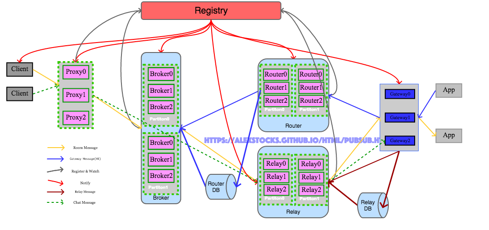

## 一套高可用实时消息系统实现
---
*written by Alex Stocks on 2017/12/31，版权所有，无授权不得转载*

### 1 极简实现
---

所谓群聊系统消息，就是一种群聊方式，譬如直播房间内的聊天对应的服务器端就是一个群聊消息系统。

2017年9月初初步实现了一套极简的消息系统，其大致架构如下：


系统名词解释：

> 1 Client : 消息发布者【其位于服务端内，亦可叫做服务端群聊消息系统调用者，不要与APP Client混淆】，publisher；
>
> 2 Proxy : 系统代理，对外统一接口，收集 Client 发来的消息转发给 Broker；
>
> 3 Broker ：系统消息转发Server，Broker 会根据 Gateway Message 组织一个 RoomGatewayList【key为 RoomID，value为 Gateway IP:Port 地址列表】，然后把 Proxy 发来的消息转发到 Room 中所有成员登录的所有 Gateway；
>
> 4 Router ：用户登录消息转发者，把 Gateway 转发来的用户登入登出消息转发给所有的 Broker；
>
> 5 Gateway ：所有服务端的入口，接收合法客户端的连接，并把客户端的登录登出消息通过 Router 转发给所有的 Broker；
>
> 6 Room Message : Room 聊天消息；
>
> 7 Gateway Message : Room 内某成员 登录 或者 登出 某Gateway消息，包含用户 UIN/RoomID/Gateway 地址 {IP:Port} 等消息；

当一个 Room 中多个用户的 APP 连接一个 Gateway 的时候，Broker只会根据 RoomID 把房间内的消息转发一次给这个Gateway，由Gateway再把消息复制多份分别发送给连接这个 Gateway 的 Room 中的所有用户的客户端。

这套系统有如下特点：

- 1 系统只转发房间内的聊天消息，每个节点收到后立即转发出去，不存储任何房间内的聊天消息，不考虑消息丢失以及消息重复的问题；
- 2 系统固定地由一个 Proxy、三个 Broker 和一个 Router 构成；
- 3 Proxy 接收后端发送来的房间消息，然后按照一定的负载均衡算法把消息发往某个 Broker，Broker 则把消息发送到所有与 Room 有关系的接口机 Gateway；
- 4 Router 接收 Gateway 转发来的某个 Room 内某成员在这个 Gateway 的登出或者登录消息，然后把消息发送到所有 Broker；
- 5 Broker 收到 Router 转发来的 Gateway 消息后，更新（添加或者删除）与某 Room 相关的 Gateway 集合记录；
- 6 整个系统的通信链路采用 UDP 通信方式；

从以上特点，整个消息系统足够简单，**不考虑扩缩容问题**，当系统负载到达极限的时候，就**重新再部署一套系统**以应对后端client的消息压力。

这种处理方式本质是把系统的扩容能力甩锅给了后端 Client 以及前端 Gateway：**每次扩容一个系统，所有 Client 需要在本地配置文件中添加一个 Proxy 地址然后全部重启，所有 Gateway 则需要再本地配置文件添加一个 Router 地址然后全部重启。**

这种“幸福我一人，辛苦千万家”的扩容应对方式，必然导致公司内部这套系统的使用者怨声载道，升级之路就是必然的了。

### 2 可扩展
---

大道之行也，天下为公，不同的系统有不同的构架，相同的系统总有类似的实现。类似于数据库的分库分表【关于分库分表，目前看到的最好的文章是参考文档1】，其扩展实现核心思想是分 Partition 分 Replica，但各 Replica 之间还区分leader（leader-follower，只有leader可接受写请求）和 non-leader（所有replica均可接收写请求）两种机制。

从数据角度来看，这套系统接收两种消息：Room Message（房间聊天消息）和 Gateway Message（用户登录消息）。两种消息的交汇之地就是Broker，所以应对扩展的紧要地方就是 Broker，Broker 的每个 Partition 采用 non-leader 机制，各 replica 均可接收 Gateway Message 消息写请求和 Room Message 转发请求。

首先，当 Room Message 量加大时可以对 Proxy 进行水平扩展，多部署 Proxy 即可因应 Room Message 的流量。

其次，当 Gateway Message 量加大时可以对 Router 进行水平扩展，多部署 Router 即可因应 Gateway Message 的流量。

最后，两种消息的交汇之地 Broker 如何扩展呢？可以把若干 Broker Replica 组成一个 Partition，因为 Gateway Message 是在一个 Partition 内广播的，所有 Broker Replica 都会有相同的 RoomGatewayList 数据，因此当 Gateway Message 增加时扩容 Partition 即可。当 Room Message 量增加时，水平扩容Partition 内的 Broker Replica 即可，因为 Room Message 只会发送到 Partition 内某个R eplica 上。

从个人经验来看，Room ID 的增长以及 Room 内成员的增加量在一段时间内可以认为是线性增加，而 Room Message 可能会以指数级增长，所以若部署得当则 Partition 扩容的概率很小，而 Partition 内 Replica 水平增长的概率几乎是 100%。

不管是 Partition 级别的水平扩容还是 Partition Replica 级别的水平扩容，不可能像系统极简版本那样每次扩容后都需要 Client 或者 Gateway 去更新配置文件然后重启，因应之道就是可用 zookeeper 充当角色的 Registry。通过这个 zookeeper 注册中心，相关角色扩容的时候在 Registry 注册后，与之相关的其他模块得到通知即可获取其地址等信息。采用 zookeeper 作为 Registry 的时候，所以程序实现的时候采用实时watch和定时轮询的策略保证数据可靠性，因为一旦网络有任何的抖动，zk就会认为客户端已经宕机把链接关闭。

分析完毕，与之相对的架构图如下：


分章节描述各个模块详细流程。

#### 2.1 Client ###
---

Client详细流程如下：

- 1 从配置文件加载 Registry 地址；
- 2 从 Registy 路径 `/pubsub/proxy`(Proxy 注册路径) 下获取所有的 Proxy，依据各个 Proxy ID 大小顺序递增组成一个 ProxyArray；
- 3 启动一个线程实时关注 Registry 路径 `/pubsub/proxy`，以获取Proxy的动态变化，及时更新 ProxyArray；
- 4 启动一个线程定时轮询获取 Registry 路径 `/pubsub/proxy` 下各个 Proxy 实例，作为关注策略的补充，以期本地ProxyArray 内各个 Proxy 成员与 Registry 上的各个 Proxy 保持一致；定时给各个 Proxy 发送心跳，异步获取心跳回包；定时清除 ProxyArray 中心跳超时的 Proxy 成员；
- 5 发送消息的时候采用 snowflake 算法给每个消息分配一个 MessageID ，然后采用相关负载均衡算法把消息转发给某个 Proxy。

**本系统使用 Zookeeper 作为 Registry，而 Zookeeper 的通知机制有名的不可靠且延迟高（15s），所以采用 Zookeeper 自身的 Watch 机制的同时使用定时查询策略作为补偿机制。定时策略的定时时间单位应该是分钟级，不能小于 Zookeeper 自身的通知延时时长，以防止 Zookeeper 系统的轻微抖动造成消息系统的服务波动。**

#### 2.2 Proxy
---

Proxy详细流程如下：

- 1 读取配置文件，获取 Registry 地址；
- 2 把自身信息注册到 Registry 路径 `/pubsub/proxy` 下，把 Registry 返回的 ID 作为自身 ReplicaID；
- 3 从 Registry 路径 `/pubsub/broker/partition(x)` 下获取每个 Broker Partition 的各个 replica；
- 4 从 Registry 路径 `/pubsub/broker/partition_num` 获取当前有效的 Broker Partition Number；
- 5 启动一个线程关注 Registry 上的 Broker 路径 `/pubsub/broker`，以实时获取以下信息：

```
	Broker Partition Number；
	​新的Broker Partition（此时发生了扩容）；
	Broker Partition内新的broker replica（Partition内发生了replica扩容）；
	Broker Parition内某replica挂掉的信息；
```

- 6 定时向各个 Broker replica 发送心跳，异步等待 Broker 返回的心跳响应包，以探测其活性，以保证不向超时的 replica 转发 Room Message；
- 7 启动一个线程定时读取 Registry 上的 Broker 路径 /pubsub/broker 下各个子节点的值，以定时轮询的策略观察 Broker Partition Number 变动，以及各 Partition 的变动情况，作为实时策略的补充；同时定时检查心跳包超时的 Broker，从有效的 BrokerList 中删除；
- 8 依据规则`BrokerPartitionID = RoomID % BrokerPartitionNum， BrokerReplicaID = RoomID % BrokerPartitionReplicaNum` 向某个 Partition 的 replica 转发 Room Message，收到 Client 的 Heatbeat 包时要及时给予响应。

<font color=blue>**之所以把 Room Message 和 Heartbeat Message 放在一个线程处理，是为了防止进程假死这种情况。**</font>

当 `/pubsub/broker/partition_num` 的值发生改变的时候(譬如值改为4)，意味着 Router Partition 进行了扩展，Proxy 需及时获取新 Partition 路径（如 `/pubsub/broker/Partition2` 和 `/pubsub/broker/Partition3`）下的实例，并关注这些路径，获取新 Partition 下的实例。

之所以 Proxy 在获取 Registry 下所有当前的 Broker 实例信息后再注册自身信息，是因为此时 Broker 子系统扩容完成，才具有转发消息的资格。

Proxy 转发某个 Room 消息时候，只发送给处于 Running 状态的 Broker。为 Broker Partition 内所有 replica 依据Registry 给其分配的 replicaID 进行递增排序，组成一个 Broker Replica Array，规则中BrokerPartitionReplicaNum 为 Array 的 size，而 BrokerReplicaID 为 replica 在 Array 中的下标。

#### 2.2.1 Pipeline
---

收到的 Room Message 需要做三部工作：收取 Room Message、消息协议转换和向 Broker 发送消息。

初始系统这三步流程如果均放在一个线程内处理，proxy 的整体吞吐率只有 50 000 Msg/s，最后的实现方式是按照消息处理的三个步骤以 pipeline 方式做如下流程处理：

+ 1 启动 1 个消息接收线程和 N【N == Broker Parition 数目】个多写一读形式的无锁队列【称之为消息协议转换队列】，消息接收线程分别启动一个 epoll 循环流程收取消息，然后把消息以相应的 hash 算法【队列ID =  UIN % N】写入对应的消息协议转换队列；
+ 2 启动 N 个线程 和 N * 3 个一写一读的无锁队列【称之为消息发送队列】，每个消息协议专家线程从消息协议转换队列接收到消息并进行协议转换后，根据相应的 hash 算法【队列ID =  UIN % 3N】写入消息发送队列；
+ 3 启动 3N 个消息发送线程，分别创建与之对应的 Broker 的连接，每个线程单独从对应的某个消息发送队列接收消息然后发送出去。

经过以上流水线改造后，Proxy 的整体吞吐率可达 200 000 Msg/s。

#### 2.2.2 大房间消息处理
---

每个 Room 的人数不均，最简便的解决方法就是给不同人数量级的 Room 各搭建一套消息系统，不用修改任何代码。

然所谓需求推动架构改进，在系统迭代升级过程中遇到了这样一个需求：业务方有一个全国 Room，用于给所有在线用户进行消息推送。针对这个需求，不可能为了一个这样的 Room 单独搭建一套系统，况且这个 Room 的消息量很少。

如果把这个 Room 的消息直接发送给现有系统，它有可能影响其他 Room 的消息发送：消息系统是一个写放大的系统，全国 Room 内有系统所有的在线用户，每次发送都会卡顿其他 Room 的消息发送。

最终的解决方案是：使用类似于分区的方法，把这样的大 Room 映射为 64 个虚拟 Room【称之为 VRoom】。在 Room 号段分配业务线的配合下，给消息系统专门保留了一个号段，用于这种大 Room 的切分，在 Proxy 层依据一个 hash 方法 【 VRoomID = UserID % 64】 把每个 User 分配到相应的 VRoom，其他模块代码不用修改即完成了大 Room 消息的路由。 

#### 2.3 Broker
---

Broker详细流程如下：

- 1 Broker 加载配置，获取自身所在 Partition 的 ID（假设为3）；
- 2 向 Registry 路径 `/pubsub/broker/partition3` 注册，设置其状态为 Init ，注册中心返回的 ID 作为自身的 ID(replicaID)；
- 3 接收 Router 转发来的 Gateway Message，放入 GatewayMessageQueue；
- 4 从 Database 加载数据，把自身所在的 Broker Partition 所应该负责的 RoomGatewayList 数据加载进来；
- 5 异步处理 GatewayMessageQueue 内的 Gateway Message，只处理满足规则【PartitionID == RoomID % PartitionNum】的消息，把数据存入本地路由信息缓存；
- 6 修改 Registry 路径 `/pubsub/broker/partition3` 下自身节点的状态为Running；
- 7 启动线程实时关注 Registry 路径 `/pubsub/broker/partition_num` 的值；
- 8 启动线程定时查询 Registry 路径 `/pubsub/broker/partition_num` 的值；
- 9 当 Registry 路径 `/pubsub/broker/partition_num` 的值发生改变的时候，依据规则【PartitionID == RoomID % PartitionNum】清洗本地路由信息缓存中每条数据；
- 10 接收 Proxy 发来的 Room Message，依据 RoomID 从路由信息缓存中查找 Room 有成员登陆的所有 Gateway，把消息转发给这些 Gateway；

注意 Broker 之所以先注册然后再加载 Database 中的数据，是为了在加载数据的时候同时接收 Router 转发来的 Gateway Message，但是在数据加载完前这些受到的数据先被缓存起来，待所有 RoomGatewayList 数据加载完后就把这些数据重放一遍；

Broker 之所以区分状态，是为了在加载完毕 RoomGatewayList 数据前不对 Proxy 提供转发消息的服务，同时也方便 Broker Partition 应对消息量增大时进行水平扩展。

当 Broker 发生 Partition 扩展的时候，新的 Partition 个数必须是 2 的幂，只有新 Partition 内所有 Broker Replica 都加载实例完毕，再更改 `/pubsub/broker/partition_num` 的值。

老的 Broker 也要 watch 路径 `/pubsub/broker/partition_num` 的值，当这个值增加的时候，它也需要清洗本地的路由信息缓存。

Broker 的扩容过程犹如细胞分裂，形成中的两个细胞有着完全相同的数据，分裂完成后【Registry路径 `/pubsub/broker/partition_num` 的值翻倍】则需要清洗垃圾信息。这种方法称为翻倍法。

#### 2.4 Router
---

Router详细流程如下：

- 1 Router 加载配置文件中的 Registry 地址；
- 2 把自身信息注册到 Registry 路径 `/pubsub/router` 下，把 Registry 返回的 ID 作为自身 ReplicaID；
- 3 从 Registry 路径 `/pubsub/broker/partition(x)` 下获取每个 Broker Partition 的各个 replica；
- 4 从 Registry 路径 `/pubsub/broker/partition_num` 获取当前有效的 Broker Partition Number；
- 5 启动一个线程关注 Registry 上的 Broker 路径 `/pubsub/broker`，以实时获取以下信息：

```
	Broker Partition Number；
	​新的Broker Partition（此时发生了扩容）；
	Broker Partition内新的broker replica（Partition内发生了replica扩容）；
	Broker Parition内某replica挂掉的信息；
```

- 6 定时向各个 Broker replica 发送心跳，异步等待 Broker 返回的心跳响应包，以探测其活性，以保证不向超时的 replica 转发 Gateway Message；
- 7 启动一个线程定时读取 Registry 上的 Broker 路径 `/pubsub/broker` 下各个子节点的值，以定时轮询的策略观察 Broker Partition Number 变动，以及各 Partition 的变动情况，作为实时策略的补充；同时定时检查心跳包超时的 Broker，从有效的 BrokerList 中删除；
- 8 从 Database 全量加载路由 RoomGatewayList 数据放入本地缓存；
- 9 收取 Gateway 发来的客户端心跳消息，及时返回 ack 包；
- 10 收取 Gateway 转发来的 Gateway Message，按照一定规则【BrokerPartitionID % BrokerPartitionNum = RoomID % BrokerPartitionNum】转发给<font color=blue>**某个 Broker Partition 下所有 Broker Replica **</font>，保证 Partition 下所有 replica 拥有同样的路由 RoomGatewayList 数据，再把 Message 内数据存入本地缓存，当检测到数据不重复的时候把数据异步写入 Database；

#### 2.5 Gateway
---

Gateway详细流程如下：

- 1 读取配置文件，加载 Registry 地址；
- 2 获取 Registry 路径 `/pubsub/router/` 下所有 router replica，依据各 Replica 的 ID 递增排序组成 replica 数组 RouterArray；
- 3 启动一个线程实时关注 Registry 路径 `/pubsub/router`，以获取 Router 的动态变化，及时更新 RouterArray；
- 4 启动一个线程定时轮询获取 Registry 路径 `/pubsub/router` 下各个Router实例，作为关注策略的补充，以期本地 RouterArray 及时更新；定时给各个 Router 发送心跳，异步获取心跳回包；定时清除 RouterArray 中心跳超时的 Router 成员；
- 5 当有 Room 内某成员客户端连接上来或者 Room 内所有成员都不连接当前 Gateway 节点时，依据规则【RouterArrayIndex = RoomID % RouterNum】向某个 Router 发送 Gateway Message；
- 6 收到 Broker 转发来的 Room Message 时，根据 MessageID 进行去重，如果不重复则把消息发送到连接到当前 Gateway 的 Room 内所有客户端，同时把 MessageID 缓存起来以用于去重判断。

Gateway 本地有一个基于共享内存的 LRU Cache，存储最近一段时间发送的消息的 MessageID。

### 3 系统稳定性
---

系统具有了可扩展性仅仅是系统可用的初步，整个系统要保证最低粒度的 SLA（0.99），就必须在两个维度对系统的可靠性就行感知：消息延迟和系统内部组件的高可用。

#### 3.1 消息延迟
---

准确的消息延迟的统计，通用的做法可以基于日志系统对系统所有消息或者以一定概率抽样后进行统计，但限于人力目前没有这样做。

目前使用了一个方法：通过一种构造一组伪用户 ID，定时地把消息发送给 proxy，每条消息经过一层就把在这层的进入时间和发出时间以及组件自身的一些信息填入消息，这组伪用户的消息最终会被发送到一个伪 Gateway 端，伪 Gateway 对这些消息的信息进行归并统计后，即可计算出当前系统的平均消息延迟时间。

通过所有消息的平均延迟可以评估系统的整体性能。同时，因为系统消息路由的哈希方式已知，当固定时间内伪 Gateway 没有收到消息时，就把消息当做发送失败，当某条链路失败一定次数后就可以产生告警了。

#### 3.2 高可用
---

上面的方法同时能够检测某个链路是否出问题，但是链路具体出问题的点无法判断，且实时性无法保证。

为了保证各个组件的高可用，系统引入了另一种评估方法：每个层次都给后端组件发送心跳包，通过心跳包的延迟和成功率判断其下一级组件的当前的可用状态。

譬如 proxy 定时给每个 Partition 内每个 broker 发送心跳，可以依据心跳的成功率来快速判断 broker 是否处于“假死”状态（最近业务就遇到过 broker 进程还活着，但是对任何收到的消息都不处理的情况）。

同时依靠心跳包的延迟还可以判断 broker 的处理能力，基于此延迟值可在同一 Partition 内多 broker 端进行负载均衡。


### 4 消息可靠性
---

公司内部内部原有一个走 tcp 通道的群聊消息系统，但是经过元旦一次大事故（几乎全线崩溃）后，相关业务的一些重要消息改走这套基于 UDP 的群聊消息系统了。这些消息如服务端下达给客户端的游戏动作指令，是不允许丢失的，但其特点是相对于聊天消息来说量非常小（单人1秒最多一个），所以需要在目前UDP链路传递消息的基础之上再构建一个可靠消息链路。

国内某 IM 大厂的消息系统也是以 UDP 链路为基础的，他们的做法是消息重试加 ack 构建了可靠消息稳定传输链路。但是这种做法会降低系统的吞吐率，所以需要独辟蹊径。

UDP 通信的本质就是伪装的 IP 通信，TCP 自身的稳定性无非是重传、去重和 ack，所以不考虑消息顺序性的情况下可以通过重传与去重来保证消息的可靠性。

基于目前系统的可靠消息传输流程如下：

- 1 Client 给每个命令消息依据 snowflake 算法配置一个 ID，复制三份，立即发送给不同的 Proxy；
- 2 Proxy 收到命令消息以后随机发送给一个 Broker；
- 3 Broker 收到后传输给 Gateway；
- 4 Gateway 接收到命令消息后根据消息 ID 进行重复判断，如果重复则丢弃，否则就发送给 APP，并缓存之。

正常的消息在群聊消息系统中传输时，Proxy 会根据消息的 Room ID 传递给固定的 Broker，以保证消息的有序性。

### 5 Router群集
---

当线上需要部署多套群聊消息系统的时候，Gateway 需要把同样的 Room Message 复制多份转发给多套群聊消息系统，会增大 Gateway 压力，可以把 Router 单独独立部署，然后把 Room Message 向所有的群聊消息系统转发。

Router 系统原有流程是：Gateway 按照 Room ID 把消息转发给某个 Router，然后 Router 把消息转发给下游 Broker 实例。新部署一套群聊消息系统的时候，新系统 Broker 的schema 需要通过一套约定机制通知 Router，使得 Router 自身逻辑过于复杂。


重构后的 Router 架构参照上图，也采用分 Partition 分 Replica 设计，Partition 内部各 Replica 之间采用 non-leader 机制；各 Router Replica 不会主动把Gateway Message 内容 push 给各 Broker，而是各 Broker 主动通过心跳包形式向 Router Partition 内某个 Replica 注册，而后此 Replica 才会把消息转发到这个 Broker 上。

类似于 Broker，Router Partition 也以 2 倍扩容方式进行 Partition 水平扩展，并通过一定机制保证扩容或者 Partition 内部各个实例停止运行或者新启动时，尽力保证数据的一致性。

Router Replica 收到 Gateway Message 后，replica 先把 Gateway Message 转发给 Partition 内各个 peer replica，然后再转发给各个订阅者。Router 转发消息的同时异步把消息数据写入 Database。

独立 Router 架构下，下面分别详述 Gateway、Router 和 Broker 三个相关模块的详细流程。

#### 5.1 Gateway
---

Gateway详细流程如下：

- 1 从 Registry 路径 `/pubsub/router/partition(x)` 下获取每个 Partition 的各个 replica；
- 2 从 Registry 路径 `/pubsub/router/partition_num` 获取当前有效的 Router Partition Number；
- 3 启动一个线程关注 Registry 上的 Router 路径 `/pubsub/router`，以实时获取以下信息：

```
	Router Partition Number；
	新的Router Partition（此时发生了扩容）；
	Partition内新的replica（Partition内发生了replica扩容）；
	Parition内某replica挂掉的信息；
```

- 4 定时向各个 Partition replica 发送心跳，异步等待 Router 返回的心跳响应包，以探测其活性，以保证不向超时的 replica 转发 Gateway Message；
- 4 启动一个线程定时读取 Registry 的 Router 路径 /pubsub/router 下各个子节点的值，以定时轮询的策略观察 Router Partition Number 变动，以及各 Partition 的变动情况，作为实时策略的补充；同时定时检查心跳包超时的 Router，从有效的 BrokerList 中删除；
- 6 依据规则向某个 Partition 的 replica 转发 Gateway Message；

第六步的规则决定了 Gateway Message 的目的 Partition 和 replica，规则内容有：
> 如果某 Router Partition ID 满足 condition `RoomID % RouterPartitionNumber == RouterPartitionID % RouterPartitionNumber`，则把消息转发到此 Partition；
> >> 这里之所以不采用直接 hash 方式 `RouterPartitionID = RoomID % RouterPartitionNumber` 获取 Router Partition，是考虑到当 Router 进行 2 倍扩容的时候当所有新的 Partition 的所有 Replica 都启动完毕且数据一致时才会修改 Registry 路径 `/pubsub/router/partition_num` 的值，按照规则的计算公式才能保证新 Partition 的各个 Replica 在启动过程中就可以得到 Gateway Message，也即此时每个 Gateway Message 会被发送到两个 Router Partition。
> >> 当 Router 扩容完毕，修改 Registry 路径 `/pubsub/router/partition_num` 的值后，此时新集群进入稳定期，每个 Gateway Message 只会被发送固定的一个Partition，condition `RoomID % RouterPartitionNumber == RouterPartitionID % RouterPartitionNumber` 等效于 `RouterPartitionID = RoomID % RouterPartitionNumber`。
>
> 如果 Router Partition 内某 replia 满足 condition `replicaPartitionID = RoomID % ReplicaNumber`，则把消息转发到此replica。
>
> >> replica 向 Registry 注册的时候得到的 ID 称之为 replicaID，Router Parition 内所有 replica 按照 replicaID 递增排序组成 replica 数组 RouterPartitionReplicaArray，replicaPartitionID 即为 replica 在数组中的下标。

##### 5.1.1 Gateway Message 数据一致性
---

Gateway 向 Router 发送的 Router Message 内容有两种：某 user 在当前 Gateway 上进入某 Room 和某 user 在当前 Gateway 上退出某 Room，数据项分别是 UIN（用户ID）、Room ID、Gateway Addr和User Action(Login or Logout)。

由于所有消息都是走 UDP 链路进行转发，则这些消息的顺序就有可能乱序。Gateway 可以统一给其发出的所有消息分配一个全局递增的 ID【下文称为 GatewayMsgID，Gateway Message ID】以保证消息的唯一性和全局有序性。

Gateway 向 Registry 注册临时有序节点时，Registry 会给 Gateway 分配一个 ID，Gateway 可以用这个 ID 作为自身的 Instance ID【假设这个ID上限是 65535】。

GatewayMsgID 字长是 64 bit，其格式如下：

	// 63 -------------------------- 48 47 -------------- 38 37 ------------ 0
	// |  16bit Gateway Instance ID    |   10bit Reserve    |    38bit自增码  |

#### 5.2 Router
---

Router 系统部署之前，先设置 Registry 路径 `/pubsub/router/partition_num` 的值为1。

Router 详细流程如下：

- 1 Router 加载配置，获取自身所在 Partition 的 ID（假设为3）；
- 2 向 Registry 路径 `/pubsub/router/partition3` 注册，设置其状态为 Init，注册中心返回的 ID 作为自身的 ID(replicaID)；
- 3 注册完毕会收到 Gateway 发来的 Gateway Message 以及 Broker 发来的心跳消息（HeartBeat Message），先缓存到消息队列 MessageQueue；
- 4 从 Registry 路径 `/pubsub/router/partition3` 下获取自身所在的 Partition 内的各个 replica；
- 5 从 Registry 路径 `/pubsub/router/partition_num` 获取当前有效的 Router Partition Number；
- 6 启动一个线程关注 Registry 路径 `/pubsub/router`，以实时获取以下信息：

```
	Router Partition Number；
	Partition内新的replica（Partition内发生了replica扩容）；
	Parition内某replica挂掉的信息；
```

- 7 从 Database 加载数据；
- 8 启动一个线程异步处理 MessageQueue 内的 Gateway Message，把 Gateway Message 转发给同 Partition 内其他 peer replica，然后依据规则【RoomID % BrokerPartitionNumber == BrokerReplicaPartitionID % BrokerPartitionNumber】转发给 BrokerList 内每个 Broker；处理 Broker 发来的心跳包，把 Broker 的信息存入本地 BrokerList，然后给 Broker 发送回包；
- 9 修改 Registry 路径 `/pubsub/router/partition3` 下节点的状态为 Running；
- 10 启动一个线程定时读取 Registry 路径 `/pubsub/router` 下各个子路径的值，以定时轮询的策略观察 Router 各 Partition 的变动情况，作为实时策略的补充；检查超时的 Broker，把其从 BrokerList 中剔除；
- 11 当 RouterPartitionNum 倍增时，Router 依据规则【RoomID % BrokerPartitionNumber == BrokerReplicaPartitionID % BrokerPartitionNumber】清洗自身路由信息缓存中数据；
- 12 Router 本地存储每个 Gateway 的最大 GatewayMsgID，收到小于 GatewayMsgID的Gateway Message  可以丢弃不处理，否则就更新 GatewayMsgID 并根据上面逻辑进行处理。

之所以把 Gateway Message 和 Heartbeat Message 放在一个线程处理，是为了防止进程假死这种情况。

Broker 也采用了分 Partition 分 Replica 机制，所以向 Broker 转发 Gateway Message 时候路由规则，与 Gateway 向 Router 转发消息的路由规则相同。

另外启动一个工具，当水平扩展后新启动的 Partition 内所有 Replica 的状态都是 Running 的时候，修改 Registry 路径 `/pubsub/router/partition_num` 的值为所有 Partition 的数目。

#### 5.3 Broker
---

Broker 详细流程如下：

- 1 Broker 加载配置，获取自身所在 Partition 的 ID（假设为3）；
- 2 向 Registry 路径 `/pubsub/broker/partition3` 注册，设置其状态为 Init，注册中心返回的 ID 作为自身的 ID(replicaID)；
- 3 从 Registry 路径 `/pubsub/router/partition_num` 获取当前有效的 Router Partition Number；
- 4 从 Registry 路径 `/pubsub/router/partition(x)` 下获取每个 Router Partition 的各个replica；
- 5 启动一个线程关注 Registry 路径 `/pubsub/router`，以实时获取以下信息：

```
	Router Partition Number；
	新的Router Partition（此时发生了扩容）；
	Partition内新的replica（Partition内发生了replica扩容）；
	Parition内某replica挂掉的信息；
```

- 6 依据规则【RouterPartitionID % BrokerPartitionNum == BrokerPartitionID % BrokerPartitionNum，RouterReplicaID = BrokerReplicaID % BrokerPartitionNum】选定目标 Router Partition 下某个 Router replica，向其发送心跳消息，包含 BrokerPartitionNum、BrokerPartitionID、BrokerHostAddr 和精确到秒级的 Timestamp ，并异步等待所有 Router replica 的回复，所有 Router 转发来的 Gateway Message 放入 GatewayMessageQueue；
- 7 依据规则【BrokerPartitionID == RoomID % BrokerParitionNum】从 Database 加载数据；
- 8 依据规则【BrokerPartitionID % BrokerParitionNum == RoomID % BrokerParitionNum】异步处理 GatewayMessageQueue 内的 Gateway Message，只留下合乎规则的消息的数据；
- 9 修改 Registry 路径 `/pubsub/broker/partition3` 下自身节点的状态为 Running；
- 10 启动一个线程定时读取 Registry 路径 `/pubsub/router` 下各个子路径的值，以定时轮询的策略观察 Router 各 Partition 的变动情况，作为实时策略的补充；定时检查超时的 Router，某 Router 超时后更换其所在的 Partition 内其他 Router 替换之，定时发送心跳包；
- 11 当 Registry 路径 `/pubsub/broker/partition_num` 的值 BrokerPartitionNum 发生改变的时候，依据规则【PartitionID == RoomID % PartitionNum】清洗本地路由信息缓存中每条数据；
- 12 接收 Proxy 发来的 Room Message，依据 RoomID 从路由信息缓存中查找 Room 有成员登陆的所有 Gateway，把消息转发给这些 Gateway；
- 13 Broker 本地存储每个 Gateway 的最大 GatewayMsgID，收到小于 GatewayMsgID 的 Gateway Message 可以丢弃不处理，否则更新 GatewayMsgID 并根据上面逻辑进行处理。

BrokerPartitionNumber 可以小于或者等于或者大于 RouterPartitionNumber，两个数应该均是2的幂，两个集群可以分别进行扩展，互不影响。譬如BrokerPartitionNumber=4 而 RouterPartitionNumber=2，则 Broker Partition 3 只需要向 Router Partition 1 的某个 follower 发送心跳消息即可；若 BrokerPartitionNumber=4 而 RouterPartitionNumber=8，则 Broker Partition 3 需要向 Router Partition 3 的某个 follower 发送心跳消息的同时，还需要向 Router Partition 7 的某个 follower 发送心跳，以获取全量的 Gateway Message。

Broker 需要关注 `/pubsub/router/partition_num` 和 `/pubsub/broker/partition_num` 的值的变化，当 router 或者 broker 进行 parition 水平扩展的时候，Broker 需要及时重新构建与 Router 之间的对应关系，及时变动发送心跳的 Router Replica 对象【RouterPartitionID = BrokerReplicaID % RouterPartitionNum，RouterPartitionID 为 Router Replica 在 PartitionRouterReplicaArray 数组的下标】。

当 Router Partition 内 replica 死掉或者发送心跳包的 replica 对象死掉（无论是注册中心通知还是心跳包超时），broker 要及时变动发送心跳的 Router replica 对象。

另外，Gateway 使用 UDP 通信方式向 Router 发送 Gateway Message，如若这个 Message 丢失则此 Gateway 上该 Room 内所有成员一段时间内（当有新的成员在当前 Gateway 上加入 Room
时会产生新的 Gateway Message）都无法再接收消息，为了保证消息的可靠性，可以使用这样一个约束解决问题：<font color=blue>**在此Gateway上登录的某 Room 内的人数少于 3 时，Gateway 会把 Gateway Message 复制两份非连续（如以10ms为时间间隔）重复发送给某个 Partition leader。**</font>因 Gateway Message 消息处理的幂等性，重复 Gateway Message 并不会导致 Room Message 发送错误，只在极少概率的情况下会导致 Gateway 收到消息的时候 Room 内已经没有成员在此 Gateway 登录，此时 Gateway 会把消息丢弃不作处理。

传递实时消息群聊消息系统的 Broker 向特定 Gateway 转发 Room Message 的时候，会带上 Room 内在此 Gateway 上登录的用户列表，Gateway 根据这个用户列表下发消息时如果检测到此用户已经下线，在放弃向此用户转发消息的同时，还应该把此用户已经下线的消息发送给 Router，当 Router 把这个消息转发给 Broker 后，Broker 把此用户从用户列表中剔除。<font color=red>**通过这种负反馈机制保证用户状态更新的及时性**</font>。

### 6 离线消息
---

前期的系统只考虑了用户在线情况下实时消息的传递，当用户离线时其消息便无法获取。若系统考虑用户离线消息传递，需要考虑如下因素：   

* 消息固化：保证用户上线时收到其离线期间的消息；
* 消息有序：离线消息和在线消息都在一个消息系统传递，给每个消息分配一个 ID 以区分消息先后顺序，消息顺序越靠后则 ID 愈大。

离线消息的存储和传输，需要考虑用户的状态以及每条消息的发送状态，整个消息核心链路流程会有大的重构。新消息架构如下图：


系统名词解释：

> 1 Pi : 消息ID存储模块，存储每个人未发送的消息 ID 有序递增集合；
>
> 2 Xiu : 消息存储KV模块，存储每个人的消息，给每个消息分配 ID，以 ID 为 key，以消息内为 value；
>
> 3 Gateway Message(HB) : 用户登录登出消息，包括APP保活定时心跳（Hearbeat）消息；

系统内部代号貔貅(貔貅者，雄貔雌貅)，源自上面两个新模块。

这个版本架构流程的核心思想为“消息ID与消息内容分离，消息与用户状态分离”。消息发送流程涉及到模块 Client/Proxy/Pi/Xiu，消息推送流程则涉及到模块 Pi/Xiu/Broker/Router/Gateway。

下面先细述Pi和Xiu的接口，然后再详述发送和推送流程。

#### 6.1 Xiu
---

Xiu 模块功能名称是 Message Storage，用户缓存和固化消息，并给消息分配 ID。Xiu 集群采用分 Partition 分 Replica 机制，Partition 初始数目须是2的倍数，集群扩容时采用翻倍法。

##### 6.1.1 存储消息
---

存储消息请求的参数列表为 {SnowflakeID，UIN, Message}，其流程如下：

- 1 接收客户端发来的消息，获取消息接收人 ID（UIN）和客户端给消息分配的 SnowflakeID；
- 2 检查 `UIN % Xiu_Partition_Num == Xiu_Partition_ID % Xiu_Partition_Num` 添加是否成立【即接收人的消息是否应当由当前Xiu负责】，不成立则返回错误并退出；
- 3 检查 SnowflakeID 对应的消息是否已经被存储过，若已经存储过则返回其对应的消息ID然后退出；
- 4 给消息分配一个 MsgID；

	每个Xiu有自己唯一的 Xiu\_Partition\_ID，以及一个初始值为 0 的 Partition\_Msg\_ID。MsgID = 1B[ Xiu\_Partition\_ID ] + 1B[ Message Type ] + 6B[ ++ Partition\_Msg\_ID ]。每次分配的时候 Partition\_Msg\_ID 都自增加一。

- 5 以 MsgID 为 key 把消息存入基于共享内存的 Hashtable，并存入消息的 CRC32 hash值和插入时间，把 MsgID 存入一个 LRU list 中；

	LRU List 自身并不存入共享内存中，当进程重启时，可以根据Hashtable中的数据重构出这个List。把消息存入 Hashtable 中时，如果 Hashtable full，则依据 LRU List 对Hashtable 中的消息进行淘汰。

- 6 把MsgID返回给客户端；
- 7 把MsgID异步通知给消息固化线程，消息固化线程根据MsgID从Hashtable中读取消息并根据CRC32 hash值判断消息内容是否完整，完整则把消息存入本地RocksDB中；

##### 6.1.2 读取消息
---

读取消息请求的参数列表为{UIN, MsgIDList}，其流程为：

- 1 获取请求的 MsgIDList，判断每个MsgID `MsgID{Xiu_Partition_ID} == Xiu_Partition_ID` 条件是否成立，不成立则返回错误并退出；
- 2 从 Hashtable 中获取每个 MsgID 对应的消息；
- 3 如果 Hashtable 中不存在，则从 RocksDB 中读取 MsgID 对应的消息；
- 4 读取完毕则把所有获取的消息返回给客户端。

##### 6.1.3 主从数据同步
---

目前从简，暂定 Xiu 的副本只有一个。

Xiu 节点启动的时候根据自身配置文件中分配的 Xiu\_Partition\_ID 到 Registry 路径 `/pubsub/xiu/partition_id` 下进行注册一个临时有序节点，注册成功则 Registry 会返回 Xiu 的节点 ID。

Xiu节点获取 `/pubsub/xiu/partition\_id` 下的所有节点的 ID 和地址信息，依据 `节点ID最小者为leader` 的原则，即可判定自己的角色。只有 leader 可接受读写数据请求。

数据同步流程如下：

- 1 follower 定时向 leader 发送心跳信息，心跳信息包含本地最新消息的 ID；
- 2 leader 启动一个数据同步线程处理 follower 的心跳信息，leader 的数据同步线程从 LRU list 中查找 follower\_latest\_msg\_id 之后的N条消息的ID，若获取到则读取消息并同步给 follower，获取不到则回复其与 leader 之间消息差距太大；
- 3 follower 从 leader 获取到最新一批消息，则存储之；
- 4 follower 若获取 leader 的消息差距太大响应，则请求 leader 的 agent 把 RocksDB 的固化数据全量同步过来，整理完毕后再次启动与 leader 之间的数据同步流程。

follower 会关注 Registry 路径  /pubsub/xiu/partition\_id 下所有所有节点的变化情况，如果 leader 挂掉则及时转换身份并接受客户端请求。如果 follower 与 leader 之间的心跳超时，则 follower 删掉 leader 的 Registry 路径节点，及时进行身份转换处理客户端请求。

当 leader 重启或者 follower 转换为 leader 的时候，需要把 Partition\_Msg\_ID 进行一个大数值增值（譬如增加1000）以防止可能的消息 ID 乱序情况。

##### 6.1.4 集群扩容
---

Xiu 集群扩容采用翻倍法，扩容时新 Partition 的节点启动后工作流程如下：

- 1 向Registry的路径 `/pubsub/xiu/partition_id` 下自己的 node 的 state 为 running，同时注册自己的对外服务地址信息；

另外启动一个工具，当水平扩展后所有新启动的 Partition 内所有 Replica 的状态都是 Running 的时候，修改 Registry 路径 /pubsub/xiu/partition\_num 的值为扩容后 Partition 的数目。按照开头的例子，即由2升级为4。

之所以 Xiu 不用像 Broker 和 Router 那样启动的时候向老的 Partition 同步数据，是因为每个 Xiu 分配的 MsgID 中已经带有 Xiu 的 PartitionID 信息，即使集群扩容这个 ID 也不变，根据这个ID也可以定位到其所在的Partition，而不是借助 hash 方法。

#### 6.2 Pi
---

Pi 模块功能名称是 Message ID Storage，存储每个用户的 MsgID List。Xiu 集群也采用分 Partition 分 Replica 机制，Partition 初始数目须是2的倍数，集群扩容时采用翻倍法。

##### 6.2.1 存储消息ID
---

MsgID 存储的请求参数列表为{UIN，MsgID}，Pi 工作流程如下：

- 1 判断条件 `UIN % Pi_Partition_Num == Pi_Partition_ID % Pi_Partition_Num` 是否成立，若不成立则返回error退出；
- 2 把 MsgID 插入UIN的 MsgIDList 中，保持 MsgIDList 中所有 MsgID 不重复有序递增，把请求内容写入本地log，给请求者返回成功响应。

Pi有专门的日志记录线程，给每个日志操作分配一个 LogID，每个 Log 文件记录一定量的写操作，当文件 size 超过配置的上限后删除之。

##### 6.2.2 读取消息ID列表
---

读取请求参数列表为{UIN, StartMsgID, MsgIDNum, ExpireFlag}，其意义为获取用户 UIN 自起始ID为 StartMsgID 起（不包括 StartMsgID ）的数目为 MsgIDNum 的消息ID列表，ExpireFlag意思是 所有小于等于 StartMsgID 的消息ID是否删除。 流程如下：

- 1 判断条件 `UIN % Pi_Partition_Num == Pi_Partition_ID % Pi_Partition_Num` 是否成立，若不成立则返回error退出；
- 2 获取 (StartID, StartMsgID + MsgIDNum] 范围内的所有 MsgID，把结果返回给客户端；
- 3 如果 ExpireFlag 有效，则删除MsgIDList内所有在 [0, StartMsgID] 范围内的MsgID，把请求内容写入本地log。

##### 6.2.3 主从数据同步
---

同 Xiu 模块，暂定 Pi 的同 Parition 副本只有一个。

Pi 节点启动的时候根据自身配置文件中分配的 Pi\_Partition\_ID 到Registry路径 /pubsub/pi/partition\_id 下进行注册一个临时有序节点，注册成功则 Registry 会返回 Pi 的节点 ID。

Pi 节点获取 /pubsub/pi/partition\_id 下的所有节点的ID和地址信息，依据 `节点ID最小者为leader` 的原则，即可判定自己的角色。只有 leader 可接受读写数据请求。

数据同步流程如下：

- 1 follower 定时向 leader 发送心跳信息，心跳信息包含本地最新 LogID；
- 2 leader 启动一个数据同步线程处理 follower 的心跳信息，根据 follower 汇报的 logID 把此 LogID；
- 3 follower 从 leader 获取到最新一批 Log，先存储然后重放。

follower 会关注 Registry 路径  /pubsub/pi/partition\_id 下所有节点的变化情况，如果 leader 挂掉则及时转换身份并接受客户端请求。如果follower 与 leader 之间的心跳超时，则follower删掉 leader 的 Registry 路径节点，及时进行身份转换处理客户端请求。

##### 6.2.4 集群扩容
---

Pi 集群扩容采用翻倍法。则节点启动后工作流程如下：

- 1 向 Registry 注册，获取 Registry 路径 /pubsub/xiu/partition\_num 的值 PartitionNumber；
- 2 如果发现自己 PartitionID 满足条件 `PartitionID >= PartitionNumber` 时，则意味着当前 Partition 是扩容后的新集群，更新 Registry 中自己状态为start；
- 3 读取 Registry 路径 /pubsub/xiu 下所有 Parition 的 leader，根据条件 `自身PartitionID % PartitionNumber == PartitionID % PartitionNumber` 寻找对应的老 Partition 的 leader，称之为 parent_leader；
- 4 缓存收到 Proxy 转发来的用户请求；
- 5 向 parent_leader 获取log；
- 6 向 parent_leader 同步内存数据；
- 7 重放 parent_leader 的log；
- 8 更新 Registry 中自己的状态为 Running；
- 9 重放用户请求；
- 10 当 Registry 路径 /pubsub/xiu/partition\_num 的值 PartitionNumber 满足条件 `PartitionID >= PartitionNumber` 时，意味着扩容完成，处理用户请求时要给用户返回响应。

Proxy 会把读写请求参照条件 `UIN % Pi\_Partition\_Num == Pi\_Partition\_ID % Pi\_Partition\_Num` 向相关 partition 的 leader 转发用户请求。假设原来 PartitionNumber 值为2，扩容后值为4，则原来转发给 partition0 的写请求现在需同时转发给 partition0 和 partition2，原来转发给 partition1 的写请求现在需同时转发给 partition1 和 partition3。

另外启动一个工具，当水平扩展后所有新启动的 Partition 内所有 Replica 的状态都是 Running 的时候，修改Registry路径/pubsub/xiu/partition\_num的值为扩容后 Partition 的数目。

#### 6.3 数据发送流程
---

消息自 PiXiu 的外部客户端（Client，服务端所有使用 PiXiu 提供的服务者统称为客户端）按照一定负载均衡规则发送到 Proxy，然后存入 Xiu 中，把 MsgID 存入 Pi 中。其详细流程如下：

- 1 Client 依据 snowflake 算法给消息分配 SnowflakeID，依据 `ProxyID = UIN % ProxyNum` 规则把消息发往某个 Proxy；
- 2 Proxy 收到消息后转发到 Xiu；
- 3 Proxy 收到 Xiu 返回的响应后，把响应转发给 Client；
- 4 如果 Proxy 收到 Xiu 返回的响应带有 MsgID，则发起 Pi 写流程，把 MsgID 同步到 Pi 中；
- 5 如果 Proxy 收到 Xiu 返回的响应带有 MsgID，则给 Broker 发送一个 Notify，告知其某 UIN 的最新 MsgID。

#### 6.4 数据转发流程
---

转发消息的主体是Broker，原来的在线消息转发流程是它收到 Proxy 转发来的 Message，然后根据用户是否在线然后转发给 Gateway。

PiXiu架构下 Broker 会收到以下类型消息：

* 用户登录消息
* 用户心跳消息
* 用户登出消息
* Notify 消息
* Ack 消息

Broker流程受这五种消息驱动，下面分别详述其收到这五种消息时的处理流程。

用户登录消息流程如下：

- 1 检查用户的当前状态，若为 OffLine 则把其状态值为在线 OnLine；
- 2 检查用户的待发送消息队列是否为空，不为空则退出；
- 3 向 Pi 模块发送获取 N 条消息 ID 的请求 {UIN: uin, StartMsgID: 0, MsgIDNum: N, ExpireFlag: false}，设置用户状态为 GettingMsgIDList 并等待回应；
- 4 根据 Pi 返回的消息 ID 队列，向 Xiu 发起获取消息请求 {UIN: uin, MsgIDList: msg ID List}，设置用户状态为 GettingMsgList 并等待回应；
- 5 Xiu 返回消息列表后，设置状态为 SendingMsg，并向 Gateway 转发消息。

可以把用户心跳消息当做用户登录消息处理。

Gateway的用户登出消息产生有三种情况：

- 1 用户主动退出；
- 2 用户心跳超时；
- 3 给用户转发消息时发生网络错误；

用户登出消息处理流程如下：

- 1 检查用户状态，如果为 OffLine，则退出；
- 2 用户状态不为 OffLine 且检查用户已经发送出去的消息列表的最后一条消息的 ID（LastMsgID），向 Pi 发送获取 MsgID 请求{UIN: uin, StartMsgID: LastMsgID, MsgIDNum: 0, ExpireFlag: True}，待 Pi 返回响应后退出；

处理 Proxy 发来的 Notify 消息处理流程如下：

- 1 如果用户状态为 OffLine，则退出；
- 2 更新用户的最新消息 ID（LatestMsgID），如果用户发送消息队列不为空则退出；
- 3 向 Pi 模块发送获取 N 条消息 ID 的请求 {UIN: uin, StartMsgID: 0, MsgIDNum: N, ExpireFlag: false}，设置用户状态为 GettingMsgIDList 并等待回应；
- 4 根据 Pi 返回的消息 ID 队列，向 Xiu 发起获取消息请求 {UIN: uin, MsgIDList: msg ID List}，设置用户状态为 GettingMsgList 并等待回应；
- 5 Xiu 返回消息列表后，设置状态为 SendingMsg，并向 Gateway 转发消息。

所谓 Ack 消息，就是 Broker 经 Gateway 把消息转发给 App 后，App 给Broker的消息回复，告知Broker其最近成功收到消息的 MsgID。
Ack 消息处理流程如下：

- 1 如果用户状态为 OffLine，则退出；
- 2 更新 LatestAckMsgID 的值；
- 3 如果用户发送消息队列不为空，则发送下一个消息后退出；
- 4 如果 LatestAckMsgID >= LatestMsgID，则退出；
- 5 向 Pi 模块发送获取 N 条消息 ID 的请求 {UIN: uin, StartMsgID: 0, MsgIDNum: N, ExpireFlag: false}，设置用户状态为 GettingMsgIDList 并等待回应；
- 6 根据 Pi 返回的消息 ID 队列，向 Xiu 发起获取消息请求 {UIN: uin, MsgIDList: msg ID List}，设置用户状态为 GettingMsgList 并等待回应；
- 7 Xiu 返回消息列表后，设置状态为 SendingMsg，并向 Gateway 转发消息。

总体上，PiXiu 转发消息流程采用拉取（pull）转发模型，以上面五种消息为驱动进行状态转换，并作出相应的动作行为。

### 7 单聊消息
---

前几章所述之系统架构均基于群聊这一实时通信场景，此群聊消息系统在公司内部稳定运行近一年半时间，期间经历了6个大版本的迭代演进，赢得了各个业务线同事的信任，承担了从群聊、聊天室、语音传递、到游戏信令传递等等各种场景的群聊实时通信业务。

2017 年 9 月份刚接手系统时，已有业务方提出把对单人下发的消息【以下称之为 Chat Message】也接入这套系统，即消息系统不仅是一个群聊消息下发通道，也应该是一个单聊消息下发通道，但是考虑到当时处于系统实现初期，个人基于系统小作的考量直接拒绝了。随着这一年半其接入的业务范围的扩展，目下公司正考虑拆分 Gateway，这套消息系统需要被重构以处理单聊消息就是势然了。

公司的 Gateway 大概是我见过的最复杂的接口层系统，各种本应该放在逻辑层处理的子系统都被糅合进了接口层 Gateway 这一单个模块之内，除了公司几个创始人外很少有人清楚其它内部逻辑，据说陆续有四个高薪招聘的高手在接手这套系统后三个月内跑路了。Gateway 内部与聊天场景有关的状态数据主要有两种：用户所在的群信息【以下简称 Router Data】以及用户自身的状态信息【包括在线状态以及客户端地址信息，以下简称 Relay Data】。

Router Data 已经被群聊系统的 Router 模块替代掉，当下的 Gateway 已经不需要存储 Router Data。若扩展此系统使其能够处理单聊消息，能够存储用户的在线状态以及用户接入的 Gateway 信息，则 Gateway 就可以不用存储任何有关用户的状态数据了。

#### 7.1 实时消息系统架构
---

Relay Data 迥异于 Router Data：Relay Data 的 key 是 UIN，其数据传递依赖于 Relay Message；而 Router Data 的 key 是 GroupID，其数据传递依赖于 Gateway Message。此二者差异决定了这两种数据的处理不可能在一个单一的模块之内。

新的实时通信系统添加了一个 Relay 模块用于处理 Relay Message 并存储 Relay Data。添加了单聊消息处理能力的实时消息系统架构如下：



下面详述新架构下各个模块的功能和消息处理流程，至于系统注册、系统扩容以及注册通知等相关流程与以往处理机制雷同，下面不再详述。

注意：新架构图中把原来的专门存储 Router Data 的 Database 模块改称为 Router DB，并添加了一个 Relay DB，以专门存储 Relay Data。

##### 7.2 Gateway
---

Gateway 不再存储 Router Data 和 Relay Data，几乎成了 APP 的透明代理，其功能如下：

>- 接收 APP 的连接请求，并把用户连接消息以 Relay Message 形式发送给 Relay；
>- APP 与 Gateway 连接断开时以 Relay Message 形式发送给 Relay；
>- 把用户登录登出某 Room 的消息转发给 Router；
>- 接收 Relay 转发来的 Room Message 和 Chat Message，并下发给 APP。

##### 7.3 Relay
---

Relay 是一个新模块，但其组织方式类似于 Router，亦是分 Partition 分 Replica，处理 Relay Message。

Relay 模块依据用户的 UIN 进行把不同用户的 Relay Data 放入不同的 Parition，同 Partition 内的 所有 Relay Replica 数据一致。 

Relay 功能列表如下：

>- 接收由 Gateway 转发来的 Relay Message，存储为 Relay Data，并把 Relay Data 异步存入 Relay DB；
>- 起始时先从 Relay DB 获取其 Partiton 内所有用户的 Relay Data，以与 Partiton 内其他 Replica 保持数据一致性；
>- 接收由 Broker 转发来的 Room Message，依据 Relay Data 记录的用户所在的 Gateway 把消息复制转发给 Gateway；
>- 接收由 Proxy 转发来的 Chat Message，依据 Relay Data 记录的用户所在的 Gateway 把消息复制转发给 Gateway；

前面提及所有处理 Room Message 系统都是一个写放大的系统，究其原因是一条 Room Message 需要被复制下发给 Room 内每个人，所以 Relay 处理 Room Message 时需要根据 Room Message 内的 Room UIN List 对消息进行复制后下发给每个 User APP 所连接的 Gateway。

当然，如果用户不在线，Relay 会对 Room Message 和 Chat Message 都作丢弃处理，因为此系统只处理实时消息。 

Relay 承担了群聊消息与单聊消息的下发。

##### 7.4 Broker
---

新架构下 Broker 模块不再直接把 Room Message 转发给 Gateway，而是转发给 Relay。有了 Relay，Broker 自身只需要存储每个 Group 的 UIN List 即可，大大减轻了自身的任务流程，Broker 可以把 Relay 视作 `pseudo-gateway`。

Broker 功能列表如下：

>- 接收 Router 转发来的 Gateway Message，存储为 Router Data，并把 Router Data 异步存入 Router DB；
>- 起始时先从 Router DB 获取其 Partiton 内所有用户的 Router Data，以与 Partiton 内其他 Replica 保持数据一致性；
>- 接收由 Proxy 转发来的 Room Message，依据 Router Data 记录的 Group 内的 UIN List 把消息复制转发给各个 Relay；

Broker 仅仅承担了群聊消息下发。

##### 7.4 Proxy
---

Proxy 接收 Client 发来的消息时，需要区分消息是 Room Message 还是 Chat Message，新架构下其功能列表如下：

>- 关注 Registry Broker Path，以实时获取正确的 Broker List；
>- 关注 Registry Relay Path，以实时获取正确的 Relya List；
>- 接收 Client 发来的 Room Message，依据 Group 把消息转发给 Broker；
>- 接收 Client 发来的 Chat Message，依据 UIN 把消息转发给 Relay；

Proxy 对 Group Message 的处理仅仅是转发了事，并不需要复制，所以不存在写放大的问题。

其实还可以把 Proxy 区分为 Group Message Proxy 和 Chat Message Proxy，以期收逻辑清晰职责明了之效。

### 8 总结 ###
---

这套群聊消息系统尚有以下task list需完善：

- 1 消息以UDP链路传递，不可靠【2018/01/29解决之】；
- 2 目前的负载均衡算法采用了极简的RoundRobin算法，可以根据成功率和延迟添加基于权重的负载均衡算法实现；
- 3 只考虑传递，没有考虑消息的去重，可以根据消息ID实现这个功能【2018/01/29解决之】；
- 4 各个模块之间没有考虑心跳方案，整个系统的稳定性依赖于Registry【2018/01/17解决之】；
- 5 离线消息处理【2018/03/03解决之】；
- 6 区分消息优先级；
- 7 添加 Metaserver 模块，监控各 Broker 的 metrics数据；
- 8 添加虚拟节点和物理节点之间的映射关系，把翻倍扩容方式升级为冷热负载均衡迁移式的动态扩缩容方式；

此记。

## 参考文档 ##

- 1 [一种支持自由规划无须数据迁移和修改路由代码的Replicaing扩容方案](http://blog.csdn.net/bluishglc/article/details/7970268)

## 扒粪者-于雨氏 ##
>- 于雨氏，2017/12/31，初作此文于丰台金箱堂。
>- 于雨氏，2018/01/16，于海淀添加“#3 系统稳定性”一节。
>- 于雨氏，2018/01/29，于海淀添加“#4 消息可靠性”一节。
>- 于雨氏，2018/02/11，于海淀添加 “#5 Router群集” 一章节，并重新格式化全文。
>- 于雨氏，2018/03/05，于海淀添加 “#6 离线消息” 一章节。
>- 于雨氏，2018/03/14，于海淀添加负反馈机制、根据Gateway Message ID保证Gateway Message数据一致性 和 Gateway用户退出消息产生机制 等三个细节。
>- 于雨氏，2018/08/05，于海淀添加 “#2.2.1 pipeline” 一节。
>- 于雨氏，2018/08/28，于海淀添加 “#2.2.2 大房间消息处理” 一节。
>- 于雨氏，2019/01/19，于丰台添加 “#7 单聊消息” 一章节。
