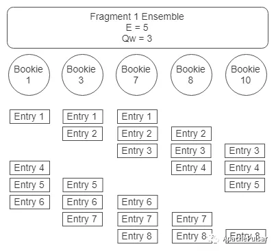

## Pulsar笔记
---
*written by Alex Stocks on 2018/10/16，版权所有，无授权不得转载*

Pulsar 是由 Yahoo 于 2016 年开源并捐赠给 Apache 基金会的一款消息中间件，其主要特点是多租户且易于扩展，本文根据自己对 Pulsar 相关文档的理解并请教相关 PMC 后写成，囿于水平有限，错误难免，欢迎留言指正。

### 1 Pulsar vs Kafka
---

很多人查看 Pulsar 之前可能对 Kafka 很熟悉，参照上图可见二者内部结构的区别，下面详述二者的异同以明了 Pulsar 的特点。

#### 1.1 名词对应表
---

 根据个人对[参考文档1](https://mp.weixin.qq.com/s/CIpCLCxqpLoQVUKz6QeDJQ)的理解，整理如下**Pulsar 和 Kafka名词对应列表**：

| Pulsar | Kafka |
| :---- | :--- |
| Topic | Topic |
| Partition | Partition |
| Ledger(Segment)/Fragment | Fragment/Segment |
| Bookie  | Broker  |
| Broker | Client SDK |
| Ensemble Size | Replica Number |
| Write Quorum Size (Qw) | metadata.broker.list |
| Ack Quorum Size (Qa) | request.required.acks |

Pulsar 和 Kafka 都是以 Topic 描述一个基本的数据集合，Topic 数据又分为若干 Partition，即对数据进行逻辑上的 sharding 后存储为若干子集合。但 Kafka 以 partition 作为物理存储单位，每个 partition 必须作为一个整体（一个目录）存储在某一个 broker 上。 而 Pulsar 的每个 partition 是以 segment（对应到 Bookkeeper 的 Ledger） 作为物理存储的单位，所以 Pulsar 中的一个逻辑上有序的 partition 数据集合在物理上会均匀分散到多个 bookie 节点中。

Pulsar 的数据存储节点 Bookkeeper 被称为 Bookie，相当于一个 Kafka Broker。Ledger 是 Topic 的若干日志的集合，是 Pulsar 数据删除的最小单元，即 Pulsar 每次淘汰以 Ledger 为单位进行删除。Fragment 是 Bookkeeper 的概念，对应一个日志文件，每个 Ledger 由若干 Fragment 组成。 

Pulsar 进行数据同步时采用相关共识算法保证数据一致性。Ensemble Size 表示 Topic 要用到的物理存储节点 Bookie 个数，类似于 Kafka，其副本数目 Ensemble Size 不能超过 Bookie 个数，因为一个 Bookie 上不可能存储超过一个以上的数据副本。每次写数据时最低写入的 Bookie 个数 Qw 的上限当然是 Ensemble Size。

Qa 是每次写请求发送完毕后需要回复确认的 Bookie 的个数，类似于 Kafka 的 `request.required.acks`，其数值越大则需要确认写成功的时间越长，其值上限当然是 Qw。[参考文档1](https://mp.weixin.qq.com/s/CIpCLCxqpLoQVUKz6QeDJQ) 提到 `为了一致性，Qa应该是：(Qw + 1) / 2 或者更大`，即为了确保数据安全性，Qa 下限是 `(Qw + 1) / 2`。

本小节的所有概念，以上面来自于[参考文档1](https://mp.weixin.qq.com/s/CIpCLCxqpLoQVUKz6QeDJQ)的一幅图作为总结比较合适。

#### 1.2 Kafka 的缺陷
---

[参考文档1](https://mp.weixin.qq.com/s/CIpCLCxqpLoQVUKz6QeDJQ) 给出了 Kafka 的一些不足：

- 1 Kafka 每个 Partition replica 都完整的存储在kafka节点上，Partition 以及 Partition replica 由一系列的 Segment 和索引文件组成，整个架构简单快捷，但是单个节点必须有足够的磁盘空间来处理副本；
- 2 在集群扩展时必须做 Rebalance，需要 Broker 有良好的执行流程保证没有任何故障的情况下分散节点的存储压力。

比较才有优劣。相比 Pulsar，Kafka 的存储模型的缺陷导致了其负载均衡能力的不足，[参考文档3](https://jack-vanlightly.com/sketches/2018/10/2/kafka-vs-pulsar-rebalancing-sketch) 对这点很形象地以下图说明之。

 

### 2 Pulsar 组件
---

Pulsar 是一种基于 Proxy 的分布式系统，Pulsar 团队开发了 Broker 模块作为 Proxy，存储系统使用了 Bookkeeper，使用 zookeeper 存储 metadata【据 PMC 讲下一步打算用 etcd 替换 zookeeper】，下面分别详述各个模块的内部机制。
 
#### 2.1 Pulsar Producer/Consumer
---

Pulsar 自身支持多租户，在 zookeeper 中以 `/root/property/namespace/topic/ledger` 形式组织映射关系，[参考文档5](https://mp.weixin.qq.com/s/4UMz2REmn7rMYHwLjGE2RQ)中的下图清晰地描述了多租户之间的组织关系：

其中 property 是租户名称，namespace 则是业务线名称，故一个租户可以有多个 namespace，租户可以针对 namespace 设置 ACL、调整副本数目、消息过期时间等参数，至于多租户的资源控制无非是借助配额、限流、流控等手段进行。租户实质上是一种资源隔离手段，把不同业务婚部在一起，可以提高资源的利用率。

向 Pulsar 中写入数据者称为 Producer。Producer 向某个 Topic 写入数据时，采用不同的路由策略则一条日志消息会落入不同的 Partition，[参考文档7](https://mp.weixin.qq.com/s/uwmLR-1Jo_VNXRFA0yYWlg)中给出了如下四种路由策略：

- 单个分区——生产者随机挑选一个分区，并将数据写入该分区。该策略与非分区主题提供的保证是一样的，不过如果有多个生产者向同一个主题写入数据，该策略就会很有用。
- 轮询（round robin）分区——生产者通过轮询的方式将数据平均地分布到各个分区上。比如，第一个消息写入第一个分区，第二个消息写入第二个分区，并以此类推。
- 哈希（hash）分区——每个消息会带上一个键，要写入哪个分区取决于它所带的键。这种分区方式可以保证次序。
- 自定义分区——生产者使用自定义函数生成分区对应的数值，然后根据这个数值将消息写入对应的分区。

Pulsar 的 Consumer 消费消息有不同的消费模式，亦有不同的获取方式。其获取消息的方式有同步等待、异步等待和注册 MessageListener 三种方式，Consumer 可以主动向 Pulsar 拉取消息也可以等待 Pulsar 的推送，无论采用哪种方式 Consumer 接收到消息后都需要给 Pulsar 回复 acknowledgement(以下简称为ack)，回复方式有逐条回复（Individual Ack）和批量回复（Cumulative Ack）两种，关于二者的区别详见[参考文档10](https://mp.weixin.qq.com/s/XJ3vj9xeDpdqZr-um8wBug)。类似于 Kafka 有一个内置的保存各个消费者消费 topic offset 信息的 名为 \_\_consumer\_offsets 的 topic，Pulsar 也有专门的 ledger 记录 Consumer 的 ack 并移动其消息消费游标(Cursor)，由 Broker 管理游标。Pulsar 和 Consumer 之间消费消息的方式是一种推拉相结合的方式，详细内容见[参考文档6](http://www.cnblogs.com/hzmark/p/pulsar-consumer.html) 。

Pulsar 不同 Consumer 可以针对同一个 Topic 指定不同的消费模式。如上图所示，消费模式主要有独享（Exclusive）、共享（Shared）或故障转移（Failover）三种。Exclusive 可以认为是 Failover 的一个特例，两种消费方式都可以保证消息有序的传递给 Consumer，并方便 Consumer 以批量方式提交 ack，区别就是 Exclusive 无法保证消费者高可用。

如上图，Pulsar Shared 消费方式则类似于 kafka 的 Consumer Group 的消费方式，Pulsar 以 Round-Robin 的方式把消息分发给一组消费群内的每个 Consumer，缺点是无法保证消息的有序性，且每个 Consumer 须对每个消息都回复 ack。

#### 2.2 Pulsar Broker
---

Pulsar 的 metadata 存储在 zookeeper 上，而消息数据存储在 Bookkeeper 上。Broker 虽然需要这些 metadata，但是其自身并不持久化存储这些数据，所以可以认为是无状态的。不像 Kafka 是在 Partition 级别拥有一个 leader Broker，Pulsar 是在 Topic 级别拥有一个 leader Broker，称之为拥有 Topic 的所有权，针对该 Topic 所有的 R/W 都经过改 Broker 完成。

Pulsar Broker 可以认为是一种 Proxy，它对 client 屏蔽了服务端读写流程的复杂性，是保证数据一致性与数据负载均衡的重要角色，所以 Pulsar 可以认为是一种基于 Proxy 的分布式系统。与之形成对比的 kafka 可以认为是一种基于 SmartClient 的系统，所以 Kafka 服务端自身的数据一致性流程还需要 Client SDK 与之配合完成。

[参考文档2](https://mp.weixin.qq.com/s/0dkgA8swNPkpcY5H6CU62w)如下一幅图可以帮助理解 Pulsar Broker 的 proxy 角色。

 

上图中的 Writer Proxy 和 Read Proxy 两个逻辑角色的功能由 Pulsar Broker 这一物理模块完成。

Kafka 的所有 Broker 会选出一个 Leader，作为 Broker Leader 决定 Broker 宕机判断、集群扩容、创建删除 Topic、Topic Replica分布、Topic Partition 的 Leader 的选举。Pulsar 的所有 Broker 也会借助 zookeeper 加锁的方式选举一个 Leader【或者称为 Master 更合适，以区分于 Topic 的 Leader】，对 Broker 宕机判断（Failover）、根据 Bookie 集群负载Topic Ledger 所有权【即 Ledger 所在的 Bookie】等任务，具体代码细节可参见 Pulsar LoadManager 相关流程。

当 Broker 发生宕机事故后，其 Failover 过程几乎瞬间完成。如上图，当 Broker 2 宕机后，其负责的 Topic-Part2 的读写职责会被 Boker 3 接替，不管就的 Fragment（Segment X）中数据完整性以及文件容量是否使用完毕，Broker 3会立即为 Topic1-Part2 创建行的 Fragment：Segment x + 1，新来的写请求的数据会被写入其中。

#### 2.3 Pulsar Bookie
---

前文说过 Pulsar Bookie 就是 Bookkeeper，其实如上图所示， Bookkeeper 自身就可以组成一个集群，这个集群是 `Client --- Server` 模型，集群的 metadata 可以利用一个 Ledger 语义存储，在 Client 层面保证 各个 Bookie 之间的数据一致性。Pulsar 则是一种 `Client --- Proxy --- Server` 模型，基于 Broker 这个 Proxy 来保证一个 Topic Parition 内的数据一致性。

Pulsar 的底层数据 以 Ledger（上图中的 Segment 就是 Ledger） 形式存储在多个 BookKeeper 上，当集群扩容添加 Bookies 后，Pulsar 会在新的 Bookie 上创建新的 Segment(即 Bookeeper 的 Ledger)，所以不需要再扩容时候像 Kafka 一样进行 Rebalance 操作，其结果就是 `Fragments跨多个Bookies以带状分布`。但是这样的结果就是同一个 Ledger 的 Fragments 分布在多个 Bookie 上，导致读取和写入会在多个 Bookies 之间跳跃。Topic的 Ledger 和 Fragment 之间映射关系等元数据存储在 Zookeeper 中，Pulsar Broker 需要实时跟踪这些关系进行读写流程。

Pulsar 有一个 `Ledger的所有权(ownership)` 的概念，其意义为某个 Ledger 数据所在的 Bookie。除去创建新 Ledger 的情况，当集群扩容 Pulsar 把数据写入新的 Bookie 或者 `当前Fragment使用Bookies发生写入错误或超时` 时，`Ledger的所有权` 都会发生改变。

上图描述了 Bookie 集群扩容的情况。图中 Bookie X 和 Bookie Y 被添加到集群中，Broker 根据 IDC、机架、各个 Bookie 的容量等信息根据各种策略把 Segment X+1 和 X+2 存储到两个 Bookie 节点中，最终确保群集中各个 Bookie 之间的流量均衡。Pulsar 的 Partition 也可以扩容，但不能缩容。

上图描述了 Bookie 2 发生故障时，其 Segment 4 的修复过程。Broker 2 选取 Bookie 1 作为 Segment 4 的副本集，然后由 Bookie 自己的 Auditor 线程完成数据复制工作，整个过程对 Broker 和应用透明，就能的可用性不受影响。

### 3 Pulsar 读写过程
---

在第一章节详细介绍了 Pulsar 的相关概念。对 Kafka 读写流程比较熟悉的人应该会对 Pulsar 的读写流程了然于胸，本节借用[参考文档1](https://mp.weixin.qq.com/s/CIpCLCxqpLoQVUKz6QeDJQ)的两幅图对读写流程简略叙述后，重点详述 Pulsar 的 fencing 机制，其是保证 Pulsar 数据 CAP 特性中的 Consistency 一项的关键。

#### 3.1 写流程
---

Pulsar 的写流程如下图：

 

Pulsar Broker 接收到 client 的请求后，依据 Topic 所使用的 Ensemble 集合以及相关参数，把数据写入 Qw 个 Bookie，收到 Qa 个 Bookie 的回应后，可以认为写成功。至于 Ensemble 的选择，则由 Pulsar Broker Leader 通过如同机房同机柜以及负载等相应的策略在创建 Topic 的时候从 Bookie 集合中选择。

如上图，Bookie Ensemble 数目是 5，Qw 为 3，Broker 可以用这种条带化方式把数据 Entry x 写入各个 Bookie。每个 Bookie 有一个 Auditor 线程跟踪自身负责的 Entry 集合是否有数据副本缺失【如当 Bookie 1 接收到 Entry 6 时，Auditor 会检测 Entry 5 是否已经收到】，当其发现数据有缺失的时候会从副本集中其他副本复制数据。

如果写流程中有 Bookie 返回错误或者超时没有返回，则 Broker 会用新的 Bookie 替换之，并把数据写入其中的 Ledger/Fragment上。通过这个称之为 `Ensemble Change` 的方法能够保证 Pulsar 肯定能够写成功，而不是由于某个节点故障导致写流程阻塞住进而影响后面 Entry 的写流程。

如果写流程中 Pulsar Broker 发生崩溃，Failover 流程【#3.3 fencing#小节会详述之】完成后，新的 Pulsar Broker 会关闭上个 Broker 写的 Ledger，而后创建新的 Ledger 进行写入。

Pulsar Bookie 是一种日志型存储引擎，每条 Log 称之为 Entry，每个 Log 的 ID 称谓 Entry ID。Entry ID 从0开始有序递增，<Ledger ID, Entry ID> 即唯一的确定了一个 Entry 的坐标。

Pulsar 可以缓存写流程中的部分尾部数据用于加快 client 的读取数据流程，并记下最后一条写成功的消息的 ID（Last Add Confirmed ID，称之为 LAC），可以用来检验读请求的合法性。所有 Entry ID 小于 LAC 的即可确认是 commited index，都可以被安全读出。

与 LAC 相应的，Pulsar 还有一个称谓 LAP 的概念，其全称为 Last-Add-Pushed，即已经发送给 Bookie 但是尚未收到 Ack 的日志条目，整个机制类似于 TCP 发送端的滑动窗口。

#### 3.2 读流程
---

Pulsar Consumer 读取消息的不需要关心数据数据存储所在的介质，因为 Pulsar 很好的使用了缓存功能以提高读取速度，并利用分级方式降低存储成本。

如上图所示，除了 Broker 自身的 Cache，这个层级存储方式使用了 AWS S3 以及其他的一些存储介质，但对整体集群性能影响并不大。 

Pulsar 的读流程如下图：

 

Kafka 的 Consumer 会从 Partition 对应的 leader Broker 上读取数据，Pulsar 的 client 是从 Topic/Partition owner 对应的 Broker 读取数据。如果该 Broker 有缓存，则直接返回相应数据，否则就从任一个 Bookie 读取数据并返回给 client。

一个新的 Pulsar Broker 发起读取请求之前，需要知道 Pulsar 集群的 LAC，Broker 会向所有 Bookie 发送获取 LAC 请求，得到大多数回复后即可计算出一个安全的 LAC 值，这个流程就是采用了 Quorum Read 的方式。 

Pulsar Broker 获取可靠的 LAC 之后，其读取可以从任一 Bookie 开始，如果在限定时间内没有响应则给第二个 Bookie 发送读取请求，然后同时等待这两个 Bookie，谁先响应就意味着读取成功，这个流程称之为 Speculative Read。

上图描述了 Pulsar 通过 LAC 和 LAP 实现读写分离机制， 从而使得整个读写机制很简洁。

#### 3.3 fencing
---

上面提到 Pulsar Broker 本质上是一个 Proxy，其区别就是自身是无状态的：不存储任何状态数据。Broker 决定了数据如何分片，保证数据一致性，具有常见分布式系统 leader-follower 架构中 leader 的部分职权：当一个 Topic/Partition owner 所在的 Broker 宕机时，要选举出一个新的 Broker 作为 Topic owner。同 Raft leader 选举一样，选举过程中不处理数据读写请求。

[参考文档1](https://mp.weixin.qq.com/s/CIpCLCxqpLoQVUKz6QeDJQ)描述了整个选举流程如下：

- 1 Topic X 的当前拥有者(B1)不可用(通过Zookeeper);
- 2 其他Broker(B2)将Topic X 的当前Ledger状态从OPEN修改为IN_RECOVERY;
- 3 B2向Ledger的当前Fragment的Bookies发送fence信息并等待(Qw-Qa) + 1个Bookies响应。收到此响应数后Ledger将变成fenced。如果旧的Broker仍然处于活跃状态则无法再进行写入，因为无法获得Qa确认(由于fencing导致异常响应);
- 4 B2然后从Fragment的Bookies获得他们最后确认的条目是什么。它需要最新条目的ID，然后从该点开始向前读。它确保从哪一点开始的所有条数(可能以前未向Pulsar Broker承认)都会被复制到Qw Bookies。一旦B2无法读取并复制任何条目，Ledger将完全恢复;
- 5 B2将Ledger的状态更改为CLOSED;
- 6 B2现在可以创建新的Ledger并接受写入请求。

整个流程 Pulsar 称之为 fencing。如果对 Codis 数据迁移流程了解的人应该会觉得这个流程与 Codis Migration 操作流程甚是相似，[参考文档4](https://www.csdn.net/article/2015-02-02/2823796-spark-codis-crazyjvm-goroutine/2)给出了 Codis Migration 流程如下：

 

Codis 也是一种基于 Proxy 的分布式存储系统，架构实质与 Pulsar 无多大差别，所以二者流程类似也在清理之中。Fencing 本质就是一个分布式加锁协议，与 2PC 协议类似，本质上与多 CPU core 之间数据一致性协议 MESI 协议也无差。

上图比较了 Raft 和 Bookkeeper 之间的异同，很显然 fencing 就相当于 Raft 的 election 流程。可以把 Broker 理解为一个无状态的 leader，而相互之间平等的 Bookie 则是有状态的 follower，整体就相构成了一个 leader - follower 集群。而无状态的 Broker 的 Leadership change 相对于 Raft 来说就简单的多了。

上图是 Raft 与 Bookie 的正常数据写流程对比图，可见二者之间也是很类似的，差异在于 Raft 有一个状态机，而 Bookie 仅仅是一个日志型存储系统，对数据的计算交给了 Broker 或者 Consumer，所以其写数据流程也比 Raft 简单很多。

#### 3.4 Bookie 数据读写流程
---

Pulsar 的数据最终是靠 Bookkeeper(Bookie) 落地的，各个 Pulsar Bookie 之间是平等的，kafka 的存储节点在 Partition 层次上有主从之分。单个 Broker 数据写流程如下：

- 1 将写请求记入 WAL【类似于数据库的 Journal 文件】；

    > 一般工程实践上建议把 WAL 和数据存储文件分别存储到两种存储盘上，如把 WAL 存入一个 SSD 盘，而数据文件存入另一个 SSD 或者 SATA 盘。 
- 2 将数据写入内存缓存中；
- 3 写缓存写满后，进行数据排序并进行 Flush 操作，排序时将同一个 Ledger 的数据聚合后以时间先后进行排序，以便数据读取时快速顺序读取；
- 4 将 <(LedgerID, EntryID), EntryLogID> 写入 RocksDB。

    > LedgerID 相当于 kafka 的 ParitionID，EntryID 即是 Log Message 的逻辑 ID，EntryLogId 就是 Log消息在 Pulsar Fragment文件的物理 Offset。   
    > 这里把这个映射关系存储 RocksDB 只是为了加快写入速度，其自身并不是 Pulsar Bookie 的关键组件。
   
   
   
结合上图，可以对上述流程有更清晰的认识。若与对 Elasticsearch 的写入刷盘流程进行比较，会发现二者流程比较相似。其实其与 RocksDB 写流程也有相似之处，只不过 RocksDB 需要维持数据的状态机，而日志型存储系统 Pulsar 不需要对数据进行计算或者整理，故其还有 Bookkeeper 没有的基于 LSM 的对数据进行 compaction 的整理流程，或者也可以说 Pulsar 把对数据的重新整理交个 Consumer 自己进行处理，自身只负责按照提交先后顺序维持 Entry 的有序存储即可。
    
Bookie 的整个写入流程除了自身把内存缓存数据批量刷盘一步外，整个流程几乎不需要跟磁盘进行IO，所以速度也是极快。

其读取流程如下：

- 1 从写缓存读取数据【因为写缓存有最新的数据】；
- 2 如果写缓存不命中，则从读缓存读取数据；
- 3 如果读缓存不命中，则根据 RocksDB 存储的映射关系查找消息对应的物理存储位置，然后从磁盘上读取数据；
- 4 把从磁盘读取的数据回填到读缓存中；
- 5 把数据返回给 Broker。

整个读写流程借用[参考文档1](https://mp.weixin.qq.com/s/CIpCLCxqpLoQVUKz6QeDJQ)一图描述如下：

如果 Bookie 意外崩溃，则其重启后需要进行数据恢复，执行这个任务的流程称之为 AutoRecoveryMain。AutoRecoveryMain 任务是由若干个 worker 线程构成的线程池执行的，每个 worker 线程从由自己负责的 zookeeper path 上找到要恢复数据的 Ledger 进行数据复制。如果集群发生扩容，则由 Auditor 线程负责 Segment 数据的迁移复制。

## 参考文档

> 1 [理解Apache Pulsar工作原理](https://mp.weixin.qq.com/s/CIpCLCxqpLoQVUKz6QeDJQ)  
> 2 [Twitter高性能分布式日志系统架构解析](https://mp.weixin.qq.com/s/0dkgA8swNPkpcY5H6CU62w)  
> 3 [Kafka vs Pulsar - Rebalancing (Sketch)](https://jack-vanlightly.com/sketches/2018/10/2/kafka-vs-pulsar-rebalancing-sketch)  
> 4 [
Spark生态系统解析及基于Redis的开源分布式服务Codis](https://www.csdn.net/article/2015-02-02/2823796-spark-codis-crazyjvm-goroutine/2)   
> 5 [Apache Pulsar的多租户](https://mp.weixin.qq.com/s/4UMz2REmn7rMYHwLjGE2RQ)   
> 6 [Pulsar Consumer实现介绍](http://www.cnblogs.com/hzmark/p/pulsar-consumer.html)    
> 7 [简介Apache Pulsar-下一代分布式消息系统](https://mp.weixin.qq.com/s/uwmLR-1Jo_VNXRFA0yYWlg)   
> 8 [Apache Pulsar中的多地互备，第1篇：概念和功能](https://mp.weixin.qq.com/s/qWgLsDYYL2G1V6O2XHVxbw)   
> 9 [Apache Pulsar中的多地互备，第2篇：模式和实践](https://mp.weixin.qq.com/s/3cfs7pXQDmMWGJRB8criRg)   
> 10 [Pulsar VS. Kafka（1）: 统一的消息消费模型（Queue + Stream）](https://mp.weixin.qq.com/s/XJ3vj9xeDpdqZr-um8wBug)   
> 11 [Pulsar VS. Kafka（2）: 以Segment为中心的架构](https://mp.weixin.qq.com/s/zcole6BuAzP9durwAbrUpg)  

## 扒粪者-于雨氏 ##

> 2018/10/18，于雨氏，初作此文于西二旗。   
> 2018/10/20，于雨氏，于丰台完成 #3 Pulsar 读写过程#。   
> 2018/10/22，于雨氏，于丰台完成 #2 Pulsar 组件#、# 3.4 小节中 “Raft 和 BK 之间比较” 部分内容。

