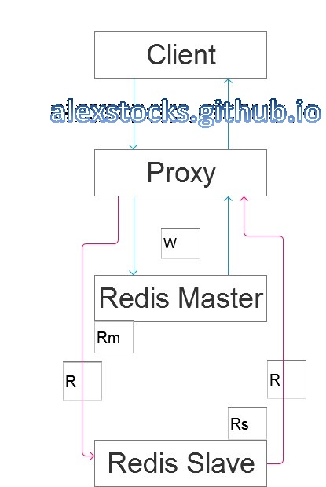
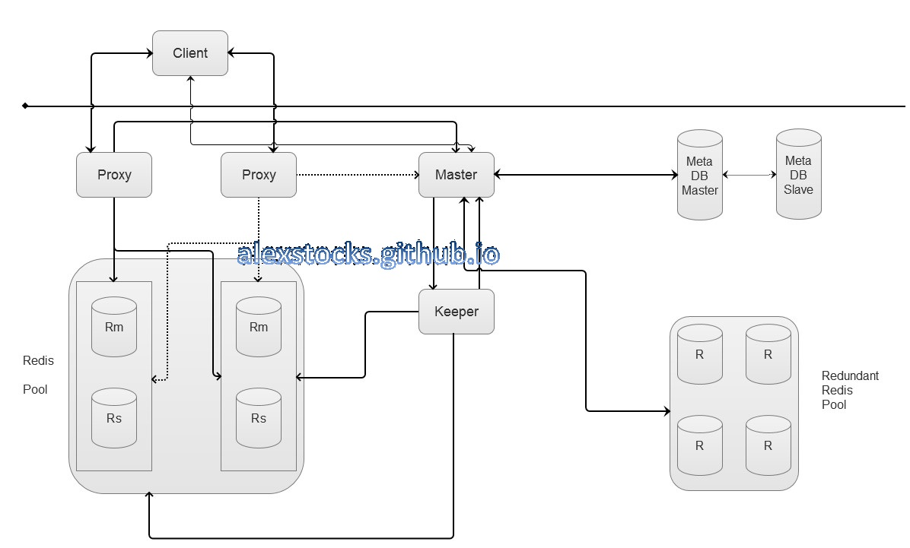

## 一种基于Redis的多租户多粒度分布式内存文件系统 ##
---
*written by Alex Stocks on 2016/03/05*

### 1 前言 ###
---

Redis是目前一种比较流行的内存数据库，但是其缺点也非常明显：

- 1 Scale out能力

	Redis采用了单进程架构，无法利用服务端多核的高性能，进而制约了其对服务器超大内存的使用能力。Redis能够使用的内存极限容量经验值为【8G, 24G】，超过这个容量上限其性能便急剧下降。

- 2 Scale up能力

	基于Redis的cluster目前采用了两种设计模式：proxy based和无中心的smart client based(如官方的Redis 3.0)。官方实现的Redis Cluster把系统设计成了一个"All-In-Box"模式的cluster，看似简洁易用轻便很多，其实不过是多个模块应该执行的任务混合在一起让一个Redis执行了，看似平等的一模一样的Redis进程的逻辑变得很复杂起来，一旦出问题就是一堆乱麻，你就只能呵呵哒了。目前业界暂时没有关于Redis 3.0的比较成功的使用案例。

	Proxy-based Redis Cluster看似让架构复杂很多，但是这种架构很容易做到让每个模块自身职责明了清晰且分工明确，尽可能专注于符合自己职责的工作，每个模块可以独立部署升级，所以运维也就方便很多，契合微服务的精神。目前比较成功的proxy有twemproxy，比较方便使用的Redis Cluster有Codis等。

### 2 多租户与多粒度和内存分布式文件系统 ###
---

目前各种Iaas层的云架构方兴未艾，OpenStack是目前最成功的架构中的一个，其特点之一便是能够构建一个提供多租户使用的公有云系统。不管是否基于公有云系统，如果想要构建一个多租户的Paas层的多租户的内存文件系统服务，囿于个人孤陋寡闻，目前还未见到比较成熟的相关系统。

磁盘文件系统最基本的的组织单元之一如扇区，其size一般固定为512B，基于扇区就可以构建4kB或者8kB等size的磁盘簇等多粒度存储单元，如果要构建一个内存文件系统，也可以基于类似的方式构建一个多粒度的内存文件系统。

Redis自身具有db的概念，即一个redis instance可以从逻辑上划分多个db分别给不同的用户使用，每个用户的数据从逻辑层面来看是相互隔离的，但是其缺点之一就是Redis不提供每个db占用的内存空间的size，更不能限制其内存使用量，用户一般能做的就是限制Redis instance自身占用的内存总量。

### 3 关于数据一致性 ###
---

Redis还有一个优点，可以通过master与slave构成一对Redis instance保证数据的consistency。但是这种一致性是一种最终一致性，并不能算是强一致性，即master处理一个写请求后，写请求的数据何时会被同步给slave且能让slave落盘成功，用户无法知晓。

一般的分布式文件系统可以基于data version来解决强一致性问题，但是Redis自身并不提供这种能力。在一个proxy based的系统中，proxy一般只承担数据请求的转发能力，为了保证用户写请求的强一致，可以进一步提高proxy的能力：区分读写请求和读写分离能力。

假设有一个简单的proxy based的系统如下所示：

Proxy通过区分读写请求和读从写主的能力，如果要保证数据的强一致性，一个client的写流程如下：

- 1 client发出Write Request；
- 2 proxy把Write Request转发给Rm；
- 3 Rm把Write Response结果返回给Proxy；
- 4 client收到Proxy转发回来的Write Response，如果失败就退出流程；
- 5 client再发出对同一个key的Read Request；
- 6 Proxy把Read Request转发给Rs；
- 7 Rs把value返回给Proxy；
- 8 Proxy把value返回给client；
- 9 client收到value。

如果client读到的value与写入的value一致，便可以认为写成功了，否则认为是失败的，不管其原因是Rm与Rs的同步太慢还是中间整个流程耗时过长导致了请求超时。如果某个Redis的写操作被认为是幂等的，则用户可以通过重试上面的流程来提高写成功率。这个方案需要redis和proxy配合一起保证数据的强一致性。

还有一种选择。proxy可以向Rm发送info命令，可以得到其sync buffer的offset值master_repl_offset，依据写请求前后两个不同的offset值，大致地可以把上面的流程修改为：

- 1 client发出Write Request；
- 2 proxy区分出请求是写请求，向Rm发出info命令；
- 3 待info命令超时之前如果Rm返回Info Response，proxy可以记录下此时的master_repl_offset值；
- 4 Proxy把Write Request转发给Rm；
- 5 Rm把Write Response结果返回给Proxy，如果结果是写失败，Proxy就把结果返回给client并退出流程，否则再次向Rm发出info命令；
- 6 Proxy收到Rm返回的Info Response，计算此时的master_repl_offset值，如果与此前的offset值不等，则Proxy就把Write Response结果返回给client，退出流程；
- 7 proxy sleep一段时间，再次发出info命令并等待结果，然后比较offset值，如果仍然相等则返回write fail，否则返回Rm的Write Response。

以上两种方法各有优劣，分别适用不同的场景，用户自己取舍。如果是面向用户的服务，则采用方案一，proxy的任务轻便一些，如果是Redis Cluster内部的Redis另有它用（下面讲到的架构），则可以使用方案二。

另外，为了加快主从同步速度，建议关闭Rm的磁盘写能力，只让Rs开启磁盘存储能力。

### 4 Redis Cluster架构 ###
---

基于前面的分析，我手绘了一个Redis Cluster架构图如下：

为了综述方便，我不再详细解释cluster内部的详细流程，只分别介绍各个model的职责。

#### 4.1 Redis Proxy ####
---

Proxy处于cluster的代理层，其职责是：

- A 对Redis Pool内部的所有的Redis Instance进行全连接；
- B 从meta master处获取Redis Pool内所有的Instance的host信息以及其内存粒度(quota)等信息；
- C 从meta master处获取所有的database的信息；
- D 从meta master处得到所有的user信息；
- E 提供读写分离的能力；
- F 定时地向master汇报心跳包，心跳包中可以包含诸如连接数、写请求数目、读请求数目、最新有数据更新的db等信息；
- G 对master发来的各种命令做出响应；
- H 监听master发来的如下消息：

> 1 资源池子中某个redis Instance对的主从切换消息；
>
> 2 发生主从后的新的Rs消息；
>
> 3 新注册的用户以及其使用的资源消息；
>
> 4 用户资源更改消息；
>
> 5 用户被删除消息；
>
> 6 用户使用的资源超出其粒度(quota)的消息；
>
> 7 封禁某个db响应写请求的消息；

#### 4.2 Keeper ####
---

Keeper作为master的管家，具有管理Redis Pool的能力，其职责列表如下:

- A 从master处接收监控Redis Pool中某对Rm-Rs的命令；
- B 从master处接收计算某个instance上某个db的占用内存大小的指令[简单地，可以读取Rs的磁盘文件来进行估算]；
- C 从master处接收migrate指令以及源db和目标db两个参数；
- D 某instance上Rm down掉是及时进行failover，并把心的Rm及时汇报给master；
- E 从master处接收某个Rm新的Rs的命令，并向这个Rs发出slaveof指令；
- F 把各个命令操作结果汇报master；
- G 向master汇报心跳；

#### 4.3 Meta Db ####
---

metadb作为meta信息的存储者，其能力列表如下:

- A 存储所有user的信息以及其使用的db信息列表；
- B 存储Redis Pool之中所有的instance的host信息；
- C 存储Redis Pool中所有db的size、owner user、quota、free state、create time和当前size等信息；
- D 存储多粒度空闲db列表；
- E 存储Redundant Redis Pool中所有instance以及db的信息；
- F 提供一个的消息通道能力，以让master和proxy以及keeper之间进行通信。

#### 4.4 Master ####
---

master作为整个cluster内的管理者，其职责列表如下：

- A 管理从32M、64M、128M、256M、512M和1G等各个粒度的instance pool；
- B 接受用户创建以及其资源申请的请求；
- C 统计各个proxy负载，以及选择一个负载最轻的proxy服务于user的请求；
- D 接收超级管理员向资源池子(Redis Pool)或者备用资源管理池(Redundant REdis Pool)中添加新的Redis Instance以及其内存粒度大小和各个db编号等参数的命令；
- E 接收keeper发来的Rm-Rs instance发生failover的消息通知，把新的Rm通知给各个proxy，从备用资源池中选出新的Rs'，通知给keeper，待keeper操作成功后更新metadb，并及时通知各个proxy；
- F 接收proxy和keeper发来的心跳包；
- G 根据proxy心跳包，发出统计某个db的内存size的指令给keeper；
- H 如果某个db的size超出其粒度限额(quota)，则通知各个proxy封禁其写请求访问；
- I 定时检测超出quota的db，一旦其db容量下降到合适额度，就通知proxy开放对其进行写请求的访问；
- J 接收用户扩展其某个db的size指令，检验请求合法性并通过后，做出如下流程：

> 1 向各个proxy发出对某个db的写请求访问封禁通知；
>
> 2 收到所有的proxy响应后，从备用资源池抽出合适粒度的instance上的db，作为migrate命令的参数发给keeper；
>
> 3 根据keeper操作结果，修改metadb中db的相关信息；
>
> 4 命令keeper对原db做出drop操作；
>
> 5 通知各个proxy修改redis pool架构信息并开放对某个db的写请求访问；
>
> 6 返回成功或者失败信息给user。

- K 接收用户缩减其某个db的size或者drop某个db的指令。

### 5 进一步的工作 ###
---

上面的流程设计是假设Redis被部署于物理机之上，如果想要把Redis Instance部署在公有云系统之上呢？

#### 5.1 Redundant Redis Pool ####
---

上面的架构图是基于Redis被部署于物理机之上这个条件设计出来的，所以附带了一个Redundant Redis Pool以应对Redis Instance failover的情况。如果整个系统能部署于openstack云系统之上，或者至少能否把Redis部署于docker集群之中，这个Redundant Redis Pool就完全没有存在的必要了。

因为docker容器启动速度是如此之快，所以一个备用池子就没有存在的必要了。当出现failover的情况的时候，master向云系统的管理者nova或者其职责相当的角色发送启动命令以及相关的参数，待容器启动成功之后把它交个keeper就可以了，其他流程不用修改。

#### 5.2 master与proxy和keeper之间的通信 ####
---

有没有想过，master可能是系统的单点？更别提keeper了。

一种处理方法就是更改频繁的系统状态数据放在metadb之中，让master做到无状态，只是执行相关的逻辑任务即可，这样就解放了master和keeper，就算是他们崩溃掉也无谓，重启即可，至于在同一个机器或者不同的机器重启都无所谓，用keepalived或者dns系统保证其地址不变即可。而且他们的任务并不繁重，所以更不必担心其通信数据量多少的问题。

那么，metadb究竟使用何种db为宜呢？使用Mysql抑或是MongoDB或者是其他更高大上的系统？其实metadb存储的数据量不多，当系统出现不稳定情况的时候，就得快速响应master的数据请求，而且系统的状态这种更新频繁的数据也由它负责存储，metadb也用Redis充当即可。但是需要注意的是，master每次修改响应数据的时候，都要保证数据的强一致性，至于操作步骤可以参考第三章节。

上面的架构图以及相关的流程都讲到master需要和proxy以及keeper进行通信以完成相关系统任务以及Redis Instance状态的流转，但是他们之间究竟如何通信呢？最简单的情况，他们之间以最基础的tcp方式完成通信任务，但是开发时间就浪费在解包封包(pack/unpack)的任务上了。

更进一步，metadb既然使用了Redis，是不是可以借用Redis的pub/sub能力？至于如何进行，自己稍微想想就能明白。至于通信中使用的message可以借助protobuf这种成熟的IDL语言描述之，以减轻工作量。

至于metadb自身的稳定性，本文就不再赘述了^_^。或者你有更好的方式处理之，总之是合适够用即可。

### 6 总结 ###
---

这个系统的特点就在于多用户和多粒度。

metaserver与metadb构成的子系统以满足分布式系统CAP中的CP为主，而client-proxy-redis instance子系统如果不考虑读写分离特性的话以满足AP为主。

本文没有列明metaserver的操作流程，其与proxy以及keeper之间的操作本质是二阶段提交过程而已。

proxy的操作其实还应该列明过载保护特性，如内存、网络带宽等资源的保护，系统实现过程中我会对文档逐步作以补充。

## 扒粪者-于雨氏 ##
---

> 于雨氏，2016/03/05，于金箱堂。
>
> 于雨氏，2016/03/19，于金箱堂补充第6章。