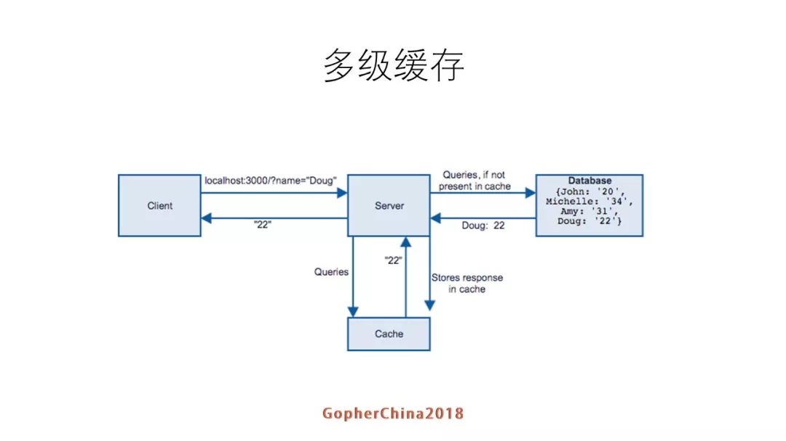

## 分布式系统数据存储 ##
---
*written by Alex Stocks on 2016/05/10，版权所有，无授权不得转载*

### 0 分布式集群的数据一致性 ###
---

分布式集群的存储层一般由缓存层与数据固化层构成。

对存储层进行读写的时候，需要考虑到数据的一致性。数据一致性分为强一致（实时一致性）和弱一致(最终一致性)，根据数据一致性要求的不同，读写流程也要做相应的改变。下面结合个人经验给出两种情况下的读写流程步骤。

一般的简单的分布式系统，缓存层可以使用redis集群，固化层则可以使用mysql或者mongodb集群。**限于个人经验，本文所指的缓存层专指redis集群，固化层专指mysql或者mongodb集群。**


下面所有函数都遵循的几个条件：

   - 1 数据的key(如key="foo.bar")有垃圾值rubbish(如rubbish = "rubish-123987401234-zbert-rubish")；
   - 2 key相关的锁为lock(如lock = "lock.foo.bar")
   - 3 lock为mutex类型(即不对操作者的读写身份进行区分)乐观锁，其超时时间为ttl(如ttl = 10s)


### 1 强一致性系统的读写流程 ###
---

强一致性系统要求缓存和数据库的数据实时一致。这就要求写操作期间既要防止多个写请求之间发生冲突，又要防止读请求与其发生冲突。

- 写流程

```go
func write(key, value) err {
	err = "okay"

  	// 1 生成本次lock的随机值rand，然后申请与key对应的lock
 	rand = time().now() * getpid() * random()
 	t0 = t1 = time().now()
 	ret = "null"
 	while ret != "okay" {
 	    t1 = time().now()
 	    if (t1 - t0) >= ttl {
		    err = "fail"
 	        goto end
 	    }

		timeout = t1 - t0
 	    ret = redis.set(lock rand PX timeout NX)
 	}

 	// 2 把缓存中的值更新为垃圾值, 以表示key的当前值无效
 	ret = redis.set(key, rubish)
 	if ret != "okay" {
 	   err = "fail"
 	   goto end
 	}

 	// 3 更新db (mysql or mongodb)
 	ret = db.update(key, value)
 	if ret != "okay" {
 	   err = "fail"
 	   goto end
 	}

 	// 4 更新缓存
 	ret = redis.set(key, value)
 	if ret != "okay" {
 	   redis.del(key)
 	}

 	end:
 	// 5 删除锁
 	ret = get("lock.foo.bar")
 	if ret == rand {
 	    redis.del(lock)
 	}

	return
}
```


- 读流程

读流程也用到超时时间ttl，其值可与写流程下的ttl不同，如1s。

```go
func read_cache(key) (err, value) {
 	err = "okay"

	// 防止读与写竞争
 	err, value = redis.get(key)
 	if err == "okay" {
 		if value == rubbish {
 			err = "fail"
 		}

 		return
 	}

	return
}

func read(key) (err, value) {
 	// 1 从缓存读取value, 读取失败说明key超时不存在了或者有写者正在对key进行更新
 	err, value = read_cache(key)
 	if err == "okay" {
 		return
 	}

  	// 2 生成本次lock的随机值rand，然后申请lock；
 	rand = time().now() * getpid() * random()
 	t0 = t1 = time().now()
 	ret = "null"
 	while ret != "okay" {
 	    t1 = time().now()
 	    if (t1 - t0) >= ttl {
			err = "fail"
 	        goto end
 	    }

		timeout = t1 - t0
 	    ret = redis.set(lock rand PX timeout NX)
 	}

	// 3 拿到lock后，再次从缓存读一次，以防止其他读者已经把value读回到cache中
	// 多个读者同时执行到第三步时，只有第一个会成功，所以后面的读者只需要再次从缓存读取数据即可
 	err, value = read_cache(key)
 	if err == "okay" && value != rubbish {
 		goto end
 	}

 	// 4 第一个获取锁成功的读者从db读取value
 	err, value = db.get(key)
 	if err == "fail" {
 		goto end
 	}

 	// 5 写入redis
 	// err = redis.setnx(key, value) // 既要防止与write函数的第2 或 4步冲突，又要防止与其他读者执行到这一步时发生冲突
	// if err != "okay" {
	// 	// 多个读者同时执行到第三步时，只有第一个会成功，所以后面的读者再次从缓存读取数据
	// 	err, value = read_cache(key)
	// 	return
	// }
 	err = redis.set(key, value)

	end:
 	// 6 删除锁
 	ret = get("lock.foo.bar")
 	if ret == rand {
 	    redis.del(lock)
 	}

	return
}
```

### 2 弱一致性系统的读写流程 ###
---

弱一致性系统要求数据库的数据更新成功后，缓存可以过一段时间后与数据库的值一致，读请求读到一个key的旧值时也可以认为其操作成功。

- 读流程

	弱一致性条件下读流程与强一直性条件下流程一致。

- 写流程

```go
func write(key, value) err {
	err = "okay"
	// 1 生成本次lock的随机值rand，然后申请lock；
	rand = time().now() * getpid() * random()
	t0 = t1 = time().now()
	ret = "null"
	while ret != "okay" {
		t1 = time().now()
		if (t1 - t0) >= ttl {
			err = "fail"
			goto end
		}

		// ret = redis.set(lock rand PX ttl NX)
		ret = redis.set(lock rand PX timeout NX)
	}

	// 2 把缓存中的值更新为垃圾值
	ret, old_value = read(key)
	if ret != "okay" {
		err = "fail"
		goto end
	}

	// 3 更新db (mysql or mongodb)
	ret = db.update(key, value)
	if ret != "okay" {
		err = "fail"
		goto end
	}

	// 4 更新缓存
	ret = redis.set(key, value)
	if ret != "okay" {
		redis.del(key)
	}

end:
	// 5 删除锁
	ret = get("lock.foo.bar")
	if ret == rand {
		redis.del(lock)
	}

	return
}
```

### 3 多级缓存系统 ###
---

分布式系统（特别是读多写少的系统）缓存数据的使用者的数据的读取流程一般如下图【源自[参考文档1](https://mp.weixin.qq.com/s/WtRcGWauZJ7gkwz23QIm4A)】所示：

[](https://mp.weixin.qq.com/s/WtRcGWauZJ7gkwz23QIm4A)
​                        ***3.1 一级cache***

整个流程比较简单，正如[参考文档1](https://mp.weixin.qq.com/s/WtRcGWauZJ7gkwz23QIm4A)文中所述: `client请求到server，server先在缓存里找，找到就返回，没有就数据库找，如果找到就回设到缓存然后返回客户端。这里是一个比较简单的模型：一级cache`。

一级 cache 模型简单，但是缺点就是每次数据的获取都必须走网络请求，其 QPS 便必然有一个上限，诚如[参考文档1](https://mp.weixin.qq.com/s/WtRcGWauZJ7gkwz23QIm4A)文中所述: `一级cache有可能不够用，比如说压测的时候我们发现，一个redis在我们的业务情况下支撑到接口的QPS就是一万左右`，文档也给出了一个很好的解决方案---多级缓存，如下图【源自[参考文档1](https://mp.weixin.qq.com/s/WtRcGWauZJ7gkwz23QIm4A)】所示：

[](https://mp.weixin.qq.com/s/WtRcGWauZJ7gkwz23QIm4A)
​                        ***3.2 多级cache***

其工作流程，诚如[参考文档1](https://mp.weixin.qq.com/s/WtRcGWauZJ7gkwz23QIm4A)文中有详细描述: `越靠近上面的缓存就越小，一级就是服务local cache，如果命中就返回数据，如果没有就去L1查，如果查到就更新local cache,并且返回数据。如果L1级也没有就去L2级查，如果查到数据就更新L1 cache/local cache，并返回数据`。

文档1 也给出了如下图所示的多级缓存的整体读写流程：

[](https://mp.weixin.qq.com/s/WtRcGWauZJ7gkwz23QIm4A)
​                        ***3.3 多级cache的读写流程***

其实多级缓存有多种实现方案，参考上图并结合上文所述，其中一种实现方案如下：

+ 1 DB 使用 Mysql 或者 MongoDB；
+ 2 二级缓存使用分布式 Redis 集群【譬如 Codis 或者 本人的 [Exocet](https://github.com/penguin-diors/exocet)】；
+ 3 一级缓存则是在相关机器上启动一个 Agent；
+ 4 本地缓存[上图中的 APP(cache)] 则是使用者进程空间内的缓存。

***注：下文假设缓存中的数据都是有 TTL 的 KV 数据 【KV = K + V + T + R，K = key, V = value, T = timestamp, R = version】，KV数据的 T 是数据更新时的本机时间，R 则是数据的版本号。***

前面两节对缓存和数据两个层次的数据的写流程给出了详细的解决方案，但是相关过程使用了分布式锁，这就决定其性能必然有瓶颈。使用分布式锁的原因就是其场景是多写多读，若对 key 做sharding 之后可以把场景简化为一写多读，可以通过多版本手段在保证数据读取最终一致性的场景下避免使用锁，至于详细操作流程则暂时不是本文重点，在此不再详述。

多级缓存系统的数据更新流程诚如图 3.3 所示，首先更新 DB，然后逐级更新二级缓存和一级缓存，[参考文档1](https://mp.weixin.qq.com/s/WtRcGWauZJ7gkwz23QIm4A)给出的方案是 `读取数据库binlog来补漏，减少数据不一致的情况`，如果真实线上系统使用这种方法可能会导致很长时间内缓存内的数据都是旧数据。

缓存自身也有很多实现方法，一种基本的实现方法是 LRU list 和 hashtable 实现的 [LRU Cache](https://github.com/alexstocks/c-practice/blob/master/structure/shm_lru/inc/shm_lru.h)。图 3.3 的读流程是很清晰的，但是更新流程则语焉不详，结合前两节，本节主要讨论图 3.3 中一级缓存的数据更新流程，下面结合个人的过往经验对其予以补充如下：

+ 1 数据更新过程中写者负责二级缓存和 DB 的数据一致性，并把更新的 KV 数据以 pubsub 的消息方式发送出去【不必保证消息的必达性(即 subscriber 全部收到)，但必须保证消息的有序性】；
+ 2 各个 subscriber (各个机器的 agent) 收到数据更新消息后，根据消息内容对本地缓存数据予以更新，并把 T 更新为当前时间；
+ 3 各个 Agent 启动一个定时检查线程，遍历缓存中的 KV 数据，若其 T 与当前机器时间只差超过 TTL，则以 pipeline 方式把过期数据的 K + R 发送到一级缓存【此请求称之为校验请求】；
+ 4 一级缓存收到 Agent 发来的校验请求转换后，依据 K + R 分别对每个请求做出如下处理：

    - 4.1 一级缓存中没有相应 K，则返回空的 KV 数据 [K 不变，V 为 nil，R 为0]；
    - 4.2 一级缓存中有相应 K，请求的 R 比一级缓存中的数据的 R 小，则返回最新的 KV 数据；
    - 4.3 一级缓存中有相应 K，请求的 R 与一级缓存中的数据的 R 相等，则返回 V 为空的最新的 KV 数据 [K 不变，V 为 nil，R 为最新R]；
    - 4.4 一级缓存中有相应 K，请求的 R 比一级缓存中的数据的 R 大，则一级缓存应该告警，并返回最新的 KV 数据；

+ 5 二级缓存收到一级缓存的 pipeline 形式的响应后，分别对每个响应做出如下处理：

    - 5.1 收到空的 KV 数据，则删除缓存中的数据；
    - 5.2 收到 V 为空的最新的 KV 数据，不处理；
    - 5.3 收到 KV 数据，更新缓存中的数据，同时判断缓存数据的 R 是否比响应 KV 数据的 R 大，如是则二级缓存应该告警。

流程的整体思路就是 “通过消息通道的实时更新” 和 “通过本地定期校验” 两种策略的结合体，第二种策略就是上面流程中的 “定时检查线程”，其工作频率不宜过于频繁，若不然很容易导致数据的全量更新。

第二种策略使用不当的后果很多，其另一种替代策略就是 “过期淘汰”，即：二级缓存中的数据的 TTL 过期后直接淘汰即可，不管其在 LRU 链表的冷热程度。

上面详细介绍了一级缓存的数据更新流程，至于 APP(cache) 如何更新，其思路亦复如是，不再详述。

## 参考文档：##

- 1 [罗辑思维Go语言微服务改造实践](https://mp.weixin.qq.com/s/WtRcGWauZJ7gkwz23QIm4A)

## 扒粪者-于雨氏 ##

> 2016/05/10，于雨氏，写于魔都张衡路。
>
> 2016/10/20，于雨氏，于魔都张衡路更新文章一些误笔。
>
> 2018/08/05，于雨氏，于帝都西二旗添加 “多级缓存系统” 一节。

