## RocksDB 笔记 
---
*written by Alex Stocks on 2018/03/28，版权所有，无授权不得转载*

### 0 说明 
---

近日在写一个分布式 KV DB，存储层使用了 RocksDB。

RocksDB 的优点此处无需多说，它的一个 feature 是其有很多优化选项用于对 RocksDB 进行调优。欲熟悉这些参数，必须对其背后的原理有所了解，本文主要整理一些 RocksDB 的 wiki 文档，以备自己参考之用。

### 1 [Basic Operations](https://github.com/facebook/rocksdb/wiki/Basic-Operations) 
---

先介绍一些 RocksDB 的基本操作和基本架构。

通过参考文档 5，RocksDB 是一个快速存储系统，它会充分挖掘 Flash or RAM 硬件的读写特性，支持单个 KV 的读写以及批量读写。RocksDB 自身采用的一些数据结构如 LSM/SKIPLIST 等结构使得其有读放大、写放大和空间使用放大的问题。

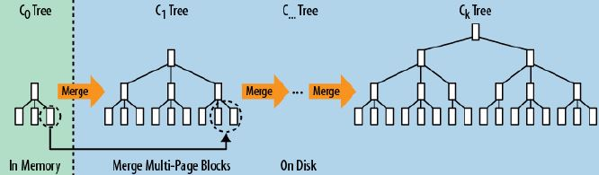

LSM 大致结构如上图所示。LSM树而且通过批量存储技术规避磁盘随机写入问题。 LSM树的设计思想非常朴素, 它的原理是把一颗大树拆分成N棵小树， 它首先写入到内存中（内存没有寻道速度的问题，随机写的性能得到大幅提升），在内存中构建一颗有序小树，随着小树越来越大，内存的小树会flush到磁盘上。磁盘中的树定期可以做merge操作，合并成一棵大树，以优化读性能【读数据的过程可能需要从内存memtable到磁盘sstfile读取多次，称之为读放大】。RocksDB 的 LSM 体现在多 level 文件格式上，最热最新的数据尽在 L0 层，数据在内存中，最冷最老的数据尽在 LN层，数据在磁盘或者固态盘上。

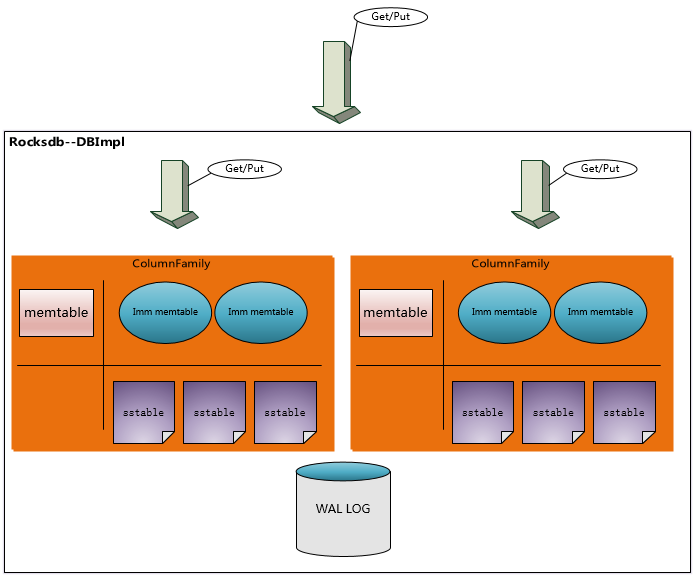

RocksDB的三种基本文件格式是 memtable/sstfile/logfile，memtable 是一种内存文件数据系统，新写数据会被写进 memtable，部分请求内容会被写进 logfile。logfile 是一种有利于顺序写的文件系统。memtable 的内存空间被填满之后，会有一部分老数据被转移到 sstfiile 里面，这些数据对应的 logfile 里的 log 就会被安全删除。sstfile 中的内容是有序的。

上图所示，所有 Column Family 共享一个 WAL 文件，但是每个 Column Family 有自己单独的 memtable & ssttable(sstfile)，即 log 共享而数据分离。

一个进程对一个 DB 同时只能创建一个 rocksdb::DB 对象，所有线程共享之。这个对象内部有锁机制保证访问安全，多个线程同时进行 Get/Put/Fetch Iteration 都没有问题，但是如果直接 Iteration 或者 WriteBatch 则需要额外的锁同步机制保护 Iterator 或者 WriteBatch 对象。

#### 1.1 WriteBatch
---

单独的 Get/Put/Delete 是原子操作，要么成功要么失败，不存在中间状态。

如果需要进行批量的 Get/Put/Delete 操作且需要操作保持原子属性，则可以使用 WriteBatch。

WriteBatch 还有一个好处是保持加快吞吐率。

#### 1.2 同步写 与 异步写
---

默认情况下，RocksDB 的写是异步的：仅仅把数据写进了操作系统的缓存区就返回了，而这些数据被写进磁盘是一个异步的过程。如果为了数据安全，可以用如下代码把写过程改为同步写：

	rocksdb::WriteOptions write_options;   
	write_options.sync = true;   
	db->Put(write_options, …);

这个选项会启用 Posix 系统的 `fsync(...) or fdatasync(...) or msync(..., MS_SYNC)` 等函数。

<font color=red> 异步写的吞吐率是同步写的一千多倍。异步写的缺点是机器或者操作系统崩溃时可能丢掉最近一批写请求发出的由操作系统缓存的数据，但是 RocksDB 自身崩溃并不会导致数据丢失。而机器或者操作系统崩溃的概率比较低，所以大部分情况下可以认为异步写是安全的。</font>

RocksDB 由于有 WAL 机制保证，所以即使崩溃，其重启后会进行写重放保证数据一致性。如果不在乎数据安全性，可以把 `write_option.disableWAL` 设置为 true，加快写吞吐率。

RocksDB 调用 Posix API `fdatasync()` 对数据进行异步写。如果想用 `fsync()` 进行同步写，可以设置 `Options::use_fsync` 为 true。

#### 1.3 Snapshots
---

RocksDB 能够保存某个版本的所有数据（可称之为一个 Snapshot）以方便读取操作，创建并读取 Snapshot 方法如下：


	rocksdb::ReadOptions options;   
	options.snapshot = db->GetSnapshot();   
	… apply some updates to db ….  
	rocksdb::Iterator* iter = db->NewIterator(options);   
	… read using iter to view the state when the snapshot was created ….  
	delete iter;   
	db->ReleaseSnapshot(options.snapshot);


如果 ReadOptions::snapshot 为 null，则读取的 snapshot 为 RocksDB 当前版本数据的 snapshot。

#### 1.4 Slice
---

不管是 `it->key()` 还是 `it->value()`，其值类型都是 `rocksdb::Slice`。 Slice 自身由一个长度字段以及一个指向外部一个内存区域的指针构成，返回 Slice 比返回一个 string 廉价，并不存在内存拷贝的问题。RocksDB 自身会给 key 和 value 添加一个 C-style 的 ‘\0’，所以 slice 的指针指向的内存区域自身作为字符串输出没有问题。

Slice 与 string 之间的转换代码如下：

	rocksdb::Slice s1 = “hello”;
	std::string str(“world”);
	rocksdb::Slice s2 = str;
	   
	OR:   
	   
	std::string str = s1.ToString();   
	assert(str == std::string(“hello”));

但是请注意 Slice 的安全性，有代码如下：

	rocksdb::Slice slice;   
	if (…) {  
	 std::string str = …;   
	 slice = str;   
	}  
	Use(slice);   

当退出 if 语句块后，slice 内部指针指向的内存区域已经不存在，此时再使用导致程序出问题。

#### 1.5 Transactions
---

当使用 TransactionDB 或者 OptimisticTransactionDB 的时候，可以使用 RocksDB 的 BEGIN/COMMIT/ROLLBACK 等事务 API。RocksDB 支持活锁或者死等两种事务。

WriteBatch 默认使用了事务，确保批量写成功。

当打开一个 TransactionDB 的时候，如果 RocksDB 检测到某个 key 已经被别的事务锁住，则 RocksDB 会返回一个 error。如果打开成功，则所有相关 key 都会被 lock 住，直到事务结束。TransactionDB 的并发特性表现要比 OptimisticTransactionDB 好，但是 TransactionDB 的一个小问题就是不管写发生在事务里或者事务外，他都会进行写冲突检测。TransactionDB 使用示例代码如下：


	TransactionDB* txn_db;
	Status s = TransactionDB::Open(options, path, &txn_db);
	Transaction* txn = txn_db->BeginTransaction(write_options, txn_options);
	s = txn->Put(“key”, “value”);
	s = txn->Delete(“key2”);
	s = txn->Merge(“key3”, “value”);
	s = txn->Commit();
	delete txn;

OptimisticTransactionDB 提供了一个更轻量的事务实现，它在进行写之前不会进行写冲突检测，当对写操作进行 commit 的时候如果发生了 lock 冲突导致写操作失败，则 RocksDB 会返回一个 error。这种事务使用了活锁策略，适用于读多写少这种写冲突概率比较低的场景下，使用示例代码如下：

	DB* db;
	OptimisticTransactionDB* txn_db;
	Status s = OptimisticTransactionDB::Open(options, path, &txn_db);
	db = txn_db->GetBaseDB();
	
	OptimisticTransaction* txn = txn_db->BeginTransaction(write_options, txn_options);
	txn->Put(“key”, “value”);
	txn->Delete(“key2”);
	txn->Merge(“key3”, “value”);
	s = txn->Commit();
	delete txn;

参考文档 6 详细描述了 `RocksDB` 的 Transactions。

#### 1.6 Column Family
---

CF 提供了对 DB 进行逻辑划分开来的方法，用户可以通过 CF 同时对多个 CF 的 KV 进行并行读写的方法，提高了并行度。


#### 1.7 MemTable and Table factories
---

RocksDB 内存中的数据格式是 skiplist，磁盘则是以 table 形式存储的 SST 文件格式。

table 格式有两种：继承自 leveldb 的文件格式【详见参考文档2】和 PlainTable 格式【详见参考文档3】。PlainTable 格式是针对 低查询延迟 或者低延迟存储媒介如 SSD 特别别优化的一种文件格式。

#### 1.8 Block size
---

RocksDB 把相邻的 key 放到同一个 block 中，block 是数据存储和传递的基本单元。默认 Block 的大小是 4096B，数据未经压缩。

经常进行 bulk scan 操作的用户可能希望增大 block size，而经常进行单 key 读写的用户则可能希望减小其值，官方建议这个值减小不要低于 1KB 的下限，变大也不要超过 `a few megabytes`。启用压缩也可以起到增大 block size 的好处。

修改 Block size 的方法是修改 `Options::block_size`。


#### 1.9 Writer Buffer
---

`Options::write_buffer_size` 指定了一个写内存 buffer 的大小，当这个 buffer 写满之后数据会被固化到磁盘上。这个值越大批量写入的性能越好。

RocksDB 控制写内存 buffer 数目的参数是 `Options::max_write_buffer_number`。这个值默认是 2，当一个 buffer 的数据被 flush 到磁盘上的时候，RocksDB 就用另一个 buffer 作为数据读写缓冲区。

‘Options::min_write_buffer_number_to_merge’ 设定了把写 buffer 的数据固化到磁盘上时对多少个 buffer 的数据进行合并然后再固化到磁盘上。这个值如果为 1，则 L0 层文件只有一个，这会导致读放大，这个值太小会导致数据固化到磁盘上之前数据去重效果太差劲。

这两个值并不是越大越好，太大会延迟一个 DB 被重新打开时的数据加载时间。

#### 1.10 Key Layout
---

在 **1.8** 章节里提到 “block 是数据存储和传递的基本单元”，RocksDB 的数据是一个 range 的 key-value 构成一个 Region，根据局部性原理每次访问一个 Region 的 key 的时候，有很多概率会访问其相邻的 key，每个 Region 的 keys 放在一个 block 里，多个 Region 的 keys 放在多个 block 里。

下面以文件系统作为类比，详细解释下 RocksDB 的文件系统：
	
	filename -> permission-bits, length, list of file_block_ids
	file_block_id -> data

以多个维度组织 key 的时候，我们可能希望 filename 的前缀都是 ‘/‘， 而 file_block_id 的前缀都是 ‘0’，这样可以把他们分别放在不同的 block 里，以方便快速查询。


#### 1.11 Checksums
---

Rocksdb 对每个 kv 以及整体数据文件都分别计算了 checksum，以进行数据正确性校验。下面有两个选项对 checksum 的行为进行控制。

* `ReadOptions::verify_checksums` 强制对每次从磁盘读取的数据进行校验，这个选项默认为 true。
* `Options::paranoid_checks` 这个选项为 true 的时候，如果 RocksDB 打开一个数据检测到内部数据部分错乱，马上抛出一个错误。这个选择默认为 false。

如果 RocksDB 的数据错乱，RocksDB 会尽量把它隔离出来，保证大部分数据的可用性和正确性。

#### 1.12 Approximate Sizes
---

`GetApproximateSizes` 方法可以返回一个 key range 的磁盘占用空间大致使用量，示例代码如下：

	rocksdb::Range ranges[2];  
	ranges[0] = rocksdb::Range(“a”, “c”);  
	ranges[1] = rocksdb::Range(“x”, “z”);  
	uint64_t sizes[2];  
	rocksdb::Status s = db->GetApproximateSizes(ranges, 2, sizes);  

上面的 `sizes[0]` 返回 `[a..c)` key range 的磁盘使用量，而 `sizes[1]` 返回 `[x..z)`  key range 的磁盘使用量。 

#### 1.13 Purging WAL files
---

一般情况下，RocksDB 会删除一些过时的 WAL 文件，所谓过时就是 WAL 文件里面对应的一些 key 的数据已经被固化到磁盘了。但是 RocksDB 提供了两个选项以实让用户控制 WAL 何时删除：`Options::WAL_ttl_seconds` 和 `Options::WAL_size_limit_MB`，这两个参数分别控制 WAL 文件的超时时间 和 最大文件 size。

如果这两个值都被设置为 0，则 log 不会被固化到文件系统上。

如果 `Options::WAL_ttl_seconds` 为 0 而 `Options::WAL_size_limit_MB` 不为 0， RocksDB 会每 10 分钟检测所有的 WAL 文件，如果其总体 size 超过 `Options::WAL_size_limit_MB`，则 RocksDB 会删除最早的日志直到满足这个值位置。一切空文件都会被删除。

如果 `Options::WAL_ttl_seconds` 不为 0 而 `Options::WAL_size_limit_MB` 为 0，RocksDB 会每 `Options::WAL_ttl_seconds` / 2 检测一次 WAL 文件， 所有 TTL 超过 `Options::WAL_ttl_seconds` 的 WAL 文件都会被删除。

如果两个值都不为 0，RocksDB 会每 10 分钟检测所有的 WAL 文件，所有不满足条件的 WAL 文件都会被删除，其中 ttl 参数优先。


#### 1.14 Prefix Iterators
---

许多 LSM 引擎不支持高效的 RangeScan 操作，因为 Range 操作需要扫描所有的数据文件。一般情况下常规的技术手段是给 key 建立索引，只用遍历 key 就可以了。应用可以通过确认 `prefix_extractor` 指定一个可以的前缀，RocksDB 可以为这些 key prefix 建立 Bloom 索引，以加快查询速度。


#### 1.15 Multi-Threaded Compactions
---

参考文档 5 的 `Compaction Styles` 一节提到，如果启用 `Level Style Compaction`, L0 存储着 RocksDB 最新的数据，Lmax 存储着比较老的数据，<font color=blue>**L0 里可能存着重复 keys，但是其他层文件则不可能存在重复 key**</font>。每个 compaction 任务都会选择 Ln 层的一个文件以及与其相邻的 Ln+1 层的多个文件进行合并，删除过期 或者 标记为删除 或者 重复 的 key，然后把合并后的文件放入 Ln+1 层。Compaction 过程会导致写放大【如写qps是10MB/s，但是实际磁盘io是50MB/s】效应，但是可以节省空间并减少读放大。

如果启用 `Universal Style Compaction`，则只压缩 L0 的所有文件，合并后再放入 L0 层里。

RocksDB 的 compaction 任务线程不宜过多，过多容易导致写请求被 hang 住。

#### 1.16 Incremental Backups and Replication
---

RocksDB 的 API `GetUpdatesSince` 可以让调用者从 transaction log 获知最近被更新的 key（原文意为用 tail 方式读取 transaction log），通过这个 API 可以进行数据的增量备份。

RocksDB 在进行数据备份时候，可以调用 API `DisableFileDeletions` 停止删除文件操作，调用 API `GetLiveFiles/GetSortedWalFiles` 以检索活跃文件列表，然后进行数据备份。备份工作完成以后在调用 API `EnableFileDeletions` 让 RocksDB 再启动过期文件淘汰工作。

#### 1.17 Thread Pool
---

RocksDB 会创建一个 thread pool 与 Env 对象进行关联，线程池中线程的数目可以通过 `Env::SetBackgroundThreads()` 设定。通过这个线程池可以执行 compaction 与 memtable flush 任务。

当 memtable flush 和 compaction 两个任务同时执行的时候，会导致写请求被 hang 住。RocksDB 建议创建两个线程池，分别指定  HIGH 和 LOW 两个优先级。默认情况下 HIGH 线程池执行 memtable flush 任务，LOW 线程池执行 compaction 任务。

相关代码示例如下：

```c++
#include “rocksdb/env.h”
#include “rocksdb/db.h”

auto env = rocksdb::Env::Default();
env->SetBackgroundThreads(2, rocksdb::Env::LOW);
env->SetBackgroundThreads(1, rocksdb::Env::HIGH);
rocksdb::DB* db;
rocksdb::Options options;
options.env = env;
options.max_background_compactions = 2;
options.max_background_flushes = 1;
rocksdb::Status status = rocksdb::DB::Open(options, “/tmp/testdb”, &db);
assert(status.ok());
```

还有其他一些参数，可详细阅读参考文档4。
	
#### 1.18 Bloom Filter
---

RocksDB 的每个 SST 文件都包含一个 Bloom filter。Bloom Filter 只对特定的一组 keys 有效，所以只有新的 SST 文件创建的时候才会生成这个 filter。当两个 SST 文件合并的时候，会生成新的 filter 数据。

当 SST 文件加载进内存的时候，filter 也会被加载进内存，当关闭 SST 文件的时候，filter 也会被关闭。如果想让 filter 常驻内存，可以用如下代码设置：    

```c++
BlockBasedTableOptions::cache_index_and_filter_blocks=true
```

一般情况下不要修改 filter 相关参数。如果需要修改，相关设置上面已经说过，此处不再多谈，详细内容见参考文档 7。

#### 1.19 Time to Live
---

RocksDB 在进行 compact 的时候，会删除被标记为删除的数据，会删除重复 key 的老版本的数据，也会删除过期的数据。数据过期时间由 API `DBWithTTL::Open(const Options& options, const std::string& name, StackableDB** dbptr, int32_t ttl = 0, bool read_only = false)` 的 ttl 参数设定。

TTL 的使用有以下注意事项：

* 1 TTL 其值单位是秒，如果 TTL 值为 0 或者负数，则 TTL 值为 `infinity`，即永不过期；
* 2 每个 kv 被插入数据文件中的时候会带上创建时的机器 `(int32_t)Timestamp` 时间值；
* 3 compaction 时如果 kv 满足条件 `Timestamp+ttl<time_now`，则会被淘汰掉；
* 4 Get/Iterator 的时候可能返回过期的 kv（compact 任务还未执行）；
* 5 不同的 `DBWithTTL::Open` 可能会带上不同的 TTL 值，此时 kv 以最大的 TTL 值为准；
* 6 如果 `DBWithTTL::Open` 的参数 `read_only` 为 true，则不会触发 compact 任务，不会有过期数据被删除。


### 2 [RocksDB Memory](https://github.com/facebook/rocksdb/wiki/Memory-usage-in-RocksDB) 
---

RocksDB的内存大致有如下四个区：

* Block Cache
* Indexes and bloom filters
* Memtables
* Blocked pinned by iterators

#### 2.1 Block Cache
---

第三节详述了 Block Cache，这里只给出总结性描述：它存储一些读缓存数据，它的下一层是操作系统的 Page Cache。

#### 2.2 Indexes and bloom filters
---

Index 由 key、offset 和 size 三部分构成，当 Block Cache 增大 Block Size 时，block 个数必会减小，index 个数也会随之降低，如果减小 key size，index 占用内存空间的量也会随之降低。

filter是 bloom filter 的实现，如果假阳率是 1%，每个key占用 10 bits，则总占用空间就是 `num_of_keys * 10 bits`，如果缩小 bloom 占用的空间，可以设置 `options.optimize_filters_for_hits = true`，则最后一个 level 的 filter 会被关闭，bloom 占用率只会用到原来的 10% 。

结合 block cache 所述，index & filter 有如下优化选项：

* `cache_index_and_filter_blocks` 这个 option 如果为 true，则 index & filter 会被存入 block cache，而 block cache 中的内容会随着 page cache 被交换到磁盘上，这就会大大降低 RocksDB的性能，把这个 option 设为 true 的同时也把 `pin_l0_filter_and_index_blocks_in_cache` 设为 true，以减小对性能的影响。

如果 `cache_index_and_filter_blocks` 被设置为 false （其值默认就是 false），index/filter 个数就会受 `max_open_files` 影响，官方建议把这个选项设置为 -1，以方便 RocksDB 加载所有的 index 和 filter 文件，最大化程序性能。

可以通过如下代码获取 index & filter 内存量大小：
	
```c++
	std::string out;
	db->GetProperty(“rocksdb.estimate-table-readers-mem”, &out);
```

#### 2.3 Indexes and bloom filters
---

block cache、index & filter 都是读 buffer，而 memtable 则是写 buffer，所有 kv 首先都会被写进 memtable，其 size 是 `write_buffer_size`。 memtable 占用的空间越大，则写放大效应越小，因为数据在内存被整理好，磁盘上就越少的内容会被 compaction。如果 memtable 磁盘空间增大，则 L1 size 也就随之增大，L1 空间大小受 `max_bytes_for_level_base` option 控制。

可以通过如下代码获取 memtable 内存量大小：

```c++
	std::string out;
	db->GetProperty(“rocksdb.cur-size-all-mem-tables”, &out);
```

#### 2.4 Blocks pinned by iterators
---

这部分内存空间一般占用总量不多，但是如果有 100k 之多的transactions 发生，每个 iterator 与一个 data block 外加一个 L1 的 data block，所以内存使用量大约为 `num_iterators * block_size * ((num_levels-1) + num_l0_files)`。

可以通过如下代码获取 Pin Blocks 内存量大小：
	
```c++
	table_options.block_cache->GetPinnedUsage();
```

#### 2.5 读流程
---

RocksDB 的读流程分为逻辑读(logical read)和物理读(physical read)。逻辑读通常是对 cache【Block Cache & Table Cache】进行读取，物理读就是直接读磁盘。

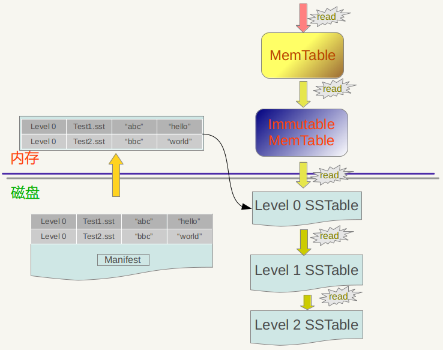

参考文档 12 详细描述了 LeveDB（RocksDB）的读流程，转述如下：

* 在MemTable中查找，无法命中转到下一流程；
* 在immutable_memtable中查找，查找不中转到下一流程；
* 在第0层SSTable中查找，无法命中转到下一流程；
  
  对于L0 的文件，RocksDB 采用遍历的方法查找，所以为了查找效率 RocksDB 会控制 L0 的文件个数。

* 在剩余SSTable中查找。

  对于 L1 层以及 L1 层以上层级的文件，每个 SSTable 没有交叠，可以使用二分查找快速找到 key 所在的 Level 以及 SSTfile。


至于写流程，请参阅 ### 5 Flush & Compaction 章节内容。

#### 2.6 memory pool
---

不管 RocksDB 有多少 column family，一个 DB 只有一个 WriteController，一旦 DB 中一个 column family 发生堵塞，那么就会阻塞其他 column family 的写。RocksDB 写入时间长了以后，可能会不定时出现较大的写毛刺，可能有两个地方导致 RocksDB 会出现较大的写延时：获取 mutex 时可能出现几十毫秒延迟 和 将数据写入 memtable 时候可能出现几百毫秒延时。

获取 mutex 出现的延迟是因为 flush/compact 线程与读写线程竞争导致的，可以通过调整线程数量降低毛刺时间。

至于写入 memtable 时候出现的写毛刺时间，解决方法一就是使用大的 page cache，禁用系统 swap 以及配置 min\_free\_kbytes、dirty\_ratio、dirty\_background\_ratio 等参数来调整系统的内存回收策略，更基础的方法是使用内存池。

采用内存池时，memtable 的内存分配和回收流程图如下：

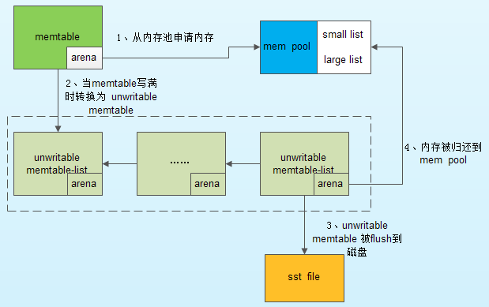

使用内存池时，RocksDB 的内容分配代码模块如下：

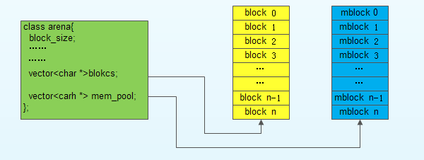

### 3 [Block Cache](https://github.com/facebook/rocksdb/wiki/Block-Cache) 
---

Block Cache 是 RocksDB 的数据的缓存，这个缓存可以在多个 RocksDB 的实例下缓存。一般默认的Block Cache 中存储的值是未压缩的，而用户可以再指定一个 Block Cache，里面的数据可以是压缩的。用户访问数据先访问默认的 Block Cache，待无法获取后再访问用户 Cache，用户 Cache 的数据可以直接存入 page cache 中。

Cache 有两种：LRUCache 和 BlockCache。Block 分为很多 Shard，以减小竞争，所以 shard 大小均匀一致相等，默认 Cache 最多有 64 个 shards，每个 shard 的 最小 size 为 512k，总大小是 8M，类别是 LRU。

```c++
	std::shared_ptr<Cache> cache = NewLRUCache(capacity);  
	BlockedBasedTableOptions table_options;  
	table_options.block_cache = cache;  
	Options options;  
	options.table_factory.reset(new BlockedBasedTableFactory(table_options));  
```

这个 Cache 是不压缩数据的，用户可以设置压缩数据 BlockCache，方法如下：

```c++
table_options.block_cache_compressed = cache;
```

如果 Cache 为 nullptr，则RocksDB会创建一个，如果想禁用 Cache，可以设置如下 Option：

```c++
table_options.no_block_cache = true;
```

默认情况下RocksDB用的是 LRUCache，大小是 8MB， 每个 shard 单独维护自己的 LRU list 和独立的 hash table，以及自己的 Mutex。

 RocksDB还提供了一个 ClockCache，每个 shard 有自己的一个 circular list，有一个 clock handle 会轮询这个 circular list，寻找过时的 kv，如果 entry 中的 kv 已经被访问过则可以继续存留，相对于 LRU 好处是无 mutex lock，circular list 本质是 tbb::concurrent_hash_map，从 benchmark 来看，二者命中率相似，但吞吐率 Clock 比 LRU 稍高。

Block Cache初始化之时相关参数：

* capacity 总的内存使用量
* num\_shards\_bits 把 key 的前 n bits 作为 shard id，则总 shard 的数目为 2 ^ num\_shards\_bits；
* strict\_capacity\_limit 在一些极端情况下 block cache 的总体使用量可能超过 capacity，如在对 block 进行读或者迭代读取的时候可能有插入数据的操作，此时可能因为加锁导致有些数据无法及时淘汰，使得总体capacity超标。如果这个选项设置为 true，则此时插入操作是被允许的，但有可能导致进程 OOM。如果设置为 false，则插入操作会被 refuse，同时读取以及遍历操作有可能失败。这个选项对每个 shard 都有效，这就意味着有的 shard 可能内存已满， 别的 shard 却有很多空闲。
* high\_pri\_pool\_ratio block中为高优先级的 block 保留多少比例的空间，这个选项只有 LRU Cache 有。

默认情况下 index 和filter block 与 block cache 是独立的，用户不能设定二者的内存空间使用量，但为了控制 RocksDB 的内存空间使用量，可以用如下代码把 index 和 filter 也放在 block cache 中：

	BlockBasedTableOptions table_options;
	table_options.cache_index_and_filter_blocks = true;

index 与 filter 一般访问频次比 data 高，所以把他们放到一起会导致内存空间与 cpu 资源竞争，进而导致 cache 性能抖动厉害。有如下两个参数需要注意：cache_index_filter_blocks_with_high_priority 和 high_pri_pool_ratio 一样，这个参数只对 LRU Cache 有效，两者须同时生效。这个选项会把 LRU Cache 划分为高 prio 和低 prio 区，data 放在 low 区，index 和 filter 放在 high 区，如果高区占用的内存空间超过了 capacity * high_pri_pool_ratio，则会侵占 low 区的尾部数据空间。

* pin\_l0\_filter\_and\_index\_blocks\_in\_cache 把 level0 的 index 以及 filter block 放到 Block Cache 中，因为 l0 访问频次最高，一般内存容量不大，占用不了多大内存空间。

SimCache 用于评测 Cache 的命中率，它封装了一个真正的 Cache，然后用给定的 capacity 进行 LRU 测算，代码如下:
	
	// This cache is the actual cache use by the DB.
	std::shared_ptr<Cache> cache = NewLRUCache(capacity);
	// This is the simulated cache.
	std::shared_ptr<Cache> sim_cache = NewSimCache(cache, sim_capacity, sim_num_shard_bits);
	BlockBasedTableOptions table_options;
	table_options.block_cache = sim_cache;

大概只有容量的 2% 会被用于测算。

### 4 [Column Families](https://github.com/facebook/rocksdb/wiki/Column-Families) 
---

RocksDB 3.0 以后添加了一个 Column Family【后面简称 CF】 的feature，每个 kv 存储之时都必须指定其所在的 CF。RocksDB为了兼容以往版本，默认创建一个 “default” 的CF。存储 kv 时如果不指定 CF，RocksDB 会把其存入 “default” CF 中。


#### 4.1 Option
---

RocksDB 的 Option 有 Options, ColumnFamilyOptions, DBOptions 三种。


ColumnFamilyOptions 是 table 级的，而 Options 是 DB 级的，Options 继承自 ColumnFamilyOptions 和 DBOptions，它一般影响只有一个 CF 的 DB，如 “default”。

每个 CF 都有一个 Handle：ColumnFamilyHandle，在 DB 指针被 delete 前，应该先 delete ColumnFamilyHandle。如果 ColumnFamilyHandle 指向的 CF 被别的使用者通过 DropColumnFamily 删除掉，这个 CF 仍然可以被访问，因为其引用计数不为 0.

在以 Read/Write 方式打开一个 DB 的时候，需要指定一个由所有将要用到的 CF string name 构成的 ColumnFamilyDescriptor array。不管 “default” CF 使用与否，都必须被带上。

CF 存在的意义是所有 table 共享 WAL，但不共享 memtable 和 table 文件，通过 WAL 保证原子写，通过分离 table 可快读快写快删除。每次 flush 一个 CF 后，都会新建一个 WAL，都这并不意味着旧的 WAL 会被删除，因为别的 CF 数据可能还没有落盘，只有所有的 CF 数据都被 flush 且所有的 WAL 有关的 data 都落盘，相关的 WAL 才会被删除。RocksDB 会定时执行 CF flush 任务，可以通过 `Options::max_total_wal_size` 查看已有多少旧的 CF 文件已经被 flush 了。

RocksDB 会在磁盘上依据 LSM 算法对多级磁盘文件进行 compaction，这会影响写性能，拖慢程序性能，可以通过 `WriteOptions.low_pri = true` 降低 compaction 的优先级。

#### 4.2 [Set Up Option](https://github.com/facebook/rocksdb/wiki/Set-Up-Options)
---

RocksDB 有很多选项以专门的目的进行设置，但是大部分情况下不需要进行特殊的优化。这里只列出一个常用的优化选项。

* `cf_options.write_buffer_size`

CF 的 write buffer 的最大 size。最差情况下 RocksDB 使用的内存量会翻倍，所以一般情况下不要轻易修改其值。

* Set block cache size

这个值一般设置为 RocksDB 想要使用的内存总量的 1/3，其余的留给 OS 的 page cache。


	BlockBasedTableOptions table_options;
	… \\ set options in table_options
	options.table_factory.reset(new 
	
	std::shared_ptr<Cache> cache = NewLRUCache(<your_cache_size>);
	table_options.block_cache = cache;
	
	BlockBasedTableFactory(table_options));

本进程的所有的 DB 所有的 CF 所有的 table\_options 都必须使用同一个 cahce 对象，或者让所有的 DB 所有的 CF 使用同一个 table\_options。

* `cf_options.compression, cf_options.bottonmost_compression`

选择压缩方法跟你的机器、CPU 能力以及内存磁盘空间大小有关，官方推荐 `cf_options.compression` 使用 kLZ4Compression，`cf_options.bottonmost_compression` 使用 kZSTD，选用的时候要确认你的机器有这两个库，这两个选项也可以分别使用 Snappy 和 Zlib。

* Bloom filter

<font color=red>**官方真正建议修改的参数只有这个 filter 参数。如果大量使用迭代方法，不要修改这个参数，如果大量调用 Get() 接口，建议修改这个参数。**</font>修改方法如下：

	table_options.filter_policy.reset(NewBloomFilterPolicy(10, false));


一个可能的优化设定如下：

	cf_options.level_compaction_dynamic_level_bytes = true;
	options.max_background_compactions = 4;
	options.max_background_flushes = 2;
	options.bytes_per_sync = 1048576;
	table_options.block_size = 16 * 1024;
	table_options.cache_index_and_filter_blocks = true;
	table_options.pin_l0_filter_and_index_blocks_in_cache = true;

上面只是罗列了一些优化选项，这些选项也只能在进程启动的时候设定。更多的选项请详细阅读参考文档1。

#### 4.3 WriteOption & Persistence
---

参考文档 5 的 Persistence 一节提到，RocksDB 每次接收写请求的时候，请求内容会先被写入 WAL transaction log，然后再把数据写入 memfile 里面。

Put 函数的参数 WriteOptions 里有一个选项可以指明是否需要把写请求的内容写入 WAL log 里面。

RocksDB 内部有一个 batch-commit 机制，通过一次 commit 批量地在一次 sync 操作里把所有 transactions log 写入磁盘。

### 5 Flush & Compaction & Merge
---

RocksDB 的内存数据在 memtable 中存着，有 active-memtable 和 immutable-memtable 两种。active-memtable 是当前被写操作使用的 memtable，当 active-memtable 空间写满之后( Options.write_buffer_size 控制其内存空间大小 )这个空间会被标记为 readonly 成为 immutable-memtable。memtable 实质上是一种有序 SkipList，所以写过程其实是写 WAL 日志和数据插入 SkipList 的过程。

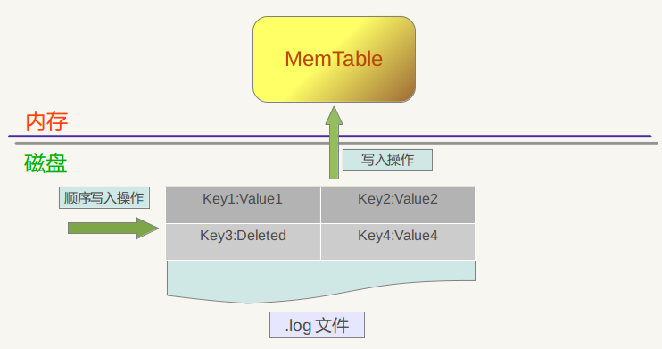

RocksDB 的数据删除过程跟写过程相同，只不过 插入的数据是 “key:删除标记”。

immutable-memtable 被写入 L0 的过程被称为 flush 或者 minor compaction。flush 的触发条件是 immutable memtable数量超过 min_write_buffer_number_to_merge。flush 过程以 column family 为单位，一个 column family 会使用一个或者多个 immutable-memtable，flush 会一次把所有这些文件合并后写入磁盘的 L0 sstfile 中。

在 compaction 过程中如果某个被标记为删除的 key 在某个 snapshot 中存在，则会被一直保留，直到 snapshot 不存在才会被删除。

RocksDB 的 compaction 策略分为 `Universal Compaction` 和 `Leveled Compaction` 两种。两种策略分别有不同的使用场景，下面分两个章节详述。

#### 5.1 Leveled  Compaction
---

compaction 的触发条件是文件个数和文件大小。L0 的触发条件是 sst 文件个数（level0_file_num_compaction_trigger 控制），触发 compaction score 是 L0 sst 文件个数与 level0_file_num_compaction_trigger 的比值或者所有文件的 size 超过 max_bytes_for_level_base。L1 ~ LN 的触发条件则是 sst 文件的大小。

如果 `level_compaction_dynamic_level_bytes` 为 false，L1 ~ LN 每个 level 的最大容量由 `max_bytes_for_level_base` 和 `max_bytes_for_level_multiplier` 决定，其 compaction score 就是当前总容量与设定的最大容量之比，如果某 level 满足 compaction 的条件则会被加入 compaction 队列。

如果 `level_compaction_dynamic_level_bytes` 为 true，则 `Target_Size(Ln-1) = Target_Size(Ln) / max_bytes_for_level_multiplier`，此时如果某 level 计算出来的 target 值小于 `max_bytes_for_level_base / max_bytes_for_level_multiplier`，则 RocksDB 不会再这个 level 存储任何 sst 数据。

##### 5.1.1 Compaction Score
---

compact 流程的 Compaction Score，不同 level 的计算方法不一样，下面先列出 L0 的计算方法。其中 num 代表未 compact 文件的数目。

| Param    | Value | Description | Score |
| :------- | :---- | :---------- | :---- |
| level0_file_num_compaction_trigger | 4 | num 为 4 时，达到 compact 条件 | num < 20 时 Score = num / 4 |
| level0_slowdown_writes_trigger | 20 | num 为 20 时，RocksDB 会减慢写入速度 | 20 <= num && num < 24 时 Score = 10000 |
| level0_stop_writes_trigger | 24 | num 为 24 时，RocksDB 停止写入文件，尽快对 L0 进行 compact | 24 <= num 时 Score = 1000000 |

对于 L1+ 层，score = Level_Bytes / Target_Size。

##### 5.1.2 Level Max Bytes
---

每个 level 容量总大小的计算前文已经提过，

| Param    | Value | Description |
| :------- | :---- | :---------- |
| max_bytes_for_level_base | 10485760 | L1 总大小 |
| max_bytes_for_level_multiplier | 10 | 最大乘法因子 |
| max_bytes_for_level_multiplier_addtl[2…6] | 1 | L2 ~ L6 总大小调整参数 |


每个 level 的总大小计算公式为 `Level_max_bytes[N] = Level_max_bytes[N-1] * max_bytes_for_level_multiplier^(N-1)*max_bytes_for_level_multiplier_additional[N-1]`。

##### 5.1.3 compact file
---

上面详述了 compact level 的选择，但是每个 level 具体的 compact 文件对象，

L0 层所有文件会被选做 compact 对象，因为它们有很高的概率所有文件的 key range 发生重叠。

对于 L1+ 层的文件，先对所有文件的大小进行排序以选出最大文件。

LevelDB 的文件选取过程如下：

LN 中每个文件都一个 seek 数值，其默认值非零，每次访问后这个数值减 1，其值越小说明访问越频繁。sst 文件的策略如下：

* 1 选择 seek 次数为 0 的文件进行 merge，如果没有 seek 次数为 0 的文件，则从第一个文件开始进行 compact；
* 2 一次 compact 后记录本次结束的 key，下次 compact 开始时以这个 key 为起始继续进行 compact。

##### 5.1.4 compaction
---

大致的 compaction 流程大致为：

* 1 找到 score 最高的 level；
* 2 根据一定策略从 level 中选择一个 sst 文件进行 compact，L0 的各个 sst 文件之间 key range 【minkey， maxkey】 有重叠，所以可能一次选取多个； 
* 3 获取 sst 文件的 minkey 和 maxkey;
* 4 从 level + 1 中选取出于 (minkey, maxkey) 用重叠的 sst 文件，有重叠的文件则把文件与 level 中的文件进行合并（merge - sort）作为目标文件，没有重叠文件则把原始文件作为目标文件；
* 5 对目标文件进行压缩后放入 level + 1 中。

##### 5.1.5 并行 Compact 与 sub-compact
---

参数 max_background_compactions 大于 1 时，RocksDB 会进行并行 Compact，但 L0 和 L1 层的 Compaction 任务不能进行并行。

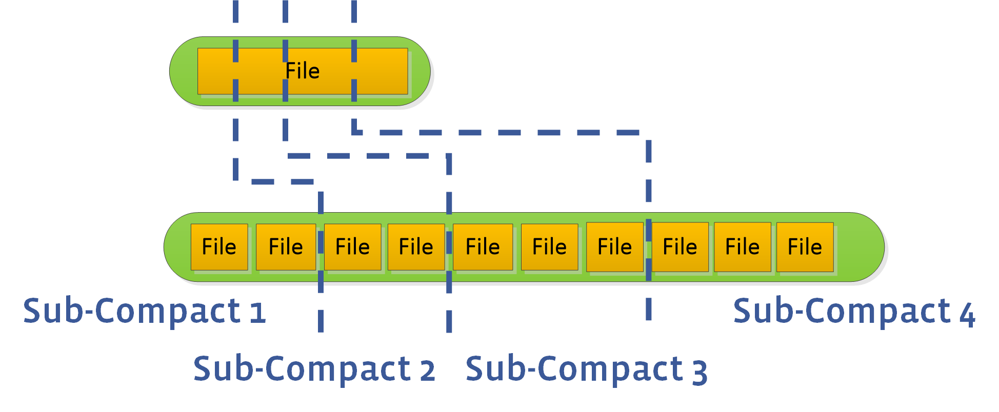

一次 compaction 只能 compact 一个或者多个文件，这会约束整体 compaction 速度。用户可以设置 max_subcompactions 参数大于 1，RocksDB 如上图一样尝试把一个文件拆为多个 sub，然后启动多个线程执行 sub-compact。

#### 5.2 Universal Compaction
---

Univesal Compaction 主要针对 L0。当 L0 中的文件个数多于 `level0_file_num_compaction_trigger`，则启动 compact。

L0 中所有的 sst 文件都可能存在重叠的 key range，假设所有的 sst 文件组成了文件队列 R1,R2,R3,...,Rn，R1 文件的数据是最新的，R2 其次，Rn 则包含了最老的数据，其 compact 流程如下：

* 1 如果空间放大超过 `max_size_amplification_percent`，则对所有的 sst 进行 compaction（就是所谓的 full compaction）；
* 2 如果前size(R1)小于size(R2)在一定比例，默认1%，则与R1与R2一起进行compaction，如果（R1+R2)*(100+ratio)%100<R3，则将R3也加入到compaction任务中，依次顺序加入sst文件；
* 如果第1和第2种情况都没有compaction，则强制选择前N个文件进行合并。

`Universal Compaction` 主要针对低写放大场景，跟 `Leveled Compaction` 相比一次合并文件较多但因为一次只处理 L0 所以写放大整体较低，但是空间放大效应比较大。

RocksDB 还支持一种 FIFO 的 compaction。FIFO 顾名思义就是先进先出，这种模式周期性地删除旧数据。在 FIFO 模式下，所有文件都在 L0，当 sst 文件总大小超过阀值 max_table_files_size，则删除最老的 sst 文件。

整个 compaction 是 LSM-tree 数据结构的核心，也是rocksDB的核心，详细内容请阅读参考文档8 和 参考文档9。

#### 5.4 Merge
---

RocksDB 自身之提供了 Put/Delete/Get 等接口，若需要在现有值上进行修改操作【或者成为增量更新】，可以借助这三个操作进行以下操作实现之：

+ 调用 Get 接口然后获取其值；
+ 在内存中修改这个值；
+ 调用 Put 接口写回 RocksDB。

如果希望整个过程是原子操作，就需要借助 RocksDB 的 Merge 接口了。[参考文档14](https://www.jianshu.com/p/e13338a3f161) 给出了 RocksDB Merge 接口定义如下： 

+ 1 封装了read - modify - write语义，对外统一提供简单的抽象接口；
+ 2 减少用户重复触发Get操作引入的性能损耗；
+ 3 通过决定合并操作的时间和方式，来优化后端性能，并达到并不改变底层更新的语义；
+ 4 渐进式的更新，来均摊更新带来带来的性能损耗，以得到渐进式的性能提升。

RocksDB 提供了一个 MergeOperator 作为 Merge 接口，其中一个子类 AssociativeMergeOperator 可在大部分场景下使用，其定义如下：

    // The simpler, associative merge operator.
    class AssociativeMergeOperator : public MergeOperator {
     public:
      virtual ~AssociativeMergeOperator() {}
    
      // Gives the client a way to express the read -> modify -> write semantics
      // key:           (IN) 操作对象 KV 的 key
      // existing_value:(IN) 操作对象 KV 的 value，如果为 null 则意味着 KV 不存在
      // value:         (IN) 新值，用于替换/更新 @existing_value 
      // new_value:    (OUT) 客户端负责把 merge 后的新值填入这个变量
      // logger:        (IN) Client could use this to log errors during merge.
      //
      // Return true on success.
      // All values passed in will be client-specific values. So if this method
      // returns false, it is because client specified bad data or there was
      // internal corruption. The client should assume that this will be treated
      // as an error by the library.
      virtual bool Merge(const Slice& key,
                         const Slice* existing_value,
                         const Slice& value,
                         std::string* new_value,
                         Logger* logger) const = 0;
    
     private:
      // Default implementations of the MergeOperator functions
      virtual bool FullMergeV2(const MergeOperationInput& merge_in,
                               MergeOperationOutput* merge_out) const override;
    
      virtual bool PartialMerge(const Slice& key,
                                const Slice& left_operand,
                                const Slice& right_operand,
                                std::string* new_value,
                                Logger* logger) const override;
    };


RocksDB AssociativeMergeOperator 被称为关联性 Merge Operator，[参考文档14](https://www.jianshu.com/p/e13338a3f161)  给出了关联性的定义：

+ 调用Put接口写入RocksDB的数据的格式和Merge接口是相同的
+ 用用户自定义的merge操作，可以将多个merge操作数合并成一个

` **MergeOperator还可以用于非关联型数据类型的更新。** 例如，在RocksDB中保存json字符串，即Put接口写入data的格式为合法的json字符串。而Merge接口只希望更新json中的某个字段。所以代码可能是这样`：

    // Put/store the json string into to the database
    db_->Put(put_option_, "json_obj_key",
             "{ employees: [ {first_name: john, last_name: doe}, {first_name: adam, last_name: smith}] }");
    // Use a pre-defined "merge operator" to incrementally update the value of the json string
    db_->Merge(merge_option_, "json_obj_key", "employees[1].first_name = lucy");
    db_->Merge(merge_option_, "json_obj_key", "employees[0].last_name = dow");
 `AssociativeMergeOperator无法处理这种场景，因为它假设Put和Merge的数据格式是关联的。我们需要区分Put和Merge的数据格式，也无法把多个merge操作数合并成一个。这时候就需要Generic MergeOperator。`

    // The Merge Operator
    //
    // Essentially, a MergeOperator specifies the SEMANTICS of a merge, which only
    // client knows. It could be numeric addition, list append, string
    // concatenation, edit data structure, ... , anything.
    // The library, on the other hand, is concerned with the exercise of this
    // interface, at the right time (during get, iteration, compaction...)
    class MergeOperator {
     public:
      virtual ~MergeOperator() {}
    
      // Gives the client a way to express the read -> modify -> write semantics
      // key:         (IN) The key that's associated with this merge operation.
      // existing:    (IN) null indicates that the key does not exist before this op
      // operand_list:(IN) the sequence of merge operations to apply, front() first.
      // new_value:  (OUT) Client is responsible for filling the merge result here
      // logger:      (IN) Client could use this to log errors during merge.
      //
      // Return true on success. Return false failure / error / corruption.
      // 用于对已有的值做Put或Delete操作
      virtual bool FullMerge(const Slice& key,
                             const Slice* existing_value,
                             const std::deque<std::string>& operand_list,
                             std::string* new_value,
                             Logger* logger) const = 0;
    
      // This function performs merge(left_op, right_op)
      // when both the operands are themselves merge operation types.
      // Save the result in *new_value and return true. If it is impossible
      // or infeasible to combine the two operations, return false instead.
      // 如果连续多次对一个 key 进行操作，则可以可以借助 PartialMerge 将两个操作数合并.
      virtual bool PartialMerge(const Slice& key,
                                const Slice& left_operand,
                                const Slice& right_operand,
                                std::string* new_value,
                                Logger* logger) const = 0;
    
      // The name of the MergeOperator. Used to check for MergeOperator
      // mismatches (i.e., a DB created with one MergeOperator is
      // accessed using a different MergeOperator)
      virtual const char* Name() const = 0;
    };

+ **工作原理**

当调用DB::Put()和DB:Merge()接口时, 并不需要立刻计算最后的结果. RocksDB将计算的动作延后触发, 例如在下一次用户调用Get, 或者RocksDB决定做Compaction时. 所以, 当merge的动作真正开始做的时候, 可能积压(stack)了多个操作数需要处理. 这种情况就需要MergeOperator::FullMerge来对existing_value和一个操作数序列进行计算, 得到最终的值.

+ **PartialMerge 和 Stacking**

有时候, 在调用FullMerge之前, 可以先对某些merge操作数进行合并处理, 而不是将它们保存起来, 这就是PartialMerge的作用: 将两个操作数合并为一个, 减少FullMerge的工作量.
当遇到两个merge操作数时, RocksDB总是先会尝试调用用户的PartialMerge方法来做合并, 如果PartialMerge返回false才会保存操作数. 当遇到Put/Delete操作, 就会调用FullMerge将已存在的值和操作数序列传入, 计算出最终的值.

+ **使用Associative Merge的场景**

merge 操作数的格式和Put相同
多个顺序的merge操作数可以合并成一个

+ **使用Generic Merge的场景**

merge 操作数的格式和Put不同
当多个merge操作数可以合并时，PartialMerge()方法返回true

*!!!: 本节文字摘抄自 [参考文档14](https://www.jianshu.com/p/e13338a3f161)  。

### 6 磁盘文件

---

参考文档 12 列举了 RocksDB 磁盘上数据文件的种类：

	* db的操作日志
	* 存储实际数据的 SSTable 文件
	* DB的元信息 Manifest 文件
	* 记录当前正在使用的 Manifest 文件，它的内容就是当前的 manifest 文件名
	* 系统的运行日志，记录系统的运行信息或者错误日志。
	* 临时数据库文件，repair 时临时生成的。

manifest 文件记载了所有 SSTable 文件的 key 的范围、level 级别等数据。

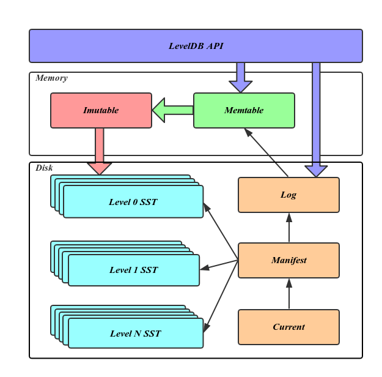

上面是 leveldb 的架构图，可以作为参考，明白各种文件的作用。

#### 6.1 log 文件 
---

log 文件就是 WAL。

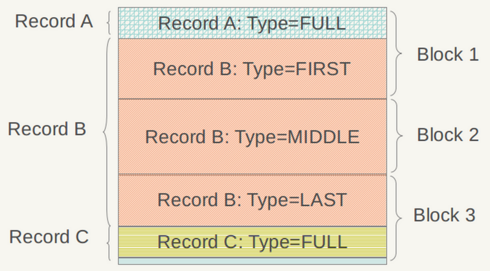

如上图，log 文件的逻辑单位是 Record，物理单位是 block，每个 Record 可以存在于一个 block 中，也可以占用多个 block。Record 的详细结构见上图文字部分，其 type 字段的意义见下图。

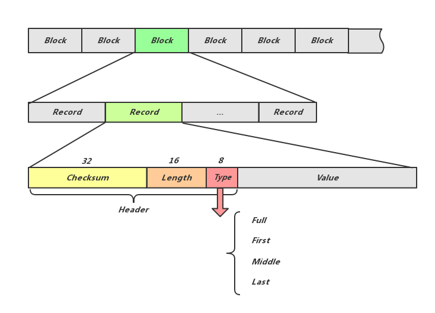

从上图可见 Record type的意义：如果某 KV 过长则可以用多 Record 存储。

#### 6.2 Manifest 文件 
---

RocksDB 整个 LSM 树的信息需要常驻内存，以让 RocksDB 快速进行 kv 查找或者进行 compaction 任务，RocksDB 会用文件把这些信息固化下来，这个文件就是 Manifest 文件。RocksDB 称 Manifest 文件记录了 DB 状态变化的事务性日志，也就是说它记录了所有改变 DB 状态的操作。主要内容有事务性日志和数据库状态的变化。

RocksDB 的函数 VersionSet::LogAndApply 是对 Manifest 文件的更新操作，所以可以通过定位这个函数出现的位置来跟踪 Manifest 的记录内容。

Manifest 文件作为事务性日志文件，只要数据库有变化，Manifest都会记录。其内容 size 超过设定值后会被 VersionSet::WriteSnapShot 重写。

RocksDB 进程 Crash 后 Reboot 的过程中，会首先读取 Manifest 文件在内存中重建 LSM 树，然后根据 WAL 日志文件恢复 memtable 内容。

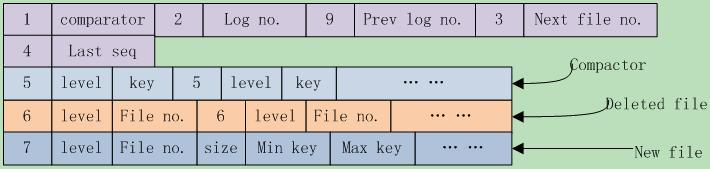

上图是 leveldb 的 Manifest 文件结构，这个 Manifest 文件有以下文件内容： 

* coparator名、log编号、前一个log编号、下一个文件编号、上一个序列号，这些都是日志、sstable文件使用到的重要信息，这些字段不一定必然存在；
* 其次是compact点，可能有多个，写入格式为{kCompactPointer, level, internal key}
* 其后是删除文件，可能有多个，格式为{kDeletedFile, level, file number}。
* 最后是新文件，可能有多个，格式为{kNewFile, level, file number, file size, min key, max key}。

RocksDB MANIFEST文件所保存的数据基本是来自于VersionEdit这个结构，MANIFEST包含了两个文件，一个log文件一个包含最新MANIFEST文件名的文件，Manifest的log文件名是这样 MANIFEST-(seqnumber)，这个seq会一直增长，只有当 超过了指定的大小之后，MANIFEST会刷新一个新的文件，当新的文件刷新到磁盘(并且文件名更新)之后，老的文件会被删除掉，这里可以认为每一次MANIFEST的更新都代表一次snapshot，其结构描述如下：

    MANIFEST = { CURRENT, MANIFEST-<seq-no>* }  
    CURRENT = File pointer to the latest manifest log 
    MANIFEST-<seq no> = Contains snapshot of RocksDB state and subsequent modifications

在RocksDB中任意时间存储引擎的状态都会保存为一个Version(也就是SST的集合)，而每次对Version的修改都是一个VersionEdit,而最终这些VersionEdit就是 组成manifest-log文件的内容。

下面就是MANIFEST的log文件的基本构成:

    version-edit      = Any RocksDB state change
    version           = { version-edit* }
    manifest-log-file = { version, version-edit* }
                      = { version-edit* }

关于 VersionSet 相关代码分析见[参考文档13](https://yq.aliyun.com/articles/594728?spm=a2c4e.11157919.spm-cont-list.17.302c27aeDR3OyC)。

#### 6.3 SSTfile  
---

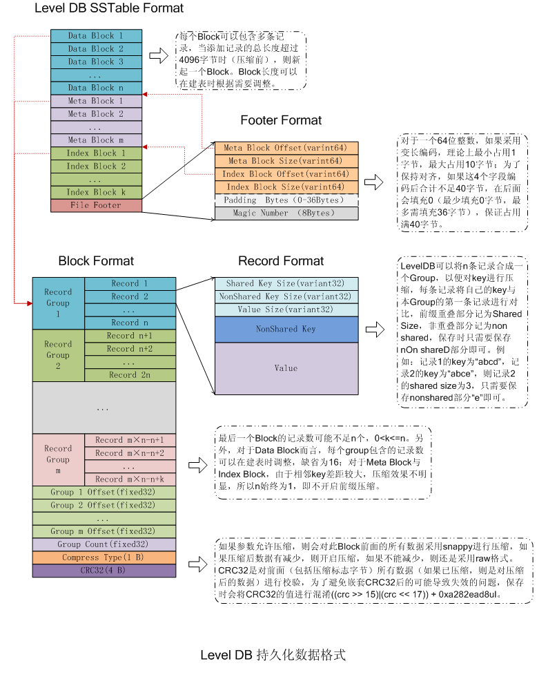

见参考文档12，SSTtable 大致分为几个部分：

* 数据块 Data Block，直接存储有序键值对；
* Meta Block，存储Filter相关信息；
* Meta Index Block，对Meta Block的索引，它只有一条记录，key是meta index的名字（也就是Filter的名字），value为指向meta index的位置；
* Index Block，是对Data Block的索引，对于其中的每个记录，其key >=Data Block最后一条记录的key，同时<其后Data Block的第一条记录的key；value是指向data index的位置信息；
* Footer，指向各个分区的位置和大小。

block 结构如下图：

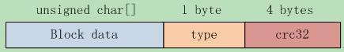

record 结构如下图：

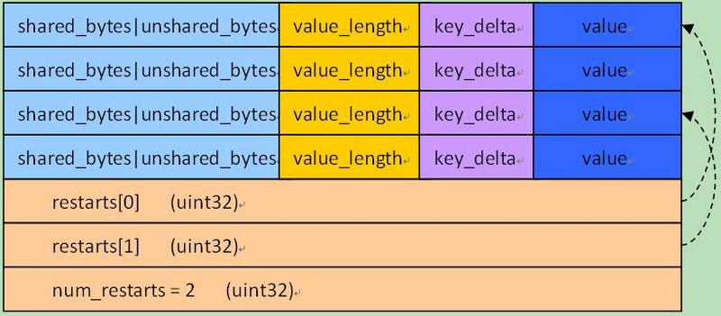

Footer 结构如下图：

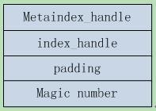

#### 6.4 memtable  
---

memtable 中存储了一些 metadata 和 data，data 在 skiplist 中存储。metadata 数据如下（源自参考文档 12）：

* 当前日志句柄；
* 版本管理器、当前的版本信息（对应 compaction）和对应的持久化文件标示；
* 当前的全部db配置信息比如 comparator 及其对应的 memtable 指针；
* 当前的状态信息以决定是否需要持久化 memtable 和合并 sstable；
* sstable 文件集合的信息。

#### 6.5 VersionSet  
---

RocksDB 的 Version 表示一个版本的 metadata，其主要内容是 FileMetaData 指针的二维数组，分层记录了所有的SST文件信息。

FileMetaData 数据结构用来维护一个文件的元信息，包括文件大小，文件编号，最大最小值，引用计数等信息，其中引用计数记录了被不同的Version引用的个数，保证被引用中的文件不会被删除。

Version中还记录了触发 Compaction 相关的状态信息，这些信息会在读写请求或 Compaction 过程中被更新。在 CompactMemTable 和 BackgroundCompaction 过程中会导致新文件的产生和旧文件的删除，每当这个时候都会有一个新的对应的Version生成，并插入 VersionSet 链表头部，LevelDB 用 VersionEdit 来表示这种相邻 Version 的差值。


VersionSet 结构如上图所示，它是一个 Version 构成的双向链表，这些Version按时间顺序先后产生，记录了当时的元信息，链表头指向当前最新的Version，同时维护了每个Version的引用计数，被引用中的Version不会被删除，其对应的SST文件也因此得以保留，通过这种方式，使得LevelDB可以在一个稳定的快照视图上访问文件。

VersionSet中除了Version的双向链表外还会记录一些如LogNumber，Sequence，下一个SST文件编号的状态信息。

#### 6.6 MetaData Restore  
---

本节内容节选自参考文档 12。

为了避免进程崩溃或机器宕机导致的数据丢失，LevelDB 需要将元信息数据持久化到磁盘，承担这个任务的就是 Manifest 文件，每当有新的Version产生都需要更新 Manifest。

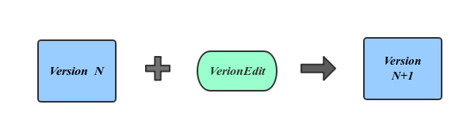

新增数据正好对应于VersionEdit内容，也就是说Manifest文件记录的是一组VersionEdit值，在Manifest中的一次增量内容称作一个Block。

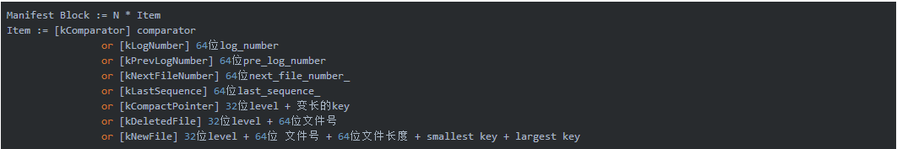

Manifest Block 的详细结构如上图所示。

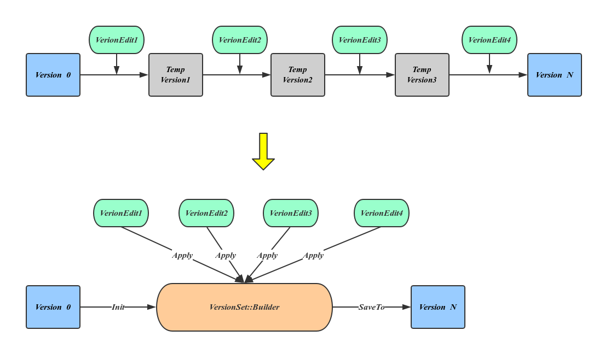

上图最上面的流程显示了恢复元信息的过程，也就是一次应用 VersionEdit 的过程，这个过程会有大量的临时 Version 产生，但这种方法显然太过于耗费资源，LevelDB 引入 VersionSet::Builder 来避免这种中间变量，方法是先将所有的VersoinEdit内容整理到VersionBuilder中，然后一次应用产生最终的Version，详细流程如上图下边流程所示。

数据恢复的详细流程如下：

* 依次读取Manifest文件中的每一个Block， 将从文件中读出的Record反序列化为VersionEdit；
* 将每一个的VersionEdit Apply到VersionSet::Builder中，之后从VersionSet::Builder的信息中生成Version；
* 计算compaction_level_、compaction_score_；
* 将新生成的Version挂到VersionSet中，并初始化VersionSet的manifest_file_number_， next_file_number_，last_sequence_，log_number_，prev_log_number_ 信息；


#### 6.7 Snapshot  
---

RocksDB 每次进行更新操作就会把更新内容写入 Manifest 文件，同时它会更新版本号。

版本号是一个 8 字节的证书，每个 key 更新的时，除了新数据被写入数据文件，同时记录下 RocksDB 的版本号。RocksDB 的 Snapshot 数据仅仅是逻辑数据，并没有对应的真实存在的物理数据，仅仅对应一下当前 RocksDB 的全局版本号而已，只要 Snapshot 存在，每个 key 对应版本号的数据在后面的更新、删除、合并时会一并存在，不会被删除，以保证数据一致性。 

#### 6.8 Backup
---

RocksDB 提供了 point-of-time 数据备份功能，其大致流程如下：

* 禁止删除文件（sst 文件和 log 文件）；
* 将 RocksDB 中的所有的 sst/Manifest/配置/CURRENT 文件备份到指定目录；
* 允许删除文件。

sst 文件只有在 compact 时才会被删除，所以禁止删除就相当于禁止了 compaction。别的 RocksDB 在获取这些备份数据文件后会依据 Manifest 文件重构 LSM 结构的同时，也能恢复出 WAL 文件，进而重构出当时的 memtable 文件。

在进行 Backup 的过程中，写操作是不会被阻塞的，所以 WAL 文件内容会在 backup 过程中发生改变。RocksDB 的 flush_before_backup 选项用来控制在 backup 时是否也拷贝 WAL，其值为 true 则不拷贝。

### 7 FAQ
---

官方 wiki 【参考文档 11】提供了一份 FAQ，下面节选一些比较有意义的建议，其他内容请移步官方文档。

- 1 如果机器崩溃后重启，则 RocksDB 能够恢复的数据是同步写【WriteOptions.sync=true】调用 `DB::SyncWAL()` 之前的数据 或者已经被写入 L0 的 memtable 的数据都是安全的；
- 2 可以通过 `GetIntProperty(cf_handle, “rocksdb.estimate-num-keys")` 获取一个 column family 中大概的 key 的个数；
- 3 可以通过 `GetAggregatedIntProperty(“rocksdb.estimate-num-keys", &num_keys)` 获取整个 RocksDB 中大概的 key 的总数，之所以只能获取一个大概数值是因为 RocksDB 的磁盘文件有重复 key，而且 compact 的时候会进行 key 的淘汰，所以无法精确获取；
- 4 Put()/Write()/Get()/NewIterator() 这几个 API 都是线程安全的；
- 5 多个进程可以同时打开同一个 RocksDB 文件，但是其中只能有一个写进程，其他的都只能通过 `DB::OpenForReadOnly()` 对 RocksDB 进行只读访问；
- 6 当进程中还有线程在对 RocksDB 进行 读、写或者手工 compaction 的时候，不能强行关闭它；
- 7 RocksDB 本身不建议使用大 key，但是它支持的 key 的最大长度是 8MB，value 的最大长度是 3GB；
- 8 RocksDB 最佳实践：一个线程进行写，且以顺序方式写；以 batch 方式把数据写入 RocksDB；使用 vector memtable；确保 `options.max_background_flushes` 最少为 4；插入数据之前设置关闭自动 compact，把 `options.level0_file_num_compaction_trigger/options.level0_slowdown_writes_trigger/options.level0_stop_writes_trigger` 三个值放大，数据插入后再启动调用 compact 函数进行 compaction 操作。 
    如果调用了`Options::PrepareForBulkLoad()`，后面三个方法会被自动启用； 
- 9 关闭 RocksDB 对象时，如果是通过 DestroyDB() 去关闭时，这个 RocksDB 还正被另一个进程访问，则会造成不可预料的后果；
- 10 可以通过 `DBOptions::db_paths/DBOptions::db_log_dir/DBOptions::wal_dir` 三个参数分别存储 RocksDB 的数据，这种情况下如果要释放 RocksDB 的数据可以通过 DestroyDB() 这个 API 去执行删除任务；
- 11 当 `BackupOptions::backup_log_files` 或者 `flush_before_backup` 的值为 true 的时候，如果程序调用 `CreateNewBackup()` 则 RocksDB 会创建 `point-in-time snapshot`，RocksDB进行数据备份的时候不会影响正常的读写逻辑；
- 12 RocksDB 启动之后不能修改 `prefix extractor`；
- 13 SstFileWriter API 可以用来创建 SST 文件，如果这些 SST 文件被添加到别的 RocksDB 数据库发生 key range 重叠，则会导致数据错乱；
- 14 编译 RocksDB 的 gcc 版本 最低是 4.7，推荐 4.8 以上；
- 15 单个文件系统如 ext3 或者 xfs 可以使用多个磁盘，然后让 RocksDB 在这个文件系统上运行进而使用多个磁盘；
- 16 使用多磁盘时，RAID 的 stripe size 不能小于 64kb，推荐使用1MB；
- 17 RocksDB 可以针对每个 SST 文件通过 `ColumnFamilyOptions::bottommost_compression` 使用不同的压缩的方法；
- 18 当多个 Handle 指向同一个 Column Family 时，其中一个线程通过 DropColumnFamily() 删除一个 CF 的时候，其引用计数会减一，直至为 0 时整个 CF 会被删除；
- 19 RocksDB 接受一个写请求的时候，可能因为 compact 会导致 RocksDB 多次读取数据文件进行数据合并操作；
- 20 RocksDB 不直接支持数据的复制，但是提供了 API GetUpdatesSince() 供用户调用以获取某个时间点以后更新的 kv；
- 21 Options 的 block_size 是指 block 的内存空间大小，与数据是否压缩无关；
- 22 options.prefix_extractor 一旦启用，就无法继续使用 Prev() 和 SeekToLast() 两个 API，可以把 ReadOptions.total_order_seek 设置为 true，以禁用 `prefix iterating`；
- 23 当 BlockBaseTableOptions::cache_index_and_filter_blocks 的值为 true 时，在进行 Get() 调用的时候相应数据的 bloom filter 和 index block 会被放进 LRU cache 中，如果这个参数为 false 则只有 memtable 的 index 和 bloom filter 会被放进内存中；
- 24 当调用 Put() 或者 Write() 时参数 WriteOptions.sync 的值为 true，则本次写以前的所有 WriteOptions.disableWAL 为 false 的写的内容都会被固化到磁盘上；
- 25 禁用 WAL 时，DB::Flush() 只对单个 Column Family 的数据固化操作是原子的，对多个 Column Family 的数据操作则不是原子的，官方考虑将来会支持这个 feature；
- 26 当使用自定义的 comparators 或者 merge operators 时，ldb 工具就无法读取 sst 文件数据；
- 27 RocksDB 执行前台的 Get() 和 Write() 任务遇到错误时，它会返回 rocksdb::IOError 具体值；
- 28 RocksDB 执行后台任务遇到错误时 且 options.paranoid_checks 值为 true，则 RocksDB 会自动进入只读模式；
- 29 RocksDB 一个线程执行 compact 的时候，这个任务是不可取消的；
- 30 RocksDB 一个线程执行 compact 任务的时候，可以在另一个线程调用 CancelAllBackgroundWork(db, true) 以中断正在执行的 compact 任务；
- 31 当多个进程打开一个 RocksDB 时，如果指定的 compact 方式不一样，则后面的进程会打开失败；
- 32 Column Family 使用场景：(1) 不同的 Column Family 可以使用不同的 setting/comparators/compression types/merge operators/compaction filters；(2) 对数据进行逻辑隔离，方便分别删除；(3) 一个 Column Family 存储 metadata，另一个存储 data；
- 33 使用一个 RocksDB 就是使用一个物理存储系统，使用一个 Column Family 则是使用一个逻辑存储系统，二者主要区别体现在 数据备份、原子写以及写性能表现上。DB 是数据备份和复制以及 checkpoint 的基本单位，但是 Column Family 则利用 BatchWrite，因为这个操作是可以跨 Column Family 的，而且多个 Column Family 可以共享同一个 WAL，多个 DB 则无法做到这一点；
- 34 RocksDB 不支持多列；
- 35 RocksDB 的读并不是无锁的，有如下情况：(1) 访问 sharded block cache (2) 如果 table cache options.max_open_files 不等于 -1 (3) 如果 flush 或者 compaction 刚刚完成，RocksDB 此时会使用全局 mutex lock 以获取 LSM 树的最新 metadata (4) RocksDB 使用的内存分配器如 jemalloc 有时也会加锁，这四种情况总体很少发生，总体可以认为读是无锁的；
- 36 如果想高效的对所有数据进行 iterate，则可以创建 snapshot 然后再遍历；
- 37 如果一个 key space range (minkey, maxkey) 很大，则使用 Column Family 对其进行 sharding，如果这个 range 不大则不要单独使用一个 Column Family；
- 38 RocksDB 没有进行 compaction 的时候，可以通过 `rocksdb.estimate-live-data-size` 可以估算 RocksDB 使用的磁盘空间；
- 39 Snapshot 仅仅存在于逻辑概念上，其对应的实际物理文件可能正被 compaction 线程执行写任务；Checkpoint 则是实际物理文件的一个镜像，或者说是一个硬链接，而出处于同样的 Env 下【都是 RocksDB 数据文件格式】；而 backup 虽然也是物理数据的镜像，但是与原始数据处于不同的 Env 下【如 backup 可能在 HDFS 上】；
- 40 推荐使用压缩算法 LZ4，Snappy 次之，压缩之后如果为了更好的压缩效果可以使用 Zlib；
- 41 即使没有被标记为删除的 key，也没有数据过期，RocksDB 仍然会执行 compaction，以提高读性能；
- 42 RocksDB 的 key 和 value 是存在一起的，遍历一个 key 的时候，RocksDB 已经把其 value 读入 cache 中；
- 43 对于一个离线 DB 可以通过 "sst_dump --show_properties --command=none" 命令获取特定 sst 文件的 index & filter 的 size，对于正在运行的 DB 可以通过读取 DB 的属性 "kAggregatedTableProperties" 或者调用 DB::GetPropertiesOfAllTables() 获取 DB 的 index & filter 的 size。

### 8 Pika
---

今年六月份公司打算使用 Codis + Pika 作为存储方案，故而最近三个月都在研究测试使用 Pika，稍微有些心得，一并记录于本文，以作记忆之用。

### 8.1 相关参数
---

* target_file_size_base 这个参数就是 #5.1# 小节中的 "target sise",是 level 1 SST 文件的 size。有使用者 “把pika的target-file-size-base从20M改到256M后，发现新写入数据时cpu消耗高30%左右，写入性能也有影响”，原因是“文件越大compaction代价越大”。


## 参考文档 ##
---

- 1 [RocksDB Tuning Guide](https://github.com/facebook/rocksdb/wiki/RocksDB-Tuning-Guide)
- 2 [Rocksdb BlockBasedTable Format](https://github.com/facebook/rocksdb/wiki/Rocksdb-BlockBasedTable-Format)
- 3 [PlainTable Format](https://github.com/facebook/rocksdb/wiki/PlainTable-Format)
- 4 [Thread Pool](https://github.com/facebook/rocksdb/wiki/Thread-Pool)
- 5 [RocksDB Basics](https://github.com/facebook/rocksdb/wiki/RocksDB-Basics)
- 6 [Transactions](https://github.com/facebook/rocksdb/wiki/Transactions)
- 7 [Bloom Filter](https://github.com/facebook/rocksdb/wiki/RocksDB-Bloom-Filter)
- 8 [Universal Compaction](https://github.com/facebook/rocksdb/wiki/Universal-Compaction)
- 9 [Leveled Compaction](https://github.com/facebook/rocksdb/wiki/Leveled-Compaction)
- 10 [Time to Live](https://github.com/facebook/rocksdb/wiki/Time-to-Live)
- 11 [RocksDB-FAQ](https://github.com/facebook/rocksdb/wiki/RocksDB-FAQ)
- 12 [设计思路和主要知识点](https://note.youdao.com/share/?id=60b7e3aa14a01c85d05ee8a7e4d16c46&type=note#/)
- 13 [RocksDB · MANIFEST文件介绍](https://yq.aliyun.com/articles/594728?spm=a2c4e.11157919.spm-cont-list.17.302c27aeDR3OyC)
- 14 [RocksDB. Merge Operator](https://www.jianshu.com/p/e13338a3f161)

## 扒粪者-于雨氏 ##

> 2018/03/28，于雨氏，初作此文于海淀。
> 
> 2018/07/06，添加 5.4 节 `Merge Operator`。
> 
> 2018/09/06，添加第 8 章 `Pika`。