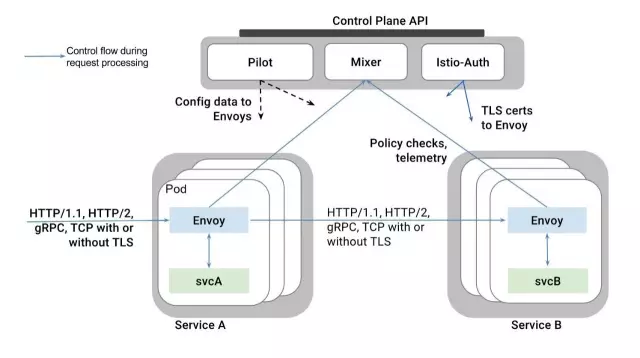
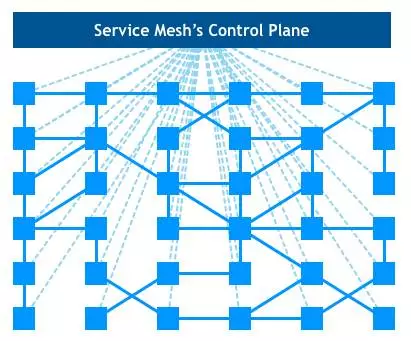
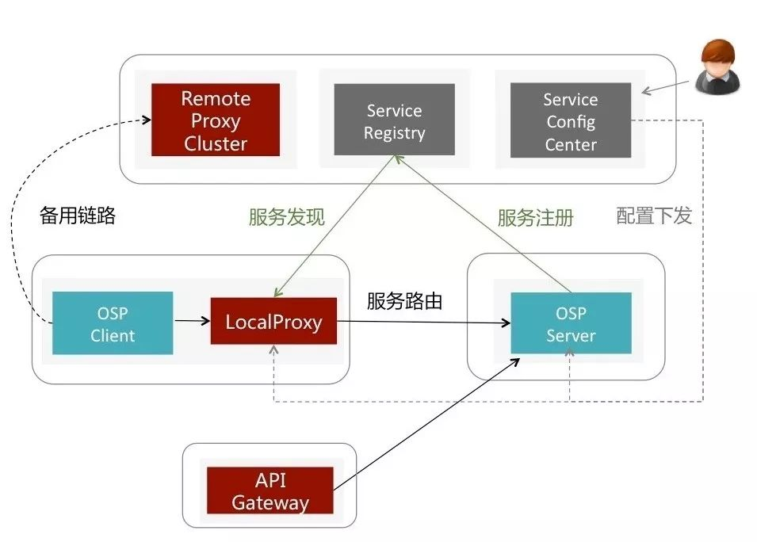
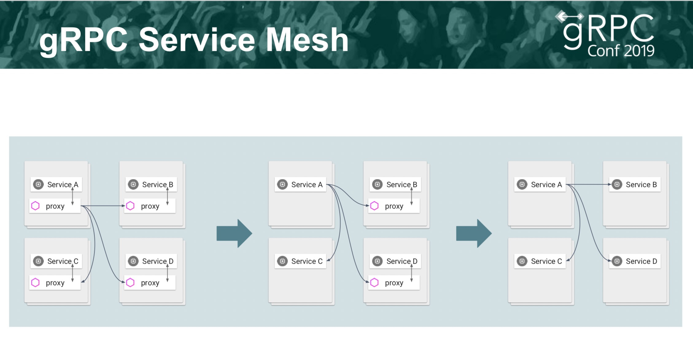

## Service Mesh 形态刍议
---
*written by Alex Stocks on 2019/05/21，版权所有，无授权不得转载*

愚人曾对 Service Mesh 有成见：以为其不过是一些西方商业公司的 “概念党” 们基于利益包装出来的又一个所谓的 “新概念”，然后国内一帮 “布道师” 们便开始锣鼓喧天地抬轿子迎进来。

基于这种认知愚人去年一年躲开了一些机会，但 "躲得了初一躲不过十五"，今年刚进公司第一天，便被同事告知工作内容之一便是某系统的 Service Mesh 改造工作......

考虑到饭碗，愚人还是很愉快无节操地拥抱项目开干了。随着工作展开逐步了解 Service Mesh 的内容之后，对这项技术有了兴趣，进而有了自己的一些看法。

### 1 k8s 缺陷

以前个人有愚见，Service Mesh 概念其实不过是新瓶装老酒。大概 2012 年时，愚人在 “南方某厂” 干活时，曾见过一个称之为 nlb 的系统，其核心组件 proxy 工作职责有：

- 1 从配置中心拉取配置；
- 2 为 client 到 zookeeper 进行服务发现；
- 3 为 server 向 zookeeper 进行服务注册；
- 4 记录每个服务的在某段时间内的成功率，基于此权值进行随机均衡转发网络请求；
- 5 定时把服务质量上报到监控中心；

后来这套系统被移植到其云系统之上时，被改名为 F5。当看到后来的 Service Mesh 概念时，便有种孩子出生六年了还是个 nobody，到六岁上小学时才被匆匆命名之觉。

当然以上为个人愚见，按照正史记载：2017 年 Service Mesh 概念之所以出现且存在是为了减轻网络中心控制节点的压力。

以 2015 年出现的 k8s 的为例，其每个 Worker Node 需要同 Master Node 之间通信以上报容器状态并接收控制信息，Master Node 便成为整个系统的单点。有了单点，上帝需要对其拆分，于是便有了 Istio。愚人以为 Istio 其实也不过是从十年发展历史的 envoy 某些概念的拆分组合后形成的。

淡然，本文无意向深处阐述 k8s 的各种概念【那是因为目前我还没入门^_^】，只能从一些虚处入手，结合个人以往的粗浅项目经验来谈谈自己的 Service Mesh 愚见。

### 2 “经典” 框架

Istio 要求每个容器有自己的代理（Sidecar），所有 Sidecar 直接进行数据通信【数据平面】而后组成一个服务网格（Service Mesh），从 Istio 接收配置信息且进行服务发现并进行状态上报【控制平面】。

Sidecar 接管容器应用的所有网络流，负责流量管理（服务发现、服务治理、流量控制）、安全管理、健康检查和监控上报。某容器出现故障便会被系统网络隔离，而后会被新容器替换之，并不影响整体网络健康度。整体网络弹性可伸缩，且流量会被精细调度，系统整体不存在单点。

Istio 官方给出了如下一个基于 Envoy 作为 Sidecar 的 "经典" Servidce Mesh 宏观视图：

整体框架图甚是精简，若把其嵌入 k8s，便有如下让密集恐惧症患者们肃（望）然（而）起（生）敬（畏）的围棋图：

愚人初学 k8s 已经被其各种名词吓倒，再加上 istio 的各种 “新概念”，心中只有跪拜的想法。虽如是，二者的功能都是搭建一个健康的 “数据管道”，其本质必脱离不了 “流量管控”。

### 3 Service Mesh 升级流程

应用无论是否运行在 Service Mesh 系统之中，都有需要升级之时，即使 Service Mesh 系统自身也面临升级问题。Service Mesh 系统升级，核心便是众多 Sidecar 的升级，最高要求就是做到 Sidecar 升级时，其服务的应用系统无感【高大上说法是 “在飞驰的火车（鹅厂用词）/飞机（猫厂用词）上换引擎”】。

个人曾见到这样的说法：基于 Istio 的 Service Mesh 系统的 Sidecar 如果能做到热升级，其升级便能做到 “丝滑般柔顺”。但个人在基于某 sidecar 进行定制开发时，从一起干活的同事的开发经历中见到的真实情况是：为了做到对应用系统无感，sidecar 热升级【如蝉蜕变】花费 30s，给其定义了若干状态，然后形成一个巨复杂的状态机等待业务方去填充业务逻辑，且整个过程某些子服务的网络流还是会暂停的！

当然，身为高段位的我厂同事处理这种流程还是手到擒来，最后很 ease 地把整个流程搞定了，但最终的结果是业务流程也配合做了改变。事后反思整个流程，个人的看法是：既然现实中做不到热升级过程中的 “丝滑般柔顺” 和 “应用层无感”，为何不通过服务降级这种方式简化处理流程呢？

升级的最终结果只要做到应用层服务流程不中断即可，不必强调 “应用层无感知”。换一只认知便是换需要一种处理方法，通过服务降级，虽然整个流程让应用层也分担整个过程的复杂度，但也降低的 Sidecar 自身处理整个升级流程的复杂度【复杂性守恒定律】，且应用层的流程处理完全可以经梳理后形成标准，在应用层的网络 SDK 层内处理整个升级流程，最终的结果其实能做到 “应用开发者无感知”。

如上图【源自[参考文档1](https://mp.weixin.qq.com/s/7bwBCdDEVeYMhL242Xo6Cg)】中给出了唯品会公司的 Service Mesh 框架以 服务降级 手法处理 Service Mesh 框架升级流程：“如果本地Proxy不可用或宣称自己准备关闭，就将请求无损转发到Remote Proxy，再启动一个监视器观察本地Proxy什么时候重新可用"【源自[参考文档1](https://mp.weixin.qq.com/s/7bwBCdDEVeYMhL242Xo6Cg)】。

其核心在于其 “Remote Proxy Cluster”，解决手法简单漂亮，整个升级过程中没有 “热升级” 处理流程中需要旧版本 Sidecar 容器和新版本 Sidecar 容器共存而引起的额外资源占用问题。

### 4 未来的 Service Mesh

Sidecar 作为网络层组件接管了其服务应用的流量后，服务应用层以 local 方式连接 Sidecar，可以实现自身网络层处理逻辑的解耦。

服务应用层无论是各种跨进程访问方式还是走本机协议栈形式以 local 形式连接 Sidecar，但毕竟多了一个 “hop”，对整理系统的吞吐、延迟都有影响，且多了这么一个组件必然会增加硬件资源地消耗，所以有一个问题便是：Sidecar 这个组件是必不可少的吗？

在 Service Mesh 概念出来之前，服务治理框架有谷歌的 gRPC、鹅厂的 Tars、猫厂的 Dubbo【内部有一个 HSF】等，其本质是以 SDK 形式嵌入服务应用的网络层实现整体系统的可靠通信。在 Service Mesh 概念出现后，这些组件当然还是会以各种形式进化下去，gRPC 的进化应该会最引人注目。

上图详细得描述了 gRPC 的 Service Mesh 进化方向，其最终形态是：一个无 Sidecar 的 Service Mesh。

gRPC 自身由于协议的向前先后兼容性，所以基于其上的应用能够做到升级过程中服务的兼容性不存在问题，则通过滚动升级可以做到升级过程中 “服务不中断”，所以没有 Sidecar 的 Service Mesh 形态随出乎意料但并不令人意外。

谷歌创造了 k8s，谷歌创造了 istio，谷歌也创造了 gRPC。谷歌未来的 Service Mesh 框架具体会以何种形态面世，愚人无从预测，然其生态中应该少不了自家的 k8s 和 istio，但是没有 Sidecar。

## 参考文档

- 1 [唯品会的Service Mesh三年进化史](https://mp.weixin.qq.com/s/7bwBCdDEVeYMhL242Xo6Cg)

## 扒粪者-于雨氏

>- 2019/05/21，于雨氏，于 G4x，初作此文。